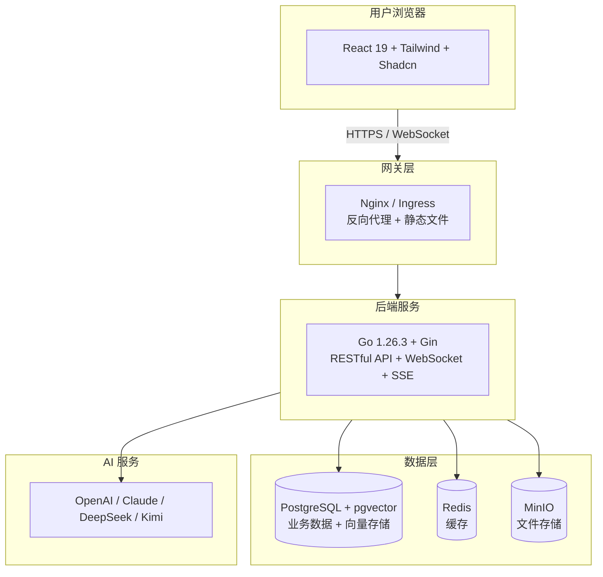
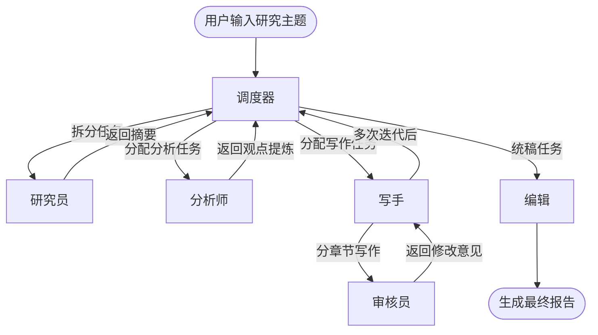

# 第1章 这本书怎么读，技术栈怎么选

## 1.1 写给谁看：你已经会写代码，但想搭一套完整的现代应用

这本书不是给零基础的人准备的。

如果你已经用某种语言写过生产代码——不管是 Java、Python、PHP 还是 Node.js——你已经知道变量、函数、循环、接口这些概念。你甚至可能已经在公司负责某个模块的开发。但当你想要**从零搭一个完整的应用**时，往往会发现：

- 你会写后端接口，但不知道怎么配数据库连接池
- 你会写前端页面，但不知道怎么处理全局状态
- 你调过 OpenAI 的 API，但不知道怎么把它做成一个可持续运行的服务
- 你写过 Dockerfile，但不知道怎么上生产环境
- 你听说过 Kubernetes，但觉得那是"大厂才玩的东西"

这种状态很常见。现代全栈开发涉及的技术点太多，每个点都有自己的文档、最佳实践和坑。更麻烦的是，这些技术之间的"接缝处"——比如前端怎么调用后端、后端怎么调用 AI、AI 的结果怎么流式返回给前端——往往是资料最少的地方。

**这本书就是来填这些缝的。**

我们不会教你 Go 的语法（假设你已经会一门编程语言），不会教你 React 的基础（假设你已经了解组件化思路），也不会解释什么是 HTTP 请求。我们要讲的是：**把这些技术拼成一个能跑、能维护、能扩展的系统**。

如果你符合以下任意画像，这本书适合你：

- **后端想转全栈**：你已经能用 Go/Java/Python 写接口，但想自己把前端也接上，做一个完整的产品
- **前端想扩展**：你能写 React/Vue，但想理解后端是怎么设计的，最好能自己搭一套
- **独立开发者**：你需要快速做出 MVP，技术选型要求务实、现代、好维护
- **技术负责人**：你要带团队做 AI 应用，需要一套统一的技术栈和工程规范
- **对 AI 应用好奇的工程师**：你不只想调 API 做个聊天机器人，你想做多智能体协同、RAG、报告生成这类深度应用

这本书**不适合**以下读者：

- 完全没写过代码的新手（先去学一门语言的基础）
- 想找"复制粘贴就能跑"的代码片段的人（我们会给完整代码，但更重要的是讲清楚为什么这样写）
- 只关心理论不关心落地的人（每一章都指向一个可运行的目标）

## 1.2 技术全景图：为什么选 Go + React + AI 这个组合

技术选型没有银弹，但有一些经过验证的组合。我们选 Go + React + AI，不是因为它最潮，而是因为**它在"开发效率"、"运行效率"和"招人维护"之间取得了合理的平衡**。

### 后端：Go 1.26.3 + Gin

选 Go 的理由很实际：

**编译快、部署简单**。Go 编译成单二进制文件，没有虚拟机、没有依赖地狱。`go build` 一下，得到一个可执行文件，丢到服务器上就能跑。Docker 镜像可以小到几十 MB。

**并发是原生能力**。Goroutine 不是框架特性，是语言特性。开几万个协程也不心疼，这对 AI 应用特别重要——你经常需要同时调多个模型、处理多个任务。

**类型安全但不啰嗦**。比 Java 简洁，比 Python 安全。接口（interface）的设计让测试和扩展都很舒服。

**好招人**。Go 在后端市场的热度持续上升，云原生生态（Docker、Kubernetes、Prometheus 都是 Go 写的）意味着懂 Go 的工程师越来越容易找。

选 Gin 而不是其他框架的理由：

Gin 不是最快的，也不是功能最多的，但它是**最平衡的**。路由、中间件、参数绑定、错误恢复这些核心功能都有，学习曲线平缓，社区生态成熟。更重要的是，Gin 不会替你隐藏太多细节——你知道每个请求是怎么被处理的，这对调试和优化很重要。

**不用 ORM**。这个决定可能会让一些人不舒服。但我们选择直接用 `database/sql` + `pgx` 手写 SQL。原因有三：

1. **复杂查询时 ORM 反而碍事**。JOIN、窗口函数、CTE、递归查询，用 ORM 写既绕又难优化
2. **性能调优需要看执行计划**。ORM 生成的 SQL 你经常不知道它干了什么
3. **团队协作时 SQL 是通用语言**。前后端、DBA 都能读懂，review 时也清楚

### 数据库：PostgreSQL + pgvector

PostgreSQL 是最强的开源关系型数据库，没有之一。它支持 JSON、全文搜索、地理信息、自定义类型，扩展生态极其丰富。

**pgvector** 是 PostgreSQL 的一个扩展，让它具备了存储和检索向量数据的能力。这意味着：

- 你的业务数据和向量数据在同一个数据库里
- 可以用 SQL 同时做关系查询和相似度搜索
- 事务一致性天然保证
- 少维护一个组件（不用单独部署 Milvus/Pinecone/Weaviate）

在百万级向量以下的场景，pgvector 完全够用。我们做的深度研究平台，文档量通常在这个范围内。

### 前端：React 19 + Node.js 22

React 已经不需要辩护了。选 React 19 是因为几个关键特性：

- **Server Components**：组件可以在服务端渲染，减少传到前端的 JS 体积
- **React Compiler**：自动优化渲染，减少手动写 `useMemo` 的负担
- **useActionState / useFormStatus**：表单处理更简洁
- **useOptimistic**：乐观更新变得简单

Node.js 22 是 LTS 版本，支持顶层 await、更好的性能、更完善的 ESM 支持。

### UI 组件：Shadcn UI + Tailwind CSS

Shadcn UI 不是传统意义上的"组件库"——它不通过 npm 安装，而是把组件代码直接复制到你的项目里。这意味着：

- 你可以随意修改任何组件的内部实现
- 没有版本锁定的问题
- 基于 Tailwind CSS，样式系统统一
- 与 Radix UI 底层集成，可访问性（a11y）有保障

Tailwind CSS 的 Utility-First 思路在团队开发中特别高效：不用在 CSS 文件和组件文件之间来回切换，直接在 JSX 里写样式，而且设计令牌（颜色、间距、圆角）是统一的。

### AI：原生 API，不绑框架

我们直接用各平台的原生 HTTP API，而不是通过 LangChain、Dify 这类框架封装。原因：

1. **理解原理**。当你自己处理流式输出、Token 计算、错误重试时，你真正理解 AI 是怎么接入系统的
2. **切换自由**。今天用 OpenAI，明天用 Claude，后天用 DeepSeek 或 Kimi，切换成本极低
3. **控制力强**。框架为了通用性会牺牲很多细节控制，而生产环境往往需要精细调优

我们会封装一个统一的 AI 客户端，但底层是透明的。

### 部署：Docker Compose → Kubernetes

开发环境用 Docker Compose 一键拉起所有依赖（PostgreSQL、Redis、MinIO）。生产环境用 Kubernetes。这个路径是平滑的：

- Compose 文件里的服务定义，迁移到 K8s 的 Deployment/Service 概念是对应的
- 你先理解容器、网络、持久卷，再理解 Pod、Ingress、StatefulSet，循序渐进
- 很多云厂商的容器服务都支持直接部署 Docker Compose 文件，作为上 K8s 之前的过渡

### CI/CD：GitHub Actions

代码托管在 GitHub，CI/CD 用 GitHub Actions 是最自然的。提交代码 → 自动测试 → 构建镜像 → 部署到环境，整个流程都在 GitHub 里完成，不需要额外的 Jenkins 服务器。

### 整体架构一览



## 1.3 多智能体到底是什么：别被概念吓到，本质就是"分工协作"

多智能体（Multi-Agent）是最近几年 AI 领域的热词，听起来很高大上，像是科幻电影里的场景。但其实它的核心思想非常简单：**一个任务太复杂，一个人搞不定，那就多找几个人分工干**。

### 从单智能体的瓶颈说起

你第一次用 ChatGPT 时，可能会惊叹于它的"全能"——能写代码、能翻译、能分析、能创作。但当你真的想让它帮你完成一个复杂任务时，问题就出现了：

假设你想让 AI 帮你写一篇关于"新能源汽车电池技术发展"的深度研究报告。

如果你直接对 ChatGPT 说："帮我写一篇关于新能源汽车电池技术发展的深度研究报告"，你会得到什么？

- 一篇看起来不错、但深度不够的通用文章
- 没有数据引用，没有来源标注
- 结构可能混乱，前后逻辑不一致
- 如果你不满意，只能反复修改提示词，每次都要从头来

问题出在哪？

**一个 AI 同时承担了太多角色**：它需要检索信息、分析数据、组织结构、撰写内容、检查错误、调整风格——而这些能力很难在一个对话轮次里同时达到最佳。

### 多智能体的本质：分工

回到"写研究报告"这个任务。如果是一个人类团队，会怎么分工？

- **研究员**：负责收集资料、整理数据、标注来源
- **分析师**：负责提炼观点、找出趋势、评估可信度
- **写手**：负责按大纲撰写各章节，保持风格一致
- **审核员**：负责检查事实准确性、逻辑漏洞、引用规范
- **编辑**：负责统稿、润色、调整格式

每个人专注自己擅长的事，通过文档、会议、批注等方式协作，最终产出高质量报告。

**多智能体系统做的就是这个事**——只不过"人"换成了"AI 智能体"。

每个智能体有明确的角色、能力和目标。它们之间通过消息传递信息和任务结果。一个调度器（Master-Agent）负责分配任务、监控进度、处理异常。

### 多智能体不是万能药

需要澄清几个常见误解：

**不是智能体越多越好**。3-5 个角色明确的智能体，通常比 20 个模糊的智能体效果更好。分工要合理，通信开销要控制。

**不是替代人，而是辅助人**。在关键节点（比如研究方向确定、最终报告发布）让人来确认，AI 负责执行和迭代。这叫 Human-in-the-loop。

**不是只有大模型才能做智能体**。一个智能体可以很简单——它可能就是一个调用搜索引擎的函数、一个查询数据库的模块、一个格式化输出的模板。大模型是"大脑"，但智能体还需要"手脚"（工具调用）。

### 本书的多智能体设计

在后面的实战章节里，我们会搭建一个多智能体引擎，包含以下角色：

| 智能体 | 职责 | 使用的工具 |
|--------|------|-----------|
| 调度器 | 接收任务、拆分步骤、分配执行 | 任务状态机、消息总线 |
| 研究员 | 检索知识库、搜索外部资料、生成摘要 | pgvector 检索、搜索引擎 API |
| 分析师 | 提炼关键观点、评估信息可信度、发现矛盾 | 大模型推理 |
| 写手 | 按大纲撰写章节、保持风格一致 | 大模型生成 |
| 审核员 | 事实核查、逻辑审查、引用规范检查 | 大模型+规则引擎 |
| 编辑 | 统稿润色、格式调整、生成最终报告 | 模板引擎 |

它们之间的协作流程是这样的：



整个过程对用户是透明的，用户只看到进度条和最终报告。但背后是多智能体的协同工作。

## 1.4 我们要一起做什么：一个能出活的"深度研究与报告生成平台"

全书围绕一个真实案例展开。我们不做一个玩具项目，而是做一个**能解决实际问题的产品原型**。

### 产品定位

一个帮助用户完成深度研究并自动生成报告的平台。

目标用户：
- 行业研究员（需要快速了解一个新领域）
- 咨询顾问（需要为客户产出分析报告）
- 学生（需要完成文献综述或课题报告）
- 内容创作者（需要深度选题和素材整理）

### 核心流程

**第一步：创建研究任务**

用户输入研究主题，比如"2024 年固态电池技术进展与产业化前景"。系统会让用户补充一些参数：研究深度（快速/标准/深度）、目标报告长度、重点领域、参考资料范围（仅限知识库 / 允许联网搜索）。

**第二步：多智能体协同研究**

系统启动研究流程：

1. 研究员检索知识库中的相关文档，同时进行外部搜索
2. 分析师对收集到的信息进行可信度评估和观点提炼
3. 写手根据大纲逐章撰写内容
4. 审核员检查事实准确性和逻辑一致性
5. 编辑统稿并生成最终报告

整个过程是实时的。用户可以在一个面板上看到：
- 当前进度百分比
- 每个智能体的状态（工作中 / 等待 / 完成 / 出错）
- 实时产生的日志（"研究员正在检索文档..."、"写手正在撰写第三章..."）
- 中间产物（大纲、摘要、章节草稿）

**第三步：人工审阅与迭代**

AI 生成初稿后，用户可以在编辑器中审阅：
- 对某段内容提出修改意见
- 要求补充某个方面的信息
- 调整报告风格和语气
- 让 AI 重新生成某个章节

**第四步：导出与分享**

报告可以导出为：
- PDF（带目录和页眉页脚）
- Word 文档（可继续编辑）
- Markdown（方便发布到博客或 Wiki）

### 这个平台覆盖了哪些技术点

这个案例几乎覆盖了一个完整 SaaS 产品的所有核心能力：

| 能力 | 涉及的技术 |
|------|-----------|
| 用户系统 | JWT 认证、RBAC 权限、OAuth2.0 登录 |
| 数据存储 | PostgreSQL 关系表、pgvector 向量表、Redis 缓存 |
| 文件处理 | 上传下载、PDF/Word 解析、图片 OCR |
| AI 能力 | 大模型 API 调用、流式输出、RAG 检索、多智能体调度 |
| 实时通信 | WebSocket 推送进度、SSE 流式输出 AI 内容 |
| 前端交互 | 表单、列表、编辑器、拖拽、图表、Markdown 渲染 |
| 异步任务 | 协程池、优先级队列、定时任务 |
| 部署运维 | Docker、Kubernetes、CI/CD、监控告警 |

做完这个项目，你不仅学到了技术，还获得了一个**可以持续扩展的产品骨架**。你可以把"深度研究"换成"代码审查"、"合同分析"、"竞品调研"——底层架构是通用的。

## 1.5 开发环境推荐：IDE、插件、AI 编程助手配置

工欲善其事，必先利其器。这里推荐一套经过验证的开发环境配置。

### 后端开发：VS Code 或 GoLand

**VS Code（免费）**

必备插件：
- **Go**（官方插件）：代码补全、跳转、格式化、调试
- **Go Test Explorer**：图形化运行和查看测试
- **Error Lens**：把错误和警告直接显示在代码行尾，不用看底部面板
- **GitLens**：查看代码谁改的、什么时候改的、改了什么
- **REST Client**：在编辑器里直接发 HTTP 请求，不用开 Postman

推荐配置（`settings.json` 关键项）：

```json
{
  "gopls": {
    "build.experimentalWorkspaceModule": true
  },
  "go.formatTool": "gofmt",
  "go.lintTool": "golangci-lint",
  "go.testFlags": ["-v", "-count=1"],
  "editor.formatOnSave": true
}
```

**GoLand（付费，学生免费）**

JetBrains 出品，Go 开发体验最好的 IDE。如果你已经习惯了 JetBrains 家族的 IDE（IDEA、PyCharm），直接用 GoLand。它在重构、调试、数据库工具方面比 VS Code 更强大。

### 前端开发：VS Code

必备插件：
- **ESLint + Prettier**：代码检查和格式化
- **Tailwind CSS IntelliSense**：Tailwind 类名自动补全、预览
- **TypeScript Importer**：自动导入类型
- **Vitest**：测试运行器集成
- **Console Ninja**：console.log 输出直接显示在编辑器里

推荐配置：

```json
{
  "editor.defaultFormatter": "esbenp.prettier-vscode",
  "editor.formatOnSave": true,
  "editor.codeActionsOnSave": {
    "source.fixAll.eslint": "explicit"
  },
  "typescript.preferences.importModuleSpecifier": "relative"
}
```

### 数据库工具

- **TablePlus**：轻量、快速，支持 PostgreSQL、Redis、MySQL。比 Navicat 简洁，比命令行友好
- **pgAdmin**：PostgreSQL 官方工具，功能最全，适合复杂查询和性能分析
- **Redis Insight**：Redis 官方可视化工具，查看键值、监控性能

### API 调试

- **Hoppscotch**（免费，Web 版）：Postman 的轻量替代，可以直接在浏览器里发请求
- **HTTPie**：命令行工具，语法比 curl 友好得多

```bash
# 代替 curl -X POST -H "Content-Type: application/json" ...
http POST localhost:8080/api/login email="test@example.com" password="123456"
```

### AI 编程助手

这是现代开发的标配。推荐几个我们实际在用的工具：

**Cursor（推荐）**

基于 VS Code 的 AI 编辑器，内置了 GPT-4 / Claude 的能力。最大的特点是：
- 可以选择整个代码库作为上下文，让 AI 理解项目结构
- `Ctrl+K` Inline Edit：选中代码，直接说"给这个函数加错误处理"，AI 原地修改
- `Ctrl+L` Chat：针对当前文件提问，AI 能看到你的代码

对于全栈开发特别友好，因为你可以同时打开前后端文件，让 AI 帮你处理跨文件的逻辑。

**GitHub Copilot**

代码补全最强。在你打字时自动建议下一行、下一个函数。适合"我知道要干什么，但不想逐字敲"的场景。

Copilot Chat（侧边栏对话）可以用来：
- 解释一段看不懂的代码
- 生成单元测试
- 把代码从一种风格改成另一种

**Claude Code**

Anthropic 推出的终端 AI 助手。你可以在项目目录里直接运行 `claude`，然后用自然语言操作代码库：

```bash
$ claude
> 帮我给所有 API handler 加上请求日志中间件
> 找出这个项目里所有没有错误处理的地方
> 把这个函数重构为使用 context 传递超时
```

特别适合批量修改、代码审查、重构这类需要"全局视野"的任务。

**使用建议**

不要同时开三个 AI 助手，会乱。我们的建议是：

| 场景 | 工具 |
|------|------|
| 日常编码、补全 | Copilot |
| 写新功能、跨文件修改、理解项目 | Cursor |
| 批量重构、代码审查、终端操作 | Claude Code |

第5章会详细讲怎么和 AI 协作，这里先配好环境就行。

### 终端工具

- **Windows Terminal + PowerShell 7**：比 cmd 好用太多，支持多标签、Unicode、自定义主题
- **Oh My Posh**：让 PowerShell 提示符显示 git 分支、Go 版本、当前路径
- **zoxide**：智能 `cd`，按频率跳转目录，`z proj` 直接跳到 `D:\Source\ileego\go_react_ai`

### 本章小结

- 这本书面向有一定开发基础、想搭完整系统的人
- 技术栈选型务实：Go + Gin + PostgreSQL/pgvector + React 19 + Shadcn/Tailwind + 原生 AI API + Docker/K8s
- 多智能体本质就是"分工协作"，不是什么黑科技
- 实战案例是一个深度研究与报告生成平台，覆盖完整 SaaS 的技术栈
- 开发环境以 VS Code 为主，搭配 Cursor/Copilot/Claude Code 提升效率

### 思考题

1. 你现在的技术栈是什么？如果要把一个 AI 能力（比如文本生成）接入你的系统，最大的障碍会在哪里？
2. 想想看，你日常工作中哪些任务可以拆分为"多智能体协作"？不只是写报告，也可以是代码审查、数据分析、客户回复等。
3. 为什么我们选择不用 ORM？你在过去的项目中，ORM 帮过你什么，又坑过你什么？

