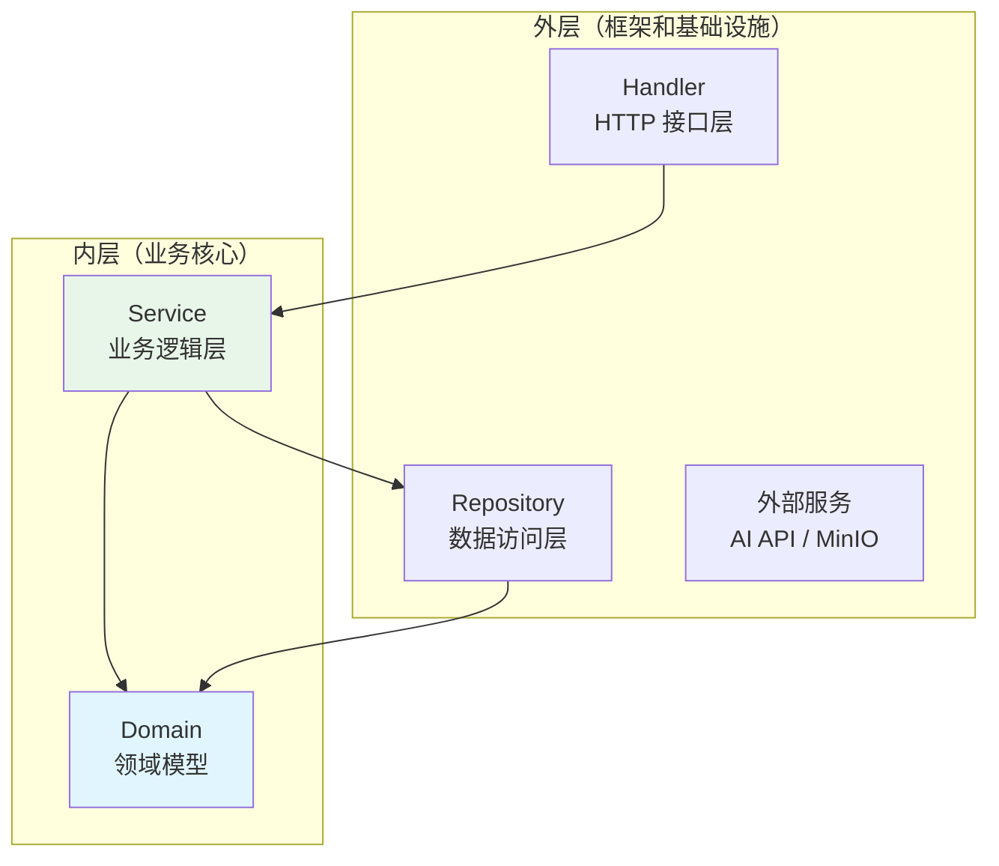
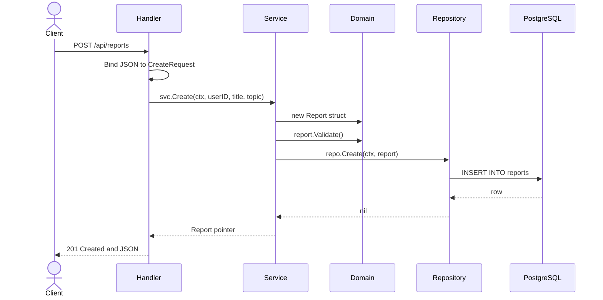

# 第3章 项目架构、工程规范与 Clean Architecture

写代码之前先想架构，这跟盖房子之前先画图纸是一个道理。很多人一上来就写 Handler，写着写着发现业务逻辑散落在各个地方，数据库操作和 HTTP 响应混在一起，改一个需求要翻十几个文件。

这一章我们先把骨架搭好。骨架对了，后面添砖加瓦会很顺畅；骨架歪了，代码量越大越痛苦。

## 3.1 单体仓库（Monorepo）目录结构设计

### 为什么用 Monorepo

我们这本书的前后端代码放在同一个 Git 仓库里，这叫 **Monorepo**（单体仓库）。与之相对的是 **Polyrepo**（多仓库），也就是前端一个仓库、后端一个仓库、文档一个仓库。

Monorepo 的优势很实际：

- **原子提交**：一次 PR 可以同时修改前后端，保证接口契约的一致性。拆成两个仓库，你改后端接口后，前端仓库的代码可能几天后才跟进，中间这段时间编译不过。
- **代码共享**：类型定义、接口契约、工具脚本可以放在同一个仓库的公共目录里，前后端共享。
- **统一版本**：发版时只有一个版本号，不用对齐前后端各自的版本。

当然 Monorepo 也有代价——仓库会变大，CI 需要区分前后端的变更范围。但对于我们这个体量的项目，收益远大于成本。

### 当前目录结构

第2章结束时，目录结构已经成型：

```
go_react_ai/
├── book/                  # 书籍源码
├── docs/                  # 设计文档、架构决策记录
├── src/                   # 项目源码
│   ├── Makefile           # 聚合命令转发
│   ├── backend/           # Go 后端
│   │   ├── cmd/
│   │   │   └── server/
│   │   │       └── main.go
│   │   ├── internal/      # 私有业务代码
│   │   │   ├── config/
│   │   │   ├── domain/    # 领域模型
│   │   │   ├── handler/   # HTTP 接口层
│   │   │   ├── service/   # 业务逻辑层
│   │   │   └── repository/# 数据访问层
│   │   ├── pkg/           # 公共库
│   │   ├── docs/          # API 文档（OpenAPI + Swagger UI）
│   │   │   └── openapi.yaml
│   │   ├── scripts/
│   │   ├── docker-compose.yml
│   │   └── Makefile
│   ├── frontend/          # React 前端
│   │   ├── src/
│   │   │   ├── features/  # 按功能模块组织
│   │   │   └── shared/    # 共享组件和工具
│   │   ├── package.json
│   │   └── vite.config.ts
│   └── scripts/
├── .gitignore
└── .github/
    └── pull_request_template.md
```

几个关键设计决策：

1. **`src/backend/internal/`**：Go 的 `internal` 包有特殊的可见性规则——只有 `src/backend/` 目录下的代码能导入它。这强制了分层边界，防止外层代码绕过 Service 层直接调 Repository。
2. **`src/backend/pkg/`**：与 `internal` 相对，这是可以被外部引用的公共库。错误处理、响应封装、日志工具放在这里。
3. **`src/frontend/src/features/`**：前端不按 `components/` `hooks/` `pages/` 这种类型拆分，而是按功能模块（feature）组织。一个功能的所有代码（组件、钩子、API 调用、类型定义）都在一个目录里。
4. **`docs/openapi.yaml`**：接口契约独立于前后端代码，双方都以这个文件为准。

## 3.2 Go 项目布局：Clean Architecture 简化版实战

### 什么是 Clean Architecture

Robert C. Martin（Uncle Bob）提出的 Clean Architecture 核心思想只有一句话：**依赖指向内部**。

外层的代码可以依赖内层的代码，但内层的代码不能依赖外层的代码。最内层是"业务实体"（Entity），它只知道自己的规则，不知道数据库是什么、HTTP 是什么、框架是什么。

标准的 Clean Architecture 有四层：

1. **Entities**：核心业务实体和规则
2. **Use Cases**：应用特定的业务逻辑
3. **Interface Adapters**：将数据转换为内层需要的格式（Controller、Presenter、Gateway）
4. **Frameworks & Drivers**：数据库、Web 框架、外部 API 等

对大多数项目来说，四层太细了。我们把它简化成三层：



### 简化版分层定义

| 层级 | 目录 | 职责 | 依赖方向 |
|------|------|------|----------|
| **Domain** | `internal/domain/` | 定义业务实体、值对象、错误类型。纯结构体，不依赖任何框架。 | 不依赖任何其他层 |
| **Service** | `internal/service/` | 实现业务逻辑。编排 Repository 调用、处理事务、调用外部 API。 | 依赖 Domain 和 Repository 接口 |
| **Repository** | `internal/repository/` | 实现数据访问。操作数据库、缓存、文件存储。 | 依赖 Domain，返回 Domain 实体 |
| **Handler** | `internal/handler/` | 处理 HTTP 请求。参数绑定、请求校验、调用 Service、构造响应。 | 依赖 Service 接口和 Domain |

注意：**Service 层依赖的是 Repository 的接口，不是具体实现**。这就是依赖倒置原则——高层模块不应该依赖低层模块，两者都应该依赖抽象。

### 接口定义放在哪里

在 Go 中，有一个经典问题：接口应该由使用者定义，还是由实现者定义？

Clean Architecture 的答案是：**由使用者定义**。Service 层需要什么样的数据访问能力，就在 `internal/service/service.go` 中定义接口。Repository 层只需要实现这些接口即可。

但这样做有一个小问题：如果多个 Service 需要不同的 Repository 方法，接口会散落在各个 Service 文件中。为了解决这个问题，我们把所有 Repository 接口统一放在 `internal/repository/repository.go` 中，由 Repository 包自己定义契约。

```go
// 文件: src/backend/internal/repository/repository.go
package repository

import (
    "context"
    "github.com/ileego/go_react_ai/internal/domain"
)

// ReportRepository 报告数据访问接口
type ReportRepository interface {
    GetByID(ctx context.Context, id int64) (*domain.Report, error)
    ListByUser(ctx context.Context, userID int64, limit, offset int) ([]*domain.Report, error)
    Create(ctx context.Context, report *domain.Report) error
    UpdateStatus(ctx context.Context, id int64, status domain.ReportStatus) error
}
```

Service 接口同理：

```go
// 文件: src/backend/internal/service/service.go
package service

import (
    "context"
    "github.com/ileego/go_react_ai/internal/domain"
)

// ReportService 报告业务逻辑接口
type ReportService interface {
    Create(ctx context.Context, userID int64, title, topic string) (*domain.Report, error)
    GetByID(ctx context.Context, id int64) (*domain.Report, error)
    ListByUser(ctx context.Context, userID int64, page, pageSize int) ([]*domain.Report, int, error)
    Cancel(ctx context.Context, id int64) error
}
```

这样做的好处是：

- **编译时检查**：如果 Repository 实现漏了某个方法，编译会报错。
- **Mock 测试**：Service 层测试时，可以直接实现一个内存版的 `ReportRepository`，不需要连接真实数据库。
- **清晰边界**：打开 `service.go`，一眼就能看出这个模块提供了什么能力。

### 领域模型

`internal/domain/` 是最内层的包，定义了业务实体：

```go
// 文件: src/backend/internal/domain/report.go
package domain

import "time"

type ReportStatus string

const (
    ReportStatusPending   ReportStatus = "pending"
    ReportStatusRunning   ReportStatus = "running"
    ReportStatusCompleted ReportStatus = "completed"
    ReportStatusFailed    ReportStatus = "failed"
)

type Report struct {
    ID          int64
    Title       string
    Topic       string
    Status      ReportStatus
    Content     string
    Sources     []string
    CreatedBy   int64
    CreatedAt   time.Time
    UpdatedAt   time.Time
    CompletedAt *time.Time
}

// CanCancel 报告是否可以取消
func (r *Report) CanCancel() bool {
    return r.Status == ReportStatusPending || r.Status == ReportStatusRunning
}
```

领域模型的几个原则：

1. **纯结构体**：不依赖任何框架或库。`Report` 不知道 JSON 是什么、数据库是什么。
2. **业务方法**：与实体相关的业务逻辑写在领域模型上，比如 `CanCancel()`。这样业务规则集中在一处，不会被分散到 Service 或 Handler 中。
3. **自校验**：实体应该能校验自己的合法性。

```go
// 文件: src/backend/internal/domain/user.go
func (u *User) Validate() error {
    if u.Email == "" {
        return NewValidationError("email", "邮箱不能为空")
    }
    if u.Name == "" {
        return NewValidationError("name", "姓名不能为空")
    }
    return nil
}
```

### 错误处理：跨层统一的错误类型

不同层产生的错误类型不一样：数据库返回 `sql.ErrNoRows`、HTTP 框架返回校验错误、业务层返回领域错误。如果把这些原始错误直接抛给 Handler，Handler 就要处理各种来源的错误，耦合度很高。

我们在 `pkg/errors/` 中定义统一的业务错误：

```go
// 文件: src/backend/pkg/errors/errors.go
package errors

type Kind string

const (
    KindValidation   Kind = "validation"
    KindNotFound     Kind = "not_found"
    KindDuplicate    Kind = "duplicate"
    KindInternal     Kind = "internal"
    KindUnauthorized Kind = "unauthorized"
    KindForbidden    Kind = "forbidden"
)

type Error struct {
    Kind    Kind
    Field   string
    Message string
    Cause   error // 原始错误，用于日志追溯
}

func (e *Error) Error() string { /* ... */ }
func (e *Error) Unwrap() error { return e.Cause }

func IsKind(err error, kind Kind) bool {
    if e, ok := err.(*Error); ok {
        return e.Kind == kind
    }
    return false
}
```

Service 层把底层错误转换为业务错误：

```go
func (s *reportService) GetByID(ctx context.Context, id int64) (*domain.Report, error) {
    report, err := s.repo.GetByID(ctx, id)
    if err != nil {
        if errors.Is(err, sql.ErrNoRows) {
            return nil, errors.NewNotFound("report", id)
        }
        return nil, errors.NewInternal("查询报告失败", err)
    }
    return report, nil
}
```

Handler 层根据错误类型返回对应的 HTTP 状态码：

```go
func (h *ReportHandler) Get(c *gin.Context) {
    report, err := h.svc.GetByID(c.Request.Context(), id)
    if err != nil {
        switch {
        case errors.IsKind(err, errors.KindNotFound):
            c.JSON(http.StatusNotFound, gin.H{"error": err.Error()})
        case errors.IsKind(err, errors.KindValidation):
            c.JSON(http.StatusBadRequest, gin.H{"error": err.Error()})
        default:
            c.JSON(http.StatusInternalServerError, gin.H{"error": err.Error()})
        }
        return
    }
    c.JSON(http.StatusOK, report)
}
```

### 统一响应封装

Handler 层构造 HTTP 响应时，使用 `pkg/response/` 中的统一函数，保证前后端契约一致：

```go
// 文件: src/backend/pkg/response/response.go
package response

func Data[T any](c *gin.Context, data T) {
    c.JSON(http.StatusOK, Body[T]{Code: 0, Data: data})
}

func List[T any](c *gin.Context, data T, total, page, size int) {
    c.JSON(http.StatusOK, ListBody[T]{
        Code: 0, Data: data, Total: total, Page: page, Size: size,
    })
}

func BadRequest(c *gin.Context, message string) {
    Error(c, http.StatusBadRequest, message)
}

func NotFound(c *gin.Context, message string) {
    Error(c, http.StatusNotFound, message)
}
```

这样 Handler 中的响应代码会非常简洁：

```go
response.Data(c, report)
response.List(c, reports, total, page, pageSize)
response.NotFound(c, err.Error())
```

## 3.3 分层原则：Handler → Service → Repository，依赖方向怎么指

### 数据流完整示例

一个创建报告的请求，从 HTTP 到数据库，完整的数据流是这样的：



### 各层铁律

**Handler 层**：
- ✅ 做：参数绑定、请求校验、调用 Service、构造响应、处理认证中间件
- ❌ 不做：直接调数据库、写业务逻辑、调用外部 API

**Service 层**：
- ✅ 做：业务逻辑编排、事务管理、调用 Repository、调用外部服务（AI API）
- ❌ 不做：处理 HTTP 细节、直接操作数据库连接

**Repository 层**：
- ✅ 做：SQL 查询、数据库事务、ORM/原生 SQL 操作、缓存读写
- ❌ 不做：业务判断（比如"这个报告能不能取消"）、调用外部 API

**Domain 层**：
- ✅ 做：定义实体结构、实体方法（自校验、业务规则）、错误类型
- ❌ 不做：任何 I/O 操作（数据库、HTTP、文件）

### 为什么 Repository 要返回 Domain 实体

Repository 的实现可能在不同场景下切换：开发时用 PostgreSQL，测试时用 SQLite，单元测试时用内存 map。如果 Repository 返回的是数据库特有的结构体（比如 `sql.Rows` 或 ORM 模型），那 Service 层就绑定了特定的数据库实现。

所以 Repository 的接口必须返回 `*domain.Report`，而不是 `*sql.Row` 或 `*gorm.Model`。转换发生在 Repository 内部：

```go
func (r *pgReportRepo) GetByID(ctx context.Context, id int64) (*domain.Report, error) {
    row := r.db.QueryRowContext(ctx,
        "SELECT id, title, topic, status, content, created_by, created_at FROM reports WHERE id = $1", id)

    var report domain.Report
    err := row.Scan(&report.ID, &report.Title, &report.Topic,
        &report.Status, &report.Content, &report.CreatedBy, &report.CreatedAt)
    if err != nil {
        return nil, err
    }
    return &report, nil
}
```

### 依赖注入

所有层之间的依赖通过接口注入，而不是直接实例化。在 `cmd/server/main.go` 中组装所有依赖：

```go
// 组装依赖
reportRepo := repository.NewReportRepository(db)
reportSvc := service.NewReportService(reportRepo, aiClient)
reportHandler := handler.NewReportHandler(reportSvc)

// 注册路由
handlers := handler.NewHandlers(reportSvc, agentSvc)
handlers.RegisterRoutes(r)
```

这种模式叫 **依赖注入**（Dependency Injection）。它的好处是：

- 测试时可以轻松替换实现。比如 `NewReportService(mockRepo, mockAI)`。
- 依赖关系一目了然。看 `main.go` 就知道系统由哪些组件构成。
- 避免全局状态。没有 `var db = ...` 这种全局变量，所有依赖都是显式传入的。

## 3.4 前端项目组织：按功能模块拆分，不按类型

### 按类型拆分的问题

很多 React 项目这样组织：

```
src/
  components/     # 所有组件
  hooks/          # 所有钩子
  pages/          # 所有页面
  utils/          # 所有工具函数
  api/            # 所有 API 调用
  types/          # 所有类型定义
```

这种按"类型"拆分的方式在小型项目里没问题，但随着功能增多，问题会逐渐暴露：

- 改一个功能要跨多个目录找文件。比如改"报告列表"，你要打开 `components/ReportList.tsx`、`hooks/useReports.ts`、`api/reports.ts`、`types/report.ts`。
- 文件之间隐式依赖关系不清晰。`useReports.ts` 依赖 `api/reports.ts` 和 `types/report.ts`，但这种关系在目录结构上看不出来。
- 难以拆分和懒加载。按类型拆分的代码天然是耦合的，很难把某个功能整体拆出去。

### Feature-based 目录结构

我们把代码按"功能模块"（feature）组织：

```
src/
  features/
    reports/
      components/
        ReportList.tsx
        ReportCard.tsx
        ReportDetail.tsx
      hooks/
        useReports.ts
        useCreateReport.ts
      api/
        reportsApi.ts
      types.ts
      index.ts          # 对外暴露的公共接口
    agents/
      components/
      hooks/
      api/
      types.ts
      index.ts
  shared/
    api/
      client.ts         # 全局 API 客户端
    components/
      Button.tsx        # 全局共享组件
    utils/
      format.ts
      validate.ts
  App.tsx
  main.tsx
```

每个 feature 是一个自包含的单元，包含这个功能需要的所有代码。feature 内部再按类型细分（components、hooks、api），但因为作用域只在这个 feature 内，所以不会乱。

`shared/` 目录放跨 feature 共享的代码：通用的 UI 组件、工具函数、API 客户端封装。

### 边界规则

1. **feature 之间不直接引用**。`features/agents/` 不应该 `import { useReports } from '../reports/hooks/useReports'`。如果 agents 需要报告数据，应该通过 `shared/api/client.ts` 或全局状态管理来获取。
2. **feature 通过 `index.ts` 对外暴露接口**。外部只导入 `features/reports/index.ts`，不直接深入内部文件。这样后续重构内部结构时，不会影响外部调用方。
3. **`shared/` 不能依赖 `features/`**。共享代码必须是通用的，不能引用任何业务相关的类型或逻辑。

```typescript
// features/reports/index.ts
export { ReportList } from './components/ReportList'
export { ReportCard } from './components/ReportCard'
export { useReports } from './hooks/useReports'
export type { Report, ReportStatus } from './types'
```

## 3.5 接口契约：OpenAPI 3.0 规范与前后端代码生成

### 为什么需要接口契约

前后端分离开发时，最常见的冲突是：

- 后端改了接口字段名，前端不知道，页面白屏。
- 前端期望的响应格式和后端实际返回的不一致。
- 两个人口头约定了接口，写出来的代码对不上。

**接口契约**就是前后端之间的"合同"。双方先写好合同，再各自实现。OpenAPI 3.0（原 Swagger）是这个合同的标准格式。

### OpenAPI 规范示例

我们在 `src/backend/docs/openapi.yaml` 中定义所有接口：

```yaml
openapi: 3.0.3
info:
  title: Go + React + AI Platform API
  version: 1.0.0

servers:
  - url: http://localhost:8080/api
    description: 本地开发环境

paths:
  /health:
    get:
      summary: 健康检查
      tags: [System]
      responses:
        "200":
          description: 服务正常
          content:
            application/json:
              schema:
                $ref: "#/components/schemas/HealthResponse"

  /reports:
    get:
      summary: 获取报告列表
      tags: [Reports]
      parameters:
        - name: page
          in: query
          schema: { type: integer, default: 1 }
        - name: page_size
          in: query
          schema: { type: integer, default: 20, maximum: 100 }
      responses:
        "200":
          description: 报告列表
          content:
            application/json:
              schema:
                $ref: "#/components/schemas/ReportListResponse"

    post:
      summary: 创建报告
      tags: [Reports]
      requestBody:
        required: true
        content:
          application/json:
            schema:
              $ref: "#/components/schemas/CreateReportRequest"
      responses:
        "201":
          description: 创建成功
          content:
            application/json:
              schema:
                $ref: "#/components/schemas/Report"
        "400":
          description: 参数校验失败
          content:
            application/json:
              schema:
                $ref: "#/components/schemas/ErrorResponse"

  /reports/{id}:
    get:
      summary: 获取报告详情
      tags: [Reports]
      parameters:
        - name: id
          in: path
          required: true
          schema: { type: integer, format: int64 }
      responses:
        "200":
          description: 报告详情
          content:
            application/json:
              schema:
                $ref: "#/components/schemas/Report"
        "404":
          description: 报告不存在
          content:
            application/json:
              schema:
                $ref: "#/components/schemas/ErrorResponse"

  /reports/{id}/cancel:
    post:
      summary: 取消报告生成
      tags: [Reports]
      parameters:
        - name: id
          in: path
          required: true
          schema: { type: integer, format: int64 }
      responses:
        "200":
          description: 取消成功
          content:
            application/json:
              schema:
                $ref: "#/components/schemas/SuccessResponse"
        "400":
          description: 报告状态不允许取消
          content:
            application/json:
              schema:
                $ref: "#/components/schemas/ErrorResponse"

components:
  schemas:
    HealthResponse:
      type: object
      properties:
        status: { type: string, example: "ok" }
        time: { type: integer, format: int64 }

    Report:
      type: object
      properties:
        id: { type: integer, format: int64 }
        title: { type: string }
        topic: { type: string }
        status:
          type: string
          enum: [pending, running, completed, failed]
        content: { type: string }
        sources:
          type: array
          items: { type: string }
        created_by: { type: integer, format: int64 }
        created_at: { type: string, format: date-time }
        updated_at: { type: string, format: date-time }

    CreateReportRequest:
      type: object
      required: [title, topic]
      properties:
        title:
          type: string
          minLength: 1
          maxLength: 200
        topic:
          type: string
          minLength: 1
          maxLength: 1000

    ReportListResponse:
      type: object
      properties:
        code: { type: integer }
        data:
          type: array
          items: { $ref: "#/components/schemas/Report" }
        total: { type: integer }
        page: { type: integer }
        size: { type: integer }

    SuccessResponse:
      type: object
      properties:
        code: { type: integer, example: 0 }
        message: { type: string }

    ErrorResponse:
      type: object
      properties:
        code: { type: integer }
        message: { type: string }
```

这个文件有几个作用：

1. **接口文档**：任何开发者打开这个文件，就能知道系统提供了哪些接口、需要什么参数、返回什么格式。
2. **Mock 服务**：用 [Prism](https://stoplight.io/open-source/prism) 或 [Mockoon](https://mockoon.com/) 可以直接从 OpenAPI 文件启动 Mock 服务器，前端不需要等后端开发完就能开始对接口。
3. **代码生成**：
   - 后端用 [oapi-codegen](https://github.com/oapi-codegen/oapi-codegen) 生成 Go 的接口定义和校验代码
   - 前端用 [openapi-typescript](https://github.com/drwpow/openapi-typescript) 生成 TypeScript 类型

### 前端类型生成

```bash
$ cd src/frontend
$ npx openapi-typescript ../backend/docs/openapi.yaml -o src/shared/api/types.gen.ts
```

生成的类型可以直接在 React 组件中使用：

```typescript
import type { components } from '../shared/api/types.gen'

type Report = components['schemas']['Report']
type CreateReportRequest = components['schemas']['CreateReportRequest']
```

这样前后端的类型定义始终同步。后端改了 OpenAPI 文件，前端重新生成类型，TypeScript 编译器会立刻发现不匹配的地方。

> 本书采用 Contract-First 方式：先手写 `openapi.yaml` 作为契约，再各自生成代码。第 6 章会介绍如何在 Gin 中嵌入 Swagger UI，使后端启动后可直接访问 `/swagger` 渲染的文档页面。

## 3.6 Git 工作流：分支策略、Commit 规范、PR 模板

### 分支策略：GitHub Flow 简化版

对于持续交付的项目，推荐 [GitHub Flow](https://docs.github.com/en/get-started/quickstart/github-flow)：

1. `main` 分支永远是可部署的。
2. 开发新功能时，从 `main` 切出功能分支：`feature/report-crud`。
3. 功能完成后发 Pull Request（PR）。
4. CI 通过 + Code Review 通过后，合并到 `main`。
5. 合并后自动部署。

不需要 `develop` 分支，不需要复杂的发布分支管理。这套流程适合每周多次发布的项目。

分支命名规范：

| 前缀 | 用途 | 示例 |
|------|------|------|
| `feature/` | 新功能 | `feature/openapi-codegen` |
| `fix/` | Bug 修复 | `fix/report-status-race` |
| `refactor/` | 重构 | `refactor/extract-auth-middleware` |
| `docs/` | 文档更新 | `docs/ch03-architecture` |

### Commit 规范：Conventional Commits

Commit 信息不仅是给未来的自己看的，也是生成 CHANGELOG 和自动版本号的基础。我们遵循 [Conventional Commits](https://www.conventionalcommits.org/) 规范：

```
<type>[optional scope]: <description>

[optional body]

[optional footer(s)]
```

常用 type：

| Type | 含义 | 示例 |
|------|------|------|
| `feat` | 新功能 | `feat: 添加报告取消接口` |
| `fix` | Bug 修复 | `fix: 修复报告状态并发竞争` |
| `refactor` | 重构 | `refactor: 提取认证中间件` |
| `test` | 测试 | `test: 补充报告 Service 单元测试` |
| `docs` | 文档 | `docs: 更新第3章架构说明` |
| `chore` | 杂项 | `chore: 升级 gin 到 v1.12` |

Commit 规范的价值在于：

- `git log` 一目了然，不需要点开每个 commit 看 diff。
- 可以自动生成 CHANGELOG：`feat` 进新功能列表，`fix` 进修复列表。
- 可以配合工具自动打版本号（`feat` 升 minor，`fix` 升 patch，`BREAKING CHANGE` 升 major）。

### PR 模板

在 `.github/pull_request_template.md` 中定义 PR 的格式：

```markdown
## 变更概要

## 类型

- [ ] 新功能 (feature)
- [ ] Bug 修复 (bugfix)
- [ ] 文档更新 (docs)
- [ ] 代码重构 (refactor)
- [ ] 测试补充 (test)
- [ ] 构建/CI 改动 (build/ci)

## 检查清单

- [ ] 代码遵循项目分层规范（Handler → Service → Repository）
- [ ] 新增/修改的接口已更新 OpenAPI 文档
- [ ] 没有引入循环依赖
- [ ] 敏感信息没有硬编码在代码中
- [ ] Commit 信息符合 Conventional Commits 规范
```

PR 模板的作用是**降低 Review 成本**。提交者按清单自检，Review 者按清单逐项确认。清单里的每一项背后都是踩过的坑。

## 3.7 代码规范：gofmt、ESLint、Prettier、husky 预提交钩子

### Go 代码规范

Go 的代码规范是"约定优于配置"：

- **`gofmt`**：官方格式化工具，没有配置项，所有人格式统一。提交前必须运行。
- **`go vet`**：静态分析工具，检测常见错误（printf 格式不匹配、死代码、race condition 等）。
- **`golangci-lint`**：社区综合 linter，集成了几十个检查规则。配置放在 `.golangci.yml` 中。

后端 Makefile 中集成：

```makefile
lint:
	gofmt -w .
	go vet ./...
	golangci-lint run ./...
```

### 前端代码规范

前端需要 ESLint + Prettier + TypeScript 三件套：

**ESLint** 负责代码质量和潜在问题：

```javascript
// eslint.config.js
import js from '@eslint/js'
import tseslint from 'typescript-eslint'
import reactHooks from 'eslint-plugin-react-hooks'
import reactRefresh from 'eslint-plugin-react-refresh'
import prettier from 'eslint-config-prettier'

export default tseslint.config(
  { ignores: ['dist', 'node_modules'] },
  {
    extends: [js.configs.recommended, ...tseslint.configs.recommended, prettier],
    files: ['**/*.{ts,tsx}'],
    plugins: {
      'react-hooks': reactHooks,
      'react-refresh': reactRefresh,
    },
    rules: {
      ...reactHooks.configs.recommended.rules,
      'react-refresh/only-export-components': ['warn', { allowConstantExport: true }],
      '@typescript-eslint/no-explicit-any': 'warn',
      '@typescript-eslint/no-unused-vars': ['warn', { argsIgnorePattern: '^_' }],
    },
  }
)
```

**Prettier** 负责代码格式（缩进、换行、引号等）：

```json
// .prettierrc
{
  "semi": false,
  "singleQuote": true,
  "tabWidth": 2,
  "trailingComma": "es5",
  "printWidth": 100
}
```

Prettier 和 ESLint 的职责要分开：ESLint 管"代码质量"，Prettier 管"代码格式"。两者通过 `eslint-config-prettier` 关闭 ESLint 中与格式相关的规则，避免冲突。

### 预提交钩子：husky + lint-staged

规范写在文档里没人看，必须让工具强制执行。

[husky](https://typicode.github.io/husky/) 可以在 `git commit` 前自动运行脚本，[lint-staged](https://github.com/lint-staged/lint-staged) 只对暂存区的文件运行检查。

`package.json` 配置：

```json
{
  "scripts": {
    "prepare": "cd .. && husky frontend/.husky",
    "lint:fix": "eslint . --fix",
    "format": "prettier --write \"src/**/*.{ts,tsx,css}\"",
    "format:check": "prettier --check \"src/**/*.{ts,tsx,css}\""
  },
  "lint-staged": {
    "*.{ts,tsx}": ["eslint --fix", "prettier --write"],
    "*.{css,json,md}": ["prettier --write"]
  }
}
```

配置完成后，每次 `git commit` 会自动执行：

1. 对暂存区的 `.ts` `.tsx` 文件运行 ESLint 自动修复
2. 运行 Prettier 格式化
3. 如果有错误无法自动修复，commit 会被阻断

对于后端，可以用 [pre-commit](https://pre-commit.com/) 框架实现类似功能。安装后配置 `.pre-commit-config.yaml`：

```yaml
repos:
  - repo: https://github.com/pre-commit/pre-commit-hooks
    rev: v4.6.0
    hooks:
      - id: trailing-whitespace
      - id: end-of-file-fixer
  - repo: local
    hooks:
      - id: gofmt
        name: gofmt
        entry: gofmt -w
        language: system
        types: [go]
      - id: go-vet
        name: go vet
        entry: go vet ./...
        language: system
        types: [go]
      - id: go-test
        name: go test
        entry: go test ./...
        language: system
        types: [go]
```

### Makefile 集成

前后端的代码检查都集成到各自的 Makefile 中，开发者只需要记住一个命令：

```bash
# 后端
$ make lint

# 前端
$ make lint
```

根目录的 `src/Makefile` 也可以加一个统一的检查入口：

```makefile
lint:
	@$(MAKE) -C backend lint
	@$(MAKE) -C frontend lint
```

---

## 本章小结

1. **Monorepo** 让前后端共享契约、统一版本，一次提交保证接口一致性。
2. **Clean Architecture 简化版** 采用三层：Handler → Service → Repository，Domain 位于最内层，不依赖任何框架。
3. **接口由使用者定义**：Service 依赖 Repository 接口，Repository 依赖 Domain 实体，通过依赖注入组装。
4. **错误分层**：底层原始错误在 Service 层转换为统一业务错误，Handler 根据错误类型返回对应 HTTP 状态码。
5. **前端按 Feature 组织**：自包含的功能模块，避免按类型拆分导致的跨目录依赖混乱。
6. **OpenAPI 是合同**：前后端以 `docs/openapi.yaml` 为准，配合代码生成工具保持类型同步。
7. **Git 工作流**：GitHub Flow + Conventional Commits + PR 模板，降低协作成本。
8. **代码规范自动化**：gofmt / ESLint / Prettier + husky 预提交钩子，规范不靠自觉，靠工具强制执行。

## 练习

1. 在 `internal/domain/` 中新增一个 `Document` 实体（表示用户上传的文档），包含 ID、Filename、ContentType、Size、ReportID 字段，并添加 `Validate()` 方法。
2. 为 `Document` 定义 Repository 接口和 Service 接口，理解"接口由使用者定义"的原则。
3. 在 `docs/openapi.yaml` 中添加 `/documents` 相关的 CRUD 接口定义，然后用 `openapi-typescript` 生成前端类型。
4. 安装配置 pre-commit，让每次提交前自动运行 `gofmt` 和 `go test`。
5. 对比两种前端目录结构：按类型拆分 vs 按 Feature 拆分。列出各自 3 个优点和 3 个缺点。
