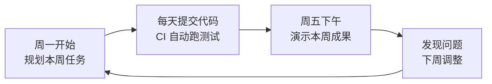
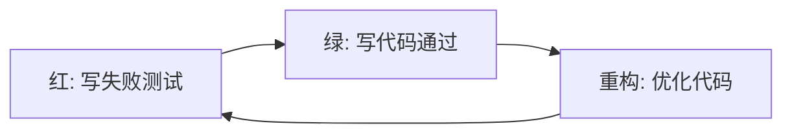
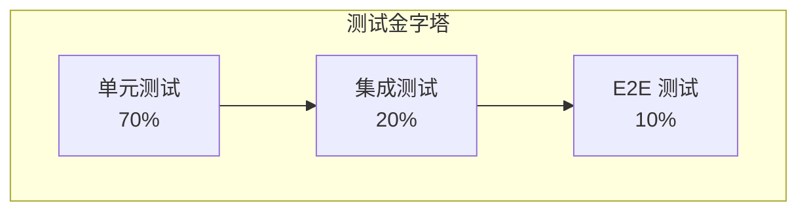

# 第4章 开发方法学：敏捷迭代与工程实践

技术选型定了，架构搭好了，接下来面临一个更棘手的问题：**怎么写代码才能不把自己埋进去？**

很多项目不是死在技术选型上，而是死在"想一步写一步"上。今天加个字段，明天改个接口，后天发现之前的设计撑不住了，于是推倒重来。这种反复不是因为需求变化快，而是因为缺乏方法学——不知道怎么把大需求拆成小任务，不知道怎么验证代码的正确性，不知道怎么在质量和进度之间做取舍。

这一章讲方法学，不是讲 Scrum 的站会要开几分钟，而是讲**务实的工程实践**：怎么拆分任务、怎么写测试、怎么做代码审查、怎么管理技术债务。这些东西不花哨，但能让你少加班。

## 4.1 不是形式主义：敏捷开发的务实做法

### 为什么很多人对"敏捷"有意见

敏捷（Agile）本身是一套很好的价值观：个体和互动高于流程和工具，可工作的软件高于详尽的文档，客户合作高于合同谈判，响应变化高于遵循计划。

但落地的时候，敏捷经常变成形式主义：每日站会变成汇报会，迭代评审变成演示会，故事点变成 KPI。开发者觉得"敏捷是管理层用来催进度的工具"，管理层觉得"开发者用敏捷当挡箭牌不写文档"。

问题不在敏捷本身，而在于**把手段当成了目的**。敏捷的目的是快速交付价值、快速获得反馈、快速调整方向。站会、故事点、看板都只是手段。

### 我们的务实做法

这本书的项目采用一套简化版的迭代节奏：



具体规则：

1. **一周一个迭代**。不拆分更细，也不拖更长。一周足够完成一个有意义的功能增量，也足够短到不会偏离方向。
2. **每天提交代码**。不是每天必须完成一个功能，而是代码必须每天进入主分支。 unfinished 的功能可以用 feature flag 隐藏，但代码要持续集成。
3. **自动化测试必须绿**。提交前 `go test ./...` 和 `pnpm test` 必须全部通过。测试是安全网，不是可选项。
4. **周五演示**。给团队演示本周做了什么，不是给老板交差，而是获得反馈。演示 15 分钟，讨论 15 分钟。

没有故事点估算，没有燃尽图，没有 Scrum Master。需要的只是一个任务列表和一张日历。

## 4.2 用户故事与任务拆分：从"大需求"到"可交付增量"

### 用户故事格式

用户故事（User Story）不是需求文档，而是**一个对话的占位符**。标准格式：

> 作为一个 [角色]，我想要 [功能]，以便 [价值]。

比如：

> 作为一个研究员，我想要输入研究主题并生成一份深度报告，以便快速了解一个陌生领域。

这个故事太大了，不能直接开发。需要拆分成更小的、可交付的增量。

### INVEST 原则

好的用户故事应该符合 INVEST：

| 原则 | 含义 | 反例 |
|------|------|------|
| **I**ndependent | 独立，不依赖其他故事完成 | "实现用户系统"（依赖登录、注册、权限） |
| **N**egotiable | 可协商，不是死合同 | "报告必须包含 20 个引用来源" |
| **V**aluable | 对用户有价值 | "重构数据库索引"（对用户没直接价值） |
| **E**stimable | 可估算大小 | "优化系统性能"（太模糊） |
| **S**mall | 足够小，一个迭代能做完 | "构建完整的多智能体系统"（太大） |
| **T**estable | 可测试 | "提升用户体验"（无法验证） |

### 拆分示例："生成深度研究报告"

大故事：作为一个研究员，我想要输入研究主题并生成一份深度报告。

拆分成迭代：

**迭代 1**：创建报告（只有标题和主题，没有内容）
- 后端：实现 Report 的 CRUD 接口
- 前端：报告列表页 + 创建报告表单
- 可交付：用户能创建报告并看到列表

**迭代 2**：报告状态流转
- 后端：报告状态机（pending -> running -> completed / failed）
- 前端：状态展示 + 取消按钮
- 可交付：用户能看到报告的执行状态

**迭代 3**：AI 内容生成（单智能体）
- 后端：调用 AI API 生成报告内容
- 前端：报告详情页展示 Markdown 内容
- 可交付：用户能看到 AI 生成的报告内容

**迭代 4**：多智能体协同
- 后端：Master-Agent 调度多个 Worker-Agent
- 前端：展示每个 Agent 的执行进度
- 可交付：用户能看到研究、写作、审校多个阶段

每个迭代都有一个**可交付的价值点**。迭代 1 结束时，用户能创建报告；迭代 2 结束时，用户能跟踪进度；以此类推。即使项目在迭代 3 后暂停，前面完成的迭代也是有价值的。

## 4.3 测试驱动开发（TDD）：红绿重构循环的实践节奏

### 什么是 TDD

测试驱动开发（Test-Driven Development）的核心流程只有三步：

1. **红**：写一个失败的测试（编译不过或断言失败）。
2. **绿**：写最少的代码让这个测试通过。
3. **重构**：在不改变行为的前提下优化代码。



TDD 不是"先写测试再写代码"这么简单。它的真正价值在于：**测试定义了代码的契约，迫使你在写代码之前想清楚输入和输出。**

### 为什么不是所有人都在用 TDD

TDD 有学习曲线。刚开始你会觉得"写测试比写代码还慢"，因为你不习惯从调用方的角度思考。但一旦跨过这个门槛，TDD 能让你：

- **减少调试时间**：代码刚写出来就是正确的，不需要事后调试。
- **获得更好的设计**：测试驱动下的代码天然是高内聚、低耦合的——不好测试的代码通常设计也有问题。
- **建立安全网**：重构时敢动手，因为测试会立刻告诉你哪里破了。

### TDD 实战：ReportService 的红绿重构

我们以 `ReportService.Create` 为例，演示完整的 TDD 流程。

#### 第一步：红——写失败的测试

先写测试，定义我们期望的行为：

```go
// 文件: src/backend/internal/service/report_service_test.go
func TestReportService_Create(t *testing.T) {
    repo := memory.NewReportRepository()
    svc := NewReportService(repo)
    ctx := context.Background()

    report, err := svc.Create(ctx, 1, "AI 医疗研究", "人工智能在医疗诊断中的应用")

    if err != nil {
        t.Fatalf("创建报告失败: %v", err)
    }
    if report.ID == 0 {
        t.Error("报告 ID 应该被自动分配")
    }
    if report.Status != domain.ReportStatusPending {
        t.Errorf("新建报告状态应为 pending, 得到 %s", report.Status)
    }
}
```

运行测试：

```bash
$ go test ./internal/service/...
# 编译失败：NewReportService 未定义
```

这是"红"状态——测试甚至编译不过。

#### 第二步：绿——写最少的代码让测试通过

先让编译通过。创建 `report_service.go`，实现最简版本：

```go
// 文件: src/backend/internal/service/report_service.go
package service

import (
    "context"
    "github.com/ileego/go_react_ai/internal/domain"
    "github.com/ileego/go_react_ai/internal/repository"
)

type reportService struct {
    repo repository.ReportRepository
}

func NewReportService(repo repository.ReportRepository) ReportService {
    return &reportService{repo: repo}
}

func (s *reportService) Create(ctx context.Context, userID int64, title, topic string) (*domain.Report, error) {
    report := &domain.Report{
        Title:     title,
        Topic:     topic,
        CreatedBy: userID,
    }
    if err := s.repo.Create(ctx, report); err != nil {
        return nil, err
    }
    return report, nil
}
```

同时需要给 `domain.Report` 补充 `Validate()` 方法（测试中可能用到）。运行测试：

```bash
$ go test ./internal/service/...
ok      github.com/ileego/go_react_ai/internal/service    0.45s
```

测试通过了，这是"绿"状态。但代码还很粗糙：没有参数校验、没有错误转换、分页逻辑也不对。

#### 第三步：重构——优化代码

现在测试是绿的，我们可以安全地重构。添加参数校验和错误转换：

```go
func (s *reportService) Create(ctx context.Context, userID int64, title, topic string) (*domain.Report, error) {
    report := &domain.Report{
        Title:     title,
        Topic:     topic,
        CreatedBy: userID,
    }

    if err := report.Validate(); err != nil {
        return nil, errors.NewValidation("report", err.Error())
    }

    if err := s.repo.Create(ctx, report); err != nil {
        return nil, errors.NewInternal("创建报告失败", err)
    }

    return report, nil
}
```

运行测试确认重构没有破坏行为：

```bash
$ go test ./internal/service/... -v
=== RUN   TestReportService_Create
--- PASS: TestReportService_Create (0.00s)
PASS
```

绿 -> 重构 -> 绿。一个循环完成。

### 继续循环：添加更多测试

接下来用同样的方式添加更多测试用例：

```go
// 参数校验测试
func TestReportService_Create_Validation(t *testing.T) {
    repo := memory.NewReportRepository()
    svc := NewReportService(repo)
    ctx := context.Background()

    tests := []struct {
        name    string
        title   string
        topic   string
        wantErr bool
    }{
        {"空标题", "", "有效主题", true},
        {"空主题", "有效标题", "", true},
        {"正常创建", "有效标题", "有效主题", false},
    }

    for _, tt := range tests {
        t.Run(tt.name, func(t *testing.T) {
            _, err := svc.Create(ctx, 1, tt.title, tt.topic)
            if (err != nil) != tt.wantErr {
                t.Errorf("Create() error = %v, wantErr %v", err, tt.wantErr)
            }
        })
    }
}
```

运行测试：

```bash
$ go test ./internal/service/... -v
=== RUN   TestReportService_Create
--- PASS: TestReportService_Create (0.00s)
=== RUN   TestReportService_Create_Validation
=== RUN   TestReportService_Create_Validation/空标题
--- PASS: TestReportService_Create_Validation/空标题 (0.00s)
=== RUN   TestReportService_Create_Validation/空主题
--- PASS: TestReportService_Create_Validation/空主题 (0.00s)
=== RUN   TestReportService_Create_Validation/正常创建
--- PASS: TestReportService_Create_Validation/正常创建 (0.00s)
PASS
```

### TDD 的节奏感

TDD 不是要你一步到位写出完美的代码，而是**小步快跑**：

- 每个测试只验证一个行为。
- 每次只写让当前测试通过的代码。
- 重构阶段再考虑设计优化。

刚开始你会觉得慢，但熟练后，TDD 的节奏是这样的：写一个测试（2 分钟）、写实现代码（3 分钟）、重构（2 分钟）、运行测试确认（10 秒）。7 分钟一个循环，一天能完成 10-15 个这样的循环。

### 测试金字塔

TDD 不只是单元测试。项目的测试策略应该呈金字塔形：



- **单元测试**（70%）：测试单个函数/方法，不依赖外部服务。我们的 `report_service_test.go` 就是单元测试，使用了内存版的 Repository。
- **集成测试**（20%）：测试多个组件的协作，比如 Handler + Service + Repository + 真实数据库。
- **E2E 测试**（10%）：从用户视角测试完整流程，比如"创建报告 -> 查看详情 -> 取消报告"。

单元测试跑得快（毫秒级）、定位准（直接告诉你哪个函数错了）。E2E 测试跑得慢（秒级）、定位难（只能告诉你"某处错了"）。比例不是绝对的，但原则是：**越靠近底层，测试越多、越快。**

## 4.4 领域驱动设计（DDD）轻量版：限界上下文、聚合、值对象

### DDD 不是银弹

领域驱动设计（Domain-Driven Design）是 Eric Evans 提出的一套复杂系统建模方法，核心思想是**让代码结构反映业务领域的结构**。完整的 DDD 包含战略设计（限界上下文、上下文映射）和战术设计（实体、值对象、聚合、领域服务、领域事件），学习曲线非常陡峭。

对大多数项目来说，不需要完整的 DDD。我们采用**轻量版 DDD**：只保留最核心、最有价值的概念，其他的等遇到问题时再引入。

### 限界上下文（Bounded Context）

限界上下文的意思是：**同一个词在不同场景下含义不同，不要把它们混在一起。**

在我们的项目中，"报告"这个词在不同上下文中的含义：

| 上下文 | "报告"的含义 | 相关操作 |
|--------|-------------|----------|
| **报告管理上下文** | 报告元数据（标题、主题、状态、创建者） | 创建、查询、取消 |
| **内容生成上下文** | 报告的实质内容（Markdown 文本、引用来源） | AI 生成、人工编辑 |
| **智能体调度上下文** | 报告作为任务调度的目标 | 派发任务、监控进度 |

如果把这三个"报告"放在同一个模型里，代码会变得臃肿且耦合。轻量版的做法是：**在同一个代码库里用不同的包来隔离上下文。**

```
internal/
  report/          # 报告管理上下文
    model.go       # Report 实体
    service.go     # 创建、查询、取消
    repository.go  # 数据访问
  content/         # 内容生成上下文
    model.go       # Content 实体（关联 ReportID）
    service.go     # AI 生成、编辑
  agent/           # 智能体调度上下文
    model.go       # AgentTask 实体（关联 ReportID）
    service.go     # 任务派发
```

三个上下文通过 `ReportID` 关联，但各自的领域模型独立演进。

### 实体（Entity）vs 值对象（Value Object）

**实体**有唯一标识，即使属性相同也是不同的对象。比如两个报告标题和主题完全一样，但 ID 不同，它们就是不同的实体。

```go
// Report 是实体：有唯一标识 ID
type Report struct {
    ID    int64      // 唯一标识
    Title string
    Topic string
}
```

**值对象**没有唯一标识，只要属性相同就是同一个对象。比如一个" money"值对象：

```go
// Money 是值对象：没有 ID，属性决定相等性
type Money struct {
    Amount   float64
    Currency string
}

func (m Money) Equal(other Money) bool {
    return m.Amount == other.Amount && m.Currency == other.Currency
}
```

在我们的项目中，`Report` 是实体，`ReportStatus` 是值对象（虽然用 string 类型实现，但概念上是值对象），`TaskResult` 也是值对象。

### 聚合（Aggregate）

聚合是一组相关对象的集合，有一个**聚合根**（Aggregate Root），外部只能通过聚合根访问集合内的对象。

在我们的项目中，`Report` 是一个聚合根，它包含了报告的基本信息。报告的内容（`Content`）和引用来源（`Sources`）可以作为聚合的一部分，但智能体任务（`AgentTask`）不应该属于 Report 聚合——因为 AgentTask 有自己的生命周期（创建、执行、完成），而且查询方式不同（按 reportID 查所有任务）。

```
Report 聚合根
├── Title
├── Topic
├── Status
├── Content      (聚合内)
├── Sources      (聚合内)
└── CreatedBy

AgentTask 独立聚合
├── ReportID     (外键关联，不是聚合内)
├── AgentRole
├── Status
└── Output
```

聚合的设计规则：**聚合内强一致性，聚合间最终一致性。** Report 的状态和 Content 必须同步更新（强一致），但 Report 和 AgentTask 可以通过事件异步同步（最终一致）。

### 领域服务（Domain Service）

当业务逻辑不适合放在任何一个实体或值对象上时，就放到领域服务中。

比如"计算报告生成成本"这个逻辑：它需要汇总所有 AgentTask 的耗时和 AI API 调用费用，既不属于 Report 也不属于 AgentTask。这时候就需要一个领域服务：

```go
// ReportCostService 计算报告生成成本
type ReportCostService struct {
    taskRepo repository.AgentTaskRepository
}

func (s *ReportCostService) CalculateCost(ctx context.Context, reportID int64) (*CostReport, error) {
    tasks, err := s.taskRepo.GetByReportID(ctx, reportID)
    if err != nil {
        return nil, err
    }

    var totalMs int64
    var apiCalls int
    for _, task := range tasks {
        totalMs += task.CostMs
        if task.Status == "completed" {
            apiCalls++
        }
    }

    return &CostReport{
        ReportID: reportID,
        TotalMs:  totalMs,
        APICalls: apiCalls,
        // 根据模型和 token 数计算费用...
    }, nil
}
```

注意领域服务和应用服务（Service 层）的区别：
- **领域服务**：包含纯业务逻辑，不依赖 HTTP、数据库框架。
- **应用服务**：编排领域服务、Repository、外部 API，处理事务和权限。

在我们的三层架构中，应用服务就是 `internal/service/` 里的代码，领域服务可以放在 `internal/domain/` 或 `internal/service/` 中（轻量版 DDD 不做严格区分）。

## 4.5 代码审查（Code Review）：审什么、怎么审、不吵架

### 审什么

代码审查不是找茬，而是**保证代码质量的一致性**。重点审查：

1. **正确性**：逻辑是否有 bug？边界条件是否处理了？错误处理是否完整？
2. **可读性**：命名是否清晰？函数是否太长？注释是否必要且准确？
3. **一致性**：是否遵循项目规范（分层、错误处理、响应格式）？
4. **安全性**：是否有 SQL 注入？是否有敏感信息硬编码？是否有并发问题？
5. **性能**：是否有 N+1 查询？是否有不必要的内存分配？

不审查的：
- 代码风格（交给 `gofmt` 和 `eslint`）
- 个人偏好（"我喜欢这样写"不是拒绝的理由）

### 怎么审

#### 审查者

- **先理解上下文**：看 PR 描述，理解这个改动要解决什么问题。
- **从测试开始**：先看测试代码，理解预期行为，再看实现。
- **区分"必须改"和"建议改"**：用明确的标签区分。

```
[必须] 这里没有处理 sql.ErrNoRows，会导致 500 错误。
[建议] 这个变量名 reportSvc 可以简化为 svc，已经在 service 包里了。
```

- **给出替代方案**：不要只说"这里不好"，要说"可以改成这样"。

#### 提交者

- **PR 要小**：一个 PR 只解决一个问题，控制在 200 行 diff 以内。 reviewer 的注意力是有限的。
- **自审一遍**：提交前自己先 review 一遍，修掉低级错误。
- **不要辩解**： reviewer 提出问题时，先假设对方是对的。如果真的不需要改，用事实解释，不要情绪化。

### 不吵架的技巧

代码审查中最容易吵起来的三种情况：

1. **"我觉得这样更好" vs "我觉得那样更好"**
   - 解决：如果双方都有道理，找第三个人仲裁，或者按项目现有风格保持一致。

2. **"你上次也这么写的"**
   - 解决：过去的代码不一定是对的。"上次"可能是赶工期写的技术债务，这次正是还债的机会。

3. **"改这点东西要这么久？"**
   - 解决：用数据说话。"这个改动涉及 3 个表的迁移，需要 backward compatible，预计 2 天"比"差不多吧"更有说服力。

### Review Checklist

我们在 `.github/pull_request_template.md` 中定义了 checklist，提交者和审查者逐项确认：

- [ ] 代码遵循项目分层规范（Handler → Service → Repository）
- [ ] 新增/修改的接口已更新 OpenAPI 文档
- [ ] 没有引入循环依赖
- [ ] 敏感信息（API Key、密码）没有硬编码在代码中
- [ ] Commit 信息符合 Conventional Commits 规范

## 4.6 技术债务管理：什么时候还债、什么时候欠着

### 技术债务不是坏事

技术债务（Technical Debt）是 Ward Cunningham 提出的比喻：为了快速交付而做出的次优设计，就像借债一样——今天借了，未来要还利息。

**关键认知：技术债务不是洪水猛兽。** 创业公司的第一个版本全是债务，但这没关系，因为没借债可能连第一个版本都活不到。问题在于**借债的时候要知道自己在借债，并且有计划地还。**

### 好的债务 vs 坏的债务

| | 好的债务 | 坏的债务 |
|--|---------|---------|
| **目的** | 为了验证假设、快速获取反馈 | 因为偷懒、不想写测试、不想重构 |
| **记录** | 有明确的 TODO 或 ADR | 没有任何记录，只有当事人知道 |
| **计划** | 下个迭代或明确的时间点还债 | 永远不还，越积越多 |
| **利息** | 可控，在偿还计划内 | 指数增长，每次改代码都要绕过它 |

### 我们的债务管理策略

1. **显式记录债务**：在代码中用 `TODO:` 标记，格式统一：

```go
// TODO(debt): 当前内存版 Repository，迭代 5 前替换为 PostgreSQL 实现
// 原因：快速验证接口设计，不需要真实数据库
// 计划：迭代 5 完成数据库迁移
// 影响：数据重启后丢失，仅用于开发测试
```

2. **定期还债**：每个迭代预留 20% 的时间处理技术债务。如果迭代有 5 天，1 天用来还债。

3. **不借高息债**：以下债务不能借：
   - 安全漏洞（密码明文存储、SQL 注入风险）
   - 数据丢失风险（没有备份策略）
   - 阻塞后续开发的债务（底层设计错误）

4. **用 CI 防止隐性债务**：lint、测试、覆盖率检查必须通过，不允许"这次先放过"。

### 何时重构

Martin Fowler 的《重构》中有一个原则：**三次法则**——第一次做某件事时只管做；第二次做类似的事时虽然会皱眉但还是会复制粘贴；第三次再做类似的事时就该重构了。

在我们的项目中，以下信号说明该重构了：

- 同一个工具函数在 3 个以上地方复制粘贴。
- 修改一个需求需要改 5 个以上文件。
- 某个函数的单元测试超过了 20 行 setUp 代码。
- 代码审查时 reviewer 连续 3 次提出同一个问题。

## 4.7 文档即代码：README、架构决策记录（ADR）、API 文档

### 为什么文档会过时

大多数项目的文档都有一个宿命：**写完第一周是准的，第二周开始过时，第三周没人信，第四周没人看。**

文档过时的根本原因是**文档和代码是分离的**。代码改了，文档没同步。

解决思路：**让文档尽可能靠近代码，用代码生成文档，或者用代码本身当文档。**

### README：项目的门面

根目录的 `README.md` 是项目的门面，应该包含：

1. **一句话描述**：这个项目是做什么的。
2. **快速开始**：5 分钟内让项目跑起来。
3. **项目结构**：关键目录的说明。
4. **开发规范**：怎么提交代码、怎么运行测试。
5. **书籍/文档链接**：如果有配套书籍，给出链接。

我们的 README：

```markdown
# Go + React + AI 多智能体系统

基于 Go 1.26.3、React 19 和 AI 大模型的深度研究与报告生成平台。

## 技术栈

- **后端**: Go 1.26.3 + Gin + 原生 SQL (pgx)
- **数据库**: PostgreSQL 16 + pgvector
...

## 快速开始

```bash
cd src
make backend-env  # 编辑 src/backend/.env 填入 AI API Keys
make backend-install
make frontend-install
make up           # 启动基础设施
make backend-run  # 启动后端
make frontend-dev # 启动前端
```
```

README 的价值在于：**一个新成员入职，只需要看 README 就能独立完成环境搭建。** 如果做不到这一点，README 就需要重写。

### ADR：记录重要的架构决策

架构决策记录（Architecture Decision Record, ADR）用来记录"为什么 codebase 是现在这个样子"。每个重要的设计决策（选型、架构、策略）都应该有一篇 ADR。

ADR 的格式很简单，我们放在 `docs/adr/` 目录下：

```markdown
# ADR-001: 采用 Clean Architecture 简化版

## 状态
已接受 (accepted)

## 背景
项目需要一套清晰的分层架构...

## 决策
采用 Clean Architecture 简化版三层结构...

## 影响
### 正面
- 分层清晰，新人能在 30 分钟内理解代码流向
...
### 负面
- 比直接写 Handler + SQL 多了两层抽象...

## 备选方案
| 方案 | 不选原因 |
|------|----------|
| 标准四层 Clean Architecture | Use Case 层和 Interface Adapter 层在项目初期价值不大 |
| MVC 模式 | Controller 直接操作数据库，难以测试 |
```

ADR 不是写给别人看的，是**写给未来的自己看的**。6 个月后你看到一个奇怪的设计，翻一下 ADR 就知道"当时为什么这样决定"。

### API 文档：代码即文档

API 文档应该是自动生成的，不应该手动维护。

- **后端**：OpenAPI 规范（`docs/openapi.yaml`）是唯一的接口契约，后端启动后访问 `/swagger` 自动渲染文档页面。
- **前端**：通过 `openapi-typescript` 从 OpenAPI 规范生成 TypeScript 类型，保证前后端类型同步。

这种方式的好处是：**接口改了，文档自动更新。** 不需要有人在代码合并后去改 wiki。

### 代码注释：写什么、不写什么

好的代码注释回答"为什么"，而不是"是什么"。

```go
// 不好的注释：重复代码 obvious 的信息
// 遍历 reports 切片
for _, report := range reports { ... }

// 好的注释：解释非 obvious 的设计决策
// 先取全部再分页是简化实现，迭代 3 后改用数据库分页
all, err := s.repo.ListByUser(ctx, userID, 10000, 0)
```

注释是债务的一种——它会过时。所以原则是：
- **能不写就不写**：代码本身能表达清楚的，不需要注释。
- **必须写的要写好**：复杂的算法、奇怪的业务规则、临时的 workaround。
- **TODO 是承诺**：写了 TODO 就要有计划地处理，不是永久搁置。

---

## 本章小结

1. **敏捷不是形式主义**：一周一个迭代、每天提交代码、周五演示，目的是快速反馈而非流程合规。
2. **任务拆分用 INVEST**：好的用户故事是独立的、有价值的、小的、可测试的。
3. **TDD 是红绿重构循环**：测试定义契约，迫使你在写代码前想清楚输入输出。单元测试是金字塔的底座。
4. **DDD 轻量版够用就好**：限界上下文隔离不同业务语义，实体有标识、值对象无标识，聚合根管理一致性边界。
5. **代码审查关注正确性和一致性**：区分"必须改"和"建议改"，用事实而不是情绪沟通。
6. **技术债务可以借，但要记台账**：显式记录、定期偿还、不借高息债。
7. **文档即代码**：README 降低入门门槛，ADR 记录决策上下文，OpenAPI 自动生成 API 文档。

## 练习

1. 把"用户可以上传文档并关联到报告"这个需求拆分成 3 个可交付的迭代，每个迭代都有明确的价值点。
2. 用 TDD 方式实现 `ReportService.GetByID`：先写测试（包含"找到"和"不存在"两种情况），再写实现，最后重构。
3. 在我们的项目中找出 3 个"值对象"和 3 个"实体"，并说明为什么这样分类。
4. 写一片 ADR，记录"为什么使用原生 SQL 而非 ORM"这个决策。
5. 审查 `internal/service/report_service.go`，列出 3 个可以改进的地方（可以是自己写的代码，也可以是别人的）。
