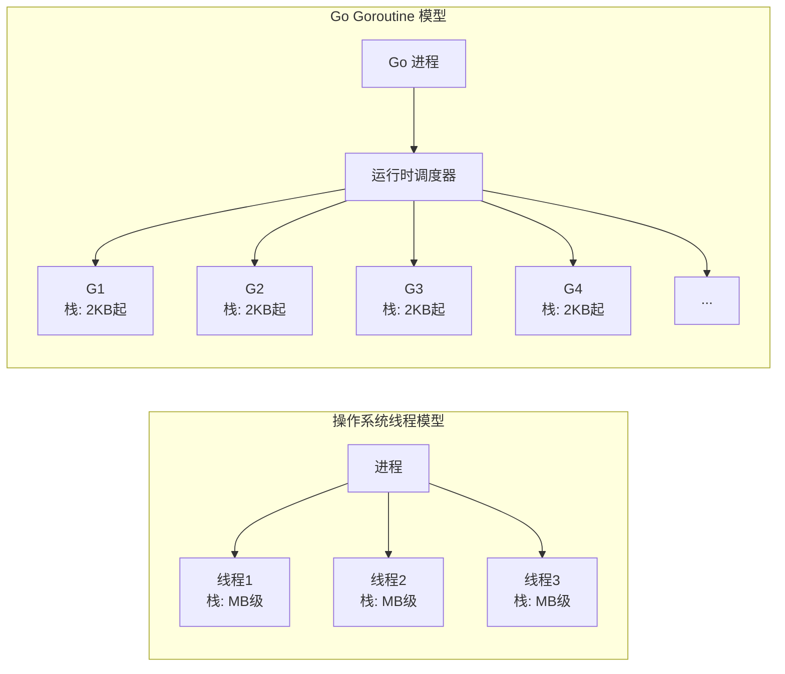
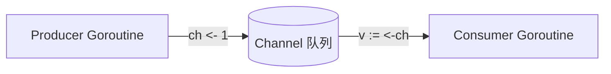
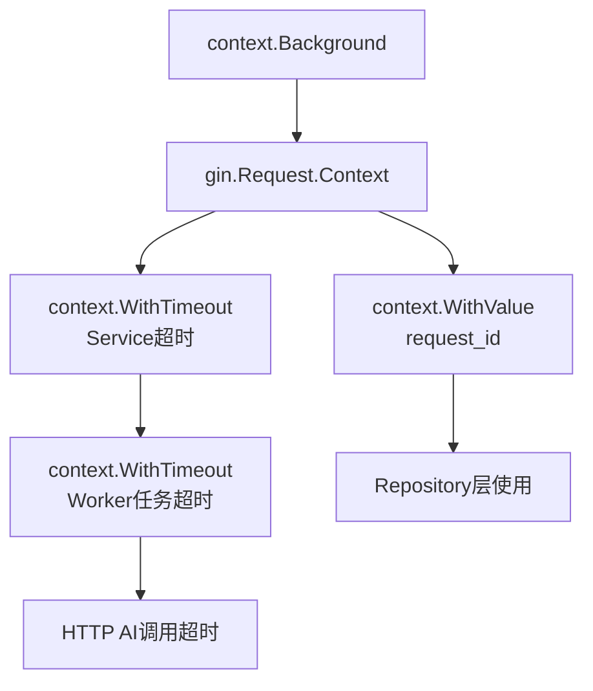
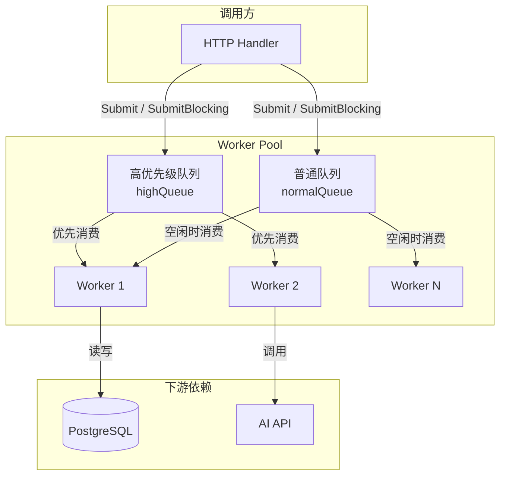
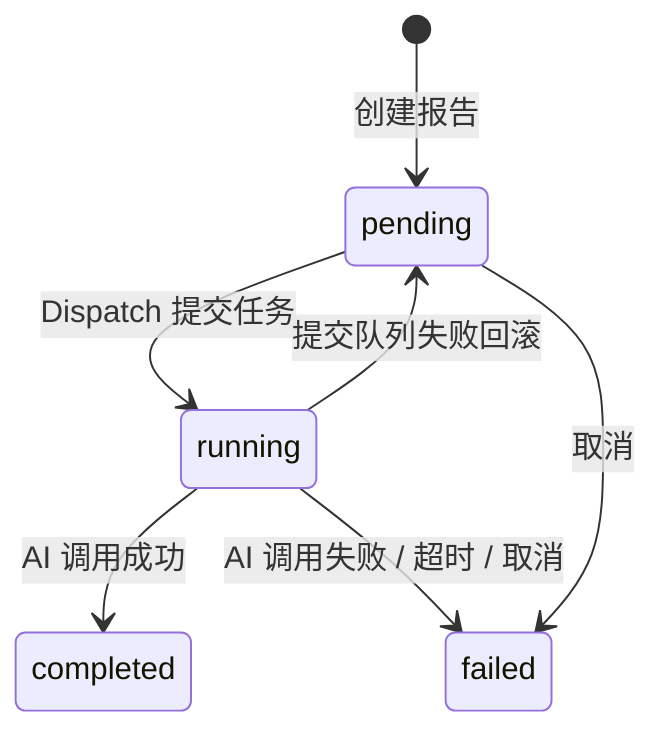
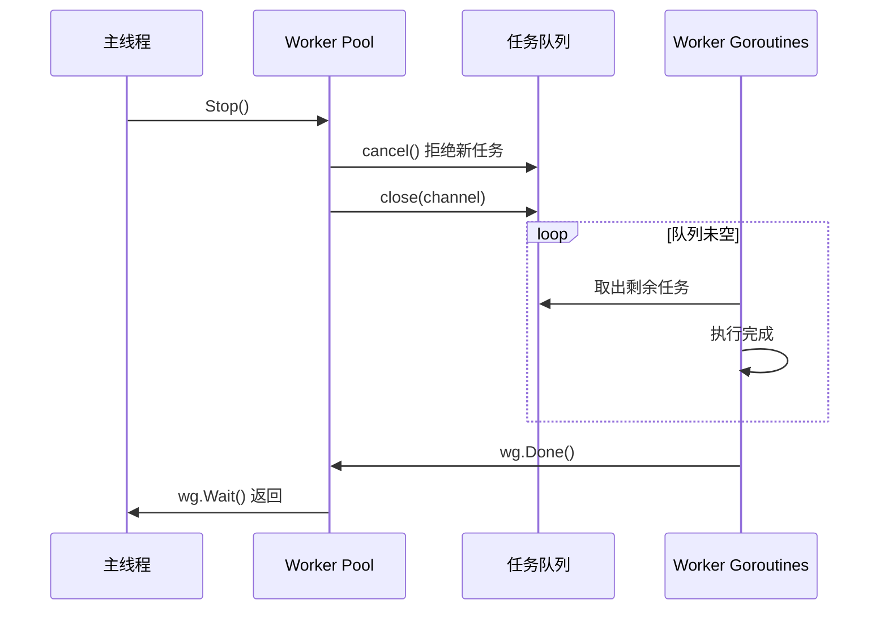
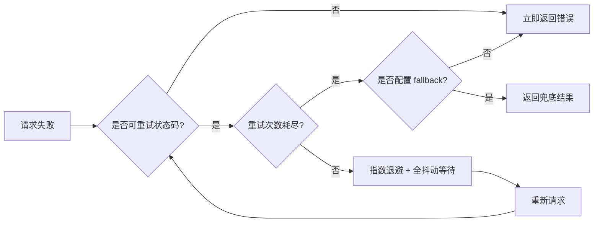
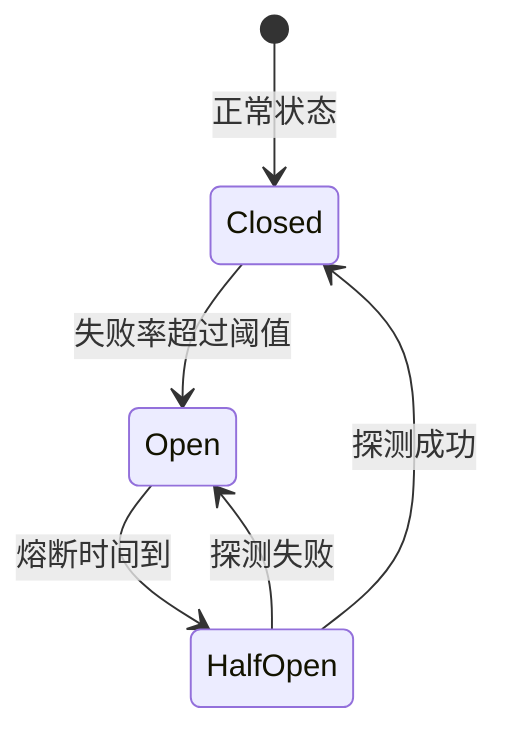
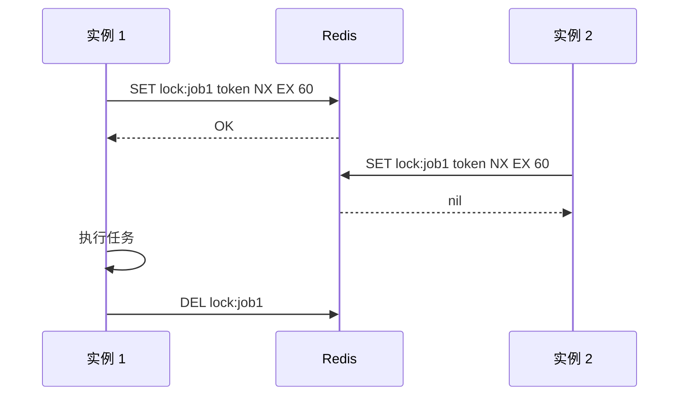
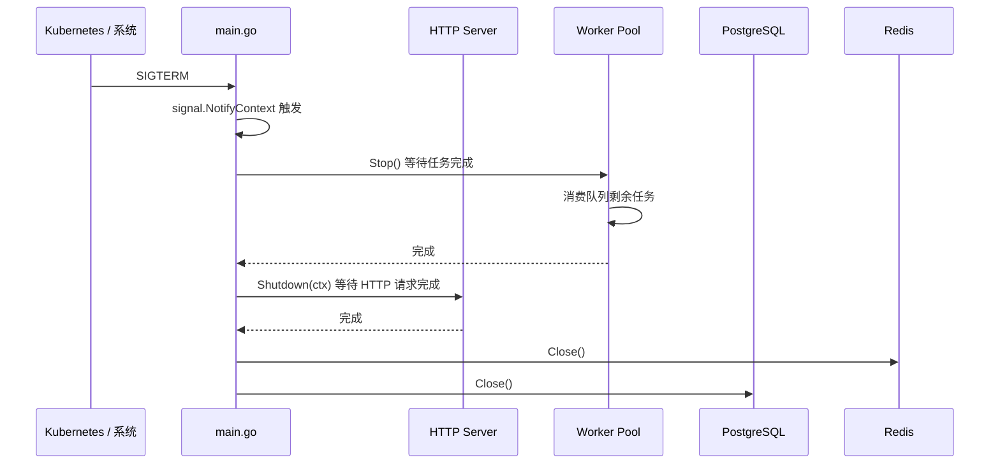

# 第10章 并发模式、异步任务与外部调用

第9章我们把认证授权体系补全了，但 `AgentService.Dispatch` 目前只是一个 `fmt.Printf` 的空实现。报告生成是典型的 I/O 密集型任务：调用 AI API、读写数据库、可能还要解析文档，单次执行动辄数秒到数分钟。如果前端点击"生成"后一直阻塞等待响应，HTTP 连接会被长时间占用，用户体验也很差。

本章我们把报告派发改造成**异步任务**：调用方立即收到"任务已提交"，真正的生成流程交给后台 Worker Pool 执行。同时系统讲解 Go 并发编程的核心模式：Goroutine、Channel、context、Worker Pool、超时重试、降级与优雅启停。

## 10.1 Go 并发基础：Goroutine、Channel、Select

### 10.1.1 为什么 Go 的并发模型与众不同

传统多线程编程中，线程是操作系统调度的基本单位，创建和切换成本都很高。Go 在语言层面提供了 **Goroutine**：一种由 Go 运行时（runtime）管理的轻量级执行单元。



对比维度：

| 特性 | OS 线程 | Goroutine |
|------|---------|-----------|
| 栈大小 | MB 级（通常 1–8 MB） | 2 KB 起，动态伸缩 |
| 创建成本 | 高（需要内核参与） | 低（用户态） |
| 切换成本 | 高（上下文切换） | 低（运行时调度） |
| 创建语法 | `pthread_create` 等 | `go funcName()` |
| 数量上限 | 数千到数万 | 数十万甚至百万 |

### 10.1.2 Goroutine + Channel：通过通信共享内存

Go 有一句名言："Do not communicate by sharing memory; instead, share memory by communicating." 意思是：不要通过共享内存来通信，而要通过通信来共享内存。

下面是一个最经典的生产者-消费者模式示例：

```go
func producer(ch chan<- int) {
    for i := 0; i < 5; i++ {
        ch <- i
    }
    close(ch)
}

func consumer(ch <-chan int) {
    for v := range ch {
        fmt.Println(v)
    }
}
```



Channel 可以分为：

- **无缓冲 channel**：`ch := make(chan int)`，发送和接收必须同时准备好，强同步；
- **有缓冲 channel**：`ch := make(chan int, 10)`，发送方在缓冲区满之前不会阻塞；
- **只发送/只接收 channel**：`chan<- T` / `<-chan T`，用于函数参数限制方向。

### 10.1.3 Select：多路复用与超时

`select` 可以同时监听多个 channel，常用于超时控制和非阻塞读取：

```go
select {
case v := <-ch:
    fmt.Println("received", v)
case <-time.After(5 * time.Second):
    fmt.Println("timeout")
default:
    fmt.Println("non-blocking")
}
```

### 10.1.4 项目中的反模式

一个常见的错误是在每个 HTTP Handler 里随手 `go func()`：

```go
// 反模式：不要这样做
func (h *AgentHandler) Dispatch(c *gin.Context) {
    go h.svc.Dispatch(...) // 无法追踪、panic 无法捕获、并发失控
}
```

这会导致：

- 并发数不可控，AI API 配额或数据库连接池被瞬间打满；
- panic 无法被 Recovery 中间件捕获；
- 任务丢失、状态不一致。

正确的做法是把异步任务交给统一的 **Worker Pool** 调度，Handler 只负责提交任务。这样并发度、队列长度、超时、错误处理都有边界。

## 10.2 context 包实战：超时、取消、截止日期

### 10.2.1 context 是什么

`context` 是 Go 并发编程的标配。它的核心能力：

- **取消传播**：父 context 取消后，所有子 context 都会收到 `ctx.Done()` 信号；
- **超时控制**：`context.WithTimeout` / `context.WithDeadline` 在到期后自动取消；
- **元数据透传**：`context.WithValue` 可以携带 request_id、用户信息等。本项目在 `RequestID` 中间件中把 request_id 同时写入 `gin.Context` 和 `c.Request.Context()`，兼顾 Handler 层与 Service/Worker 层的读取习惯。



### 10.2.2 项目中的 context 传递链

在 HTTP Handler 中，`gin.Context.Request.Context()` 已经携带了请求的**取消/超时信号**以及 **`request_id` 等元数据**，应该一路传入 Service、Repository 甚至 Worker。`Logger` 中间件注入的 logger 仍通过 `gin.Context` 的 `c.Set/c.Get` 提供（见 `internal/middleware/context.go`），而 `request_id` 本身也会写入 `c.Request.Context()`，供仅持有 `context.Context` 的下游组件读取。Worker 内部再用 `context.WithTimeout` 限制单个任务的执行时间：

```go
// 文件: src/backend/pkg/worker/pool.go

func (p *Pool) runJob(logger *slog.Logger, job Job) {
    // ...
    ctx, cancel := context.WithTimeout(p.ctx, defaultJobTimeout)
    defer cancel()

    if err := job.Execute(ctx); err != nil {
        logger.Error("job failed", "error", err)
        return
    }
    // ...
}
```

> **注意**：`context.WithTimeout` 创建的 context 必须 `defer cancel()`，否则会造成 Goroutine 泄漏。

### 10.2.3 context 使用规范

| 场景 | 推荐 API | 说明 |
|------|----------|------|
| 请求入口 | `c.Request.Context()` | Gin 请求自带 |
| 设置超时 | `context.WithTimeout(parent, timeout)` | 控制下游调用 |
| 设置截止时间 | `context.WithDeadline(parent, time)` | 基于绝对时间 |
| 取消信号 | `context.WithCancel(parent)` | 手动取消 |
| 元数据 | `context.WithValue(parent, key, val)` | 只传必要元数据 |

## 10.3 Worker Pool 模式：有界并发与背压处理

### 10.3.1 为什么需要 Worker Pool

无限制创建 Goroutine 的风险很明显：

- 内存耗尽：每个 goroutine 虽然轻量，但数十万个也会吃光内存；
- 调度开销：goroutine 过多时，运行时调度成本上升；
- 外部依赖被压垮：数据库连接池、AI API 配额都有上限。

Worker Pool 通过固定数量的 worker 和缓冲队列解决这些问题。



### 10.3.2 Pool 结构体设计

我们实现了一个支持**双优先级队列**的 Worker Pool。对外暴露的接口不变，内部会把每个任务和它提交时的上游 `context.Context` 一起封装成 `jobContext`：

```go
// 文件: src/backend/pkg/worker/pool.go

type Pool struct {
    workers     int
    queueSize   int
    highQueue   chan *jobContext // 高优先级队列
    normalQueue chan *jobContext // 普通优先级队列
    wg          sync.WaitGroup
    ctx         context.Context
    cancel      context.CancelFunc
    once        sync.Once
    stopped     chan struct{}
}

type Job interface {
    Execute(ctx context.Context) error
    ID() string
}

// jobContext 把任务与它提交时的上游 context 绑定在一起。
type jobContext struct {
    job Job
    ctx context.Context
}
```

- `NewPool(workers, queueSize)` 指定 worker 数量和每个优先级队列的缓冲大小；
- `Start()` 启动所有 worker goroutine；
- `Submit(job)` / `SubmitWithPriority(job, high)` 非阻塞提交，队列满立即返回错误；
- `SubmitBlocking(ctx, job)` / `SubmitWithPriorityBlocking(ctx, job, high)` 阻塞提交，支持 context 取消；
- `Stop()` 优雅关闭。

### 10.3.3 优先级调度逻辑

worker 主循环优先消费 `highQueue`，空闲时才处理 `normalQueue`：

```go
// 文件: src/backend/pkg/worker/pool.go

func (p *Pool) worker(id int) {
    defer p.wg.Done()
    logger := slog.With("worker_id", id)

    for {
        // 优先处理高优先级任务（非阻塞尝试）
        select {
        case jc, ok := <-p.highQueue:
            if !ok {
                p.drainNormal(logger)
                return
            }
            p.runJob(logger, jc)
            continue
        default:
        }

        // 没有高优先级任务时，阻塞等待普通任务
        select {
        case jc, ok := <-p.highQueue:
            if !ok {
                p.drainNormal(logger)
                return
            }
            p.runJob(logger, jc)
        case jc, ok := <-p.normalQueue:
            if !ok {
                return
            }
            p.runJob(logger, jc)
        }
    }
}
```

这种设计的优点是：

- **有界并发**：worker 数量固定，不会无限制占用 CPU 和 DB 连接；
- **背压处理**：队列满时 `Submit` 返回错误，调用方可以降级或限流；
- **优先级隔离**：高优先级任务不会被普通任务长时间阻塞。

### 10.3.4 上游 Context 的透传：值要保留，取消信号要屏蔽

`SubmitBlocking(ctx, job)` 传入的 `ctx` 通常来自 HTTP Handler 的 `c.Request.Context()`，里面可能有 `request_id`、用户 ID 等追踪信息。但 Worker Pool 执行的是**异步任务**：如果直接把上游的取消信号透传给 `job.Execute`，用户一关闭浏览器，后台的报告生成就被中断了，这通常不符合预期。

因此我们在 `runJob` 里用 `valueOnlyContext` 包装上游 `ctx`：保留它的值（`Value`），但覆盖 `Deadline` / `Done` / `Err`，让它不再传播取消信号。真正的取消/超时由 Pool 自己的 `defaultJobTimeout` 控制。

```go
// 文件: src/backend/pkg/worker/pool.go

// valueOnlyContext 包装一个 context，只暴露它的值，忽略它的取消信号。
type valueOnlyContext struct {
    context.Context
}

func (valueOnlyContext) Deadline() (time.Time, bool) { return time.Time{}, false }
func (valueOnlyContext) Done() <-chan struct{}       { return nil }
func (valueOnlyContext) Err() error                  { return nil }

func (p *Pool) runJob(logger *slog.Logger, jc *jobContext) {
    logger = logger.With("job_id", jc.job.ID())
    logger.Info("processing job")
    start := time.Now()

    ctx, cancel := context.WithTimeout(valueOnlyContext{jc.ctx}, defaultJobTimeout)
    defer cancel()

    if err := jc.job.Execute(ctx); err != nil {
        logger.Error("job failed", "error", err, "cost", time.Since(start))
        return
    }
    logger.Info("job completed", "cost", time.Since(start))
}
```

这样 `job.Execute(ctx)` 内部既可以通过 `middleware.GetRequestIDFromContext(ctx)` 拿到 `request_id`，又不会因为 HTTP 连接断开而被意外取消。

## 10.4 轻量任务队列：优先级队列 + 优雅关闭

### 10.4.1 报告生成状态机

报告生成是一个典型的状态机，我们定义了四种状态：



### 10.4.2 优雅关闭的关键

优雅关闭是 Worker Pool 的关键能力。当服务收到 `SIGTERM` 时，应该：

1. 停止接收新任务（`Submit` 返回错误）；
2. 继续执行队列中已提交的任务；
3. 等所有 worker 完成后退出。



实现方式是先 `cancel()` 再 `close(channel)`：

```go
// 文件: src/backend/pkg/worker/pool.go

func (p *Pool) Stop() {
    p.cancel()
    close(p.highQueue)
    close(p.normalQueue)
    p.wg.Wait()
    close(p.stopped)
    slog.Info("worker pool stopped")
}
```

由于 worker 只通过 channel 状态判断是否退出，关闭 channel 后，worker 会把队列里剩余的任务全部消费完再退出。`Submit` 方法在入队前检查 `p.ctx.Done()`，因此 Stop 后的新任务会被拒绝。

### 10.4.3 业务侧：异步 Dispatch

在业务侧，`AgentService.Dispatch` 把报告生成任务包装成 `reportGenerationJob` 提交到 Worker Pool：

```go
// 文件: src/backend/internal/service/agent_service.go

func (s *agentService) Dispatch(ctx context.Context, reportID int64) error {
    report, err := s.reportRepo.GetByID(ctx, reportID)
    // ... 校验状态为 pending ...

    if err := s.reportRepo.UpdateStatus(ctx, reportID, domain.ReportStatusRunning); err != nil {
        return apperrors.NewInternal("更新报告状态失败", err)
    }

    job := &reportGenerationJob{
        reportID:   reportID,
        title:      report.Title,
        topic:      report.Topic,
        aiEndpoint: s.aiEndpoint,
        reportRepo: s.reportRepo,
        taskRepo:   s.taskRepo,
        httpClient: s.httpClient,
        logger:     middleware.GetLoggerFromContext(ctx).With("report_id", reportID),
    }

    if err := s.workerPool.SubmitBlocking(ctx, job); err != nil {
        _ = s.reportRepo.UpdateStatus(ctx, reportID, domain.ReportStatusPending)
        return apperrors.NewInternal("任务提交失败", err)
    }
    return nil
}
```

提交失败时回滚报告状态为 `pending`，避免任务"丢失"。

注意到 `middleware.GetLoggerFromContext(ctx)` 会从传入的 `context.Context` 中取出 `request_id`，因此即使任务在后台 Worker 的 goroutine 中执行，日志里仍然保留了原始 HTTP 请求的追踪 ID。这样既能把 `request_id` 一路透传到 Service/Worker，又不必让 Service 依赖 `gin.Context`。

## 10.5 HTTP 客户端封装：超时、重试、熔断、降级

### 10.5.1 外部调用的可靠性挑战

调用外部 AI 服务时，网络抖动、限流、临时故障是常态。一个生产级 HTTP 客户端至少需要：

- **超时**：单次请求不能无限等待；
- **重试**：对可重试错误（429、502、503、504）进行有限次重试；
- **退避**：指数退避 + 抖动，避免所有客户端在同一时刻重试造成"惊群效应"；
- **降级**：所有重试失败后，返回兜底结果，保证核心链路可用。

### 10.5.2 重试策略对比

| 策略 | 第1次等待 | 第2次等待 | 第3次等待 | 风险 |
|------|-----------|-----------|-----------|------|
| 固定间隔 | 500ms | 500ms | 500ms | 惊群效应 |
| 指数退避 | 500ms | 1s | 2s | 仍可能扎堆 |
| 指数退避 + 全抖动 | 0–500ms | 0–1s | 0–2s | 推荐 |



### 10.5.3 Client 实现

我们封装了 `pkg/httpx.Client`：

```go
// 文件: src/backend/pkg/httpx/client.go

type Client struct {
    base     *http.Client
    retryCfg RetryConfig
    fallback FallbackFunc
}

type RetryConfig struct {
    MaxRetries           int
    InitialBackoff       time.Duration
    MaxBackoff           time.Duration
    RetryableStatusCodes []int
}

func DefaultRetryConfig() RetryConfig {
    return RetryConfig{
        MaxRetries:           3,
        InitialBackoff:       500 * time.Millisecond,
        MaxBackoff:           5 * time.Second,
        RetryableStatusCodes: []int{429, 502, 503, 504},
    }
}
```

重试时采用**全抖动（Full Jitter）**退避：

```go
// 文件: src/backend/pkg/httpx/client.go

func backoff(attempt int, initial, maxBackoff time.Duration) time.Duration {
    d := float64(initial) * math.Pow(2, float64(attempt-1))
    if d > float64(maxBackoff) {
        d = float64(maxBackoff)
    }
    d = d * rand.Float64() // 全抖动
    if d < float64(initial) {
        d = float64(initial)
    }
    return time.Duration(d)
}
```

> **注意**：重试会消耗请求 Body。我们在 `Do` 方法中先读取 Body 保存，每次重试时重新构造 `io.NopCloser(bytes.NewReader(body))`，这样 POST JSON 也能安全重试。

### 10.5.4 降级（Fallback）

降级通过 `FallbackFunc` 实现。当所有重试都失败后，不直接返回错误，而是返回兜底内容：

```go
// 文件: src/backend/cmd/server/main.go

func aiFallback(provider string) httpx.FallbackFunc {
    return func(err error, resp *http.Response) ([]byte, error) {
        slog.Warn("AI call failed, using fallback content", "error", err)
        content := "## 研究报告（降级内容）\n\n由于 AI 服务暂时不可用..."
        result := map[string]string{"output": content}
        return json.Marshal(result)
    }
}
```

### 10.5.5 熔断（Circuit Breaker）

熔断本章以概念讲解为主。它的核心思想是：当错误率达到阈值后，短时间内直接拒绝请求，给下游恢复时间。



可以基于失败计数器实现一个简单的状态机。后续对接真实 AI Provider 时，再根据实际场景引入成熟的熔断库（如 `sony/gobreaker`）。

## 10.6 定时任务：分布式 cron 与任务幂等性

### 10.6.1 定时任务场景

报告生成平台还有很多定时任务场景：

- 重试失败报告；
- 清理过期文件；
- 生成日报/周报；
- 同步外部数据源。

多副本部署时，必须保证同一任务只在一个实例上执行，否则会出现重复处理。

### 10.6.2 分布式锁实现

我们实现了一个基于 Redis `SET key value NX EX seconds` 的轻量分布式锁：



```go
// 文件: src/backend/pkg/schedule/scheduler.go

func (s *Scheduler) RunOnce(ctx context.Context, key string, ttl time.Duration, task Task) error {
    lockKey := fmt.Sprintf("%s:lock:%s", s.prefix, key)
    execKey := fmt.Sprintf("%s:exec:%s", s.prefix, key)
    token := generateToken()

    acquired, err := s.client.SetNX(ctx, lockKey, token, ttl).Result()
    if err != nil {
        return fmt.Errorf("acquire lock: %w", err)
    }
    if !acquired {
        return ErrLockNotAcquired
    }

    // 记录执行时间用于幂等性判断
    now := time.Now().UTC().Format(time.RFC3339)
    _ = s.client.Set(ctx, execKey, now, ttl).Err()

    if err := task(ctx); err != nil {
        // 任务失败不立即释放锁，让 ttl 自然过期
        return fmt.Errorf("task execution: %w", err)
    }

    // 使用 Lua 脚本原子释放锁，避免误删其他实例的锁
    script := `
        if redis.call("get", KEYS[1]) == ARGV[1] then
            return redis.call("del", KEYS[1])
        else
            return 0
        end
    `
    _, _ = s.client.Eval(ctx, script, []string{lockKey}, token).Result()
    return nil
}
```

### 10.6.3 幂等性保证

幂等性可以通过以下方式保证：

- 分布式锁：`SET NX EX` 保证同一时刻只有一个实例执行；
- 执行时间记录：通过 `LastExecutedAt` 避免短时间内重复执行；
- 业务唯一键：数据库层面的唯一索引或 Redis 去重键。

本章把这个 Scheduler 作为可复用组件提供，不强制集成到主服务启动流程。后续第 31 章可观测性、第 33 章调度器中会进一步展开。

## 10.7 优雅启停：信号处理、资源释放、零停机部署准备

### 10.7.1 为什么需要优雅启停

生产环境的服务必须能够优雅处理 `SIGINT` / `SIGTERM` 信号，避免正在处理的任务被强行中断。Kubernetes 在滚动更新、缩容时会先发送 `SIGTERM`，等待一段时间后再强制 `SIGKILL`。



### 10.7.2 main.go 中的实现

我们在 `main.go` 中使用 `signal.NotifyContext` 监听信号，并使用 `http.Server.Shutdown` 优雅关闭 HTTP 服务：

```go
// 文件: src/backend/cmd/server/main.go

func main() {
    // ... 初始化基础组件和依赖注入 ...

    workerPool := worker.NewPool(cfg.WorkerPool.Workers, cfg.WorkerPool.QueueSize)
    workerPool.Start()

    retryCfg := httpx.DefaultRetryConfig()
    retryCfg.MaxRetries = cfg.AI.RetryCount()
    aiHTTPClient := httpx.NewClientWithFallback(cfg.AI.APITimeout(), retryCfg, aiFallback(cfg.AI.Provider))

    // ... 依赖注入 ...

    srv := &http.Server{
        Addr:    ":" + cfg.Server.Port,
        Handler: r,
    }

    ctx, stop := signal.NotifyContext(context.Background(), syscall.SIGINT, syscall.SIGTERM)
    defer stop()

    go func() {
        if err := srv.ListenAndServe(); err != nil && err != http.ErrServerClosed {
            slog.Error("server failed", slog.Any("error", err))
            os.Exit(1)
        }
    }()

    <-ctx.Done()
    slog.Info("server shutting down")

    shutdownCtx, cancel := context.WithTimeout(context.Background(), 30*time.Second)
    defer cancel()

    workerPool.Stop()
    _ = srv.Shutdown(shutdownCtx)

    slog.Info("server stopped")
}
```

### 10.7.3 关闭顺序

关闭顺序很重要：

1. `workerPool.Stop()`：先停止接收新任务，等待队列中已提交的任务执行完成；
2. `srv.Shutdown(ctx)`：停止接收新的 HTTP 请求，等待正在处理的请求完成；
3. `defer db.Close()` / `defer redisClient.Close()`：最后释放数据库和 Redis 连接。

这个顺序保证了：

- 正在执行的任务不会因为进程退出而中断；
- 新的任务和请求不会被接收；
- 连接池等资源被正确释放。

## 小结

本章我们为平台引入了完整的并发与外部调用能力：

- **Goroutine + Channel + Select**：Go 并发的基础，强调"通过通信共享内存"。
- **context**：在 Handler、Service、Repository 和 Worker 之间传递超时、取消信号。
- **Worker Pool**：固定 worker 数量 + 双优先级队列 + 背压处理，避免无限制创建 goroutine。
- **异步任务队列**：`AgentService.Dispatch` 把报告生成任务提交到 Worker Pool，立即返回"任务已提交"。
- **HTTP 客户端封装**：超时、指数退避重试、全抖动、降级，提升外部 AI 服务的可靠性。
- **定时任务**：基于 Redis 分布式锁的轻量 Scheduler，支持幂等性。
- **优雅启停**：`signal.NotifyContext` + `http.Server.Shutdown` + Worker Pool 优雅关闭，为零停机部署打基础。

你可以用以下 curl 快速验证：

```bash
# 1. 注册并登录（参考第9章）
# 2. 创建报告
curl -X POST http://localhost:8080/api/reports \
  -H "Authorization: Bearer <access_token>" \
  -H "Content-Type: application/json" \
  -d '{"title":"AI 研究","topic":"多智能体协作"}'

# 3. 派发报告生成任务（异步）
curl -X POST http://localhost:8080/api/reports/1/dispatch \
  -H "Authorization: Bearer <access_token>"
# 返回：{"code":0,"message":"任务已提交"}

# 4. 轮询报告状态
watch -n 1 'curl -s http://localhost:8080/api/reports/1 \
  -H "Authorization: Bearer <access_token>" | jq .data.status'
```

下一章（第11章）我们进入缓存、搜索与文件系统：Redis 缓存模式、PostgreSQL 全文搜索、MinIO 文件存储抽象。
