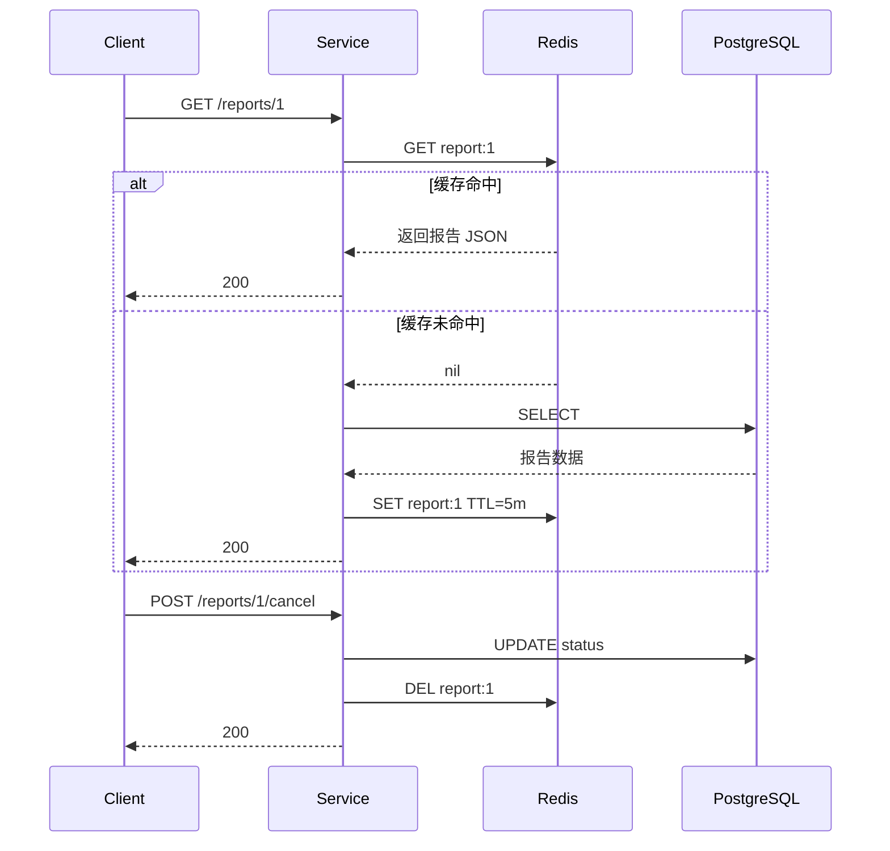
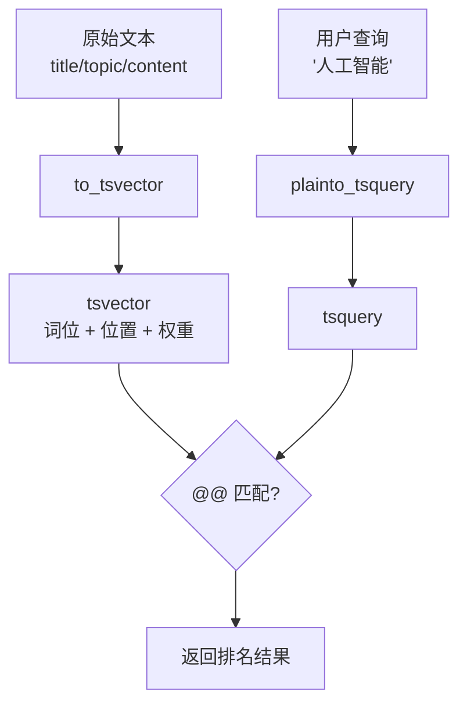
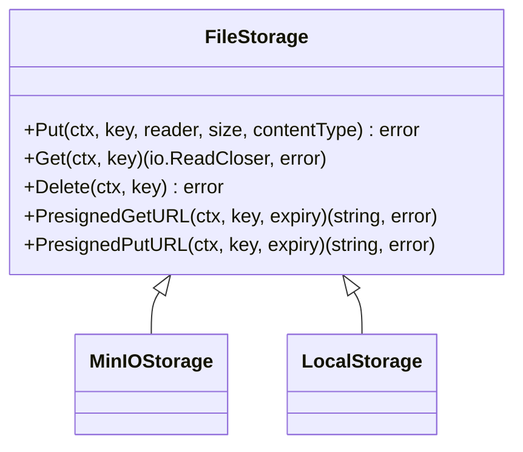
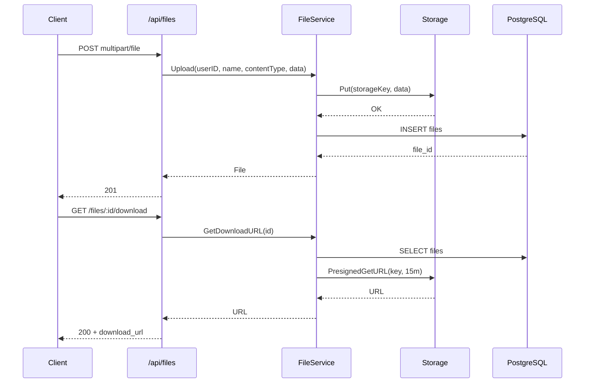

# 第11章 缓存、搜索与文件系统

第10章我们搭好了异步任务与外部调用体系。报告生成、AI 调用这些 I/O 密集型操作一旦跑起来，系统会面临三类新需求：

1. **缓存**：报告详情、列表等读多写少的数据反复查库，既慢又浪费数据库连接。
2. **搜索**：报告标题、主题、正文累积多了，用户需要快速检索，而不是翻页。
3. **文件系统**：报告可能附带 PDF、图片、数据源，需要上传、下载、临时访问链接。

本章我们依次实现 Redis 缓存、PostgreSQL 全文搜索、MinIO 文件存储抽象，并把它们融入已有的 Clean Architecture。

## 11.1 缓存：Redis 应用级缓存

### 11.1.1 为什么需要缓存

以报告详情接口为例：前端每次进入详情页都会请求 `/api/reports/:id`。如果每次都要走 PostgreSQL，高并发时数据库连接池很快会成为瓶颈。缓存可以：

- 降低数据库负载；
- 减少响应延迟；
- 支撑更高的 QPS。

### 11.1.2 Cache-Aside 模式

最常用的模式是 **Cache-Aside（旁路缓存）**：

- 读：先查缓存，命中直接返回；未命中查数据库，再写入缓存。
- 写：先写数据库，再删除（或更新）缓存。



为什么不写缓存而是删缓存？因为写缓存需要知道最新值，容易和并发写入产生竞态；删缓存简单且总能在下次读取时重新回填。

### 11.1.3 缓存抽象

我们在 `internal/cache` 中定义统一接口，业务层只依赖接口，不关心是 Redis 还是内存：

```go
// 文件: src/backend/internal/cache/cache.go

type Manager interface {
    Get(ctx context.Context, key string, dest any) error
    Set(ctx context.Context, key string, value any, ttl time.Duration) error
    Delete(ctx context.Context, key string) error
    DeletePattern(ctx context.Context, pattern string) error
}

func ReportKey(id int64) string { return fmt.Sprintf("report:%d", id) }
func ReportListKey(userID int64, page, pageSize int) string {
    return fmt.Sprintf("reports:user:%d:page:%d:size:%d", userID, page, pageSize)
}
```

Redis 实现使用 JSON 序列化存储对象；内存实现用于测试：

```go
// 文件: src/backend/internal/cache/redis_cache.go

func (c *RedisCache) Get(ctx context.Context, key string, dest any) error {
    data, err := c.client.Get(ctx, c.prefixed(key)).Bytes()
    if err == redis.Nil {
        return ErrCacheMiss
    }
    // ... 反序列化
}

func (c *RedisCache) DeletePattern(ctx context.Context, pattern string) error {
    // 使用 SCAN 分批删除，避免 KEYS 阻塞
    iter := c.client.Scan(ctx, 0, c.prefixed(pattern), 100).Iterator()
    // ...
}
```

### 11.1.4 为 Report 添加缓存

`ReportService` 现在注入 `cache.Manager`：

```go
// 文件: src/backend/internal/service/report_service.go

func (s *reportService) GetByID(ctx context.Context, id int64) (*domain.Report, error) {
    // 1. 先读缓存
    if s.cache != nil {
        var cached domain.Report
        if err := s.cache.Get(ctx, cache.ReportKey(id), &cached); err == nil {
            return &cached, nil
        }
    }

    // 2. 缓存未命中，查库
    report, err := s.repo.GetByID(ctx, id)
    // ...

    // 3. 回填缓存
    if s.cache != nil {
        _ = s.cache.Set(ctx, cache.ReportKey(id), report, 5*time.Minute)
    }
    return report, nil
}
```

列表也按同样方式缓存，TTL 可以短一些（2 分钟），因为列表变化更频繁。

### 11.1.5 缓存问题诊断：穿透、击穿、雪崩

| 问题 | 现象 | 防御手段 |
|------|------|----------|
| **缓存穿透** | 查询不存在的数据，每次穿透到 DB | 对空结果也缓存短暂 TTL；布隆过滤器 |
| **缓存击穿** | 热点 key 过期瞬间大量请求打到 DB | 互斥锁/单线程重建；逻辑过期 |
| **缓存雪崩** | 大量 key 同时过期，DB 压力激增 | 随机 TTL；多级缓存；熔断降级 |

我们的实现中对不存在的报告返回 `apperrors.NewNotFound`，没有缓存空结果——生产环境中建议为高频空查询加短暂空值缓存。

### 11.1.6 缓存 TTL 与失效

- `report:{id}`：5 分钟，详情变化少。
- `reports:user:{id}:page:*`：2 分钟，列表变化相对多。

失效策略：

```go
// Create 后删除该用户的列表缓存
_ = s.invalidateReportList(ctx, userID)

// UpdateStatus / Cancel 后删除详情 + 列表
_ = s.cache.Delete(ctx, cache.ReportKey(id))
_ = s.invalidateReportList(ctx, report.CreatedBy)
```

### 11.1.7 反模式

- **缓存和数据库一起更新**：更新缓存失败后可能导致数据不一致。
- **不设置 TTL**：缓存变成永久内存，数据更新也无法生效。
- **只删 key 不删列表**：列表缓存会长期保留脏数据。

### 11.1.8 生产关注

- 热 key 监控（Redis `SLOWLOG`、`INFO commandstats`）。
- 大 value 拆分（单条报告内容过长时考虑分片）。
- 命中率指标：`cache_hit`、`cache_miss`。
- 第 31 章可观测性会进一步展开。

## 11.2 搜索：PostgreSQL 全文搜索

### 11.2.1 为什么不先上 Elasticsearch

Elasticsearch 很强，但引入它意味着：

- 额外集群，运维成本高；
- 数据同步链路复杂；
- 对小规模项目可能是过度设计。

如果搜索量不大、语种以中文+英文混合为主，PostgreSQL 的 `tsvector` + GIN 索引完全够用，等数据量到千万级再考虑 Elasticsearch。

### 11.2.2 tsvector / tsquery / GIN 索引

PostgreSQL 把文本拆成**词位（lexeme）**，存为 `tsvector`；查询时用 `tsquery` 匹配；GIN 索引加速匹配。



`setweight` 可以给不同字段赋权重：`A`（标题）> `B`（主题）> `C`（正文）。

### 11.2.3 迁移：添加搜索向量

```sql
-- 文件: src/backend/internal/repository/migrations/000003_add_search_and_files.up.sql

ALTER TABLE reports
    ADD COLUMN IF NOT EXISTS search_vector tsvector;

CREATE INDEX IF NOT EXISTS idx_reports_search ON reports USING GIN(search_vector);

CREATE OR REPLACE FUNCTION reports_search_update()
RETURNS TRIGGER AS $$
BEGIN
    NEW.search_vector :=
        setweight(to_tsvector('simple', COALESCE(NEW.title, '')), 'A') ||
        setweight(to_tsvector('simple', COALESCE(NEW.topic, '')), 'B') ||
        setweight(to_tsvector('simple', COALESCE(NEW.content, '')), 'C');
    RETURN NEW;
END;
$$ LANGUAGE plpgsql;

CREATE TRIGGER reports_search_trigger
    BEFORE INSERT OR UPDATE ON reports
    FOR EACH ROW
    EXECUTE FUNCTION reports_search_update();

UPDATE reports SET search_vector = ... WHERE search_vector IS NULL;
```

使用 `simple` 字典，避免中文被错误词干化；适合中英文混合场景。

### 11.2.4 实现 SearchRepository

```go
// 文件: src/backend/internal/repository/postgres/search_repository.go

const querySearchReports = `
    SELECT id, title, topic, status, content, sources, created_by, created_at, updated_at, completed_at
    FROM reports
    WHERE created_by = $1
      AND search_vector @@ plainto_tsquery('simple', $2)
    ORDER BY ts_rank(search_vector, plainto_tsquery('simple', $2)) DESC, created_at DESC
    LIMIT $3 OFFSET $4
`
```

`plainto_tsquery` 会把用户输入安全地转成 `tsquery`，避免注入；同时支持多个关键词。

### 11.2.5 搜索排名与分页

`ts_rank` 返回 0–1 的相似度分数。我们按分数降序、再按创建时间降序排列，保证最新且最相关的结果在前。

### 11.2.6 反模式：LIKE '%keyword%'

```sql
-- 不要这样做
SELECT * FROM reports WHERE title LIKE '%人工智能%';
```

这会导致全表扫描，无法使用索引，数据量一大就慢。

### 11.2.7 生产关注

- 定期 `VACUUM ANALYZE` 让查询计划器保持统计信息新鲜。
- 监控 GIN 索引大小，避免膨胀。
- 中文场景可考虑 `pg_bigm` 或 `zhparser` 优化分词。

## 11.3 文件存储：MinIO 抽象

### 11.3.1 对象存储 vs 本地文件系统

生产环境推荐对象存储（MinIO/S3）：

- 可横向扩展；
- 支持预签名 URL，避免文件直穿应用；
- 多副本/纠删码保证 durability。

本地文件系统仅用于开发和测试。

### 11.3.2 存储接口设计



### 11.3.3 MinIO 实现

```go
// 文件: src/backend/internal/storage/minio_storage.go

func NewMinIOStorage(endpoint, accessKey, secretKey, bucket string, useSSL bool) (*MinIOStorage, error) {
    client, err := minio.New(endpoint, &minio.Options{
        Creds:  credentials.NewStaticV4(accessKey, secretKey, ""),
        Secure: useSSL,
    })
    // 检查并创建 bucket
}

func (s *MinIOStorage) PresignedGetURL(ctx context.Context, key string, expiry time.Duration) (string, error) {
    u, err := s.client.PresignedGetObject(ctx, s.bucket, key, expiry, nil)
    return u.String(), err
}
```

### 11.3.4 本地存储实现

```go
// 文件: src/backend/internal/storage/local_storage.go

func (s *LocalStorage) Put(ctx context.Context, key string, reader io.Reader, size int64, contentType string) error {
    path := s.path(key)
    _ = os.MkdirAll(filepath.Dir(path), 0755)
    f, _ := os.Create(path)
    defer f.Close()
    _, err := io.Copy(f, reader)
    return err
}
```

### 11.3.5 文件元数据表

```sql
CREATE TABLE files (
    id BIGSERIAL PRIMARY KEY,
    name VARCHAR(255) NOT NULL,
    storage_key VARCHAR(500) NOT NULL UNIQUE,
    content_type VARCHAR(100) NOT NULL,
    size BIGINT NOT NULL DEFAULT 0,
    bucket VARCHAR(100) NOT NULL,
    created_by BIGINT NOT NULL REFERENCES users(id),
    created_at TIMESTAMPTZ NOT NULL DEFAULT NOW()
);
```

数据库只存元数据，不存文件内容。

### 11.3.6 上传、下载与预签名 URL



预签名上传让客户端直接 PUT 到 MinIO，不经过应用服务器，适合大文件：

```go
// 文件: src/backend/internal/service/file_service.go

func (s *fileService) PresignedUploadURL(...) (string, *domain.File, error) {
    file := &domain.File{...}
    url, err := s.storage.PresignedPutURL(ctx, file.StorageKey, 15*time.Minute)
    if err != nil {
        return "", nil, apperrors.NewInternal("生成上传链接失败", err)
    }
    _ = s.repo.Create(ctx, file)
    return url, file, nil
}
```

### 11.3.7 反模式：在数据库中存文件内容

不要把图片/PDF 直接存 `BYTEA` 或 `BLOB`：

- 单表数据量膨胀；
- 备份恢复慢；
- 数据库连接被大查询长时间占用。

正确做法：数据库只存元数据，内容交给对象存储。

### 11.3.8 生产关注

- MIME 类型白名单，防止上传可执行文件。
- 文件大小限制，Handler 和 Service 双层校验。
- 文件名与 `storageKey` 分离，使用 UUID 作为实际存储键，避免覆盖和遍历。
- 病毒扫描（可接入 ClamAV 等）。

## 11.4 整合到 Clean Architecture

### 11.4.1 依赖注入更新

`cmd/server/main.go` 中新增：

```go
cacheMgr := cache.NewRedisCache(redisClient.Client, cache.Config{
    DefaultTTL: cfg.Cache.DefaultTTL(),
    Prefix:     cfg.Cache.Prefix,
})

fileStorage := newFileStorage(cfg.MinIO)

searchRepo := postgres.NewSearchRepository(db.DB)
fileRepo := postgres.NewFileRepository(db.DB)

reportSvc := service.NewReportService(reportRepo, cacheMgr)
searchSvc := service.NewSearchService(searchRepo)
fileSvc := service.NewFileService(fileRepo, fileStorage, cfg.MinIO.Bucket, 0, nil)
```

`newFileStorage` 优先尝试 MinIO，失败则降级到本地存储，保证开发环境开箱即用。

### 11.4.2 路由注册

```go
// 文件: src/backend/internal/handler/handler.go

search := api.Group("/search")
search.Use(middleware.JWTAuth(h.jwtSecret, h.blacklist))
search.Use(middleware.RateLimit(h.rl, 60, time.Minute))
{
    search.GET("/reports", h.Search.Reports)
}

files := api.Group("/files")
files.Use(middleware.JWTAuth(h.jwtSecret, h.blacklist))
files.Use(middleware.RateLimit(h.rl, 50, time.Minute))
{
    files.POST("", h.File.Upload)
    files.GET("", h.File.List)
    files.GET("/:id", h.File.Get)
    files.GET("/:id/download", h.File.Download)
    files.DELETE("/:id", h.File.Delete)
    files.GET("/presigned-upload", h.File.PresignedUpload)
}
```

### 11.4.3 健康检查

当前 `/ready` 只检查数据库。后续可扩展为同时检查 Redis 和 MinIO：

```go
// 伪代码，第31章可观测性中完善
func (h *HealthHandler) Ready(c *gin.Context) {
    // check DB, Redis, Storage
}
```

## 11.5 测试与验证

### 11.5.1 缓存测试

使用 `miniredis` 测试 Redis 缓存，内存缓存测试 TTL 和模式删除：

```bash
cd src/backend
go test ./internal/cache/... -v
```

### 11.5.2 搜索测试

内存版 `SearchRepository` 用简单关键字匹配，保证 `SearchService` 分页逻辑正确；PostgreSQL 版依赖迁移后的 `search_vector`。

### 11.5.3 文件存储测试

`LocalStorage` 覆盖 Put/Get/Delete；`FileService` 覆盖上传、下载、删除、预签名 URL、大小与类型校验。

### 11.5.4 curl 验证示例

```bash
# 0. 登录并获取 token（参考第9章）
TOKEN=<your_jwt_token>

# 1. 创建报告
for i in {1..3}; do
  curl -s -X POST http://localhost:8080/api/reports \
    -H "Authorization: Bearer $TOKEN" \
    -H "Content-Type: application/json" \
    -d "{\"title\":\"人工智能报告$i\",\"topic\":\"AI 应用场景\"}"
done

# 2. 第一次获取报告详情（缓存未命中）
curl -s -w "\nhttp_code=%{http_code}\ntime=%{time_total}\n" \
  -H "Authorization: Bearer $TOKEN" \
  http://localhost:8080/api/reports/1 | tail -2

# 3. 第二次获取（缓存命中，响应时间明显缩短）
curl -s -w "\nhttp_code=%{http_code}\ntime=%{time_total}\n" \
  -H "Authorization: Bearer $TOKEN" \
  http://localhost:8080/api/reports/1 | tail -2

# 4. 取消报告，观察缓存失效
curl -s -X POST http://localhost:8080/api/reports/1/cancel \
  -H "Authorization: Bearer $TOKEN" | jq .

# 5. 全文搜索
curl -s "http://localhost:8080/api/search/reports?q=人工智能&page=1&page_size=10" \
  -H "Authorization: Bearer $TOKEN" | jq .

# 6. 上传文件
curl -s -X POST http://localhost:8080/api/files \
  -H "Authorization: Bearer $TOKEN" \
  -F "file=@/path/to/report.pdf" | jq .

# 7. 获取下载链接
curl -s http://localhost:8080/api/files/1/download \
  -H "Authorization: Bearer $TOKEN" | jq .

# 8. 获取预签名上传链接
curl -s "http://localhost:8080/api/files/presigned-upload?name=draft.pdf&content_type=application/pdf" \
  -H "Authorization: Bearer $TOKEN" | jq .
```

## 小结

本章为平台补上了三块基础设施：

- **Redis Cache-Aside 缓存**：为报告详情/列表加速，并演示缓存失效、穿透/击穿/雪崩防御思路。
- **PostgreSQL 全文搜索**：用 `tsvector` + GIN 索引实现报告搜索，避免过早引入 Elasticsearch。
- **MinIO 文件存储抽象**：统一接口支持对象存储与本地文件系统，支持上传、下载、预签名 URL。

下一章（第12章）我们进入 pgvector 与向量数据存储：在 PostgreSQL 中统一管理关系数据与 Embedding 向量，为后续 RAG 与语义检索打下基础。
