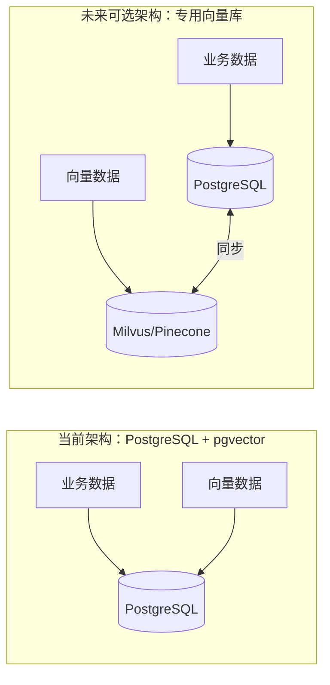
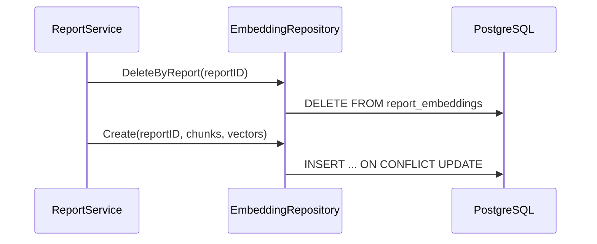
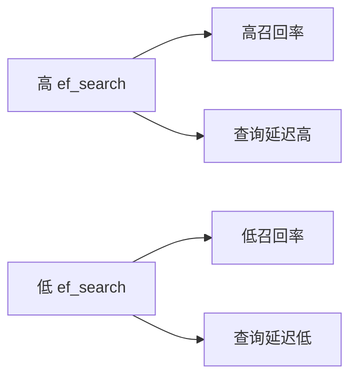
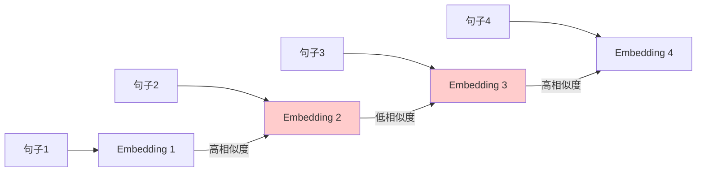
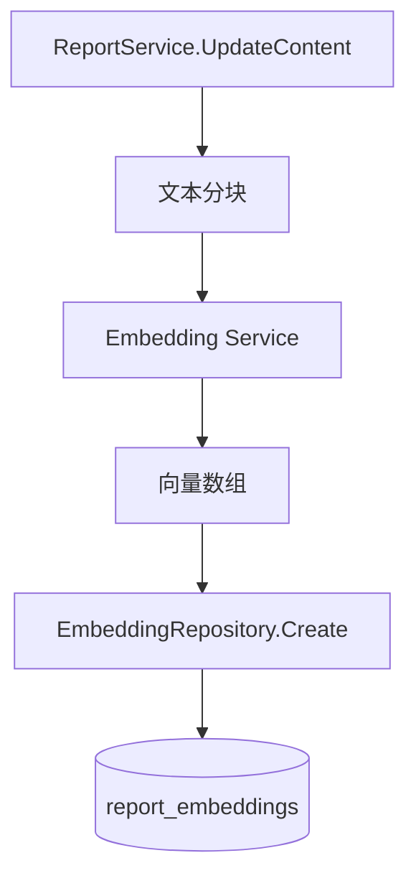

# 第12章 pgvector 与向量数据存储

第11章我们补齐了缓存、全文搜索和文件存储。对于一个 AI 驱动的研究平台，还有一类数据无法被传统索引高效处理——**语义信息**。

比如用户想找"多智能体协作"相关的报告，但历史报告里写的是"Multi-Agent Coordination"；或者上传了一份 PDF，想根据自然语言问题定位到最相关的段落。这种"意思相近但字面不同"的查询，靠 `LIKE` 或 `tsvector` 都难以解决，需要把文本转成 **Embedding 向量**，在向量空间中寻找最近邻。

本章我们在已有的 PostgreSQL 基础上引入 **pgvector** 扩展，实现一套关系数据与向量数据共存的基础设施，为第23章 RAG 系统打下地基。

## 12.1 为什么用 pgvector：一套数据库搞定关系+向量

### 12.1.1 向量数据库的选型光谱

| 方案 | 代表产品 | 优点 | 缺点 | 适用阶段 |
|------|----------|------|------|----------|
| 专用向量库 | Pinecone、Milvus、Weaviate | 性能高、功能全 | 额外运维、数据同步链路 | 大规模、专职团队 |
| 向量插件 | pgvector、Redis Vector | 与现有数据库共存、事务一致 | 单节点性能有上限 | 中小规模、快速验证 |
| 纯内存 | faiss、annoy | 检索极快 | 无持久化、无事务 | 实验、离线计算 |

对于本书项目， PostgreSQL 已经承载了用户、报告、文件等核心数据。引入 pgvector 的好处显而易见：

- **一套基础设施**：不用维护额外集群，Docker Compose 里换一个镜像即可；
- **事务一致**：向量记录和业务记录在同一事务中写入/回滚；
- **混合查询天然方便**：`WHERE user_id = $1 ORDER BY embedding <-> $2 LIMIT 10` 直接结合关系过滤与向量排序；
- **运维简单**：备份、迁移、权限模型与现有 PostgreSQL 完全一致。

### 12.1.2 什么时候该从 pgvector 迁移出去

pgvector 不是银弹。当单表向量记录达到**千万级**、QPS 持续超过数千、或者需要复杂的分布式向量索引时，再考虑专用向量数据库。前期把它当作"带向量能力的 PostgreSQL"来用，能显著降低架构复杂度。



## 12.2 pgvector 安装与 Docker Compose 配置

### 12.2.1 镜像选择

pgvector 官方维护的 Docker 镜像是 `ankane/pgvector`。我们在第2章的 Docker Compose 里已经把 PostgreSQL 替换成了它：

```yaml
# 文件: src/backend/docker-compose.yml

services:
  postgres:
    image: ankane/pgvector:v0.5.1
    container_name: goai-postgres
    environment:
      POSTGRES_USER: goai
      POSTGRES_PASSWORD: goai_dev
      POSTGRES_DB: goai
    ports:
      - "5432:5432"
    volumes:
      - postgres_data:/var/lib/postgresql/data
```

> 注意：如果之前用普通 PostgreSQL 镜像启动过并持久化了卷，切换 pgvector 镜像后需要删除旧卷，否则扩展文件不匹配。开发环境可用 `docker compose down -v` 后重新启动。

### 12.2.2 创建扩展

容器启动后，执行一次 `CREATE EXTENSION`：

```sql
CREATE EXTENSION IF NOT EXISTS vector;
```

建议把它放在初始化脚本里，确保每个新环境自动启用：

```sql
-- 文件: src/scripts/init.sql

CREATE EXTENSION IF NOT EXISTS vector;
```

## 12.3 向量类型与操作：embedding、L2 距离、余弦相似度

### 12.3.1 向量列的定义

pgvector 提供了 `vector(n)` 类型，`n` 是维度。OpenAI 的 `text-embedding-3-small` 输出 1536 维，本书示例就按 1536 维设计：

```sql
-- 文件: src/backend/internal/repository/migrations/000004_add_vector_embeddings.up.sql

CREATE EXTENSION IF NOT EXISTS vector;

CREATE TABLE IF NOT EXISTS report_embeddings (
    id BIGSERIAL PRIMARY KEY,
    report_id BIGINT NOT NULL REFERENCES reports(id) ON DELETE CASCADE,
    chunk_index INT NOT NULL DEFAULT 0,
    content TEXT NOT NULL DEFAULT '',
    source_type VARCHAR(50) NOT NULL DEFAULT 'report',
    source_id BIGINT,
    metadata JSONB NOT NULL DEFAULT '{}',
    embedding vector(1536) NOT NULL,
    created_at TIMESTAMPTZ NOT NULL DEFAULT NOW(),
    UNIQUE(report_id, chunk_index)
);

CREATE INDEX IF NOT EXISTS idx_report_embeddings_report_id
    ON report_embeddings(report_id);
```

字段说明：

- `report_id`：关联到 reports 表，删除报告时级联删除向量；
- `chunk_index`：同一报告可能分块存储多个向量；
- `content`：向量对应的原始文本片段，便于结果展示与可解释性；
- `source_type / source_id / metadata`：来源元数据，为后续 RAG 追踪片段出处预留；
- `embedding`：1536 维向量。

回滚脚本：

```sql
-- 文件: src/backend/internal/repository/migrations/000004_add_vector_embeddings.down.sql

DROP TABLE IF EXISTS report_embeddings;
```

### 12.3.2 距离操作符

pgvector 支持三种常见距离：

| 操作符 | 含义 | 适用场景 | 索引类型 |
|--------|------|----------|----------|
| `<->` | L2 欧氏距离 | 空间位置差异 | ivfflat / hnsw |
| `<#>` | 负内积 | 最大化内积 | ivfflat / hnsw |
| `<=>` | 余弦距离 | 方向相似度 | ivfflat / hnsw |

余弦距离 `1 - cosine_similarity`，值越小越相似。对 Embedding 模型输出做归一化后，L2 距离的排序结果与余弦距离一致，但余弦距离更直观。

示例查询：

```sql
SELECT report_id, chunk_index, content,
       embedding <=> $1::vector AS distance
FROM report_embeddings
WHERE report_id = 42
ORDER BY embedding <=> $1::vector
LIMIT 5;
```

### 12.3.3 在 Go 中读写向量

Go 侧推荐使用 `github.com/pgvector/pgvector-go` 库，它提供了与 `database/sql`、`pgx` 都能配合的 `Vector` 类型：

```go
// 文件: src/backend/internal/domain/embedding.go

package domain

import (
	"github.com/pgvector/pgvector-go"
)

// Embedding 表示一条文本片段及其向量。
type Embedding struct {
	ID         int64
	ReportID   int64
	ChunkIndex int
	Content    string
	SourceType string
	SourceID   *int64
	Metadata   map[string]any
	Vector     pgvector.Vector
	CreatedAt  time.Time
}
```

> 这里 `pgvector.Vector` 底层是 `[]float32`。如果 Embedding 服务返回 `[]float64`，需要先转成 `[]float32`。

### 12.3.4 EmbeddingRepository 实现

```go
// 文件: src/backend/internal/repository/postgres/embedding_repository.go

package postgres

import (
	"context"
	"database/sql"
	"encoding/json"
	"fmt"
	"time"

	"github.com/ileego/go_react_ai/internal/domain"
	"github.com/pgvector/pgvector-go"
)

// EmbeddingRepository 提供报告片段向量的增删查。
type EmbeddingRepository struct {
	db *sql.DB
}

// NewEmbeddingRepository 创建 PostgreSQL 版 EmbeddingRepository。
func NewEmbeddingRepository(db *sql.DB) *EmbeddingRepository {
	return &EmbeddingRepository{db: db}
}

// Create 批量插入或更新某报告的向量记录。
// sourceType 为默认值 "report"；如需更细粒度的来源控制，可后续扩展 CreateWithMetadata。
func (r *EmbeddingRepository) Create(ctx context.Context, reportID int64, chunks []string, vectors [][]float32) error {
	if len(chunks) != len(vectors) {
		return fmt.Errorf("chunks and vectors length mismatch")
	}

	tx, err := r.db.BeginTx(ctx, nil)
	if err != nil {
		return fmt.Errorf("begin tx: %w", err)
	}
	defer func() { _ = tx.Rollback() }()

	stmt, err := tx.PrepareContext(ctx, `
		INSERT INTO report_embeddings (report_id, chunk_index, content, source_type, embedding, created_at)
		VALUES ($1, $2, $3, $4, $5, $6)
		ON CONFLICT (report_id, chunk_index) DO UPDATE SET
			content = EXCLUDED.content,
			source_type = EXCLUDED.source_type,
			embedding = EXCLUDED.embedding,
			created_at = EXCLUDED.created_at
	`)
	if err != nil {
		return fmt.Errorf("prepare insert: %w", err)
	}
	defer func() { _ = stmt.Close() }()

	now := time.Now()
	for i, content := range chunks {
		if _, err := stmt.ExecContext(ctx, reportID, i, content, "report", pgvector.NewVector(vectors[i]), now); err != nil {
			return fmt.Errorf("insert embedding %d: %w", i, err)
		}
	}

	return tx.Commit()
}

// SearchSimilar 在指定报告内搜索与 queryVector 最相似的片段。
func (r *EmbeddingRepository) SearchSimilar(ctx context.Context, reportID int64, queryVector []float32, limit int) ([]domain.Embedding, error) {
	rows, err := r.db.QueryContext(ctx, querySimilarEmbeddings, reportID, pgvector.NewVector(queryVector), limit)
	if err != nil {
		return nil, fmt.Errorf("query similar embeddings: %w", err)
	}
	defer func() { _ = rows.Close() }()

	var results []domain.Embedding
	for rows.Next() {
		var e domain.Embedding
		var v pgvector.Vector
		var sourceID sql.NullInt64
		var metadataJSON []byte
		if err := rows.Scan(
			&e.ID,
			&e.ReportID,
			&e.ChunkIndex,
			&e.Content,
			&e.SourceType,
			&sourceID,
			&metadataJSON,
			&v,
			&e.CreatedAt,
		); err != nil {
			return nil, fmt.Errorf("scan embedding: %w", err)
		}
		if sourceID.Valid {
			sid := sourceID.Int64
			e.SourceID = &sid
		}
		if len(metadataJSON) > 0 {
			_ = json.Unmarshal(metadataJSON, &e.Metadata)
		}
		e.Vector = v
		results = append(results, e)
	}
	if err := rows.Err(); err != nil {
		return nil, fmt.Errorf("iterate embeddings: %w", err)
	}
	return results, nil
}

// DeleteByReport 删除某报告的所有向量。
func (r *EmbeddingRepository) DeleteByReport(ctx context.Context, reportID int64) error {
	if _, err := r.db.ExecContext(ctx, deleteEmbeddingsByReport, reportID); err != nil {
		return fmt.Errorf("delete embeddings: %w", err)
	}
	return nil
}

const querySimilarEmbeddings = `
	SELECT id, report_id, chunk_index, content, source_type, source_id, metadata, embedding, created_at
	FROM report_embeddings
	WHERE report_id = $1
	ORDER BY embedding <=> $2
	LIMIT $3
`

const deleteEmbeddingsByReport = `
	DELETE FROM report_embeddings WHERE report_id = $1
`
```

### 12.3.5 事务与一致性

Embedding 通常跟随报告或文件的生命周期变化。当报告重新生成时，应先删除旧向量再写入新向量，避免检索到"新旧混合"的中间状态。



> 当前 `DeleteByReport` 和 `Create` 是两次独立调用。生产环境中如需严格事务，可封装一个 `ReplaceInTx` 方法，在同一事务内先删除再插入。

## 12.4 HNSW 与 IVFFlat 索引：近似最近邻搜索

### 12.4.1 为什么需要近似索引

当向量记录达到几十万、上百万时，全表 `ORDER BY embedding <=> $1` 会做一次暴力扫描（Exact Search），速度很慢。pgvector 提供两类近似最近邻（ANN）索引：

- **IVFFlat**：把向量空间分成若干簇（list），查询时只扫描最近的几个簇，建索引快、内存占用小，但需要训练数据且召回率受 list 数量影响；
- **HNSW**（Hierarchical Navigable Small World）：基于图结构，查询精度高、无需训练，但内存占用更大、写入速度稍慢。

### 12.4.2 HNSW 索引实战

HNSW 更适合写多读多、对召回率要求高的场景，也是我们项目的主推方案：

```sql
-- 文件: src/backend/internal/repository/migrations/000004_add_vector_embeddings.up.sql

CREATE INDEX IF NOT EXISTS idx_report_embeddings_hnsw
    ON report_embeddings
    USING hnsw (embedding vector_cosine_ops)
    WITH (m = 16, ef_construction = 64);
```

参数说明：

- `m`：每个节点的最大连接数，越大图越稠密，查询越慢但召回越高；
- `ef_construction`：建图时的搜索宽度，越大索引质量越高，建索引越慢。

> 注意：HNSW 索引只支持 `vector_cosine_ops`（余弦距离）、`vector_l2_ops` 等操作符类。建索引前务必确认查询里使用的距离操作符与操作符类一致。

### 12.4.3 IVFFlat 索引（备选）

如果数据量大但内存紧张，可以用 IVFFlat：

```sql
CREATE INDEX idx_report_embeddings_ivfflat
    ON report_embeddings
    USING ivfflat (embedding vector_cosine_ops)
    WITH (lists = 100);
```

`lists` 一般取 `sqrt(总行数)` 或 `4 * sqrt(总行数)`。建索引前需要先有一定量的数据，否则聚类效果差。

### 12.4.4 查询参数调优

HNSW 查询可以通过 `SET hnsw.ef_search = N` 调整精度与速度：

```sql
SET hnsw.ef_search = 100;  -- 默认 40，越大越准越慢
SELECT * FROM report_embeddings
ORDER BY embedding <=> $1
LIMIT 10;
```



建议在生产环境中先用真实查询集做召回率测试，再确定参数。

## 12.5 混合查询：关系过滤 + 向量相似度排序

### 12.5.1 业务场景

报告平台的常见需求是："在我自己的报告里，找到与这个问题最相关的片段"。这同时包含：

- **关系过滤**：`created_by = ?` 或 `report_id = ?`；
- **向量排序**：按语义相似度取 Top-K。

pgvector 的索引在有过滤条件时可能不会被使用，需要理解它的执行计划。

### 12.5.2 按 report_id 过滤的相似度查询

我们已经实现的 `SearchSimilar` 就是典型案例：

```sql
SELECT ...
FROM report_embeddings
WHERE report_id = $1
ORDER BY embedding <=> $2
LIMIT $3
```

当单个报告的片段数量不多时（几百到几千），HNSW 索引可能让位于按 `report_id` 的 B-tree 索引 + 内存排序，性能通常可接受。

### 12.5.3 跨用户报告的相似推荐

如果想做"找到与我历史报告最相似的其他报告"，需要跨 report 聚合。一种简单做法是先用向量检索拿到候选片段，再按 report_id 聚合：

```sql
SELECT report_id,
       MIN(embedding <=> $1::vector) AS min_distance
FROM report_embeddings
WHERE report_id IN (SELECT id FROM reports WHERE created_by = $2)
GROUP BY report_id
ORDER BY min_distance
LIMIT 10;
```

> 注意：当候选集很大时，这类查询可能需要专门的"报告级摘要向量"（只存每篇报告标题+摘要的向量），而不是对全文分块向量做聚合。

### 12.5.4 索引与过滤的权衡

| 策略 | 优点 | 缺点 |
|------|------|------|
| 单表存储 + 联合索引 | 简单 | 高选择性过滤可能让 HNSW 失效 |
| 分用户/分报告分片 | 索引更小 | 运维复杂 |
| 报告级摘要向量表 | 检索快 | 损失细粒度 |

项目初期推荐**单表 + 报告级过滤**，等数据量增长后再根据实际查询模式拆分。

## 12.6 向量数据管理：分块策略、元数据关联、过期清理

### 12.6.1 分块策略

Embedding 不是对整个报告只生成一个向量，而是把长文本切成片段。常见策略：

| 策略 | 说明 | 适用 |
|------|------|------|
| 固定长度 | 每 512 / 1024 个 token 切一段 | 简单、均匀、快速 |
| 按段落 | 按空行或标题切分 | 语义边界清晰、结构感强 |
| 重叠滑动窗口 | 相邻块重叠 20% | 避免上下文被切断 |
| 语义分块 | 按语义单元（句子、主题、相似度）切分 | 检索质量要求高、可接受额外成本 |

本书项目默认采用**固定长度 + 重叠**的折中方案，但在关键场景（如长报告、研究文献）中可以升级为语义分块。

### 12.6.2 语义分块详解

语义分块的核心目标是：让每个片段内部主题一致，片段之间边界自然。相比固定长度分块，它能显著减少"一句话被拦腰截断"或"不相关的内容被塞进同一块"的问题，从而提升检索准确率。

常见实现思路有三种：

#### 1. 基于句子边界

先按句号、问号、感叹号等标点把文本拆成句子，再把若干句子组合成块，确保每个块在句子边界处结束。这是最轻量的语义分块方式，不需要调用模型。

```go
// 伪代码：按句子边界分块，尽量接近 targetSize
func ChunkBySentence(text string, targetSize int) []string {
    sentences := splitSentences(text) // 按标点拆分
    var chunks []string
    var current strings.Builder
    for _, s := range sentences {
        if current.Len()+len(s) > targetSize && current.Len() > 0 {
            chunks = append(chunks, strings.TrimSpace(current.String()))
            current.Reset()
        }
        current.WriteString(s)
    }
    if current.Len() > 0 {
        chunks = append(chunks, strings.TrimSpace(current.String()))
    }
    return chunks
}
```

#### 2. 基于 Embedding 相似度

把文本按句子或小段落拆分后，依次计算相邻片段的 Embedding 相似度。当相似度出现明显下降时，说明此处发生了主题切换，适合作为分块边界。



上图中，句子 2 与句子 3 之间相似度骤降，因此在此处切分。实现伪代码：

```go
// 伪代码：基于相邻片段相似度的语义分块
func ChunkByEmbeddingSimilarity(segments []string, embed func([]string) [][]float32, threshold float64) []string {
    var chunks []string
    var current strings.Builder
    current.WriteString(segments[0])

    prevVec := embed([]string{segments[0]})[0]
    for i := 1; i < len(segments); i++ {
        vec := embed([]string{segments[i]})[0]
        sim := cosineSimilarity(prevVec, vec)
        if sim < threshold && current.Len() > 0 {
            // 相似度低于阈值，说明主题切换，在此切分
            chunks = append(chunks, strings.TrimSpace(current.String()))
            current.Reset()
        }
        current.WriteString(segments[i])
        prevVec = vec
    }
    if current.Len() > 0 {
        chunks = append(chunks, strings.TrimSpace(current.String()))
    }
    return chunks
}
```

> 该方法需要多次调用 Embedding 模型，成本较高，适合对检索质量要求极高的场景。

#### 3. 基于 LLM 判断边界

把一段文本和候选切分点交给 LLM，由模型判断哪里是自然的段落边界。效果最好，但成本最高、延迟最大。通常用于预处理阶段，而不是实时分块。

```go
// 伪代码：用 LLM 识别主题边界
func ChunkByLLM(text string, provider ai.AIProvider) ([]string, error) {
    prompt := `请把以下文本按主题拆分成若干段落，每个段落保留完整语义。
    只输出段落列表，段落之间用 --- 分隔：

` + text
    resp, err := provider.Complete(ctx, ai.CompletionRequest{Messages: []ai.Message{{Role: ai.RoleUser, Content: prompt}}})
    // ... 按 --- 解析结果
}
```

#### 三种语义分块方式对比

| 方式 | 精度 | 成本 | 延迟 | 适用场景 |
|------|------|------|------|----------|
| 句子边界 | 中 | 无 | 极低 | 通用文本、新闻、博客 |
| Embedding 相似度 | 高 | 中 | 中 | 技术文档、研究报告、论文 |
| LLM 判断边界 | 最高 | 高 | 高 | 预处理阶段、对质量极度敏感 |

本书项目在主流程中采用**固定长度 + 重叠**作为默认策略，同时保留语义分块的扩展接口；在后续第23章 RAG 系统中，会根据文档类型自动选择分块策略。

### 12.6.3 默认分块实现

```go
// 伪代码，第23章 RAG 中完整实现
func ChunkText(text string, chunkSize, overlap int) []string {
    var chunks []string
    start := 0
    for start < len(text) {
        end := start + chunkSize
        if end > len(text) {
            end = len(text)
        }
        chunks = append(chunks, text[start:end])
        if end == len(text) {
            break
        }
        start += chunkSize - overlap
    }
    return chunks
}
```

### 12.6.4 元数据关联

`report_embeddings` 表除了 `report_id` 外，还预留了来源元数据字段（见 `000004_add_vector_embeddings.up.sql`）：

- `source_type`：文本来源类型，如 `report`（报告正文）、`file`（上传文件）、`web`（网页）；
- `source_id`：具体来源 ID，如文件 ID；
- `metadata`：JSONB 字段，存储页码、章节、URL 等额外信息。

```sql
-- 文件: src/backend/internal/repository/migrations/000004_add_vector_embeddings.up.sql

CREATE TABLE IF NOT EXISTS report_embeddings (
    id BIGSERIAL PRIMARY KEY,
    report_id BIGINT NOT NULL REFERENCES reports(id) ON DELETE CASCADE,
    chunk_index INT NOT NULL DEFAULT 0,
    content TEXT NOT NULL DEFAULT '',
    source_type VARCHAR(50) NOT NULL DEFAULT 'report',
    source_id BIGINT,
    metadata JSONB NOT NULL DEFAULT '{}',
    embedding vector(1536) NOT NULL,
    created_at TIMESTAMPTZ NOT NULL DEFAULT NOW(),
    UNIQUE(report_id, chunk_index)
);
```

`EmbeddingRepository.SearchSimilar` 会扫描这些字段并反序列化 `metadata`，业务层可以直接使用来源信息做结果展示。

### 12.6.5 过期清理

向量数据会持续增长，需要定期清理：

- 报告删除时级联删除（已有 `ON DELETE CASCADE`）；
- 报告重新生成时先 `DeleteByReport` 再插入新向量；
- 对软删除的报告，可定时任务清理孤立向量。

```go
// 伪代码
func (r *EmbeddingRepository) CleanupOrphans(ctx context.Context) error {
    _, err := r.db.ExecContext(ctx, `
        DELETE FROM report_embeddings
        WHERE report_id NOT IN (SELECT id FROM reports)
    `)
    return err
}
```

## 12.7 整合到 Clean Architecture

### 12.7.1 依赖注入

在 `cmd/server/main.go` 中新增 EmbeddingRepository：

```go
embeddingRepo := postgres.NewEmbeddingRepository(db.DB)
```

后续 `AgentService` 或 `ReportService` 在生成/更新报告时，把报告内容分块、调用 Embedding 服务、写入向量：



### 12.7.2 与 AI Provider 的衔接

Embedding 模型通常有单独的接口（如 OpenAI `/embeddings`）。当前 `internal/ai` 包主要封装聊天补全，后续可以在 `AIProvider` 接口中扩展 `Embed(ctx, texts []string) ([][]float32, error)`，让同一套 Provider 配置同时支持对话和 Embedding。

## 12.8 测试与验证

### 12.8.1 迁移测试

```bash
docker compose -f src/backend/docker-compose.yml up -d
cd src/backend
go run ./cmd/server/main.go
```

`cmd/server/main.go` 在启动时会调用 `postgres.MigrateUp`，自动执行包括 `000004_add_vector_embeddings` 在内的所有迁移。

### 12.8.2 向量操作验证

连接数据库后手动测试：

```sql
-- 创建测试向量（1536 维，示例只展示前几维）
INSERT INTO report_embeddings (report_id, chunk_index, content, embedding)
VALUES (1, 0, '测试片段', '[0.1, 0.2, 0.3, ...]'::vector);

-- 相似度查询
SELECT report_id, chunk_index, content,
       embedding <=> '[0.1, 0.2, 0.3, ...]'::vector AS distance
FROM report_embeddings
ORDER BY embedding <=> '[0.1, 0.2, 0.3, ...]'::vector
LIMIT 5;
```

### 12.8.3 Go 单元测试

使用 `testcontainers-go` 或本书已有的 PostgreSQL 测试容器启动带 pgvector 的实例，测试 `Create`、`SearchSimilar`、`DeleteByReport` 三个核心方法。注意：向量比较不能简单用 `==`，应检查返回结果的距离是否单调递增。

## 12.9 生产关注

- **维度对齐**：表定义的 `vector(1536)` 必须和 Embedding 模型输出维度完全一致，否则插入报错。
- **批量插入**：不要一条一条 INSERT，用 `COPY` 或批量 `INSERT ... VALUES (...), (...)` 提升写入速度。
- **索引选择**：数据量 < 10 万时，HNSW 可能不如暴力扫描快；建议数据量达到阈值后再建 ANN 索引。
- **监控**：关注 `pg_stat_user_indexes` 中的索引命中率、`EXPLAIN ANALYZE` 的执行计划。
- **备份**：pgvector 的数据随 PostgreSQL 一起备份，无需额外操作。

## 小结

本章我们为平台引入了向量数据存储能力：

- **pgvector 扩展**：在现有 PostgreSQL 中直接存储 Embedding，无需引入额外向量数据库。
- **向量表设计**：`report_embeddings` 关联报告、支持分块、保留原始文本片段。
- **距离与索引**：L2 / 余弦距离、HNSW / IVFFlat 近似最近邻索引及参数调优。
- **混合查询**：关系过滤 + 向量排序，满足"在我的报告里找相关内容"的业务需求。
- **向量数据管理**：分块策略、元数据扩展、过期清理。

当前代码只完成了基础设施和 Repository 层。真正的 Embedding 生成、文本分块、RAG 检索会在第23章结合 AI Provider 一起实现。

下一章（第13章）我们进入 React 前端：从 React 19 核心概念开始，逐步搭建现代且优雅的用户界面。
