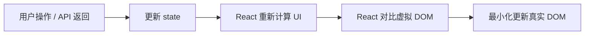
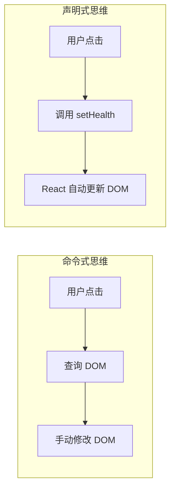
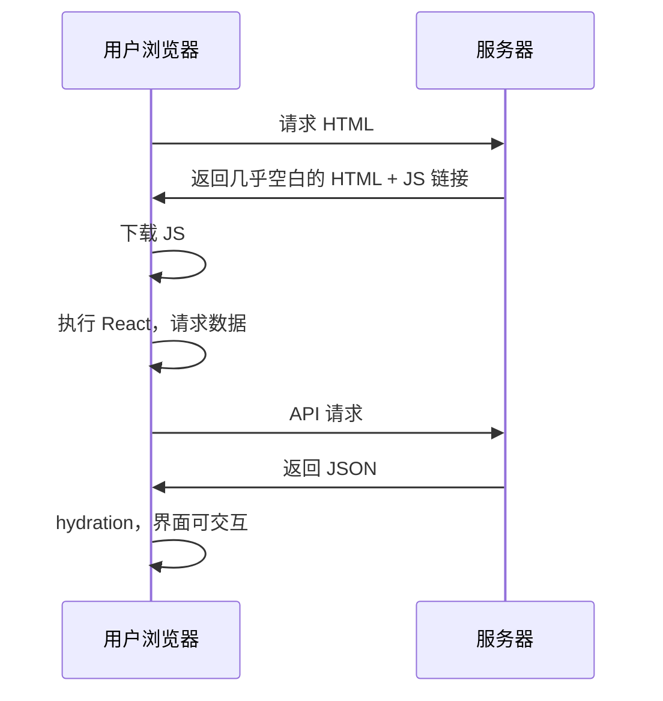
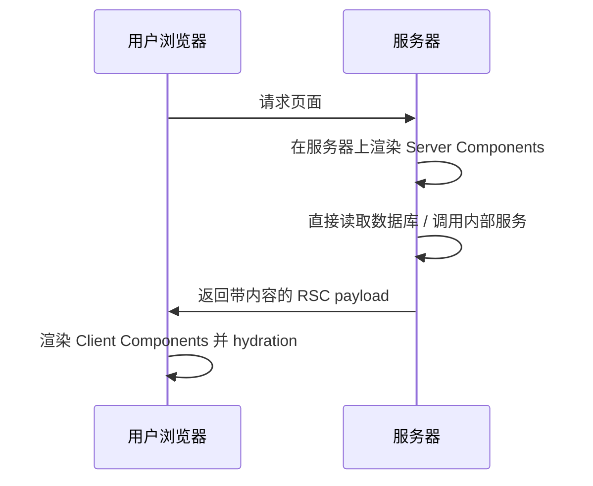
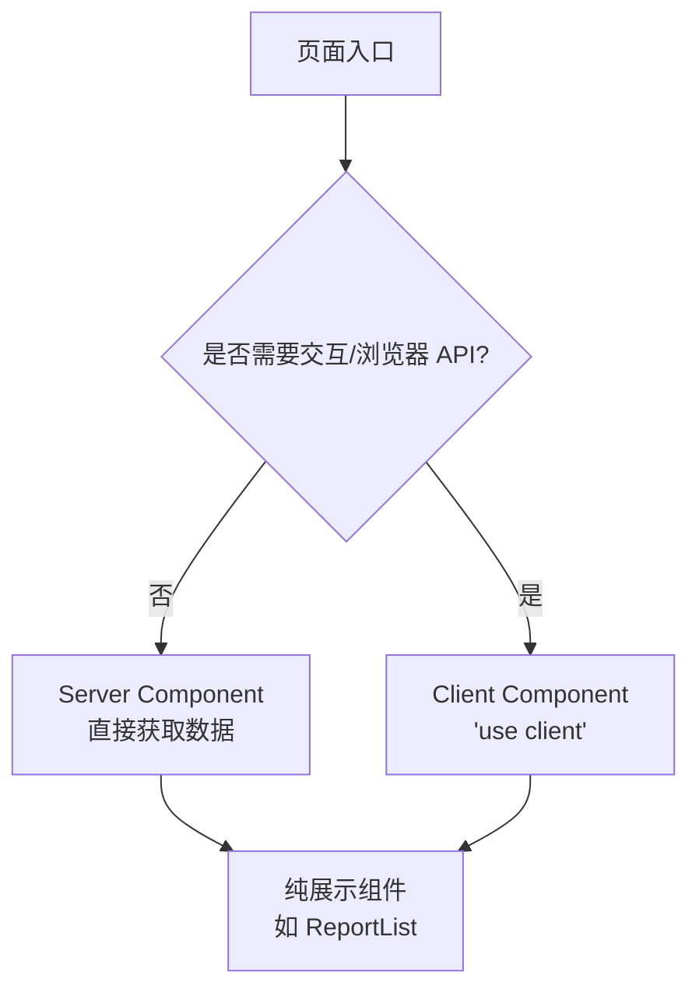
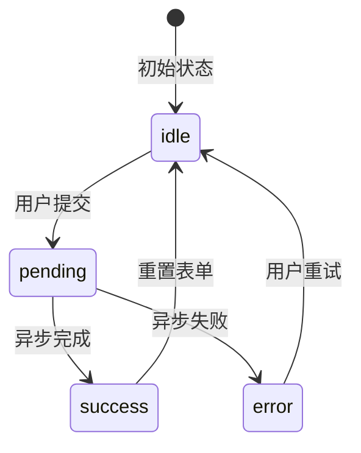
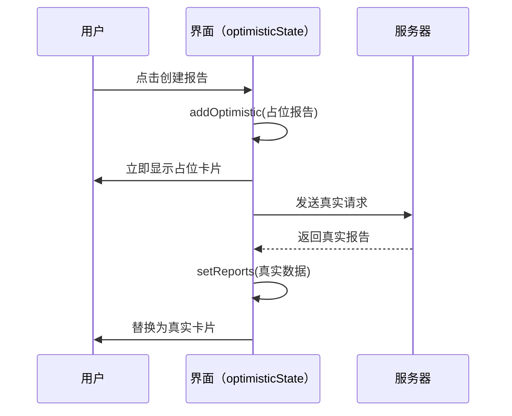

# 第13章 React 19 核心概念与思维转换

第12章我们把后端的向量基础设施补齐了：PostgreSQL + pgvector 能同时承载关系数据和语义向量，为后续 RAG 和多智能体记忆系统打下了地基。但一个完整的产品不能只靠后端 API 支撑，用户最终看到的是前端界面。

目前为止，我们的前端还非常基础：`App.tsx` 里只有一个健康检查，组件之间几乎没有通信。在进入状态管理、路由、Shadcn UI 和 AI 交互组件之前，我们需要先建立 React 19 的核心思维模型。否则后面学 Hooks、学状态管理、学 Server Components 都会像是背 API，而不是真正理解它们为什么存在。

本章不追求把所有 API 讲全，而是帮你完成一次思维转换：

- 从“操作 DOM”转向“描述界面”
- 从“写页面”转向“写组件”
- 从“什么都放在客户端”转向“合理划分 Server/Client 边界”
- 从 React 18 的“状态驱动更新”转向 React 19 的“Actions 与声明式异步”

这些概念听起来抽象，但落实到我们这本书的项目里，就是你后面要写的大量 ReportCard、ReportList、AI Chat Panel 的根基。

## 13.1 声明式 UI：从操作 DOM 到描述界面

### 13.1.1 命令式 vs 声明式：jQuery 到 React 的思维转换

在 jQuery 时代，写前端更像是在“操作”界面。想要显示一条后端返回的数据，你得手动找到 DOM 节点，修改它的 `textContent`：

```js
// 文件: src/frontend/src/legacy/jquery-example.js（教学示例）

$('#load-btn').on('click', () => {
  fetch('/api/health')
    .then((res) => res.json())
    .then((data) => {
      $('#status').text(data.status)
    })
})
```

这种写法的问题在于**状态和界面是分离的**。数据存在变量里，DOM 是另一个东西，你需要手动维持它们之间的同步。

React 的做法是反过来：**你描述“当状态是这样时，界面应该长什么样”，剩下的交给 React**。同样的功能用 React 写：

```tsx
// 文件: src/frontend/src/legacy/react-example.tsx（教学示例）

import { useState } from 'react'

function HealthStatus() {
  const [health, setHealth] = useState<{ status: string } | null>(null)

  const load = () => {
    fetch('/api/health')
      .then((res) => res.json())
      .then((data) => setHealth(data))
  }

  return (
    <div>
      <button onClick={load}>检查健康状态</button>
      {health && <p>状态：{health.status}</p>}
    </div>
  )
}
```

这里没有手动找 DOM 节点的步骤。`health` 状态变了，React 会自动重新渲染对应的部分。

### 13.1.2 UI = f(state)

React 的核心理念可以用一个公式概括：

```text
UI = f(state)
```

意思是：**界面是状态的函数**。给定相同的状态，应该渲染出相同的界面；状态变了，界面就更新。这个公式看起来简单，但它约束了你写代码的方式：

- 不要把状态藏在 DOM 里
- 不要通过查询 DOM 来决定下一步行为
- 不要直接修改界面，而是修改状态



这个流程是 React 性能优化的基础。它不会每次状态变化都清空整个页面重建，而是只在必要的地方做最小修改。

### 13.1.3 项目中的声明式实践

我们项目里的 `App.tsx` 虽然简单，但已经是声明式的了：

```tsx
// 文件: src/frontend/src/App.tsx（节选）

import { useEffect, useState } from 'react'

function App() {
  const [health, setHealth] = useState<string>('checking...')

  useEffect(() => {
    fetch('/api/health')
      .then((res) => res.json())
      .then((data) => setHealth(JSON.stringify(data, null, 2)))
      .catch((err) => setHealth(`error: ${err.message}`))
  }, [])

  return (
    <div style={{ padding: '2rem' }}>
      <h1>Go + React + AI</h1>
      <pre style={{ background: '#f5f5f5', padding: '1rem' }}>{health}</pre>
    </div>
  )
}
```

注意这里没有任何 `document.getElementById` 或 `innerHTML`。`health` 是什么，`<pre>` 里就显示什么。这就是声明式 UI 的最小实例。



> **注意**：初学者常犯的错误是混用声明式和命令式。比如在 `useEffect` 里直接操作 DOM 去修改样式。一旦你这么做了，React 就失去了对那部分 UI 的追踪，后续状态更新可能无法正确反映到界面上。

## 13.2 组件本质：纯函数、props、JSX 返回值

### 13.2.1 组件即函数

React 组件最朴素的定义是：**一个接收 props、返回 JSX 的函数**。它不是什么特殊的类，也不是什么框架魔法，就是一个普通的 JavaScript/TypeScript 函数。

```tsx
// 文件: src/frontend/src/shared/components/Welcome.tsx（教学示例）

interface WelcomeProps {
  name: string
}

export function Welcome({ name }: WelcomeProps) {
  return <h1>欢迎，{name}</h1>
}
```

这个组件满足几个重要特性：

- **输入确定**：`name` 是 props 里的值
- **输出确定**：给定同样的 `name`，永远返回同样的 JSX
- **无副作用**：不修改外部状态，不直接操作 DOM

这种组件很容易测试、复用和推理。

### 13.2.2 props 的只读契约

props 是父组件传给子组件的数据。一个关键规则是：**组件不应该修改自己的 props**。props 是只读的。

```tsx
// ❌ 错误：不要修改 props
function ReportTitle({ title }: { title: string }) {
  title = title.toUpperCase() // 违反了 props 只读约定
  return <h2>{title}</h2>
}

// ✅ 正确：如果需要转换，创建局部变量或计算属性
function ReportTitle({ title }: { title: string }) {
  const displayTitle = title.toUpperCase()
  return <h2>{displayTitle}</h2>
}
```

为什么 props 要只读？因为 React 依赖 props 和 state 的可预测性来做渲染优化。如果子组件偷偷改了 props，父组件就无法判断子组件的真实状态，调试和优化都会变得困难。

可以把 props 理解为父组件给子组件的一封信：你可以读，可以抄，但不能把原信改了再寄回去。

### 13.2.3 TypeScript 类型安全的 props

在我们项目里，`Button.tsx` 已经给出了 props 类型化的好例子：

```tsx
// 文件: src/frontend/src/shared/components/Button.tsx（节选）

import type { ButtonHTMLAttributes, ReactNode } from 'react'

interface Props extends ButtonHTMLAttributes<HTMLButtonElement> {
  children: ReactNode
  variant?: 'primary' | 'secondary' | 'danger'
}

export function Button({ children, variant = 'primary', ...rest }: Props) {
  const styles = {
    primary: 'bg-blue-600 text-white hover:bg-blue-700',
    secondary: 'bg-gray-200 text-gray-800 hover:bg-gray-300',
    danger: 'bg-red-600 text-white hover:bg-red-700',
  }

  return (
    <button className={styles[variant]} {...rest}>
      {children}
    </button>
  )
}
```

这个组件做了几件值得学习的事：

- 用 `interface` 定义 props，并且继承 `ButtonHTMLAttributes<HTMLButtonElement>`，自动获得 `onClick`、`disabled` 等原生属性
- `variant` 使用联合类型 `'primary' | 'secondary' | 'danger'`，避免传错值
- `children` 类型为 `ReactNode`，表示可以接受任意合法的 React 子元素
- 用解构赋值设置默认值 `variant = 'primary'`

> **注意**：不要给所有 props 都写 `any`。TypeScript 是 React 项目的安全带，props 类型化是发挥这条安全带价值的第一步。

### 13.2.4 项目重构：ReportCard 的 props 类型再审视

再看一下 `ReportCard.tsx`：

```tsx
// 文件: src/frontend/src/features/reports/components/ReportCard.tsx

import type { Report } from '../types'

interface Props {
  report: Report
}

export function ReportCard({ report }: Props) {
  // 根据 report 字段渲染标题、主题和状态标签
  // ...
}
```

这个组件非常“纯”：接收一个 `report` prop，输出一段描述报告状态的 JSX。它没有修改 `report`，没有调用外部 API，没有读取浏览器 API。这种纯组件是整个应用里最容易维护和测试的部分。

## 13.3 JSX 深入：表达式、条件渲染、列表渲染

### 13.3.1 JSX 不是模板，是语法糖

很多人第一次看 JSX 会把它当成模板语言，但它本质上是一种语法糖，会被编译成 JavaScript 函数调用：

```tsx
// 你写的 JSX
const element = <h1 className="title">Hello</h1>

// 编译后大致等价于
const element = React.createElement('h1', { className: 'title' }, 'Hello')
```

因为 JSX 最终是 JavaScript，所以你可以在 `{}` 里写任意表达式：

```tsx
function Greeting({ user }: { user: { name: string; level: number } }) {
  return (
    <div>
      <p>你好，{user.name.toUpperCase()}</p>
      <p>等级：{user.level > 10 ? '高级' : '初级'}</p>
      <p>注册时间：{new Date().toLocaleDateString()}</p>
    </div>
  )
}
```

注意 `{}` 里只能放表达式，不能放语句。你不能写 `if` 语句，但可以用三元运算符、逻辑与、`map`、`filter` 等表达式。

### 13.3.2 条件渲染

React 里常见的条件渲染有三种写法：

```tsx
// 1. 提前 return（适合分支差异很大）
function ReportList({ loading, error, reports }: ReportListProps) {
  if (loading) return <div>加载中...</div>
  if (error) return <div>错误: {error}</div>
  if (reports.length === 0) return <div>暂无报告</div>

  return <div>{/* 正常渲染 */}</div>
}

// 2. 三元运算符（适合二选一）
function StatusBadge({ active }: { active: boolean }) {
  return <span>{active ? '启用中' : '已停用'}</span>
}

// 3. 逻辑与 &&（适合“有则显示，无则隐藏”）
function UserCard({ user }: { user: { bio?: string } }) {
  return (
    <div>
      <h3>{user.name}</h3>
      {user.bio && <p>{user.bio}</p>}
    </div>
  )
}
```

我们项目里的 `ReportList.tsx` 使用了提前 return：

```tsx
// 文件: src/frontend/src/features/reports/components/ReportList.tsx（节选）

export function ReportList() {
  const { reports, loading, error } = useReports()

  if (loading) return <div>加载中...</div>
  if (error) return <div style={{ color: 'red' }}>错误: {error}</div>
  if (reports.length === 0) return <div>暂无报告</div>

  return (
    <div style={{ display: 'grid', gap: '1rem' }}>
      {reports.map((r) => (
        <ReportCard key={r.id} report={r} />
      ))}
    </div>
  )
}
```

提前 return 的好处是让“正常渲染路径”保持干净，不需要嵌套在一堆 `if` 里面。对于加载、错误、空数据这些边界情况，各自独立处理。

### 13.3.3 列表渲染与 key 的真正作用

列表渲染用 `map`：

```tsx
<ul>
  {items.map((item) => (
    <li key={item.id}>{item.name}</li>
  ))}
</ul>
```

`key` 是 React 用来识别每个列表项的。它的核心作用是：**当列表顺序变化或增删项时，React 能知道哪些项变了、哪些没变，从而最小化 DOM 操作**。

一个常见的错误是用数组 index 作为 key：

```tsx
// ❌ 错误：用 index 作为 key
{reports.map((report, index) => (
  <ReportCard key={index} report={report} />
))}
```

如果报告列表支持排序、删除或状态更新，index 会变化，React 会误以为同一个位置上的组件没有变，导致状态错乱或动画异常。正确的做法是使用数据中稳定且唯一的字段：

```tsx
// ✅ 正确：使用业务唯一 ID
{reports.map((report) => (
  <ReportCard key={report.id} report={report} />
))}
```

> **注意**：`key` 只在数组渲染的兄弟元素之间有意义的。你不能把 `key` 当作 prop 传给子组件在内部使用。如果业务上需要一个唯一标识，应该单独传一个 `id` prop。

### 13.3.4 JSX 中的注释与空渲染

JSX 里的注释要写成表达式形式：

```tsx
function App() {
  return (
    <div>
      {/* 这是 JSX 注释 */}
      <h1>标题</h1>
    </div>
  )
}
```

如果你想什么都不渲染，可以返回 `null` 或 `undefined`：

```tsx
function AdminOnly({ isAdmin, children }: { isAdmin: boolean; children: React.ReactNode }) {
  if (!isAdmin) return null
  return <>{children}</>
}
```

`null`、`undefined`、`true`、`false` 在 JSX 中都会被忽略，不会渲染到 DOM。

## 13.4 组件组合模式：children、render props、compound pattern

### 13.4.1 children：灵活的内容插槽

`children` 是 React 最强大的组合工具之一。它让父组件可以把任意 JSX 传给子组件，而子组件只负责“容器”和“布局”。

我们项目里的 `Button.tsx` 已经使用了 `children`：

```tsx
// 文件: src/frontend/src/shared/components/Button.tsx（节选）

export function Button({ children, variant = 'primary', ...rest }: Props) {
  // ...
  return (
    <button className={`${base} ${styles[variant]}`} {...rest}>
      {children}
    </button>
  )
}
```

使用时可以传入文字、图标、甚至另一个组件：

```tsx
import { Button } from '@/shared/components/Button'

function ReportActions() {
  return (
    <div className="flex gap-2">
      <Button variant="primary">生成报告</Button>
      <Button variant="secondary">
        <span>⬇</span> 导出
      </Button>
      <Button variant="danger" disabled>
        删除
      </Button>
    </div>
  )
}
```

`children` 的美妙之处在于：`Button` 不需要知道里面是什么，它只关心自己是一个按钮容器。这种“不知道细节”的设计是组件复用的关键。

### 13.4.2 Render Props：把逻辑交给父组件

有时候你需要把子组件内部的状态或逻辑暴露给父组件。`children` 只能传 JSX，而 **render props** 可以传一个函数，让父组件决定怎么渲染。

```tsx
// 文件: src/frontend/src/shared/components/DataLoader.tsx（教学示例）

import { useEffect, useState, type ReactNode } from 'react'

interface DataLoaderProps<T> {
  fetcher: () => Promise<T>
  children: (data: T) => ReactNode
}

export function DataLoader<T>({ fetcher, children }: DataLoaderProps<T>) {
  const [data, setData] = useState<T | null>(null)

  useEffect(() => {
    fetcher().then(setData)
  }, [fetcher])

  if (!data) return <div>加载中...</div>
  return <>{children(data)}</>
}
```

使用方决定拿到数据后怎么展示：

```tsx
<DataLoader fetcher={() => fetch('/api/health').then((res) => res.json())}>
  {(data) => <pre>{JSON.stringify(data, null, 2)}</pre>}
</DataLoader>
```

Render props 在 React 早期非常流行，现在很多场景被自定义 Hooks 取代。但理解它仍然很重要，因为你还会在很多第三方库（React Router、Formik 等）中遇到这种模式。

### 13.4.3 Compound Pattern：Button + ButtonGroup

复合组件模式（Compound Pattern）让一组相关组件共享隐式状态，用起来像原生 HTML 组合一样自然。

```tsx
// 文件: src/frontend/src/shared/components/ButtonGroup.tsx（教学示例）

import { createContext, useContext, type ReactNode } from 'react'

const GroupContext = createContext<{ attached?: boolean }>({})

export function ButtonGroup({ attached = false, children }: { attached?: boolean; children: ReactNode }) {
  return (
    <GroupContext.Provider value={{ attached }}>
      <div className={`flex ${attached ? '-space-x-px' : 'gap-2'}`}>{children}</div>
    </GroupContext.Provider>
  )
}

export function GroupButton({ children, ...rest }: React.ButtonHTMLAttributes<HTMLButtonElement>) {
  const { attached } = useContext(GroupContext)
  return (
    <button
      className={`px-4 py-2 border ${attached ? 'first:rounded-l last:rounded-r' : 'rounded'}`}
      {...rest}
    >
      {children}
    </button>
  )
}
```

使用方式非常直观：

```tsx
<ButtonGroup attached>
  <GroupButton>保存</GroupButton>
  <GroupButton>取消</GroupButton>
</ButtonGroup>
```

这里 `ButtonGroup` 通过 Context 把 `attached` 状态共享给子按钮，子按钮根据这个状态调整自己的样式。这种模式在表单、Tabs、面包屑等场景中非常有用。

### 13.4.4 组合优于继承

React 官方文档里有一句话：**“在 React 中，组合优于继承。”**

类组件时代，很多人习惯用 `extends` 来复用行为。但继承会带来强耦合：子类依赖父类的实现细节，父类一变，所有子类都可能受影响。React 推荐用组合来复用：

```tsx
// ❌ 继承：耦合度高
class PrimaryButton extends Button {}

// ✅ 组合：通过 props 控制行为
<Button variant="primary">主要按钮</Button>
```

在我们这本书的项目里，后面会大量用到组合：用 `children` 做插槽、用 render props 传递逻辑、用复合组件组织复杂 UI。记住一个原则：**如果复用靠的是“传东西进去”，那是组合；如果靠的是“我是你儿子”，那是继承。**

## 13.5 Server Components vs Client Components：边界与选型

### 13.5.1 React 18 的痛点

传统 React 应用（包括我们当前的 Vite 项目）通常采用全客户端渲染：



这个流程有几个明显问题：**首屏慢**、**JS 体积大**、**数据请求链长**、**hydration 成本高**。

### 13.5.2 Server Components 核心优势

React Server Components（RSC）让一部分组件在服务器上运行，直接把渲染结果发送到客户端：



Server Components 的优势显而易见：**零客户端 JS 体积**、**直接访问后端资源**、**减少网络请求**，天然适合报告列表、研究任务状态等读多写少的数据。

### 13.5.3 Client Components 的适用场景

但 Server Components 不能替代所有组件。需要响应用户交互、使用浏览器 API、使用 `useState`/`useEffect` 或订阅实时数据流的部分，仍然需要 Client Components。对于我们这个项目，Chat 输入框、SSE 流式输出、拖拽排序、表单验证未来都应该是 Client Components。

### 13.5.4 “use client” 指令与边界划分

在支持 RSC 的框架（如 Next.js App Router）中，组件默认是 Server Component。如果你需要客户端能力，就在文件顶部加 `'use client'`：

```tsx
// 文件: src/frontend/src/features/chat/components/ChatInput.tsx（教学示例）

'use client'

import { useState } from 'react'

export function ChatInput() {
  const [text, setText] = useState('')
  return <input value={text} onChange={(e) => setText(e.target.value)} />
}
```

> **注意**：Vite 项目目前不实现真正的 React Server Components。本节的重点是建立边界判断能力，为后续如果接入 Next.js 或类似框架做准备。即使留在 Vite 里，理解“哪些逻辑应该靠近服务端、哪些逻辑必须放在客户端”也能帮你写出更干净的前端代码。

### 13.5.5 项目决策：为未来 Server Components 做准备

虽然我们现在用 Vite，但已经为未来 RSC 做准备的一个好习惯是：**把数据获取和纯展示分离**。

当前 `ReportList.tsx` 内部调用了 `useReports()` 这个 Hook 去取数据。如果我们以后要迁移到 RSC 架构，可以把数据获取放到 Server Component 里，`ReportList` 只负责接收 `reports` prop 并渲染：

```tsx
// 文件: src/frontend/src/features/reports/components/ReportList.tsx（未来 RSC 友好版本）

import type { Report } from '../types'
import { ReportCard } from './ReportCard'

interface ReportListProps {
  reports: Report[]
}

export function ReportList({ reports }: ReportListProps) {
  if (reports.length === 0) return <div>暂无报告</div>

  return (
    <div style={{ display: 'grid', gap: '1rem' }}>
      {reports.map((report) => (
        <ReportCard key={report.id} report={report} />
      ))}
    </div>
  )
}
```

这样无论你未来是在 Vite 里用自定义 Hook 获取数据，还是在 Next.js 里用 Server Component 直接查询数据库，`ReportList` 本身都不需要改。



| 维度 | Server Component | Client Component |
|------|------------------|------------------|
| 运行位置 | 服务器 | 浏览器 |
| 能否使用 Hooks | 否 | 是 |
| 能否访问浏览器 API | 否 | 是 |
| 客户端 JS 体积 | 零 | 有 |
| 直接访问数据库 | 可以 | 不可以 |
| 典型场景 | 报告列表、静态内容 | 表单、聊天输入、实时流 |

## 13.6 React 19 新特性总览：与 18 的差异对照表

### 13.6.1 为什么 React 19 要重构异步模型

在 React 18 里，处理一个表单提交通常是这样的：

```tsx
// React 18 风格：状态、副作用、事件处理混在一处
function CreateReportForm() {
  const [topic, setTopic] = useState('')
  const [isPending, setIsPending] = useState(false)
  const [error, setError] = useState<string | null>(null)

  const handleSubmit = async (e: FormEvent) => {
    e.preventDefault()
    setIsPending(true)
    setError(null)
    try {
      await fetch('/api/reports', {
        method: 'POST',
        body: JSON.stringify({ topic }),
      })
      setTopic('')
    } catch (err) {
      setError(String(err))
    } finally {
      setIsPending(false)
    }
  }

  return (
    <form onSubmit={handleSubmit}>
      <input value={topic} onChange={(e) => setTopic(e.target.value)} />
      <button disabled={isPending}>{isPending ? '提交中...' : '创建'}</button>
      {error && <p>{error}</p>}
    </form>
  )
}
```

这段代码能跑，但它把四件事混在了一起：

1. **表单状态**：`topic`
2. **提交状态**：`isPending`
3. **错误状态**：`error`
4. **副作用**：`fetch`

当表单变复杂、字段变多、提交后还需要跳转或刷新列表时，这种模式会很快失控。更麻烦的是，这些状态之间还存在时序问题：

- 用户快速点两次提交，怎么处理竞态？
- 提交过程中用户又修改了输入，是禁用输入还是允许修改？
- 错误出现时，哪些状态要重置，哪些要保留？

React 19 给出的答案是 **Actions**：把“一次异步状态转换”作为一等公民。Action 描述的是：**从当前 UI 状态出发，经过一个可能失败的异步过程，到达下一个 UI 状态**。React 会自动帮你管理这个过程中的 pending、error、success 状态。



### 13.6.2 Actions：把异步操作作为一等公民

React 19 允许你把一个异步函数直接绑定到 `<form>` 的 `action` 属性上。这个函数接收一个 `FormData`，可以返回一个值，React 会帮你调度它。

```tsx
// 文件: src/frontend/src/features/reports/components/CreateReportForm.tsx（教学示例）

async function createReport(formData: FormData) {
  const topic = formData.get('topic') as string
  const res = await fetch('/api/reports', {
    method: 'POST',
    headers: { 'Content-Type': 'application/json' },
    body: JSON.stringify({ topic }),
  })
  if (!res.ok) throw new Error('创建失败')
  return res.json()
}

export function CreateReportForm() {
  return (
    <form action={createReport}>
      <input name="topic" placeholder="输入研究主题" required />
      <button type="submit">创建研究</button>
    </form>
  )
}
```

注意几个关键变化：

- 不再需要 `onSubmit` 里写 `e.preventDefault()`，表单提交的默认行为被 Action 接管
- 不再需要手动维护 `topic` 的受控状态，表单字段通过 `name` 进入 `FormData`
- Action 可以是客户端函数，也可以是服务端函数（Next.js 里的 `'use server'`）
- 如果 Action 抛错，错误会被 React 的错误边界捕获；如果返回数据，可以配合 `useActionState` 消费

> **注意**：Action 函数的第一个参数是 `FormData`，不是事件对象。如果你需要额外的上下文（比如当前用户 ID），可以把它放在 action 的闭包里，或者用 `formAction` 在按钮级别绑定不同的 Action。

### 13.6.3 useActionState：Action 的状态管理器

`useActionState` 是配合 Action 使用的 Hook，它的签名是：

```ts
const [state, formAction, isPending] = useActionState(action, initialState, permalink?)
```

- `action`：你的异步函数，签名是 `(prevState, formData) => newState`
- `initialState`：第一次渲染时的状态
- `state`：Action 返回的最新状态
- `formAction`：要传给 `<form action={formAction}>` 的函数
- `isPending`：Action 是否正在执行

把它用到我们的创建研究表单里：

```tsx
// 文件: src/frontend/src/features/reports/components/CreateReportForm.tsx（教学示例）

import { useActionState } from 'react'

interface FormState {
  success?: boolean
  error?: string
  reportId?: string
}

async function createReport(
  _prevState: FormState,
  formData: FormData
): Promise<FormState> {
  const topic = formData.get('topic') as string
  if (!topic || topic.length < 3) {
    return { error: '主题至少需要 3 个字符' }
  }

  const res = await fetch('/api/reports', {
    method: 'POST',
    headers: { 'Content-Type': 'application/json' },
    body: JSON.stringify({ topic }),
  })

  if (!res.ok) {
    return { error: '创建失败，请重试' }
  }

  const report = await res.json()
  return { success: true, reportId: report.id }
}

export function CreateReportForm() {
  const [state, formAction, isPending] = useActionState(createReport, {})

  return (
    <form action={formAction}>
      <input
        name="topic"
        placeholder="输入研究主题"
        required
        minLength={3}
      />
      <button type="submit" disabled={isPending}>
        {isPending ? '创建中...' : '创建研究'}
      </button>
      {state.error && <p style={{ color: 'red' }}>{state.error}</p>}
      {state.success && <p>创建成功，报告 ID：{state.reportId}</p>}
    </form>
  )
}
```

这个例子展示了 `useActionState` 的几个强大之处：

- **前置校验**：在 Action 函数里先校验 `FormData`，不用等发送到服务器才发现问题
- **错误反馈**：返回 `error` 状态，React 会自动在界面上反映
- **成功反馈**：返回 `success` 和 `reportId`，方便后续跳转或刷新列表
- **竞态安全**：如果用户连续点击多次，React 会自动忽略过期的 Action 结果，只保留最后一次

对比 React 18，同样功能你需要自己写 `useState` + `useCallback` + 手动重置错误状态。`useActionState` 把这些样板代码打包进了框架。

### 13.6.4 useFormStatus：表单内部的自包含状态感知

`useFormStatus` 让嵌套在表单里的组件能够读取外层 `<form>` 的提交状态。它返回的对象包含：

| 字段 | 含义 |
|------|------|
| `pending` | 表单是否正在提交 |
| `data` | 当前提交的 `FormData` |
| `method` | 提交方法（GET/POST） |
| `action` | 当前绑定的 Action 函数 |

最常见的用法是做提交按钮：

```tsx
// 文件: src/frontend/src/shared/components/SubmitButton.tsx（教学示例）

import { useFormStatus } from 'react-dom'

export function SubmitButton({ children }: { children: React.ReactNode }) {
  const { pending } = useFormStatus()
  return (
    <button type="submit" disabled={pending}>
      {pending ? '提交中...' : children}
    </button>
  )
}
```

```tsx
<form action={formAction}>
  <input name="topic" required />
  <SubmitButton>创建研究</SubmitButton>
</form>
```

更实用的是，你可以做表单级别的 loading 遮罩：

```tsx
// 文件: src/frontend/src/shared/components/FormLoading.tsx（教学示例）

import { useFormStatus } from 'react-dom'

export function FormLoading() {
  const { pending } = useFormStatus()
  if (!pending) return null
  return <div className="form-overlay">正在处理...</div>
}
```

```tsx
<form action={formAction}>
  <FormLoading />
  <input name="topic" required />
  <SubmitButton>创建研究</SubmitButton>
</form>
```

> **注意**：`useFormStatus` 只能读取**最近的 `<form>` 父级**的状态。如果你需要管理非表单触发的异步状态（比如点击一个普通按钮发起的请求），它并不适用，应该使用 `useActionState` 或自定义 Hook。

### 13.6.5 useOptimistic：把乐观更新变成声明式

乐观更新（Optimistic Update）是提升用户体验的重要手段。用户点击“生成报告”后，与其显示一个 loading 图标干等，不如立刻在列表里插入一个“生成中...”的占位卡片，让用户感知到系统已经响应了。

React 19 提供了 `useOptimistic` 来把这件事声明式化：

```ts
const [optimisticState, addOptimistic] = useOptimistic(state, updateFn)
```

- `state`：权威状态，通常来自 `useState` 或服务器数据
- `updateFn`：一个纯函数，接收当前状态和乐观更新参数，返回新的乐观状态
- `optimisticState`：用户看到的“即时状态”，可能包含尚未确认的数据
- `addOptimistic`：触发一次乐观更新

它的工作方式可以用一张图说明：



在我们的报告平台中，可以这样实现：

```tsx
// 文件: src/frontend/src/features/reports/hooks/useOptimisticReports.ts（教学示例）

import { useOptimistic, useState } from 'react'
import type { Report } from '../types'

export function useOptimisticReports(initialReports: Report[]) {
  const [reports, setReports] = useState(initialReports)
  const [optimisticReports, addOptimisticReport] = useOptimistic(
    reports,
    (state, newReport: Report) => [...state, newReport]
  )

  async function createReport(topic: string) {
    // 1. 先创建一个带占位状态的乐观报告
    const optimisticReport: Report = {
      id: `optimistic-${Date.now()}`,
      title: topic,
      topic,
      status: 'running',
    }
    addOptimisticReport(optimisticReport)

    // 2. 再发起真实请求
    const res = await fetch('/api/reports', {
      method: 'POST',
      body: JSON.stringify({ topic }),
    })

    if (!res.ok) {
      // 请求失败时，权威状态没有变化，乐观状态会自动回滚
      throw new Error('创建失败')
    }

    const saved = await res.json()
    setReports((prev) => [...prev, saved])
  }

  return { reports: optimisticReports, createReport }
}
```

使用这个 Hook 时有两个关键点：

1. **乐观状态是临时的**：它只是 `state` 上的一层“涂改液”，最终要以权威状态为准
2. **回滚是自动的**：如果异步请求失败，你没有调用 `setReports`，那么 `reports` 不变，`optimisticReports` 就会回到和 `reports` 一致的状态

```tsx
// 使用方
function ReportManager() {
  const { reports, createReport } = useOptimisticReports([])

  return (
    <>
      <form
        action={async (formData) => {
          await createReport(formData.get('topic') as string)
        }}
      >
        <input name="topic" required />
        <button type="submit">创建研究</button>
      </form>
      <ReportList reports={reports} />
    </>
  )
}
```

### 13.6.6 ref 作为 prop：告别 forwardRef

React 18 中，如果你想把 ref 透传给子组件，需要用到 `forwardRef`。这个 API 有两个让人头疼的问题：

1. **模板代码多**：每个需要 ref 的组件都要包一层 `forwardRef`
2. **类型难写**：TypeScript 对 `forwardRef` 的类型推导一直不够直观，尤其是泛型组件

```tsx
// React 18 风格
import { forwardRef } from 'react'

export const FancyInput = forwardRef<HTMLInputElement, React.InputHTMLAttributes<HTMLInputElement>>(
  (props, ref) => <input ref={ref} {...props} />
)
```

React 19 里，ref 可以直接声明为 props 的一部分：

```tsx
// React 19 风格
import type { Ref } from 'react'

interface FancyInputProps extends React.InputHTMLAttributes<HTMLInputElement> {
  ref?: Ref<HTMLInputElement>
}

export function FancyInput({ ref, ...props }: FancyInputProps) {
  return <input ref={ref} {...props} />
}
```

使用方式没有任何变化：

```tsx
function App() {
  const inputRef = useRef<HTMLInputElement>(null)
  return <FancyInput ref={inputRef} placeholder="输入内容" />
}
```

> **注意**：React 19 仍然兼容 `forwardRef`，所以旧的第三方库不会立刻坏掉。但新写的组件应该优先使用 ref-as-prop 写法，代码更简洁，类型也更自然。

### 13.6.7 React 18 vs React 19 的差异对照与选型建议

| 特性 | React 18 | React 19 | 建议 |
|------|----------|----------|------|
| 异步表单处理 | `onSubmit` + `useState` 手动管理 | `action` + `useActionState` | 新表单优先用 Action |
| 表单提交状态传递 | 通过 props 层层传递 pending | `useFormStatus` 自包含感知 | 按钮/遮罩组件直接用 |
| 乐观更新 | 手写状态副本与回滚逻辑 | `useOptimistic` 内置支持 | 用户体验敏感场景必备 |
| ref 传递 | 需要 `forwardRef` | ref 作为普通 prop | 新组件优先用 ref-as-prop |
| 元数据管理 | 依赖 `react-helmet` 等第三方库 | 组件内直接写 `<title>`、`<meta>` | 逐步迁移 |
| Suspense | 已支持 | 与 RSC 深度整合，水合更平滑 | 配合 Server Components 使用 |

这些新特性不是让你把现有代码全部重写一遍。合理的做法是：

- **新写的表单**：直接用 Actions + `useActionState`
- **现有表单**：如果逻辑简单，可以不动；如果 pending/error 状态管理很混乱，值得迁移
- **提交按钮/表单遮罩**：逐步用 `useFormStatus` 替换 prop drilling
- **列表/卡片操作**：在“生成报告”“删除报告”等场景中引入 `useOptimistic`
- **自定义输入组件**：新组件用 ref-as-prop，旧组件可以保留 `forwardRef`

> **注意**：React 19 的 Actions 和这些新 Hooks 与 Server Components 配合时威力最大，但它们本身在纯客户端的 Vite 项目里也能用。理解这些 API 的设计意图，比记住它们的签名更重要。


## 小结

本章我们完成了从前端“写页面”到“写组件”的思维转换：

- **声明式 UI**：不要操作 DOM，描述“状态对应的界面”。`UI = f(state)` 是 React 的核心公式。
- **组件即纯函数**：组件接收 props，返回 JSX。props 只读，相同输入产生相同输出。
- **JSX 是表达式**：条件渲染用提前 return、三元运算符或逻辑与；列表渲染用 `map`，并始终用稳定唯一 ID 作为 `key`。
- **组合优于继承**：用 `children` 做内容插槽，用 render props 共享逻辑，用 compound pattern 组织相关组件。
- **Server/Client 边界**：Server Components 适合数据获取和纯展示，Client Components 适合交互和浏览器 API。理解这个边界比追求技术潮流更重要。
- **React 19 新方向**：Actions、`useActionState`、`useFormStatus`、`useOptimistic` 让异步和表单处理更声明式；ref 作为 prop 简化了类型定义；理解这些新特性的设计意图，比记住 API 签名更重要。

下一章（第14章）我们将进入 Hooks 完全指南，在 `useState`、`useEffect`、`useMemo`、`useCallback` 的基础上，把 React 19 的新 Hooks 和真实表单、状态管理场景结合起来实战。

## 练习

1. 把 `App.tsx` 中的健康检查逻辑抽成一个 `HealthCheck` 组件，用 props 传入标题，并在 `App.tsx` 中使用它。
2. 为 `ReportCard` 添加 `children` 支持，并实现 `ReportCard.Actions` 复合组件，让使用方可以这样在卡片底部放按钮：
   ```tsx
   <ReportCard report={report}>
     <ReportCard.Actions>
       <Button variant="secondary">查看</Button>
       <Button variant="danger">删除</Button>
     </ReportCard.Actions>
   </ReportCard>
   ```
3. 用 Mermaid 画出当前前端组件树（`App` → `ReportList` → `ReportCard` 等），并标注哪些节点未来可以作为 Server Component，哪些必须是 Client Component。
4. 对比 React 19 的 `useActionState` 与 React 18 的 `useState + useCallback` 处理表单提交：各有什么优缺点？在我们的“创建研究”场景中，你会选择哪一种？
5. 在 `ReportList` 的基础上，用 `useOptimistic` 实现“创建报告后立即在列表顶部显示占位卡片，等后端返回后再替换为真实数据”的交互。思考：如果请求失败，界面应该如何回滚？
