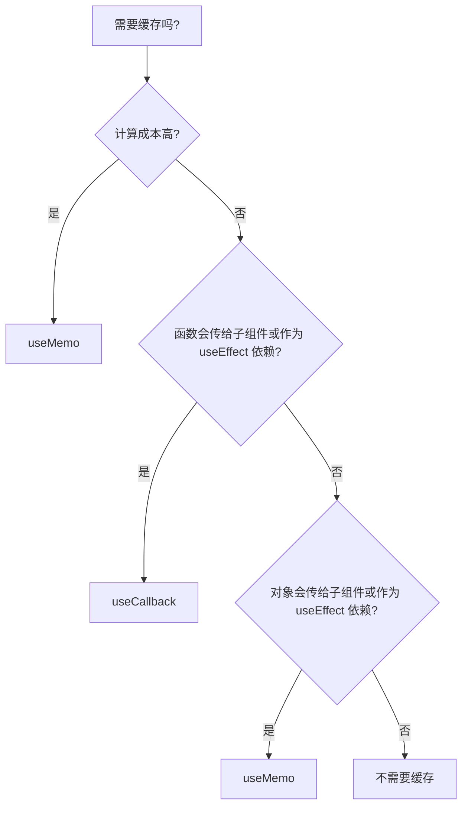
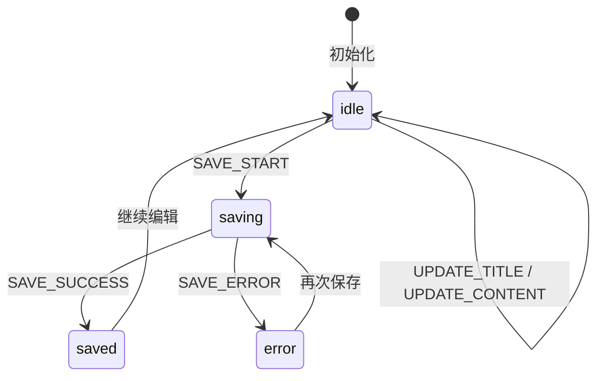
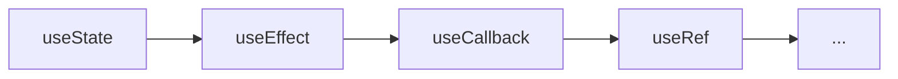

# 第14章 Hooks 完全指南

第13章我们完成了 React 19 的思维转换，并在 13.0 节系统预习了 TypeScript、JSX 和常用 Hooks 的基本用法，在 13.6 节深入讲解了 React 19 的新 Hooks。本章把这些碎片系统化：**从“知道怎么用”到“知道什么时候用、为什么这样用、底层怎么工作”**。

`useState`、`useEffect`、`useRef`、`useCallback` 的基础语法和最小示例请参考 13.0.4 节。本章不会从零再教一遍，而是聚焦几个问题：

- 什么时候该用哪个 Hook？
- 它们的底层机制是什么？
- 项目里真实代码（比如 `useReports`）是怎么组织的？
- 哪些写法是“看起来对，其实有坑”？

读完这一章，你不仅会用 Hooks，还能判断一段代码里的 Hooks 用得是否得体。

## 14.1 useState：状态更新机制与函数式更新

### 14.1.1 useState 基础回顾

`useState` 返回 `[value, setter]`，初始值只在第一次渲染时生效；多次 `setState` 调用会被 React 18 自动批量合并——这些基础概念已在 **13.0.4 节**预习过。本节从更深入的用法开始：函数式更新、不可变更新，以及项目中的拆分策略。

### 14.1.2 函数式更新：setState(prev => next)

如果你需要基于上一次状态做连续更新，应该用函数式更新：

```tsx
function incrementTwice() {
  setCount((prev) => prev + 1)
  setCount((prev) => prev + 1) // 基于最新状态，结果 +2
}
```

函数式更新在两种场景下特别重要：

- 连续多次更新同一个状态
- 新状态依赖于旧状态，但更新逻辑在异步回调里（比如 setTimeout）

```tsx
function delayedIncrement() {
  setTimeout(() => {
    setCount((prev) => prev + 1) // 拿到的是点击时的最新值
  }, 1000)
}
```

### 14.1.3 对象与数组状态的不可变更新

如果状态是对象或数组，不能直接修改原值。React 通过引用比较来判断状态是否变化，直接修改不会触发重新渲染。

```tsx
// ❌ 错误：直接修改原数组
function addReport(report: Report) {
  reports.push(report)
  setReports(reports)
}

// ✅ 正确：创建新数组
function addReport(report: Report) {
  setReports((prev) => [...prev, report])
}
```

对象状态同理：

```tsx
// ✅ 正确：展开旧对象，覆盖指定字段
setUser((prev) => ({ ...prev, name: '新名字' }))
```

### 14.1.4 项目中的 useState：useReports

我们项目里的 `useReports` 同时管理了三份状态：

```tsx
// 文件: src/frontend/src/features/reports/hooks/useReports.ts（节选）

export function useReports() {
  const [reports, setReports] = useState<Report[]>([])
  const [loading, setLoading] = useState(false)
  const [error, setError] = useState<string | null>(null)

  // ...
}
```

这里的 `loading` 和 `error` 是典型的小型独立状态。把它们分开成多个 `useState`，比合并成一个大对象更直观，也更容易单独更新。

> **注意**：不要把所有状态都塞进一个 `useState` 对象里。只有当这些状态总是同时变化、逻辑上属于同一个整体时（比如表单的多个字段），才考虑合并。

## 14.2 useEffect：生命周期映射、清理函数、依赖项精准控制

### 14.2.1 useEffect 基础回顾

`useEffect` 是组件和**外部系统同步**的入口（浏览器 API、定时器、网络请求、第三方库实例），不是类组件生命周期的简单映射。依赖数组决定它何时重新执行，清理函数在组件卸载或依赖变化前释放资源——这些基础概念和 `Timer` 示例已在 **13.0.4 节**预习过。

本节不再重复入门级示例，而是聚焦三个更深层的问题：依赖项遗漏、状态更新循环，以及“你可能不需要 Effect”。

### 14.2.2 常见误区与解决方案

**误区一：遗漏依赖项**

```tsx
// ❌ 错误：dep 里没写 count
useEffect(() => {
  document.title = `点击了 ${count} 次`
}, [])
```

这样写会导致 title 永远只显示第一次的 count。正确的做法是把 `count` 加入依赖项。

```tsx
// ✅ 正确
useEffect(() => {
  document.title = `点击了 ${count} 次`
}, [count])
```

如果你不想频繁执行 effect，应该考虑用函数式更新或把逻辑拆出去，而不是隐瞒依赖。

**误区二：在 effect 里直接 setState 导致循环**

```tsx
// ❌ 错误：effect 依赖 state，又 setState
useEffect(() => {
  setCount(count + 1)
}, [count])
```

每次 `count` 变化都会触发 effect，effect 又修改 `count`，形成无限循环。应该检查条件，或者用 `useRef` 保存上一个值。

**误区三：把不需要副作用的逻辑放进 useEffect**

```tsx
// ❌ 没必要
useEffect(() => {
  setFullName(`${firstName} ${lastName}`)
}, [firstName, lastName])
```

这种派生状态完全可以在渲染时直接计算：

```tsx
// ✅ 直接计算
const fullName = `${firstName} ${lastName}`
```

### 14.2.3 项目中的 useEffect：useReports 初始加载

```tsx
// 文件: src/frontend/src/features/reports/hooks/useReports.ts（节选）

const fetchReports = useCallback(async () => {
  setLoading(true)
  setError(null)
  try {
    const res = await fetch(`${API_BASE}/reports`)
    if (!res.ok) throw new Error(`HTTP ${res.status}`)
    const data = await res.json()
    setReports(data.data || [])
  } catch (err) {
    setError(err instanceof Error ? err.message : 'Unknown error')
  } finally {
    setLoading(false)
  }
}, [])

useEffect(() => {
  fetchReports()
}, [fetchReports])
```

这里有几个值得注意的点：

- 数据请求放在 `useCallback` 里，避免每次渲染都创建新函数
- `useEffect` 依赖 `fetchReports`，但因为 `fetchReports` 的依赖数组是空的，所以 effect 只在挂载时执行
- 错误处理覆盖了 HTTP 错误和 JSON 解析错误

### 14.2.4 什么时候不需要 useEffect

React 官方文档有一张很有名的图：**“你可能不需要 Effect”**。下面是几个常见场景：

| 场景 | 错误写法 | 正确写法 |
|------|----------|----------|
| 派生状态 | `useEffect` 里 `setFullName` | 渲染时直接计算 |
| 根据 props 初始化 state | `useEffect` 里 `setState` | 直接用 props 作为初始值 |
| 用户事件响应 | `useEffect` 里监听变化 | 直接在事件处理函数里处理 |
| 缓存计算结果 | `useEffect` + `useState` | `useMemo` |

记住一个原则：**useEffect 应该用于和外部系统同步，而不是用于状态之间的转换**。

## 14.3 useRef：DOM 引用、定时器管理、跨渲染持久化

### 14.3.1 useRef 基础回顾

`useRef` 的最常见用途是获取 DOM 引用，另一个重要作用是在多次渲染之间保存**不会触发重新渲染的可变值**。`useRef` 的基本语法和 DOM 引用示例已在 **13.0.4 节**预习过；ref-as-prop 的写法和选型建议在 **13.6.6 节**已经详细讲解。

本节聚焦两个实战话题：保存定时器 ID / 上一个值，以及不要滥用 ref 替代 state。

### 14.3.2 保存定时器 ID 和上一个值

`useRef` 很适合保存需要在清理函数里访问的值：

```tsx
// 文件: src/frontend/src/shared/hooks/useDebouncedValue.ts（教学示例）

import { useEffect, useRef, useState } from 'react'

export function useDebouncedValue<T>(value: T, delay: number) {
  const [debounced, setDebounced] = useState(value)
  const timerRef = useRef<ReturnType<typeof setTimeout> | null>(null)

  useEffect(() => {
    if (timerRef.current) clearTimeout(timerRef.current)
    timerRef.current = setTimeout(() => setDebounced(value), delay)

    return () => {
      if (timerRef.current) clearTimeout(timerRef.current)
    }
  }, [value, delay])

  return debounced
}
```

`useRef` 还可以用来比较前后值：

```tsx
function usePrevious<T>(value: T) {
  const ref = useRef<T>(value)

  useEffect(() => {
    ref.current = value
  })

  return ref.current
}
```

注意这个 Hook 的返回值是“上一次渲染时的值”，因为 `useEffect` 在渲染完成后才更新 ref。

### 14.3.3 不要滥用 useRef 替代 state

因为 `useRef` 的变化不会触发重新渲染，有人会用它来“偷偷”保存状态。这通常是错误信号：

```tsx
// ❌ 错误：用 ref 保存应该在 UI 上反映的状态
const countRef = useRef(0)

function increment() {
  countRef.current += 1
  // 界面不会更新！
}
```

如果某个值需要在界面上显示，或者会影响渲染结果，它应该是 state。`useRef` 只适合那些：

- 不需要触发重新渲染
- 需要在多次渲染之间保持稳定引用
- 需要在清理函数或事件处理中访问的值

## 14.4 useMemo / useCallback：缓存的适用场景与过度优化陷阱

### 14.4.1 useMemo / useCallback 基础回顾

React 的渲染机制是：父组件重新渲染时，子组件默认也会重新渲染。`useCallback` 用于保持函数引用稳定——这个作用已在 **13.0.4 节**预习过；`useMemo` 用于缓存复杂计算结果，将在本节深入介绍。

本节聚焦实战中的适用场景、项目用法、过度优化陷阱，以及一张决策树。

### 14.4.2 useMemo：缓存复杂计算

```tsx
// 文件: src/frontend/src/features/reports/components/ReportStats.tsx（教学示例）

import { useMemo } from 'react'
import type { Report } from '../types'

export function ReportStats({ reports }: { reports: Report[] }) {
  const stats = useMemo(() => {
    const total = reports.length
    const completed = reports.filter((r) => r.status === 'completed').length
    const failed = reports.filter((r) => r.status === 'failed').length
    return { total, completed, failed, completionRate: total ? completed / total : 0 }
  }, [reports])

  return (
    <div>
      <p>总计: {stats.total}</p>
      <p>完成: {stats.completed} ({(stats.completionRate * 100).toFixed(1)}%)</p>
      <p>失败: {stats.failed}</p>
    </div>
  )
}
```

### 14.4.3 useCallback：稳定函数引用

```tsx
// 文件: src/frontend/src/features/reports/components/ReportActions.tsx（教学示例）

import { useCallback } from 'react'

export function ReportActions({ reportId, onDelete }: { reportId: string; onDelete: (id: string) => void }) {
  const handleDelete = useCallback(() => {
    onDelete(reportId)
  }, [reportId, onDelete])

  return <button onClick={handleDelete}>删除</button>
}
```

`useCallback` 的本质就是 `useMemo` 的函数特化版：

```tsx
const handleDelete = useCallback(() => { ... }, [deps])
// 等价于
const handleDelete = useMemo(() => () => { ... }, [deps])
```

### 14.4.4 项目中的 useCallback：useReports

回到我们项目的 `useReports`：

```tsx
// 文件: src/frontend/src/features/reports/hooks/useReports.ts（节选）

const fetchReports = useCallback(async () => {
  // ...
}, [])

const createReport = useCallback(async (req: CreateReportRequest) => {
  // ...
}, [])
```

这里的 `useCallback` 有两个作用：

1. 让 `useEffect(() => { fetchReports() }, [fetchReports])` 的依赖稳定，避免无限循环
2. 让调用方可以把 `createReport` 作为 stable prop 传给子组件或另一个 `useEffect`

### 14.4.5 过度优化陷阱

不要一听到“性能优化”就给所有函数包上 `useCallback`、给所有对象包上 `useMemo`。缓存本身是有成本的：

- 需要比较依赖项
- 需要保存上一次的结果
- 会增加代码复杂度

对于简单函数和简单对象，直接定义往往比缓存更快：

```tsx
// ❌ 过度优化
const style = useMemo(() => ({ color: 'red' }), [])
const handleClick = useCallback(() => setCount((c) => c + 1), [])

// ✅ 直接写更简单
const style = { color: 'red' }
const handleClick = () => setCount((c) => c + 1)
```

### 14.4.6 什么时候需要缓存：决策树



> **注意**：React 的默认渲染已经很快了。先用简单写法，遇到真实性能问题再用 `useMemo`/`useCallback`，并配合 React DevTools Profiler 验证。

## 14.5 useReducer：复杂状态逻辑的标准化

### 14.5.1 为什么需要 useReducer

当一个组件里有多个相互关联的状态，并且它们会随着同一个事件一起变化时，多个 `useState` 会让逻辑变得分散：

```tsx
function ReportEditor() {
  const [title, setTitle] = useState('')
  const [content, setContent] = useState('')
  const [isSaving, setIsSaving] = useState(false)
  const [saveError, setSaveError] = useState<string | null>(null)
  const [lastSavedAt, setLastSavedAt] = useState<Date | null>(null)

  const updateTitle = (t: string) => {
    setTitle(t)
    // 想在这里同时清除错误？还要再调一次 setSaveError
  }

  const save = async () => {
    setIsSaving(true)
    setSaveError(null)
    try {
      await saveReport({ title, content })
      setLastSavedAt(new Date())
    } catch (err) {
      setSaveError(String(err))
    } finally {
      setIsSaving(false)
    }
  }
}
```

这段代码的问题不只是“状态多”：

- `save` 函数同时修改了三个状态，逻辑耦合却散落在 `setXxx` 调用里
- 如果以后想在“输入时自动清除错误”，要在每个 `onChange` 里手动加 `setSaveError(null)`
- 状态的合法组合没有约束：理论上可以同时 `isSaving === true` 且 `saveError !== null`

`useReducer` 把这些状态收拢到一个**状态机**里，每次状态转换都通过一个有名字的 action 完成。

### 14.5.2 reducer、action、dispatch 模式详解

状态机的核心是一个纯函数 `reducer(state, action) => newState`。

```tsx
// 文件: src/frontend/src/features/reports/hooks/useReportEditor.ts（教学示例）

import { useReducer } from 'react'

interface State {
  title: string
  content: string
  isSaving: boolean
  saveError: string | null
  lastSavedAt: Date | null
}

// 用联合类型定义所有可能的 action
// 这种写法叫“标签联合”或“可辨识联合”，TypeScript 可以根据 type 字段精确推断 payload
type Action =
  | { type: 'UPDATE_TITLE'; payload: string }
  | { type: 'UPDATE_CONTENT'; payload: string }
  | { type: 'SAVE_START' }
  | { type: 'SAVE_SUCCESS' }
  | { type: 'SAVE_ERROR'; payload: string }

function reducer(state: State, action: Action): State {
  switch (action.type) {
    case 'UPDATE_TITLE':
      // 更新标题时顺便清除之前的错误
      return { ...state, title: action.payload, saveError: null }
    case 'UPDATE_CONTENT':
      return { ...state, content: action.payload, saveError: null }
    case 'SAVE_START':
      return { ...state, isSaving: true, saveError: null }
    case 'SAVE_SUCCESS':
      return { ...state, isSaving: false, lastSavedAt: new Date() }
    case 'SAVE_ERROR':
      return { ...state, isSaving: false, saveError: action.payload }
    default:
      return state
  }
}

const initialState: State = {
  title: '',
  content: '',
  isSaving: false,
  saveError: null,
  lastSavedAt: null,
}

export function useReportEditor() {
  const [state, dispatch] = useReducer(reducer, initialState)

  const save = async () => {
    dispatch({ type: 'SAVE_START' })
    try {
      await saveReport({ title: state.title, content: state.content })
      dispatch({ type: 'SAVE_SUCCESS' })
    } catch (err) {
      dispatch({ type: 'SAVE_ERROR', payload: String(err) })
    }
  }

  return {
    state,
    setTitle: (title: string) => dispatch({ type: 'UPDATE_TITLE', payload: title }),
    setContent: (content: string) => dispatch({ type: 'UPDATE_CONTENT', payload: content }),
    save,
  }
}
```

使用这个 Hook 的组件非常干净：

```tsx
function ReportEditor() {
  const { state, setTitle, setContent, save } = useReportEditor()

  return (
    <div>
      <input
        value={state.title}
        onChange={(e) => setTitle(e.target.value)}
        placeholder="标题"
      />
      <textarea
        value={state.content}
        onChange={(e) => setContent(e.target.value)}
        placeholder="正文"
      />
      <button onClick={save} disabled={state.isSaving}>
        {state.isSaving ? '保存中...' : '保存'}
      </button>
      {state.saveError && <p style={{ color: 'red' }}>{state.saveError}</p>}
      {state.lastSavedAt && (
        <p>上次保存：{state.lastSavedAt.toLocaleTimeString()}</p>
      )}
    </div>
  )
}
```

这个状态机可以用一张图表示：



> **注意**：reducer 必须是**纯函数**。它不能调用 API、不能读取 Date.now() 以外的随机值、不能修改传入的 state。所有副作用（网络请求、计时器）都应该放在 reducer 外面，通过 dispatch 把结果传回状态机。

### 14.5.3 用 useReducer 重写 useReports：完整状态机

我们项目里的 `useReports` 用三个 `useState` 管理 `reports`、`loading`、`error`。用 `useReducer` 改写后，可以让状态的互斥性被类型系统强制：你不可能同时处于 `loading` 和 `error` 状态。

```tsx
// 文件: src/frontend/src/features/reports/hooks/useReportsReducer.ts（教学示例）

import { useCallback, useEffect, useReducer } from 'react'
import type { Report } from '../types'

// State 用可辨识联合：idle / loading / success / error 四个状态互斥
type State =
  | { status: 'idle' }
  | { status: 'loading' }
  | { status: 'success'; reports: Report[] }
  | { status: 'error'; error: string }

type Action =
  | { type: 'FETCH_START' }
  | { type: 'FETCH_SUCCESS'; payload: Report[] }
  | { type: 'FETCH_ERROR'; payload: string }

function reducer(_state: State, action: Action): State {
  switch (action.type) {
    case 'FETCH_START':
      return { status: 'loading' }
    case 'FETCH_SUCCESS':
      return { status: 'success', reports: action.payload }
    case 'FETCH_ERROR':
      return { status: 'error', error: action.payload }
    default:
      return _state
  }
}

export function useReportsReducer() {
  const [state, dispatch] = useReducer(reducer, { status: 'idle' })

  const fetchReports = useCallback(async () => {
    dispatch({ type: 'FETCH_START' })
    try {
      const res = await fetch('/api/reports')
      if (!res.ok) throw new Error(`HTTP ${res.status}`)
      const data = await res.json()
      dispatch({ type: 'FETCH_SUCCESS', payload: data.data || [] })
    } catch (err) {
      dispatch({
        type: 'FETCH_ERROR',
        payload: err instanceof Error ? err.message : 'Unknown error',
      })
    }
  }, [])

  useEffect(() => {
    fetchReports()
  }, [fetchReports])

  return { state, refetch: fetchReports }
}
```

组件里的使用方式：

```tsx
function ReportListPage() {
  const { state, refetch } = useReportsReducer()

  if (state.status === 'idle' || state.status === 'loading') {
    return <div>加载中...</div>
  }

  if (state.status === 'error') {
    return (
      <div>
        <p>出错了：{state.error}</p>
        <button onClick={refetch}>重试</button>
      </div>
    )
  }

  return (
    <div>
      {state.reports.map((report) => (
        <ReportCard key={report.id} report={report} />
      ))}
    </div>
  )
}
```

这种写法的好处：

- **类型安全**：TypeScript 会根据 `state.status` 自动收窄类型。在 `success` 分支里访问 `state.reports` 不会报错；在 `error` 分支里访问 `state.error` 是安全的。
- **状态互斥**：你无法写出 `loading && error` 这种非法组合。
- **意图清晰**：每个状态转换都有名字，而不是一堆 `setXxx` 调用。

### 14.5.4 useReducer vs useState：选型

| 场景 | useState | useReducer |
|------|----------|------------|
| 一到两个独立状态 | ✅ 首选 | 过度设计 |
| 多个关联状态随同一事件变化 | 容易分散 | ✅ 更清晰 |
| 状态转换复杂、有明确状态机 | 难以维护 | ✅ 更适合 |
| 需要撤销/重做 | 需要额外封装 | ✅ reducer 结构天然支持 |
| 团队协作、状态逻辑需要测试 | 测试分散 | ✅ reducer 是纯函数，易测 |

> **注意**：`useReducer` 不是 `useState` 的替代品，而是 `useState` 的延伸。简单状态仍然用 `useState`，复杂状态机才考虑 `useReducer`。

## 14.6 自定义 Hooks：抽象、复用、测试的最佳实践

### 14.6.1 自定义 Hook 的约定

自定义 Hook 的本质是**把组件逻辑提取成可复用的函数**。它必须满足两个约定：

1. 函数名以 `use` 开头
2. 内部可以调用其他 Hooks

```tsx
// ✅ 自定义 Hook
export function useReports() { ... }

// ❌ 不是自定义 Hook（不以 use 开头）
export function fetchReports() { ... }
```

以 `use` 开头不是形式主义，而是让 React 和 ESLint 知道你调用了 Hooks，从而应用 Hooks 规则检查。

### 14.6.2 参数与返回值设计

一个好的自定义 Hook 应该：

- 参数尽量少，复杂配置用对象
- 返回值用对象，方便扩展
- 命名清晰，调用方一眼能看懂

```tsx
// 文件: src/frontend/src/shared/hooks/useAsync.ts（教学示例）

import { useCallback, useEffect, useState } from 'react'

interface UseAsyncOptions<T> {
  asyncFn: () => Promise<T>
  immediate?: boolean
}

interface UseAsyncResult<T> {
  data: T | null
  loading: boolean
  error: string | null
  execute: () => Promise<void>
}

export function useAsync<T>({ asyncFn, immediate = true }: UseAsyncOptions<T>): UseAsyncResult<T> {
  const [data, setData] = useState<T | null>(null)
  const [loading, setLoading] = useState(false)
  const [error, setError] = useState<string | null>(null)

  const execute = useCallback(async () => {
    setLoading(true)
    setError(null)
    try {
      const result = await asyncFn()
      setData(result)
    } catch (err) {
      setError(err instanceof Error ? err.message : 'Unknown error')
    } finally {
      setLoading(false)
    }
  }, [asyncFn])

  useEffect(() => {
    if (immediate) execute()
  }, [execute, immediate])

  return { data, loading, error, execute }
}
```

### 14.6.3 项目中的自定义 Hook：useReports

`useReports` 就是一个典型的自定义 Hook：

```tsx
// 文件: src/frontend/src/features/reports/hooks/useReports.ts

import { useCallback, useEffect, useState } from 'react'
import type { CreateReportRequest, Report } from '../types'

const API_BASE = import.meta.env.VITE_API_BASE_URL || '/api'

export function useReports() {
  const [reports, setReports] = useState<Report[]>([])
  const [loading, setLoading] = useState(false)
  const [error, setError] = useState<string | null>(null)

  const fetchReports = useCallback(async () => {
    setLoading(true)
    setError(null)
    try {
      const res = await fetch(`${API_BASE}/reports`)
      if (!res.ok) throw new Error(`HTTP ${res.status}`)
      const data = await res.json()
      setReports(data.data || [])
    } catch (err) {
      setError(err instanceof Error ? err.message : 'Unknown error')
    } finally {
      setLoading(false)
    }
  }, [])

  const createReport = useCallback(async (req: CreateReportRequest) => {
    const res = await fetch(`${API_BASE}/reports`, {
      method: 'POST',
      headers: { 'Content-Type': 'application/json' },
      body: JSON.stringify(req),
    })
    if (!res.ok) throw new Error(`HTTP ${res.status}`)
    return res.json()
  }, [])

  useEffect(() => {
    fetchReports()
  }, [fetchReports])

  return { reports, loading, error, fetchReports, createReport }
}
```

它的价值在于：

- `ReportList` 不需要知道 API 地址
- 加载、错误、数据状态被封装在 Hook 内部
- 多个组件可以复用同一份数据获取逻辑

### 14.6.4 更多自定义 Hook 示例

**useHealthCheck**

```tsx
// 文件: src/frontend/src/shared/hooks/useHealthCheck.ts（教学示例）

import { useAsync } from './useAsync'

export function useHealthCheck() {
  return useAsync({
    asyncFn: async () => {
      const res = await fetch('/api/health')
      if (!res.ok) throw new Error('健康检查失败')
      return res.json()
    },
  })
}
```

**useLocalStorage**

```tsx
// 文件: src/frontend/src/shared/hooks/useLocalStorage.ts（教学示例）

import { useEffect, useState } from 'react'

export function useLocalStorage<T>(key: string, initialValue: T) {
  const [value, setValue] = useState<T>(() => {
    try {
      const item = localStorage.getItem(key)
      return item ? (JSON.parse(item) as T) : initialValue
    } catch {
      return initialValue
    }
  })

  useEffect(() => {
    localStorage.setItem(key, JSON.stringify(value))
  }, [key, value])

  return [value, setValue] as const
}
```

### 14.6.5 测试自定义 Hook

自定义 Hook 是函数，可以被单元测试。推荐用 `@testing-library/react` 的 `renderHook`：

```tsx
// 文件: src/frontend/src/shared/hooks/useCounter.test.ts（教学示例）

import { renderHook, act } from '@testing-library/react'
import { useState } from 'react'

function useCounter(initial = 0) {
  const [count, setCount] = useState(initial)
  const increment = () => setCount((c) => c + 1)
  return { count, increment }
}

describe('useCounter', () => {
  it('should increment count', () => {
    const { result } = renderHook(() => useCounter())

    act(() => {
      result.current.increment()
    })

    expect(result.current.count).toBe(1)
  })
})
```

> **注意**：测试 Hook 时一定要用 `act` 包裹会触发状态更新的操作，否则 React 会报警告。

## 14.7 Hooks 规则与底层原理：链表结构、调用顺序

### 14.7.1 只在最顶层调用 Hooks

Hooks 不能写在 `if`、`for`、嵌套函数里面：

```tsx
// ❌ 错误
function BadComponent({ shouldUse }: { shouldUse: boolean }) {
  if (shouldUse) {
    const [count, setCount] = useState(0)
  }
  return <div>...</div>
}
```

```tsx
// ✅ 正确
function GoodComponent({ shouldUse }: { shouldUse: boolean }) {
  const [count, setCount] = useState(0)

  if (!shouldUse) return null
  return <div>{count}</div>
}
```

### 14.7.2 只在 React 函数中调用 Hooks

Hooks 只能在：

- React 函数组件内部
- 自定义 Hook 内部

不能在普通函数、类组件、条件分支或循环中调用。

### 14.7.3 ESLint 插件自动检查

项目里已经配置了 `eslint-plugin-react-hooks`（见 `package.json`）。它会自动检查这两条规则：

```json
{
  "plugins": ["react-hooks"],
  "rules": {
    "react-hooks/rules-of-hooks": "error",
    "react-hooks/exhaustive-deps": "warn"
  }
}
```

`exhaustive-deps` 会提醒你 `useEffect`/`useCallback`/`useMemo` 是否遗漏了依赖项。不要随手禁用这条规则，除非你真的知道自己在做什么。

### 14.7.4 底层链表结构

13.0.4 节我们提到 Hooks 必须按固定顺序调用，这里解释为什么。

React 内部用链表来管理每个组件的 Hooks。第一次渲染时，React 按顺序创建 Hook 节点；后续渲染时，React 按同样的顺序读取这些节点。



这就是为什么调用顺序不能变：如果你在条件语句里跳过了某个 Hook，后续 Hooks 就会读取到错误的节点。

### 14.7.5 条件调用为什么会破坏 Hooks

假设有这样的代码：

```tsx
function Component({ show }: { show: boolean }) {
  const [a, setA] = useState(0)
  if (show) {
    const [b, setB] = useState(0)
  }
  const [c, setC] = useState(0)
  return <div>...</div>
}
```

第一次渲染 `show = true` 时，Hook 链表是 `[a, b, c]`。第二次渲染 `show = false` 时，React 仍然期望链表第三个位置是 `c` 的 state，但实际上第二个位置变成了 `b` 被跳过后的 `c`，于是状态错位。

### 14.7.6 多组件共享状态：为什么需要 Context 或外部状态管理

Hooks 管理的是组件自己的状态。如果两个没有父子关系的组件需要共享同一份状态，Hooks 本身不够，需要：

- 把状态提升到公共父组件（props drilling）
- 使用 Context API（第15章）
- 使用外部状态管理库如 Zustand、React Query（第15章）

不要把 Hooks 当成全局状态工具。它们是组件级状态的原语，不是应用级状态的解决方案。

## 14.8 React 19 新 Hooks：与经典 Hooks 的协同实战

### 14.8.1 从 ch13 到 ch14：新 Hooks 与经典 Hooks 的协同

第13章 13.6 节已经系统讲解了 `useActionState`、`useFormStatus`、`useOptimistic` 的独立用法、状态机、时序图和选型建议。本章作为 **Hooks 完全指南**，不再重复这些基础示例，而是站在 **“组合与协同”** 的视角：

- `useActionState` 如何与 `useCallback` 配合，避免 Action 函数频繁重建？
- `useFormStatus` 如何封装进自定义 Hook，同时管理表单的 dirty 状态？
- `useOptimistic` 如何与 `useReducer` 组合，处理多关联状态的乐观更新？

### 14.8.2 useActionState + useCallback：稳定 Action 函数引用

`useActionState` 的 action 函数如果每次渲染都重新定义，会导致依赖它的子组件或 `useEffect` 不必要地重新执行。把它包进 `useCallback` 可以解决这个问题：

```tsx
// 文件: src/frontend/src/features/reports/hooks/useCreateReportAction.ts（教学示例）

import { useActionState, useCallback, useState } from 'react'

interface FormState {
  success?: boolean
  error?: string
}

export function useCreateReportAction() {
  const [topic, setTopic] = useState('')

  // 用 useCallback 稳定 action 函数引用
  const submitAction = useCallback(
    async (_prevState: FormState, formData: FormData): Promise<FormState> => {
      const t = formData.get('topic') as string
      if (t.length < 3) return { error: '主题至少 3 个字符' }

      const res = await fetch('/api/reports', {
        method: 'POST',
        body: JSON.stringify({ topic: t }),
      })
      return res.ok ? { success: true } : { error: '创建失败' }
    },
    []
  )

  const [state, formAction, isPending] = useActionState(submitAction, {})

  return { topic, setTopic, state, formAction, isPending }
}
```

这里的 `useCallback` 依赖数组是空的，因为 action 逻辑不依赖组件内的可变状态（它从 `FormData` 读取）。这样 `formAction` 引用稳定，可以安全地传给 `useEffect` 或子组件。

### 14.8.3 useFormStatus + 自定义 Hook：封装表单提交状态

`useFormStatus` 只能读取最近 `<form>` 的提交状态。在真实项目中，我们通常把它和 `useState` 一起封装成一个自定义 Hook，同时管理 **pending** 和 **dirty**（是否被修改过）状态：

```tsx
// 文件: src/frontend/src/shared/hooks/useFormSubmit.ts（教学示例）

import { useFormStatus } from 'react-dom'
import { useState } from 'react'

export function useFormSubmit() {
  const { pending } = useFormStatus()
  const [isDirty, setIsDirty] = useState(false)

  return {
    pending,
    isDirty,
    setIsDirty,
    // 如果正在提交或表单未修改，禁用提交按钮
    submitDisabled: pending || !isDirty,
  }
}
```

使用方式：

```tsx
function CreateReportForm() {
  const { submitDisabled, setIsDirty } = useFormSubmit()

  return (
    <form action={formAction}>
      <input
        name="topic"
        onChange={() => setIsDirty(true)}
        placeholder="输入研究主题"
      />
      <button type="submit" disabled={submitDisabled}>
        创建研究
      </button>
    </form>
  )
}
```

> **注意**：`useFormStatus` 必须包裹在 `<form>` 内部使用。如果表单状态需要在表单外部读取（比如全局导航栏显示提交中），就需要用 `useActionState` 或状态提升。

### 14.8.4 useOptimistic + useReducer：多关联状态的乐观更新

当乐观更新涉及多个相互关联的状态时（比如报告列表 + 统计数字），单独用 `useState` 会让逻辑分散。`useReducer` 可以把这些状态变化集中到一个状态机里：

```tsx
// 文件: src/frontend/src/features/reports/hooks/useReportsOptimistic.ts（教学示例）

import { useOptimistic, useReducer } from 'react'
import type { Report } from '../types'

interface State {
  reports: Report[]
  totalCount: number
}

type Action =
  | { type: 'ADD_OPTIMISTIC'; report: Report }
  | { type: 'CONFIRM'; report: Report }
  | { type: 'FAIL' }

function reducer(state: State, action: Action): State {
  switch (action.type) {
    case 'ADD_OPTIMISTIC':
      return {
        reports: [action.report, ...state.reports],
        totalCount: state.totalCount + 1,
      }
    case 'CONFIRM':
      // 用真实报告替换占位报告
      return {
        reports: state.reports.map((r) =>
          r.id === action.report.id ? action.report : r
        ),
        totalCount: state.totalCount,
      }
    case 'FAIL':
      // 请求失败时，把占位报告移除，统计数字回滚
      return {
        reports: state.reports.filter((r) => !r.id.startsWith('tmp-')),
        totalCount: state.totalCount - 1,
      }
  }
}

export function useReportsOptimistic(initialReports: Report[]) {
  const [state, dispatch] = useReducer(reducer, {
    reports: initialReports,
    totalCount: initialReports.length,
  })

  const [optimisticState, addOptimistic] = useOptimistic(state, (current, report: Report) =>
    reducer(current, { type: 'ADD_OPTIMISTIC', report })
  )

  async function createReport(topic: string) {
    const optimistic: Report = {
      id: `tmp-${Date.now()}`,
      title: `${topic}（生成中...）`,
      topic,
      status: 'running',
    }

    addOptimistic(optimistic)

    try {
      const res = await fetch('/api/reports', {
        method: 'POST',
        body: JSON.stringify({ topic }),
      })
      const saved = await res.json()
      dispatch({ type: 'CONFIRM', report: saved })
    } catch (err) {
      dispatch({ type: 'FAIL' })
      console.error(err)
    }
  }

  return { state: optimisticState, createReport }
}
```

这个例子展示了三个关键点：

1. **`useOptimistic` 的更新函数可以复用 reducer**：保持乐观状态与权威状态的一致性
2. **多关联状态统一在 reducer 中管理**：列表和统计数字一起变化、一起回滚
3. **失败回滚是显式的**：通过 `FAIL` action 清理占位数据，而不是依赖自动回滚

### 14.8.5 新 Hooks 与经典 Hooks 选型矩阵

| 场景 | 推荐组合 | 原因 |
|------|----------|------|
| 简单表单提交 | `useActionState` 单独使用 | 足够声明式，样板最少 |
| Action 函数需要传给子组件 / effect | `useActionState` + `useCallback` | 稳定引用，避免不必要的重新执行 |
| 表单内按钮/遮罩感知 pending | `useFormStatus` + `useState`（dirty） | 自包含，不需要 prop drilling |
| 单列表乐观更新 | `useOptimistic` + `useState` | 自动回滚，代码最简洁 |
| 多关联状态乐观更新 | `useOptimistic` + `useReducer` | 状态机统一，回滚可控 |
| 多步骤异步流程 | `useState` + `useReducer` + 自定义 Hook | 新 Hooks 不适合复杂状态机 |

> **注意**：React 19 新 Hooks 让常见模式更简洁，但不要为了用新 API 而扭曲需求。当状态机复杂、回滚逻辑特殊、或者状态需要在多个组件共享时，回到 `useReducer` 和自定义 Hook 往往是更稳的选择。

## 小结

本章我们把 React Hooks 从基础讲到实战：

- **useState**：函数式更新、不可变更新、拆分策略。基础语法请参考 13.0.4。
- **useEffect**：用于和外部系统同步，不是生命周期。注意依赖项、清理函数和“你可能不需要 Effect”。
- **useRef**：保存定时器 ID、上一个值。DOM 引用和 ref-as-prop 参见 13.0.4 和 13.6.6。
- **useMemo / useCallback**：解决引用不稳定和复杂计算问题，但不要过度优化。
- **useReducer**：把复杂状态机标准化，特别适合有互斥状态的场景。
- **自定义 Hooks**：提取可复用逻辑，命名以 `use` 开头，返回值用对象，方便测试。
- **Hooks 规则**：只在顶层调用、只在 React 函数中调用。底层靠链表保证调用顺序。
- **React 19 新 Hooks**：独立用法和基础示例参见 13.6 节；本章 14.8 节展示了它们与 `useCallback`、`useState`、`useReducer` 的协同实战，以及复杂场景下的选型矩阵。

下一章（第15章）我们将进入状态管理，看看当组件之间的状态需要共享时，Context、Zustand、React Query 各自扮演什么角色。

## 练习

1. 把 `useReports.ts` 里的 `loading`/`error`/`reports` 三个 `useState` 改写成 `useReducer`，体会两种写法在可读性上的差异。
2. 为 `App.tsx` 的健康检查提取一个 `useHealthCheck()` 自定义 Hook，要求支持手动刷新和自动轮询（可选）。
3. 找出 `useReports.ts` 里 `useCallback` 的必要性：如果把 `fetchReports` 和 `createReport` 改成普通函数，`useEffect` 会出现什么问题？
4. 用 `useMemo` 为 `ReportList` 实现按状态筛选和搜索关键词过滤，思考缓存是否有必要。
5. 结合 13.6 节的基础示例和本章 14.5、14.8 节的内容，用 `useActionState` + `useOptimistic` + `useReducer` 重写 `useReports.ts` 里的 `createReport` 流程。要求：
   - 用 `useReducer` 管理表单的多个字段状态；
   - 用 `useOptimistic` 实现列表即时反馈；
   - 用 `useCallback` 稳定 action 函数引用；
   - 请求失败时显式回滚占位报告。
