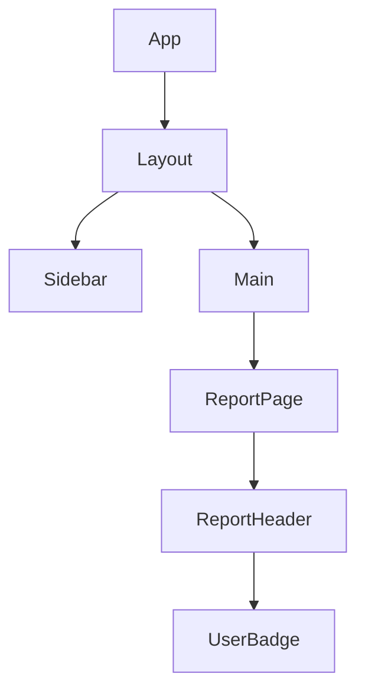
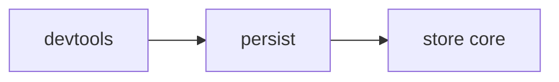
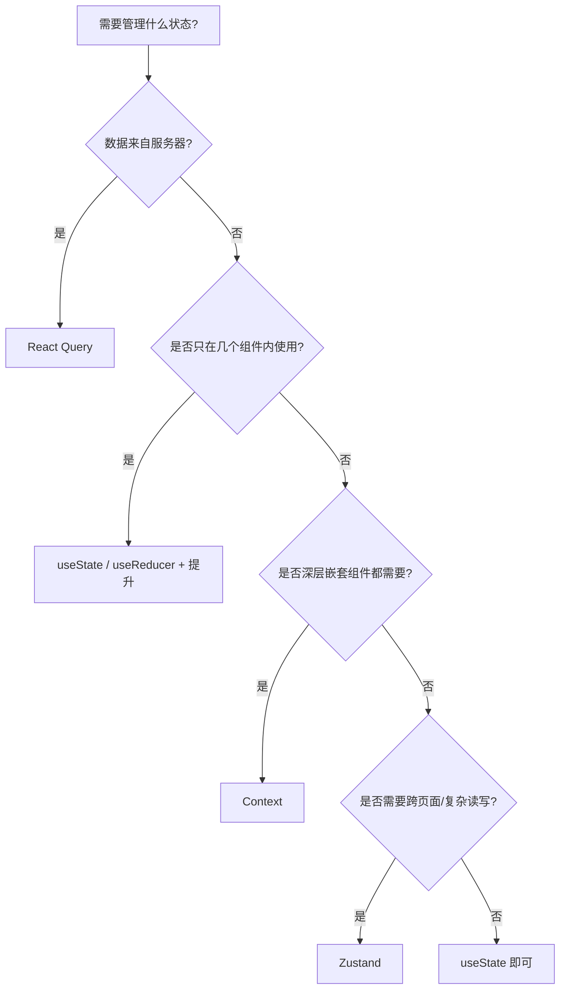

# 第15章 状态管理：从局部到全局

第14章我们把 Hooks 讲透了：`useState`、`useEffect`、`useReducer`、自定义 Hook。这些工具足够管理单个组件或单个自定义 Hook 内部的状态。但一个真实应用里，状态往往需要在多个组件之间共享：

- 当前登录用户信息要在导航栏、侧边栏、设置页同时显示
- 选中的研究报告要在列表页和详情页之间同步
- 主题（深色/浅色）要影响整个应用
- 服务端返回的报告列表要在多个页面之间缓存，避免重复请求

当状态跨越组件边界时，我们就需要**状态管理方案**。从最简单的“状态提升”到 Context，再到 Zustand、React Query，本章会给你一个清晰的选型地图。

## 15.1 状态提升与组件通信模式

### 15.1.1 局部状态的边界

每个组件都可以有自己的状态，但状态的作用域应该尽量小。一个原则：**状态应该放在离使用它的地方最近的公共父组件里**。

```tsx
// 文件: src/frontend/src/features/reports/components/ReportFilter.tsx（教学示例）

import { useState } from 'react'

export function ReportFilter() {
  const [keyword, setKeyword] = useState('')

  return (
    <input
      value={keyword}
      onChange={(e) => setKeyword(e.target.value)}
      placeholder="搜索报告"
    />
  )
}
```

如果 `keyword` 只在这个输入框内部使用，那它就应该留在 `ReportFilter` 里。但如果 `ReportList` 也需要根据 `keyword` 过滤列表，状态就得往上提。

### 15.1.2 状态提升：Lift State Up

React 官方文档中的经典建议：**当有多个组件需要同一个状态时，把状态放到它们的公共父组件里**。

```tsx
// 文件: src/frontend/src/features/reports/components/ReportSearchPanel.tsx（教学示例）

import { useState } from 'react'
import { ReportFilter } from './ReportFilter'
import { ReportList } from './ReportList'

export function ReportSearchPanel() {
  const [keyword, setKeyword] = useState('')

  return (
    <div>
      <ReportFilter keyword={keyword} onKeywordChange={setKeyword} />
      <ReportList keyword={keyword} />
    </div>
  )
}
```

```tsx
// ReportFilter 接收 props，不再自己管理状态
interface ReportFilterProps {
  keyword: string
  onKeywordChange: (keyword: string) => void
}

export function ReportFilter({ keyword, onKeywordChange }: ReportFilterProps) {
  return (
    <input
      value={keyword}
      onChange={(e) => onKeywordChange(e.target.value)}
      placeholder="搜索报告"
    />
  )
}
```

```tsx
// ReportList 根据 keyword 过滤
interface ReportListProps {
  keyword: string
}

export function ReportList({ keyword }: ReportListProps) {
  // 用 keyword 做过滤...
  return <div>报告列表</div>
}
```

这种模式的优点是简单、符合 React 数据流向；缺点是如果层级很深，每一层都要传 props，形成 **prop drilling**。

### 15.1.3 父子通信：props + callbacks

父子组件通信的最自然方式就是：

- 父传子：props
- 子传父：回调函数 prop

```tsx
function Parent() {
  const [selectedId, setSelectedId] = useState<string | null>(null)

  return <ReportList selectedId={selectedId} onSelect={setSelectedId} />
}

interface ReportListProps {
  selectedId: string | null
  onSelect: (id: string) => void
}

function ReportList({ selectedId, onSelect }: ReportListProps) {
  // 渲染列表，点击时调用 onSelect(id)
}
```

### 15.1.4 跨层级通信的问题：prop drilling

假设你的组件树是这样：



`UserBadge` 需要显示当前用户，但用户状态在 `App` 里。如果只用 props 传递，`Layout`、`Main`、`ReportPage`、`ReportHeader` 每一层都要接收并转发 `user`，即使它们自己并不需要。

这就是 prop drilling。它不一定会让应用变慢，但会让代码变得脆弱：中间任一层的 props 接口变化，都会影响整条链路。

### 15.1.5 项目实战：提升选中报告状态

在我们项目里，假设 `ReportList` 和 `ReportDetail` 都需要知道当前选中了哪份报告。我们可以把 `selectedReportId` 提升到它们的公共父组件：

```tsx
// 文件: src/frontend/src/features/reports/pages/ReportsPage.tsx（教学示例）

import { useState } from 'react'
import { ReportList } from '../components/ReportList'
import { ReportDetail } from '../components/ReportDetail'

export function ReportsPage() {
  const [selectedId, setSelectedId] = useState<string | null>(null)

  return (
    <div style={{ display: 'grid', gridTemplateColumns: '1fr 2fr', gap: '1rem' }}>
      <ReportList selectedId={selectedId} onSelect={setSelectedId} />
      <ReportDetail reportId={selectedId} />
    </div>
  )
}
```

这个方案在层级不深时非常合适。如果应用的很多角落都需要 `selectedId`，就要考虑 Context 或全局状态管理了。

## 15.2 Context API：适用场景与性能注意事项

### 15.2.1 Context 解决什么问题

React Context 提供了一种**在组件树中跨层级传递数据**的方式，不需要逐层传递 props。它最适合的数据特征是：

- **全局但相对稳定**：当前用户、主题、语言、权限
- **被多个深层组件消费**：导航栏、侧边栏、表单、弹窗都需要用户头像
- **不频繁变化**：如果每秒钟变化很多次，Context 可能不是最佳选择

### 15.2.2 createContext / Provider / useContext

使用 Context 需要三步：

```tsx
// 文件: src/frontend/src/shared/contexts/UserContext.tsx（教学示例）

import { createContext, useContext, useState, type ReactNode } from 'react'

interface User {
  id: string
  name: string
  avatar: string
}

interface UserContextValue {
  user: User | null
  setUser: (user: User | null) => void
}

const UserContext = createContext<UserContextValue | undefined>(undefined)

export function UserProvider({ children }: { children: ReactNode }) {
  const [user, setUser] = useState<User | null>(null)

  return (
    <UserContext.Provider value={{ user, setUser }}>
      {children}
    </UserContext.Provider>
  )
}

export function useUser() {
  const ctx = useContext(UserContext)
  if (!ctx) {
    throw new Error('useUser must be used within UserProvider')
  }
  return ctx
}
```

使用方式：

```tsx
// main.tsx
<UserProvider>
  <App />
</UserProvider>
```

```tsx
// 任意深层组件
function UserBadge() {
  const { user } = useUser()
  if (!user) return null
  return 
}
```

### 15.2.3 适合 Context 的数据类型

| 数据 | 是否适合 Context | 原因 |
|------|------------------|------|
| 当前用户 | ✅ | 全局、相对稳定的读多写少数据 |
| 主题/语言 | ✅ | 几乎所有组件都可能需要 |
| 路由状态 | ⚠️ | 最好用路由库，Context 只是兜底 |
| 表单字段 | ❌ | 变化太频繁，应该用局部状态或 Zustand |
| 服务器列表数据 | ❌ | 用 React Query 更合适 |

### 15.2.4 Context 的性能陷阱

Context 最大的坑是：**Provider 的 value 变化时，所有消费这个 Context 的组件都会重新渲染**。

```tsx
// ❌ 错误：每次渲染都创建新对象，导致所有子组件重渲染
function App() {
  const [user, setUser] = useState(null)

  return (
    <UserContext.Provider value={{ user, setUser }}>
      <Layout />
    </UserContext.Provider>
  )
}
```

上面的代码里，`{ user, setUser }` 每次渲染都是新对象，即使 `user` 没变，消费 Context 的组件也会重新渲染。

正确做法是把这些状态放进 Provider 组件内部，让 value 对象在 Provider 的作用域里自然稳定：

```tsx
// ✅ 正确：Provider 组件内部管理 state
function UserProvider({ children }) {
  const [user, setUser] = useState(null)
  return (
    <UserContext.Provider value={{ user, setUser }}>
      {children}
    </UserContext.Provider>
  )
}
```

在 Provider 内部，`setUser` 是稳定的，`user` 只有真正变化时才变，所以 value 对象虽然字面量形式，但只有在 state 变化时才会触发重新渲染。

### 15.2.5 拆分 Context 与 memo 优化

如果你有一个 Context 同时包含“经常变化的数据”和“不常变化的数据”，应该拆成两个 Context：

```tsx
// 文件: src/frontend/src/shared/contexts/ThemeContext.tsx（教学示例）

const ThemeContext = createContext('light')
const ThemeToggleContext = createContext(() => {})

export function ThemeProvider({ children }: { children: ReactNode }) {
  const [theme, setTheme] = useState('light')
  const toggle = useCallback(() => {
    setTheme((t) => (t === 'light' ? 'dark' : 'light'))
  }, [])

  return (
    <ThemeContext.Provider value={theme}>
      <ThemeToggleContext.Provider value={toggle}>
        {children}
      </ThemeToggleContext.Provider>
    </ThemeContext.Provider>
  )
}
```

这样只读取主题的组件不会因为 toggle 函数引用的变化而重渲染。

> **注意**：Context 不是状态管理库。它没有选择器、没有中间件、没有持久化。如果你的状态有复杂的读写模式，应该考虑 Zustand 或 React Query。

### 15.2.6 项目实战：为项目添加 UserContext

在我们的报告平台里，用户登录后需要在导航栏显示头像、在设置页显示资料。可以把用户信息放进 Context：

```tsx
// 文件: src/frontend/src/shared/contexts/UserContext.tsx（教学示例）

import { createContext, useContext, useState, type ReactNode } from 'react'

interface User {
  id: string
  name: string
  email: string
}

interface UserContextValue {
  user: User | null
  login: (user: User) => void
  logout: () => void
}

const UserContext = createContext<UserContextValue | undefined>(undefined)

export function UserProvider({ children }: { children: ReactNode }) {
  const [user, setUser] = useState<User | null>(null)

  const login = (u: User) => setUser(u)
  const logout = () => setUser(null)

  return (
    <UserContext.Provider value={{ user, login, logout }}>
      {children}
    </UserContext.Provider>
  )
}

export function useUser() {
  const ctx = useContext(UserContext)
  if (!ctx) throw new Error('useUser must be used within UserProvider')
  return ctx
}
```

```tsx
// 导航栏组件
function Navbar() {
  const { user, logout } = useUser()

  return (
    <nav>
      {user ? (
        <>
          <span>{user.name}</span>
          <button onClick={logout}>退出</button>
        </>
      ) : (
        <button>登录</button>
      )}
    </nav>
  )
}
```

## 15.3 Zustand 入门：极简 API，无样板代码

### 15.3.1 为什么选 Zustand

React 生态里有很多状态管理库：Redux、MobX、Recoil、Jotai、Zustand。我们选 Zustand 的原因是：

- **API 极简**：没有 Provider、没有 action creators、没有 reducer 样板
- **TypeScript 友好**：类型推导自然
- **性能不错**：支持选择器，组件只订阅自己需要的状态
- **中间件丰富**：持久化、日志、immer 等扩展方便
- **与 React 19 兼容**：没有 hook 规则之外的魔法

> **注意**：上面提到的 **immer** 是一个让你用“可变语法”写“不可变更新”的库。例如你可以写 `state.count += 1`，immer 会在底层帮你生成一个新的不可变对象。Zustand 提供 `immer` 中间件来支持这种写法。本章的示例不依赖 immer，如果你感兴趣，可以在掌握基础后再去了解。

### 15.3.2 安装与创建 Store

```bash
pnpm add zustand
```

```ts
// 文件: src/frontend/src/features/reports/stores/reportStore.ts（教学示例）

import { create } from 'zustand'
import type { Report } from '../types'

interface ReportStore {
  reports: Report[]
  selectedId: string | null
  setReports: (reports: Report[]) => void
  selectReport: (id: string | null) => void
  addReport: (report: Report) => void
}

export const useReportStore = create<ReportStore>((set) => ({
  reports: [],
  selectedId: null,
  setReports: (reports) => set({ reports }),
  selectReport: (id) => set({ selectedId: id }),
  addReport: (report) => set((state) => ({
    reports: [report, ...state.reports],
  })),
}))
```

### 15.3.3 在组件中读取和更新状态

```tsx
// 文件: src/frontend/src/features/reports/components/ReportList.tsx（教学示例）

import { useReportStore } from '../stores/reportStore'
import { ReportCard } from './ReportCard'

export function ReportList() {
  const { reports, selectedId, selectReport } = useReportStore()

  return (
    <div>
      {reports.map((report) => (
        <ReportCard
          key={report.id}
          report={report}
          isSelected={report.id === selectedId}
          onClick={() => selectReport(report.id)}
        />
      ))}
    </div>
  )
}
```

### 15.3.4 选择器与精细订阅

Zustand 允许你只订阅状态的某一部分，避免不必要的重渲染：

```tsx
// 只订阅 selectedId
function ReportDetail() {
  const selectedId = useReportStore((state) => state.selectedId)
  // ...
}

// 只订阅 reports 数量
function ReportCount() {
  const count = useReportStore((state) => state.reports.length)
  return <span>共 {count} 份报告</span>
}
```

如果不用选择器，`useReportStore()` 会订阅整个 store，任何字段变化都会让组件重渲染。

### 15.3.5 与 useState/useReducer 的对比

| 维度 | useState / useReducer | Zustand |
|------|----------------------|---------|
| 作用域 | 组件或自定义 Hook | 全局 |
| 跨组件共享 | 需要提升或 Context | 直接共享 |
| 代码量 | 少 | 也很少 |
| 性能优化 | 手动 useMemo/useCallback | 选择器自动细分订阅 |
| 持久化 | 自己实现 | persist 中间件 |
| 适用场景 | 局部状态、简单共享 | 全局应用状态、多组件读写 |

### 15.3.6 项目实战：用 Zustand 管理报告选中状态

把之前通过 props 传递的 `selectedId` 改用 Zustand：

```tsx
// ReportsPage.tsx 不再需要自己管理 selectedId
export function ReportsPage() {
  return (
    <div style={{ display: 'grid', gridTemplateColumns: '1fr 2fr', gap: '1rem' }}>
      <ReportList />
      <ReportDetail />
    </div>
  )
}
```

```tsx
// ReportList.tsx 直接读取 selectedId 并更新它
import { useReportStore } from '../stores/reportStore'
import { ReportCard } from './ReportCard'

export function ReportList() {
  const reports = useReportStore((state) => state.reports)
  const selectedId = useReportStore((state) => state.selectedId)
  const selectReport = useReportStore((state) => state.selectReport)

  return (
    <div>
      {reports.map((report) => (
        <ReportCard
          key={report.id}
          report={report}
          isSelected={report.id === selectedId}
          onClick={() => selectReport(report.id)}
        />
      ))}
    </div>
  )
}
```

```tsx
// ReportDetail.tsx 根据 selectedId 显示详情
import { useReportStore } from '../stores/reportStore'

export function ReportDetail() {
  const selectedId = useReportStore((state) => state.selectedId)
  const reports = useReportStore((state) => state.reports)

  const report = reports.find((r) => r.id === selectedId)

  if (!report) return <div>请选择一份报告</div>

  return <div>{report.title}</div>
}
```

`ReportList` 和 `ReportDetail` 直接从 `useReportStore` 读取和更新 `selectedId`，中间不需要 props。

## 15.4 Zustand 进阶：中间件、持久化、多 Store 架构

### 15.4.1 中间件概念

Zustand 的 `create` 支持通过**中间件**增强 store。中间件本质上是一个高阶函数：它接收 store 创建函数，返回一个新的 store 创建函数，在这个过程中注入额外能力。

```ts
import { create } from 'zustand'
import { devtools, persist } from 'zustand/middleware'

export const useStore = create(
  devtools(
    persist(
      (set) => ({
        count: 0,
        increment: () => set((state) => ({ count: state.count + 1 })),
      }),
      { name: 'my-store' }
    ),
    { name: 'MyStore' }
  )
)
```

注意**中间件的包裹顺序**通常很重要：

- `persist` 应该最接近 store 核心，负责把状态持久化
- `devtools` 通常包在最外层，负责把状态变化暴露给浏览器 Redux DevTools 插件

可以把中间件想象成洋葱：



每次状态变化先经过外层 `devtools` 记录，再经过 `persist` 决定是否写入存储，最后到达 store 核心。

Zustand 官方提供的常用中间件包括：

| 中间件 | 作用 |
|--------|------|
| `persist` | 把状态持久化到 localStorage / sessionStorage |
| `devtools` | 接入 Redux DevTools，方便调试 |
| `immer` | 让你用可变语法写不可变更新 |
| `subscribeWithSelector` | 支持基于选择器的订阅 |
| `redux` | 让 Zustand 支持 reducer + dispatch 模式 |

### 15.4.2 persist 中间件：状态持久化

`persist` 是最常用的中间件。它会把 store 的指定字段写入本地存储，刷新页面后自动恢复。

```ts
// 文件: src/frontend/src/features/reports/stores/reportStore.ts（教学示例）

import { create } from 'zustand'
import { persist } from 'zustand/middleware'
import type { Report } from '../types'

interface ReportStore {
  selectedId: string | null
  selectReport: (id: string | null) => void
}

export const useReportStore = create(
  persist<ReportStore>(
    (set) => ({
      selectedId: null,
      selectReport: (id) => set({ selectedId: id }),
    }),
    {
      name: 'report-store', // localStorage 的 key
    }
  )
)
```

刷新页面后，`selectedId` 会从 `localStorage` 恢复。

**只持久化必要的字段**

如果 store 里既有用户配置（适合持久化），又有临时列表数据（不适合持久化），可以用 `partialize` 选择：

```ts
export const useReportStore = create(
  persist<ReportStore>(
    (set) => ({
      selectedId: null,
      // reports 是从服务器获取的数据，不需要持久化
      reports: [],
      selectReport: (id) => set({ selectedId: id }),
      setReports: (reports) => set({ reports }),
    }),
    {
      name: 'report-store',
      partialize: (state) => ({ selectedId: state.selectedId }),
    }
  )
)
```

> **注意**：不要把敏感信息（如 token、用户密码）或大量服务器数据持久化到 `localStorage`。前者有安全风险，后者会让首屏加载变慢，还可能泄露过期数据。

### 15.4.3 多 Store 架构：按领域拆分

一个大型应用不建议把所有状态塞进一个 store。推荐按**领域（feature）**拆分，每个领域一个 store：

```
src/frontend/src/
├── features/
│   ├── reports/
│   │   └── stores/
│   │       └── reportStore.ts      # 报告列表、选中状态
│   │       └── reportFilterStore.ts # 筛选条件、排序方式
│   ├── users/
│   │   └── stores/
│   │       └── userStore.ts        # 当前用户、登录状态
│   └── chat/
│       └── stores/
│           └── chatStore.ts        # 消息、输入草稿
```

拆分的原则：

- **一起变化的状态放在一起**：比如 `reports` 和 `selectedId` 都属于报告领域
- **不同领域独立变化**：用户信息变化和聊天输入变化不应该互相触发重渲染
- **避免循环依赖**：`reportStore` 不要直接调用 `userStore` 的方法

```ts
// 文件: src/frontend/src/features/users/stores/userStore.ts（教学示例）

import { create } from 'zustand'

interface User {
  id: string
  name: string
  email: string
}

interface UserStore {
  user: User | null
  setUser: (user: User | null) => void
}

export const useUserStore = create<UserStore>((set) => ({
  user: null,
  setUser: (user) => set({ user }),
}))
```

#### Store 内的 slices 模式

如果某个领域内部状态很多，还可以在单个 store 里拆成 slices：

```ts
// 文件: src/frontend/src/features/reports/stores/reportStore.ts（教学示例）

import { create } from 'zustand'
import type { Report } from '../types'

interface ReportListSlice {
  reports: Report[]
  setReports: (reports: Report[]) => void
  addReport: (report: Report) => void
}

interface ReportUISlice {
  selectedId: string | null
  selectReport: (id: string | null) => void
  isSidebarOpen: boolean
  toggleSidebar: () => void
}

type ReportStore = ReportListSlice & ReportUISlice

export const useReportStore = create<ReportStore>((set) => ({
  // list slice
  reports: [],
  setReports: (reports) => set({ reports }),
  addReport: (report) => set((state) => ({
    reports: [report, ...state.reports],
  })),

  // UI slice
  selectedId: null,
  selectReport: (id) => set({ selectedId: id }),
  isSidebarOpen: true,
  toggleSidebar: () => set((state) => ({ isSidebarOpen: !state.isSidebarOpen })),
}))
```

这样即使所有状态都在一个 store 里，逻辑分组也很清晰。

### 15.4.4 与 React 19 / TypeScript 的类型推导

Zustand 对 TypeScript 的支持很好，但有几个常见细节需要注意。

**显式声明 Store 接口**

推荐显式声明 `Store` 接口，这样中间件类型推导更稳定：

```ts
interface Store {
  count: number
  increment: () => void
}

export const useStore = create<Store>((set) => ({
  count: 0,
  increment: () => set((state) => ({ count: state.count + 1 })),
}))
```

**get 的用法**

除了 `set`，store 创建函数还可以接收 `get`，用于读取当前状态：

```ts
interface Store {
  count: number
  increment: () => void
  logCount: () => void
}

export const useStore = create<Store>((set, get) => ({
  count: 0,
  increment: () => set((state) => ({ count: state.count + 1 })),
  logCount: () => {
    console.log('当前 count:', get().count)
  },
}))
```

`get()` 在 action 内部读取当前状态非常有用，避免闭包捕获旧值。

**结合 persist 时的类型**

使用 `persist` 时，泛型参数要传给 `persist` 而不是 `create`：

```ts
export const useReportStore = create(
  persist<ReportStore>(
    (set) => ({
      selectedId: null,
      selectReport: (id) => set({ selectedId: id }),
    }),
    { name: 'report-store' }
  )
)
```

### 15.4.5 项目实战：userStore + reportStore 协作

在实际组件里，经常需要同时从多个 store 读取状态。Zustand 的选择器让这种组合很自然：

```tsx
// 文件: src/frontend/src/features/reports/components/ReportCreator.tsx（教学示例）

import { useReportStore } from '../stores/reportStore'
import { useUserStore } from '../../users/stores/userStore'

export function ReportCreator() {
  const user = useUserStore((state) => state.user)
  const addReport = useReportStore((state) => state.addReport)

  const handleCreate = async () => {
    if (!user) return
    const report = await createReportAPI({ createdBy: user.id })
    addReport(report)
  }

  return <button onClick={handleCreate}>新建报告</button>
}
```

#### 跨 store 的协调：用 Hook 做编排

> **注意**：多个 store 之间尽量不要直接互相调用。如果两个 store 必须联动，建议通过一个自定义 Hook 来协调。

例如，登录成功后需要清空报告相关的临时状态：

```tsx
// 文件: src/frontend/src/features/auth/hooks/useLogin.ts（教学示例）

import { useUserStore } from '../../users/stores/userStore'
import { useReportStore } from '../../reports/stores/reportStore'

export function useLogin() {
  const setUser = useUserStore((state) => state.setUser)
  const clearReportSelection = useReportStore((state) => state.selectReport)

  const login = async (email: string, password: string) => {
    const user = await loginAPI(email, password)
    setUser(user)
    clearReportSelection(null)
  }

  return { login }
}
```

这个 Hook 同时调用 `userStore` 和 `reportStore`，但两个 store 本身互不依赖，保持了各自的独立性。

### 15.4.6 调试 Zustand：devtools 中间件

安装 `devtools` 中间件后，你可以在浏览器 Redux DevTools 插件里查看每次状态变化：

```ts
import { create } from 'zustand'
import { devtools } from 'zustand/middleware'

interface ReportStore {
  selectedId: string | null
  selectReport: (id: string | null) => void
}

export const useReportStore = create(
  devtools<ReportStore>(
    (set) => ({
      selectedId: null,
      selectReport: (id) => set({ selectedId: id }, false, 'selectReport'),
    }),
    { name: 'ReportStore' }
  )
)
```

`set({ ... }, false, 'actionName')` 的第三个参数是 action 名称，会在 DevTools 里显示，方便你追踪状态变化来源。

## 15.5 React Query：服务器状态管理的第一选择

### 15.5.1 客户端状态 vs 服务器状态

状态可以分成两类：

- **客户端状态**：主题、表单输入、选中项、UI 开关。特点是生成和消费都在浏览器里。
- **服务器状态**：报告列表、用户资料、通知消息。特点是源头在服务器，前端只是缓存和展示。

Zustand 擅长管理客户端状态，但**服务器状态**有独特需求：缓存、过期、重试、后台刷新、去重请求。React Query（TanStack Query）就是专门解决这些问题的库。

### 15.5.2 为什么需要 React Query

在没有 React Query 的项目里，你通常这样写：

```tsx
function ReportList() {
  const { reports, loading, error, fetchReports } = useReports()

  useEffect(() => {
    fetchReports()
  }, [fetchReports])

  if (loading) return <div>加载中...</div>
  if (error) return <div>{error}</div>
  return <div>{/* 渲染列表 */}</div>
}
```

这种写法有几个问题：

- 每个组件都要自己触发请求
- 不同组件请求同一份数据时，无法共享缓存
- 错误重试、轮询、后台刷新都要自己实现
- 数据过期策略复杂

React Query 把这些都封装好了。

### 15.5.3 QueryClient、useQuery、useMutation

首先需要配置 `QueryClient`：

```tsx
// 文件: src/frontend/src/main.tsx（教学示例）

import { QueryClient, QueryClientProvider } from '@tanstack/react-query'
import { createRoot } from 'react-dom/client'
import App from './App'

const queryClient = new QueryClient()

createRoot(document.getElementById('root')!).render(
  <QueryClientProvider client={queryClient}>
    <App />
  </QueryClientProvider>
)
```

然后用 `useQuery` 读取数据：

```tsx
// 文件: src/frontend/src/features/reports/hooks/useReportsQuery.ts（教学示例）

import { useQuery } from '@tanstack/react-query'
import type { Report } from '../types'

async function fetchReports(): Promise<Report[]> {
  const res = await fetch('/api/reports')
  if (!res.ok) throw new Error('加载失败')
  const data = await res.json()
  return data.data || []
}

export function useReportsQuery() {
  return useQuery({
    queryKey: ['reports'],
    queryFn: fetchReports,
  })
}
```

`useMutation` 用于修改数据：

```tsx
// 文件: src/frontend/src/features/reports/hooks/useCreateReportMutation.ts（教学示例）

import { useMutation, useQueryClient } from '@tanstack/react-query'
import type { CreateReportRequest, Report } from '../types'

async function createReport(req: CreateReportRequest): Promise<Report> {
  const res = await fetch('/api/reports', {
    method: 'POST',
    headers: { 'Content-Type': 'application/json' },
    body: JSON.stringify(req),
  })
  if (!res.ok) throw new Error('创建失败')
  return res.json()
}

export function useCreateReportMutation() {
  const queryClient = useQueryClient()

  return useMutation({
    mutationFn: createReport,
    onSuccess: () => {
      // 创建成功后，让 reports 查询失效，触发重新获取
      queryClient.invalidateQueries({ queryKey: ['reports'] })
    },
  })
}
```

### 15.5.4 替换 useReports 为 useQuery

原来的 `useReports` 可以这样改写：

```tsx
// 文件: src/frontend/src/features/reports/components/ReportList.tsx（教学示例）

import { useReportsQuery } from '../hooks/useReportsQuery'
import { ReportCard } from './ReportCard'

export function ReportList() {
  const { data: reports, isLoading, error, refetch } = useReportsQuery()

  if (isLoading) return <div>加载中...</div>
  if (error) return <div>{error.message} <button onClick={() => refetch()}>重试</button></div>

  return (
    <div>
      {reports?.map((report) => (
        <ReportCard key={report.id} report={report} />
      ))}
    </div>
  )
}
```

注意：组件不再需要 `useEffect` 触发请求，也不需要自己维护 `loading`/`error`/`reports` 三个状态。

### 15.5.5 Zustand 与 React Query 的分工

| 状态类型 | 推荐工具 | 例子 |
|----------|----------|------|
| 服务器状态 | React Query | 报告列表、用户资料、消息通知 |
| 全局客户端状态 | Zustand | 当前选中报告、主题、侧边栏折叠 |
| 局部客户端状态 | useState / useReducer | 表单输入、弹窗开关、当前页码 |
| 全局配置/用户信息 | Context 或 Zustand | 当前用户、权限、语言 |

## 15.6 查询缓存、重试、轮询、预取实战

### 15.6.1 缓存策略：staleTime 与 gcTime

React Query 默认把数据视为“过期的”（stale），组件挂载时会立即重新获取。你可以调整 `staleTime` 控制多久内认为数据新鲜：

```tsx
useQuery({
  queryKey: ['reports'],
  queryFn: fetchReports,
  staleTime: 1000 * 60 * 5, // 5 分钟内认为数据新鲜，不重复请求
})
```

`gcTime`（以前叫 `cacheTime`）控制数据从缓存中被垃圾回收的时间：

```tsx
useQuery({
  queryKey: ['reports'],
  queryFn: fetchReports,
  staleTime: 1000 * 60 * 5,
  gcTime: 1000 * 60 * 30, // 即使组件卸载，30 分钟内保留缓存
})
```

合理设置这两个值可以大幅减少服务器压力：

- 列表数据：`staleTime: 5min`，`gcTime: 10min`
- 详情数据：`staleTime: 1min`，`gcTime: 5min`
- 实时性要求高的数据：`staleTime: 0`，配合轮询

### 15.6.2 错误重试

React Query 默认会在失败时重试 3 次，指数退避。你可以全局配置：

```ts
const queryClient = new QueryClient({
  defaultOptions: {
    queries: {
      retry: 3,
      retryDelay: (attemptIndex) => Math.min(1000 * 2 ** attemptIndex, 30000),
    },
  },
})
```

也可以在单个查询上覆盖：

```tsx
useQuery({
  queryKey: ['reports'],
  queryFn: fetchReports,
  retry: 1, // 只重试一次
})
```

### 15.6.3 轮询与 refetchInterval

对于需要持续更新的数据，比如研究任务的执行进度，可以用轮询：

```tsx
useQuery({
  queryKey: ['report', reportId, 'progress'],
  queryFn: () => fetchReportProgress(reportId),
  refetchInterval: (query) => {
    // 如果任务已完成，停止轮询
    const data = query.state.data
    return data?.status === 'completed' ? false : 2000
  },
})
```

### 15.6.4 预取与 prefetchQuery

当用户鼠标悬停在报告链接上时，可以提前加载详情：

```tsx
// 文件: src/frontend/src/features/reports/components/ReportLink.tsx（教学示例）

import { useQueryClient } from '@tanstack/react-query'

export function ReportLink({ reportId }: { reportId: string }) {
  const queryClient = useQueryClient()

  const prefetch = () => {
    queryClient.prefetchQuery({
      queryKey: ['report', reportId],
      queryFn: () => fetchReport(reportId),
      staleTime: 1000 * 60 * 5,
    })
  }

  return <a href={`/reports/${reportId}`} onMouseEnter={prefetch}>查看详情</a>
}
```

### 15.6.5 乐观更新与 queryClient.setQueryData

React Query 也支持乐观更新：

```tsx
// 文件: src/frontend/src/features/reports/hooks/useOptimisticCreateReport.ts（教学示例）

import { useMutation, useQueryClient } from '@tanstack/react-query'
import type { CreateReportRequest, Report } from '../types'

export function useOptimisticCreateReport() {
  const queryClient = useQueryClient()

  return useMutation({
    mutationFn: createReportAPI,
    onMutate: async (newReport) => {
      // 取消正在进行的 refetch，避免覆盖我们的乐观更新
      await queryClient.cancelQueries({ queryKey: ['reports'] })

      // 保存之前的缓存值，用于回滚
      const previousReports = queryClient.getQueryData<Report[]>(['reports'])

      // 乐观更新缓存
      const optimistic: Report = {
        id: `tmp-${Date.now()}`,
        title: `${newReport.topic}（生成中...）`,
        topic: newReport.topic,
        status: 'running',
      }

      queryClient.setQueryData(['reports'], (old: Report[] | undefined) => {
        return old ? [optimistic, ...old] : [optimistic]
      })

      return { previousReports }
    },
    onError: (_err, _variables, context) => {
      // 请求失败时回滚
      if (context?.previousReports) {
        queryClient.setQueryData(['reports'], context.previousReports)
      }
    },
    onSettled: () => {
      // 无论成功失败，最后重新同步服务器数据
      queryClient.invalidateQueries({ queryKey: ['reports'] })
    },
  })
}
```

### 15.6.6 项目实战：研究报告列表的自动刷新与预取

结合前面内容，一个完整的研究报告页面可以这样组织：

```tsx
// 文件: src/frontend/src/features/reports/pages/ReportsPage.tsx（教学示例）

import { ReportList } from '../components/ReportList'
import { ReportDetail } from '../components/ReportDetail'

export function ReportsPage() {
  return (
    <div style={{ display: 'grid', gridTemplateColumns: '1fr 2fr', gap: '1rem' }}>
      <ReportList />
      <ReportDetail />
    </div>
  )
}
```

```tsx
// ReportList.tsx
import { useReportsQuery } from '../hooks/useReportsQuery'
import { ReportLink } from '../components/ReportLink'

export function ReportList() {
  const { data: reports, isLoading } = useReportsQuery()

  if (isLoading) return <div>加载中...</div>

  return (
    <ul>
      {reports?.map((report) => (
        <li key={report.id}>
          <ReportLink reportId={report.id} />
        </li>
      ))}
    </ul>
  )
}
```

## 15.7 状态管理决策树：不同场景用什么方案

### 15.7.1 决策树



### 15.7.2 各方案对比表

| 方案 | 最佳场景 | 主要优势 | 主要劣势 |
|------|----------|----------|----------|
| useState + 提升 | 父子/兄弟组件共享少量状态 | 简单，符合 React 数据流 | 层级深时 prop drilling |
| Context | 全局配置、主题、用户信息 | 原生支持，跨层级 | 性能优化需要手动拆分 |
| Zustand | 全局客户端状态 | API 极简，TypeScript 友好 | 服务器状态管理能力弱 |
| React Query | 服务器状态 | 缓存、重试、轮询、预取开箱即用 | 只擅长服务端数据 |

### 15.7.3 避免过度设计

状态管理最容易犯的错误是**过早引入复杂方案**。很多新手一学到 Zustand 就把所有 `useState` 改成 store，一学到 React Query 就把所有请求都包进去。

建议的演进路径：

1. 先用 `useState` / `useReducer`
2. 需要跨组件共享时，先尝试**状态提升**
3. 提升后层级太深，再引入 **Context**
4. Context 导致频繁重渲染或逻辑复杂，再引入 **Zustand**
5. 有服务器数据缓存需求时，引入 **React Query**

> **注意**：Zustand 和 React Query 不是互斥的。一个成熟项目通常会同时用：React Query 管服务器状态，Zustand 管全局客户端状态，useState 管局部 UI 状态。

## 小结

本章我们梳理了 React 应用中的状态管理方案：

- **状态提升**：父子/兄弟组件共享状态的首选，保持数据流向清晰。
- **Context API**：适合全局且相对稳定的数据，比如用户、主题、语言。注意性能陷阱，必要时拆分 Context。
- **Zustand**：极简的全局客户端状态管理，适合选中状态、主题、侧边栏状态等。支持中间件、持久化和多 Store 架构。
- **React Query**：服务器状态管理的第一选择，提供缓存、重试、轮询、预取、乐观更新等能力。
- **分工原则**：React Query 管服务器状态，Zustand 管全局客户端状态，useState/useReducer 管局部状态，Context 管全局配置。

下一章（第16章）我们将进入表单处理与数据校验，把 Zustand/React Query 和 React 19 的 Actions、Zod 结合起来，实现一套健壮的表单方案。

## 练习

1. 把当前项目的 `ReportList` 和 `ReportDetail` 用状态提升的方式共享 `selectedId`，体会 props 传递的边界。
2. 为项目添加一个 `ThemeContext`，实现深色/浅色主题切换，并确保只读取主题的组件不会因为 toggle 函数变化而重渲染。
3. 用 Zustand 创建一个 `reportStore`，管理 `reports` 和 `selectedId`。用选择器优化 `ReportCount` 组件，让它只在 reports 数量变化时重渲染。
4. 用 React Query 的 `useQuery` 替换项目里的 `useReports` Hook，配置 `staleTime` 和错误重试。
5. 为“创建报告”按钮实现 React Query 乐观更新：点击后立即在报告列表顶部显示占位卡片，失败时回滚，成功时用真实数据替换。
