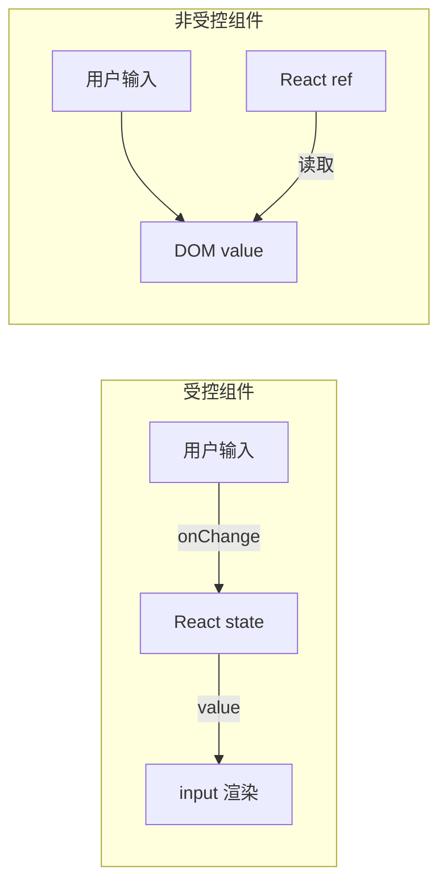
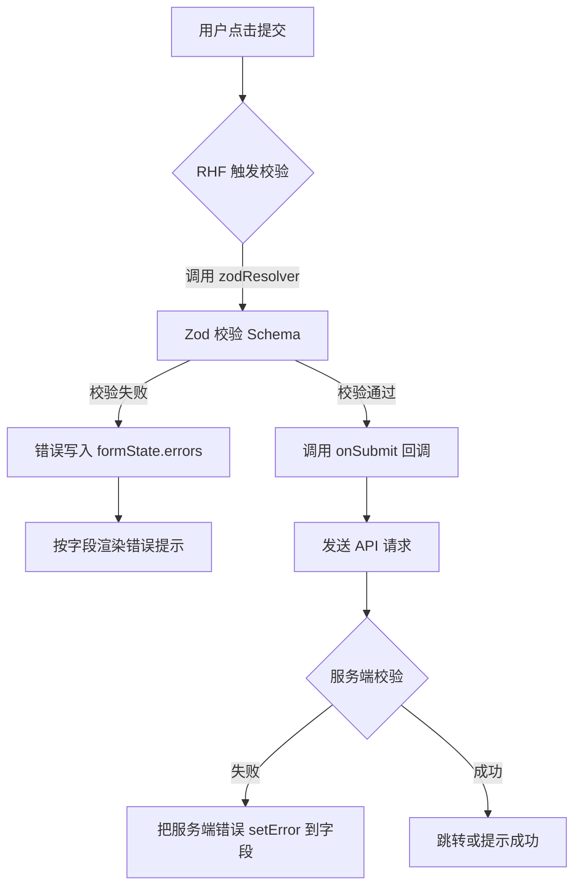

# 第16章 表单处理与数据校验

第15章我们把状态管理讲透了：从状态提升到 Context，再到 Zustand 和 React Query。状态的本质是"数据在时间和组件之间的流动"，而表单是前端应用中最密集、最复杂的状态容器之一。

一份"创建研究报告"的表单，可能同时包含：文本输入、下拉选择、日期范围、多选标签、动态参与人列表、附件上传、富文本描述。这些字段之间还会互相影响：选择了"自定义时间范围"才出现结束日期；选择了"多 Agent 协作"才允许添加多个研究员；开始日期必须早于结束日期。如果每个字段都用 `useState` 自己管，很快会陷入"状态爆炸"和重复校验。

本章的目标是把表单从"手搓状态"提升到"工程化表单"：用 React Hook Form 管理字段，用 Zod 做类型安全的运行时校验，用 React 19 Actions 处理提交。学完这一章，你能搭出生产级表单：高性能、可扩展、对 TypeScript 友好。

## 16.1 受控 vs 非受控组件：选择与性能权衡

### 16.1.1 受控组件：React 是数据唯一来源

受控组件的核心是：**输入框的值由 React 状态驱动，用户的每次输入都先更新状态，再反映到界面**。

```tsx
// 文件: src/frontend/src/features/reports/components/ControlledTopicInput.tsx（教学示例）

import { useState } from 'react'

export function ControlledTopicInput() {
  const [topic, setTopic] = useState('')

  return (
    <input
      type="text"
      value={topic}
      onChange={(e) => setTopic(e.target.value)}
      placeholder="输入研究主题"
    />
  )
}
```

优点：数据完全可控，便于实时校验和字段联动。代价是每次输入都触发 React 重新渲染，长表单性能会下降。

### 16.1.2 非受控组件：DOM 是数据来源

非受控组件把值交给 DOM 自己管理，React 只在需要时读取。典型写法是用 `ref` 获取 DOM，或者用原生 `form` 提交时通过 `FormData` 读取。

```tsx
// 文件: src/frontend/src/features/reports/components/UncontrolledTopicInput.tsx（教学示例）

import { useRef } from 'react'

export function UncontrolledTopicInput() {
  const inputRef = useRef<HTMLInputElement>(null)

  const handleSubmit = () => {
    const value = inputRef.current?.value ?? ''
    console.log('主题:', value)
  }

  return (
    <div>
      <input ref={inputRef} type="text" placeholder="输入研究主题" />
      <button type="button" onClick={handleSubmit}>提交</button>
    </div>
  )
}
```

非受控组件输入响应快、代码少，适合简单搜索框。但联动和实时校验麻烦，不如受控组件自然。

### 16.1.3 数据流向对比



### 16.1.4 何时选受控，何时选非受控

| 场景 | 推荐方式 | 原因 |
|------|----------|------|
| 需要实时校验 | 受控 | 每次输入都能立刻校验并提示 |
| 字段之间存在联动 | 受控 | 状态驱动 UI 变化最自然 |
| 需要自动保存草稿 | 受控 | 状态变化可监听并触发保存 |
| 简单搜索框 | 非受控 | 提交时才需要值，状态管理是负担 |
| 一次性大批量字段 | 非受控 + FormData | 避免大量 state 同步带来的性能损耗 |
| 原生表单提交 | 非受控 | HTML 表单行为已足够 |

> **注意**：受控和非受控不是二选一。一个表单里可以混用：主体字段用受控做精细校验，搜索框用非受控减少开销。

### 16.1.5 React 19 Actions 与 FormData 的结合

React 19 把 Action 提升为一等公民。Action 可以自动接收 `FormData`，让非受控表单也能优雅地提交。

```tsx
// 文件: src/frontend/src/features/reports/components/ActionForm.tsx（教学示例）

import { useActionState } from 'react'

async function createReportAction(
  _prevState: unknown,
  formData: FormData,
) {
  const topic = formData.get('topic') as string
  const depth = formData.get('depth') as string
  console.log('创建报告:', { topic, depth })
  return { ok: true, message: `已创建 ${topic}` }
}

export function ActionForm() {
  const [state, submitAction, isPending] = useActionState(
    createReportAction,
    null,
  )

  return (
    <form action={submitAction}>
      <input name="topic" type="text" placeholder="研究主题" required />
      <select name="depth" defaultValue="medium">
        <option value="shallow">浅度</option>
        <option value="medium">中度</option>
        <option value="deep">深度</option>
      </select>
      <button type="submit" disabled={isPending}>
        {isPending ? '提交中...' : '创建报告'}
      </button>
      {state?.message && <p>{state.message}</p>}
    </form>
  )
}
```

`useActionState` 把 Action 的返回值、pending 状态、提交函数一起管理。但 Action + FormData 的边界也很明显：校验逻辑散落，复杂联动和动态数组用 FormData 读取很啰嗦，错误提示需要手动映射回字段。这正是 React Hook Form + Zod 要解决的问题。

## 16.2 React Hook Form：高性能表单状态管理

### 16.2.1 为什么需要 React Hook Form

React Hook Form（简称 RHF）的理念是：**让非受控组件的性能优势，和受控组件的开发体验同时存在**。

它通过 `ref` 注册字段，而不是把每个字段都绑定到 React state。这样输入时不会触发整棵组件树重渲染，只在提交、校验、显式监听时才读取值。

本章示例会用到 `react-hook-form`、`zod` 和 `@hookform/resolvers`，可以一起安装：

```bash
pnpm add react-hook-form zod @hookform/resolvers
```

如果你还没安装 React Query（第15章已介绍），后面 16.6.4 节的提交示例也会用到：

```bash
pnpm add @tanstack/react-query
```

### 16.2.2 register、handleSubmit、defaultValues 与 reset

`register` 是 RHF 最基础的 API。它返回 `name`、`ref`、`onChange`、`onBlur` 等属性，你把这些属性展开到原生输入组件上即可。`handleSubmit` 会先做校验，校验通过才调用 `onSubmit`。`defaultValues` 设置初始值，`reset` 恢复初始值。

```tsx
// 文件: src/frontend/src/features/reports/components/BasicRHFReportForm.tsx（教学示例）

import { useForm } from 'react-hook-form'

interface ReportFormValues {
  title: string
  topic: string
}

export function BasicRHFReportForm() {
  const { register, handleSubmit, reset } = useForm<ReportFormValues>({
    defaultValues: { title: '未命名报告', topic: '' },
  })

  const onSubmit = (data: ReportFormValues) => {
    console.log('表单数据:', data)
    reset()
  }

  return (
    <form onSubmit={handleSubmit(onSubmit)} className="space-y-2">
      <input {...register('title')} placeholder="报告标题" />
      <input {...register('topic')} placeholder="研究主题" />
      <button type="submit">提交</button>
    </form>
  )
}
```

### 16.2.3 watch 与 Controller

`watch` 用来读取或监听字段值，会让被监听的字段变成"半受控"，组件会随其值变化而重渲染。`Controller` 则用于桥接第三方受控 UI 组件（如 Shadcn UI、MUI）。

```tsx
// 文件: src/frontend/src/features/reports/components/WatchAndController.tsx（教学示例）

import { useForm, Controller } from 'react-hook-form'

interface Values {
  depth: 'shallow' | 'medium' | 'deep'
  model: 'gpt-4o' | 'claude-3-5' | 'kimi-latest'
}

export function WatchAndController() {
  const { register, watch, control } = useForm<Values>({
    defaultValues: { depth: 'medium', model: 'kimi-latest' },
  })

  const depth = watch('depth')

  return (
    <div className="space-y-2">
      <select {...register('depth')}>
        <option value="shallow">浅度</option>
        <option value="medium">中度</option>
        <option value="deep">深度</option>
      </select>
      {depth === 'deep' && <input placeholder="详细章节数" />}

      <Controller
        name="model"
        control={control}
        render={({ field }) => (
          <select value={field.value} onChange={field.onChange}>
            <option value="gpt-4o">GPT-4o</option>
            <option value="claude-3-5">Claude 3.5</option>
            <option value="kimi-latest">Kimi Latest</option>
          </select>
        )}
      />
    </div>
  )
}
```

> **注意**：`watch` 会触发重渲染，不要在不需要监听的字段上滥用。如果只是提交时读取值，`handleSubmit` 已经够用。

### 16.2.4 项目实战：创建研究报告表单（RHF 版）

下面是一个更接近生产环境的"创建研究报告"表单。

```tsx
// 文件: src/frontend/src/features/reports/components/CreateReportFormRHF.tsx（教学示例）

import { useForm, Controller } from 'react-hook-form'
import { Button } from '@/shared/components/Button'

export interface CreateReportFormValues {
  title: string
  topic: string
  depth: 'shallow' | 'medium' | 'deep'
  model: 'gpt-4o' | 'claude-3-5' | 'kimi-latest'
  description: string
}

interface CreateReportFormProps {
  onSubmit: (data: CreateReportFormValues) => void
  isLoading?: boolean
}

export function CreateReportForm({
  onSubmit,
  isLoading,
}: CreateReportFormProps) {
  const { register, handleSubmit, control, formState } =
    useForm<CreateReportFormValues>({
      defaultValues: {
        title: '',
        topic: '',
        depth: 'medium',
        model: 'kimi-latest',
        description: '',
      },
    })

  return (
    <form onSubmit={handleSubmit(onSubmit)} className="space-y-4">
      <div>
        <label htmlFor="title">报告标题</label>
        <input
          id="title"
          {...register('title')}
          placeholder="例如：多智能体协作调研"
          className="w-full rounded border p-2"
        />
        {formState.errors.title && (
          <p className="text-sm text-red-500">{formState.errors.title.message}</p>
        )}
      </div>

      <div>
        <label htmlFor="topic">研究主题</label>
        <input
          id="topic"
          {...register('topic')}
          placeholder="输入核心研究问题"
          className="w-full rounded border p-2"
        />
      </div>

      <div>
        <label htmlFor="depth">研究深度</label>
        <select id="depth" {...register('depth')} className="w-full rounded border p-2">
          <option value="shallow">浅度概览</option>
          <option value="medium">中度分析</option>
          <option value="deep">深度研究</option>
        </select>
      </div>

      <div>
        <label>默认模型</label>
        <Controller
          name="model"
          control={control}
          render={({ field }) => (
            <select value={field.value} onChange={field.onChange} className="w-full rounded border p-2">
              <option value="gpt-4o">GPT-4o</option>
              <option value="claude-3-5">Claude 3.5</option>
              <option value="kimi-latest">Kimi Latest</option>
            </select>
          )}
        />
      </div>

      <div>
        <label htmlFor="description">补充描述</label>
        <textarea
          id="description"
          {...register('description')}
          placeholder="描述报告目标、预期读者、参考资料等"
          className="w-full rounded border p-2"
          rows={4}
        />
      </div>

      <Button type="submit" disabled={isLoading}>
        {isLoading ? '创建中...' : '创建报告'}
      </Button>
    </form>
  )
}
```

这个版本还没有做校验，下一节用 Zod 补上。

## 16.3 Zod Schema 校验：TypeScript 类型的运行时保障

**Zod** 是一个以 Schema 为核心的 TypeScript 校验库。它的核心思想是：先通过链式 API 描述数据应该长什么样（字符串、数字、枚举、对象、数组等），再让同一份 Schema 同时承担两份职责——**运行期校验真实数据**，以及**编译期推断出 TypeScript 类型**。

下面是一个最小示例，先直观感受 Zod 的用法：

```ts
import { z } from 'zod'

const userSchema = z.object({
  name: z.string().min(1, '姓名不能为空'),
  age: z.number().min(0).max(150),
})

// 从 Schema 推断出 TypeScript 类型
type User = z.infer<typeof userSchema>
// 等价于 { name: string; age: number }

// 运行期校验
const result = userSchema.safeParse({ name: 'Alice', age: 30 })
if (result.success) {
  console.log(result.data) // { name: 'Alice', age: 30 }
} else {
  console.log(result.error.issues) // 结构化错误数组
}
```

`z.object(...)` 定义数据形状，`.safeParse(...)` 安全地运行校验并返回成功/失败结果。失败时不会抛异常，而是给出包含字段路径和错误消息的 `issues` 数组。理解了这一点，我们再来看为什么要把它接到表单里。

### 16.3.1 为什么用 Zod

TypeScript 的类型只在编译期存在，运行期用户输入可能是任意值。传统做法是写一堆分散的校验函数，难以复用，也容易和类型定义不同步。

Zod 把类型和校验合二为一：你先定义一个 Schema，Zod 同时提供运行时校验和 TypeScript 推断类型。`zod` 和 `@hookform/resolvers` 已在 16.2 节安装。

### 16.3.2 Schema 定义与中文错误消息

```ts
// 文件: src/frontend/src/features/reports/schemas/reportSchema.ts（教学示例）

import { z } from 'zod'

export const reportSchema = z.object({
  title: z
    .string({ required_error: '报告标题不能为空' })
    .min(2, '标题至少 2 个字符')
    .max(100, '标题最多 100 个字符'),
  topic: z
    .string({ required_error: '研究主题不能为空' })
    .min(1, '请输入研究主题'),
  depth: z.enum(['shallow', 'medium', 'deep'], {
    errorMap: () => ({ message: '请选择有效的研究深度' }),
  }),
  model: z.enum(['gpt-4o', 'claude-3-5', 'kimi-latest'], {
    errorMap: () => ({ message: '请选择有效的模型' }),
  }),
  description: z
    .string()
    .max(2000, '描述最多 2000 个字符')
    .optional(),
})

export type ReportFormData = z.infer<typeof reportSchema>
```

`z.infer` 会自动推导出 TypeScript 类型，这样校验规则和类型定义永远同步。`errorMap` 用于覆盖枚举类型的默认英文错误。

### 16.3.3 接入 RHF：resolver

RHF 通过 `@hookform/resolvers` 把 Zod Schema 接入校验流程。

```tsx
// 文件: src/frontend/src/features/reports/components/CreateReportFormValidated.tsx（教学示例）

import { useForm } from 'react-hook-form'
import { zodResolver } from '@hookform/resolvers/zod'
import { reportSchema, type ReportFormData } from '../schemas/reportSchema'

export function CreateReportFormValidated() {
  const {
    register,
    handleSubmit,
    formState: { errors },
  } = useForm<ReportFormData>({
    resolver: zodResolver(reportSchema),
    defaultValues: {
      title: '',
      topic: '',
      depth: 'medium',
      model: 'kimi-latest',
      description: '',
    },
  })

  const onSubmit = (data: ReportFormData) => {
    console.log('校验通过:', data)
  }

  return (
    <form onSubmit={handleSubmit(onSubmit)} className="space-y-4">
      <div>
        <input {...register('title')} placeholder="报告标题" />
        {errors.title && <p className="text-red-500">{errors.title.message}</p>}
      </div>

      <div>
        <input {...register('topic')} placeholder="研究主题" />
        {errors.topic && <p className="text-red-500">{errors.topic.message}</p>}
      </div>

      <button type="submit">提交</button>
    </form>
  )
}
```

`zodResolver(reportSchema)` 会在 `handleSubmit` 前调用 Zod 校验，错误自动按字段名挂载到 `errors`。

### 16.3.4 refine 与 superRefine：跨字段与自定义规则

`refine` 用于给 Schema 加额外规则。多个 `refine` 链式调用，可以处理跨字段校验。

```ts
// 文件: src/frontend/src/features/reports/schemas/reportSchemaRefined.ts（教学示例）

import { z } from 'zod'

export const reportSchemaRefined = z
  .object({
    title: z.string().min(2, '标题至少 2 个字符'),
    topic: z.string().min(1, '请输入研究主题'),
    hasCustomRange: z.boolean(),
    startDate: z.string().optional(),
    endDate: z.string().optional(),
  })
  .refine(
    (data) => {
      if (!data.hasCustomRange) return true
      return data.startDate && data.endDate
    },
    {
      message: '选择自定义时间范围时，必须填写开始和结束日期',
      path: ['startDate'],
    },
  )
  .refine(
    (data) => {
      if (!data.startDate || !data.endDate) return true
      return new Date(data.startDate) < new Date(data.endDate)
    },
    {
      message: '结束日期必须晚于开始日期',
      path: ['endDate'],
    },
  )
```

`path` 决定错误显示在哪个字段上。下一节会把这个 Schema 用到真实表单里。

### 16.3.5 校验流程图



## 16.4 表单联动：条件字段、动态数组、跨字段验证

### 16.4.1 useFieldArray：动态数组字段

研究报告中经常需要"添加多个研究员"、"添加多个关键词"。`useFieldArray` 专门处理这种动态增删的数组字段。

```tsx
// 文件: src/frontend/src/features/reports/components/ResearcherFieldArray.tsx（教学示例）

import { useForm, useFieldArray } from 'react-hook-form'
import { zodResolver } from '@hookform/resolvers/zod'
import { z } from 'zod'

const schema = z.object({
  title: z.string().min(2),
  researchers: z
    .array(
      z.object({
        name: z.string().min(1, '请输入姓名'),
        role: z.enum(['lead', 'analyst', 'writer'], {
          errorMap: () => ({ message: '请选择角色' }),
        }),
      }),
    )
    .min(1, '至少需要一名研究员'),
})

type Values = z.infer<typeof schema>

export function ResearcherFieldArray() {
  const { register, control, formState, handleSubmit } = useForm<Values>({
    resolver: zodResolver(schema),
    defaultValues: {
      title: '',
      researchers: [{ name: '', role: 'lead' }],
    },
  })

  const { fields, append, remove } = useFieldArray({
    control,
    name: 'researchers',
  })

  const onSubmit = (data: Values) => console.log(data)

  return (
    <form onSubmit={handleSubmit(onSubmit)} className="space-y-4">
      <input {...register('title')} placeholder="报告标题" />

      <div className="space-y-2">
        <h4>研究员列表</h4>
        {fields.map((field, index) => (
          <div key={field.id} className="flex gap-2">
            <input
              {...register(`researchers.${index}.name`)}
              placeholder="姓名"
            />
            <select {...register(`researchers.${index}.role`)}>
              <option value="lead">负责人</option>
              <option value="analyst">分析师</option>
              <option value="writer">写手</option>
            </select>
            <button type="button" onClick={() => remove(index)}>
              删除
            </button>
          </div>
        ))}
        <button
          type="button"
          onClick={() => append({ name: '', role: 'analyst' })}
        >
          添加研究员
        </button>
      </div>

      {formState.errors.researchers?.root && (
        <p className="text-red-500">{formState.errors.researchers.root.message}</p>
      )}

      <button type="submit">提交</button>
    </form>
  )
}
```

`useFieldArray` 的关键点：

- 渲染列表时要用 `field.id` 做 key，保证增删时状态稳定。
- 数组校验错误（如 `min(1)`）挂在 `errors.researchers.root` 上。

### 16.4.2 跨字段验证实战：完整的创建研究任务表单

把条件字段、动态数组、跨字段校验整合起来，得到一个接近生产环境的"创建研究任务"表单。

```tsx
// 文件: src/frontend/src/features/reports/components/CreateResearchTaskForm.tsx（教学示例）

import { useForm, useFieldArray, Controller } from 'react-hook-form'
import { zodResolver } from '@hookform/resolvers/zod'
import { z } from 'zod'
import { Button } from '@/shared/components/Button'

const taskSchema = z
  .object({
    title: z.string().min(2, '标题至少 2 个字符').max(100, '标题最多 100 个字符'),
    topic: z.string().min(1, '请输入研究主题'),
    mode: z.enum(['quick', 'standard', 'deep'], {
      errorMap: () => ({ message: '请选择研究模式' }),
    }),
    hasCustomRange: z.boolean(),
    startDate: z.string().optional(),
    endDate: z.string().optional(),
    researchers: z
      .array(
        z.object({
          name: z.string().min(1, '姓名不能为空'),
          role: z.enum(['lead', 'analyst', 'writer'], {
            errorMap: () => ({ message: '请选择角色' }),
          }),
        }),
      )
      .min(1, '至少需要一名研究员'),
    model: z.enum(['gpt-4o', 'claude-3-5', 'kimi-latest'], {
      errorMap: () => ({ message: '请选择模型' }),
    }),
  })
  .refine(
    (data) => {
      if (!data.hasCustomRange) return true
      return !!data.startDate && !!data.endDate
    },
    { message: '请填写完整的时间范围', path: ['startDate'] },
  )
  .refine(
    (data) => {
      if (!data.startDate || !data.endDate) return true
      return new Date(data.startDate) < new Date(data.endDate)
    },
    { message: '结束日期必须晚于开始日期', path: ['endDate'] },
  )

export type CreateTaskFormData = z.infer<typeof taskSchema>

interface CreateResearchTaskFormProps {
  onSubmit: (data: CreateTaskFormData) => void
  isLoading?: boolean
}

export function CreateResearchTaskForm({
  onSubmit,
  isLoading,
}: CreateResearchTaskFormProps) {
  const {
    register,
    control,
    handleSubmit,
    watch,
    formState: { errors },
  } = useForm<CreateTaskFormData>({
    resolver: zodResolver(taskSchema),
    defaultValues: {
      title: '',
      topic: '',
      mode: 'standard',
      hasCustomRange: false,
      researchers: [{ name: '', role: 'lead' }],
      model: 'kimi-latest',
    },
  })

  const { fields, append, remove } = useFieldArray({
    control,
    name: 'researchers',
  })

  const hasCustomRange = watch('hasCustomRange')

  return (
    <form onSubmit={handleSubmit(onSubmit)} className="space-y-6">
      <div>
        <label htmlFor="title">任务标题</label>
        <input
          id="title"
          {...register('title')}
          className="w-full rounded border p-2"
        />
        {errors.title && <p className="text-sm text-red-500">{errors.title.message}</p>}
      </div>

      <div>
        <label htmlFor="topic">研究主题</label>
        <input
          id="topic"
          {...register('topic')}
          className="w-full rounded border p-2"
        />
        {errors.topic && <p className="text-sm text-red-500">{errors.topic.message}</p>}
      </div>

      <div>
        <label htmlFor="mode">研究模式</label>
        <select id="mode" {...register('mode')} className="w-full rounded border p-2">
          <option value="quick">快速调研</option>
          <option value="standard">标准研究</option>
          <option value="deep">深度研究</option>
        </select>
        {errors.mode && <p className="text-sm text-red-500">{errors.mode.message}</p>}
      </div>

      <div>
        <label className="flex items-center gap-2">
          <input type="checkbox" {...register('hasCustomRange')} />
          自定义时间范围
        </label>
        {hasCustomRange && (
          <div className="mt-2 flex gap-2">
            <input type="date" {...register('startDate')} className="rounded border p-2" />
            <input type="date" {...register('endDate')} className="rounded border p-2" />
          </div>
        )}
        {errors.startDate && (
          <p className="text-sm text-red-500">{errors.startDate.message}</p>
        )}
        {errors.endDate && (
          <p className="text-sm text-red-500">{errors.endDate.message}</p>
        )}
      </div>

      <div>
        <h4 className="mb-2 font-medium">研究员</h4>
        {fields.map((field, index) => (
          <div key={field.id} className="mb-2 flex gap-2">
            <input
              {...register(`researchers.${index}.name`)}
              placeholder="姓名"
              className="rounded border p-2"
            />
            <select {...register(`researchers.${index}.role`)} className="rounded border p-2">
              <option value="lead">负责人</option>
              <option value="analyst">分析师</option>
              <option value="writer">写手</option>
            </select>
            <Button type="button" variant="outline" onClick={() => remove(index)}>
              删除
            </Button>
          </div>
        ))}
        <Button type="button" variant="secondary" onClick={() => append({ name: '', role: 'analyst' })}>
          添加研究员
        </Button>
        {errors.researchers?.root && (
          <p className="text-sm text-red-500">{errors.researchers.root.message}</p>
        )}
      </div>

      <div>
        <label htmlFor="model">默认模型</label>
        <Controller
          name="model"
          control={control}
          render={({ field }) => (
            <select id="model" value={field.value} onChange={field.onChange} className="w-full rounded border p-2">
              <option value="gpt-4o">GPT-4o</option>
              <option value="claude-3-5">Claude 3.5</option>
              <option value="kimi-latest">Kimi Latest</option>
            </select>
          )}
        />
        {errors.model && <p className="text-sm text-red-500">{errors.model.message}</p>}
      </div>

      <Button type="submit" disabled={isLoading}>
        {isLoading ? '创建中...' : '创建研究任务'}
      </Button>
    </form>
  )
}
```

这个表单展示了 RHF + Zod 组合的强大：字段级别的校验由 Zod 自动完成；条件字段的显示由 `watch` 驱动；动态数组字段由 `useFieldArray` 管理；跨字段校验（日期范围）由 `refine` 完成。

> **提示**：如果条件字段逻辑比较复杂，或者只想监听某个字段而不让当前组件重渲染，可以用 `useWatch`。它和 `watch` 的用法类似，但更适合在自定义 Hook 或子组件里订阅单个字段：
>
> ```tsx
> import { useWatch } from 'react-hook-form'
> import type { Control } from 'react-hook-form'
>
> function CustomRangeWatcher({ control }: { control: Control<CreateTaskFormData> }) {
>   const hasCustomRange = useWatch({ control, name: 'hasCustomRange' })
>   return <span>{hasCustomRange ? '已启用自定义范围' : '使用默认时间范围'}</span>
> }
> ```

## 16.5 文件上传组件：拖拽、预览、进度、多文件队列

### 16.5.1 拖拽上传与文件队列

文件输入本身不能真正"受控"：你不能给 `<input type="file" />` 设置 `value`。但你可以监听 `onChange` 拿到 `FileList`，把文件信息存到本地状态。生产环境中的上传组件通常维护一个队列，每个文件有自己的状态：等待中、上传中、已完成、失败。

```tsx
// 文件: src/frontend/src/features/reports/components/AttachmentUploader.tsx（教学示例）

import { useState, useCallback, type ChangeEvent } from 'react'

interface UploadFile {
  id: string
  file: File
  status: 'pending' | 'uploading' | 'done' | 'error'
  progress: number
  previewUrl?: string
}

function generateId() {
  return Math.random().toString(36).slice(2)
}

export function AttachmentUploader() {
  const [queue, setQueue] = useState<UploadFile[]>([])
  const [isDragging, setIsDragging] = useState(false)

  const addFiles = useCallback((files: FileList | null) => {
    if (!files) return
    const newFiles: UploadFile[] = Array.from(files).map((file) => ({
      id: generateId(),
      file,
      status: 'pending',
      progress: 0,
      previewUrl: file.type.startsWith('image/')
        ? URL.createObjectURL(file)
        : undefined,
    }))
    setQueue((prev) => [...prev, ...newFiles])
  }, [])

  const startUpload = useCallback(async () => {
    for (const item of queue) {
      if (item.status !== 'pending') continue
      setQueue((prev) => prev.map((f) => (f.id === item.id ? { ...f, status: 'uploading' } : f)))

      for (let progress = 0; progress <= 100; progress += 20) {
        await new Promise((resolve) => setTimeout(resolve, 200))
        setQueue((prev) => prev.map((f) => f.id === item.id ? { ...f, progress } : f))
      }

      setQueue((prev) => prev.map((f) => f.id === item.id ? { ...f, status: 'done', progress: 100 } : f))
    }
  }, [queue])

  const removeFile = useCallback((id: string) => {
    setQueue((prev) => {
      const item = prev.find((f) => f.id === id)
      if (item?.previewUrl) URL.revokeObjectURL(item.previewUrl)
      return prev.filter((f) => f.id !== id)
    })
  }, [])

  return (
    <div className="space-y-4">
      <div
        onDragOver={(e) => { e.preventDefault(); setIsDragging(true) }}
        onDragLeave={(e) => { e.preventDefault(); setIsDragging(false) }}
        onDrop={(e) => { e.preventDefault(); setIsDragging(false); addFiles(e.dataTransfer.files) }}
        className={`border-2 border-dashed p-6 text-center ${
          isDragging ? 'border-blue-500 bg-blue-50' : 'border-gray-300'
        }`}
      >
        <input
          type="file"
          multiple
          onChange={(e: ChangeEvent<HTMLInputElement>) => addFiles(e.target.files)}
        />
        <p className="text-sm text-gray-500">支持拖拽上传多个附件</p>
      </div>

      <ul className="space-y-2">
        {queue.map((item) => (
          <li key={item.id} className="flex items-center gap-3 rounded border p-2">
            {item.previewUrl && (
              
            )}
            <div className="flex-1">
              <p className="text-sm font-medium">{item.file.name}</p>
              <div className="h-2 w-full rounded bg-gray-200">
                <div className="h-2 rounded bg-blue-500" style={{ width: `${item.progress}%` }} />
              </div>
              <p className="text-xs text-gray-500">
                {item.status === 'done' ? '上传完成' : item.status === 'uploading' ? `上传中 ${item.progress}%` : '等待上传'}
              </p>
            </div>
            <button type="button" onClick={() => removeFile(item.id)} className="text-red-500">删除</button>
          </li>
        ))}
      </ul>

      {queue.some((f) => f.status === 'pending') && (
        <button type="button" onClick={startUpload} className="rounded bg-blue-500 px-4 py-2 text-white">
          开始上传
        </button>
      )}
    </div>
  )
}
```

> **注意**：真实上传请用 `XMLHttpRequest` 或 `axios` 的 `onUploadProgress` 回调来更新进度。模拟进度只是为了教学演示。

### 16.5.2 把上传组件接入 RHF

文件队列通常是表单的子状态，可以用 RHF 的 `Controller` 或自定义注册方式接入。

```tsx
// 文件: src/frontend/src/features/reports/components/ReportFormWithUpload.tsx（教学示例）

import { useForm, Controller } from 'react-hook-form'
import { AttachmentUploader } from './AttachmentUploader'

interface Attachment {
  id: string
  name: string
  url: string
}

interface ReportWithAttachmentsForm {
  title: string
  attachments: Attachment[]
}

export function ReportFormWithUpload() {
  const { control, handleSubmit } = useForm<ReportWithAttachmentsForm>({
    defaultValues: { title: '', attachments: [] },
  })

  const onSubmit = (data: ReportWithAttachmentsForm) => {
    console.log('带附件的报告:', data)
  }

  return (
    <form onSubmit={handleSubmit(onSubmit)} className="space-y-4">
      <Controller
        name="title"
        control={control}
        render={({ field }) => <input {...field} placeholder="报告标题" />}
      />

      <Controller
        name="attachments"
        control={control}
        render={({ field }) => (
          <AttachmentUploader value={field.value} onChange={field.onChange} />
        )}
      />

      <button type="submit">提交</button>
    </form>
  )
}
```

这里仓库里的 `AttachmentUploader.tsx` 已经扩展为同时支持 `value` 和 `onChange`，把上传完成后的附件信息通过 `onChange` 传回 RHF。实际项目中，文件组件往往是"半受控"的：本地队列自己管，但上传完成的附件列表需要同步给表单。

### 16.5.3 文件校验：类型、大小、数量

上传前要做前端校验，避免把明显不合法的请求发给后端。

```ts
// 文件: src/frontend/src/features/reports/utils/fileValidation.ts（教学示例）

export interface FileValidationOptions {
  maxSizeMB?: number
  allowedTypes?: string[]
  maxCount?: number
}

export function validateFiles(
  files: File[],
  options: FileValidationOptions,
): string | null {
  if (options.maxCount && files.length > options.maxCount) {
    return `最多上传 ${options.maxCount} 个文件`
  }

  for (const file of files) {
    if (options.maxSizeMB && file.size > options.maxSizeMB * 1024 * 1024) {
      return `${file.name} 超过 ${options.maxSizeMB}MB 限制`
    }
    if (options.allowedTypes && !options.allowedTypes.includes(file.type)) {
      return `${file.name} 的文件类型不允许`
    }
  }

  return null
}
```

> **注意**：前端校验只是用户体验优化，**后端必须重新校验**。永远不要信任客户端上传的文件。

## 16.6 表单 UX：错误提示、自动保存、提交防抖

### 16.6.1 错误提示策略

错误提示的时机和方式直接影响表单体验。常见的策略有三种：

| 策略 | 触发时机 | 优点 | 缺点 |
|------|----------|------|------|
| 提交时一次性提示 | 点击提交后 | 逻辑简单，不会频繁打扰 | 用户需要滚动找错误 |
| 失焦时提示 | 字段 blur 后 | 及时反馈 | 用户可能还没输完 |
| 输入后延迟提示 | 停止输入一段时间后 | 体验最顺滑 | 实现稍复杂 |

RHF 默认在提交时触发校验，你可以通过 `mode` 配置调整：

```tsx
const { register, formState } = useForm({
  mode: 'onBlur', // 失焦时校验
  // mode: 'onChange', // 输入时校验
  // mode: 'all', // blur 和 change 都校验
})
```

建议长表单用 `onBlur`，短表单用默认的 `onSubmit` 或 `onChange`。

### 16.6.2 错误提示组件化

把错误提示封装成小组件，避免每个字段都写重复的判断逻辑。

```tsx
// 文件: src/frontend/src/features/reports/components/FieldError.tsx（教学示例）

import type { FieldError } from 'react-hook-form'

interface FieldErrorMessageProps {
  error?: FieldError
}

export function FieldErrorMessage({ error }: FieldErrorMessageProps) {
  if (!error) return null
  return <p className="mt-1 text-sm text-red-500">{error.message}</p>
}
```

### 16.6.3 自动保存草稿

研究报告表单往往很长，用户填到一半刷新页面就丢了。自动保存草稿是必需品。实现思路：监听表单值变化，用 debounce 把数据存到 `localStorage` 或后端。下面用一个简单的本地 `debounce` 实现，避免只为一个函数引入 `lodash`。

```tsx
// 文件: src/frontend/src/shared/utils/debounce.ts（教学示例）

export function debounce<T extends (...args: Parameters<T>) => void>(
  fn: T,
  delay: number,
) {
  let timer: ReturnType<typeof setTimeout> | null = null
  return (...args: Parameters<T>) => {
    if (timer) clearTimeout(timer)
    timer = setTimeout(() => fn(...args), delay)
  }
}
```

```tsx
// 文件: src/frontend/src/features/reports/components/AutoSaveDraftForm.tsx（教学示例）

import { useEffect } from 'react'
import { useForm } from 'react-hook-form'
import { debounce } from '@/shared/utils/debounce'

interface DraftValues {
  title: string
  topic: string
  description: string
}

const STORAGE_KEY = 'report-draft'

const saveDraft = debounce((data: DraftValues) => {
  localStorage.setItem(STORAGE_KEY, JSON.stringify(data))
  console.log('草稿已保存', data)
}, 1000)

export function AutoSaveDraftForm() {
  const { register, watch, reset } = useForm<DraftValues>({
    defaultValues: { title: '', topic: '', description: '' },
  })

  useEffect(() => {
    const saved = localStorage.getItem(STORAGE_KEY)
    if (saved) {
      try {
        reset(JSON.parse(saved))
      } catch {
        // 草稿损坏，忽略
      }
    }
  }, [reset])

  useEffect(() => {
    const subscription = watch((value) => {
      saveDraft(value as DraftValues)
    })
    return () => subscription.unsubscribe()
  }, [watch])

  return (
    <form className="space-y-4">
      <input {...register('title')} placeholder="标题" />
      <input {...register('topic')} placeholder="主题" />
      <textarea {...register('description')} placeholder="描述" />
    </form>
  )
}
```

> **注意**：`watch` 返回的是一个订阅对象，记得在 `useEffect` 清理函数里 `unsubscribe()`。否则组件卸载后继续订阅会内存泄漏。

如果草稿需要跨设备同步，应该把 debounce 的保存目标换成后端接口，并在用户重新打开页面时拉取最新草稿。

### 16.6.4 提交防抖与 loading 态

用户双击提交按钮、按回车多次，都可能导致重复提交。除了 UI 上禁用按钮，还可以在逻辑层做防抖或标记。

```tsx
// 文件: src/frontend/src/features/reports/hooks/useDebouncedSubmit.ts（教学示例）

import { useCallback, useRef } from 'react'

export function useDebouncedSubmit<T>(
  onSubmit: (data: T) => Promise<void>,
  delay = 500,
) {
  const isSubmittingRef = useRef(false)

  return useCallback(
    async (data: T) => {
      if (isSubmittingRef.current) return
      isSubmittingRef.current = true
      try {
        await onSubmit(data)
      } finally {
        setTimeout(() => { isSubmittingRef.current = false }, delay)
      }
    },
    [onSubmit, delay],
  )
}
```

这个 Hook 用 `useRef` 标记提交中状态，避免状态更新带来的延迟问题。配合 React Query 使用时：

```tsx
// 文件: src/frontend/src/features/reports/components/SubmitWithMutation.tsx（教学示例）

import { useForm } from 'react-hook-form'
import { useMutation } from '@tanstack/react-query'
import { useDebouncedSubmit } from '../hooks/useDebouncedSubmit'
import type { ReportFormData } from '../schemas/reportSchema'

async function createReport(data: ReportFormData) {
  const res = await fetch('/api/reports', {
    method: 'POST',
    headers: { 'Content-Type': 'application/json' },
    body: JSON.stringify(data),
  })
  if (!res.ok) throw new Error('创建失败')
  return res.json()
}

export function SubmitWithMutation() {
  const { register, handleSubmit } = useForm<ReportFormData>()
  const mutation = useMutation({ mutationFn: createReport })
  const onSubmit = useDebouncedSubmit(
    async (data) => mutation.mutateAsync(data),
    800,
  )

  return (
    <form onSubmit={handleSubmit(onSubmit)}>
      <input {...register('title')} />
      <button type="submit" disabled={mutation.isPending}>
        {mutation.isPending ? '提交中...' : '提交'}
      </button>
      {mutation.isError && <p className="text-red-500">创建失败，请重试</p>}
    </form>
  )
}
```

RHF 本身没有全局 loading 状态，配合 React Query 或 React 19 Actions 都很自然。RHF 负责客户端校验和字段管理，外部状态负责提交和服务器通信。

### 16.6.5 把服务端错误映射到字段

后端校验失败时，通常返回字段级错误。RHF 提供 `setError` 把这些错误挂到对应字段上。

```tsx
// 文件: src/frontend/src/features/reports/utils/mapServerErrors.ts（教学示例）

import type { UseFormSetError, FieldValues, Path } from 'react-hook-form'

interface ServerError {
  field: string
  message: string
}

export function mapServerErrors<T extends FieldValues>(
  errors: ServerError[],
  setError: UseFormSetError<T>,
) {
  for (const err of errors) {
    setError(err.field as Path<T>, {
      type: 'manual',
      message: err.message,
    })
  }
}
```

这样用户看到的是和字段对应的错误，而不是顶部一个笼统的"提交失败"。

### 16.6.6 表单 UX 决策清单

| 检查项 | 是否做到 | 说明 |
|--------|----------|------|
| 实时校验不卡顿 | | 长表单优先用 `onBlur` 或 RHF 默认提交校验 |
| 提交按钮有 loading 态 | | 配合 mutation.isPending 或 useActionState |
| 防止重复提交 | | 禁用按钮 + 防抖锁 |
| 自动保存草稿 | | 长表单建议 localStorage 或后端草稿 |
| 服务端错误可映射到字段 | | 用 setError 提升错误可读性 |
| 文件上传有进度和可取消 | | 复杂上传建议维护独立队列 |
| 无障碍支持 | | label 关联 input，错误用 role="alert" |

## 小结

- 受控组件适合需要实时校验、字段联动的场景；非受控组件适合简单、一次性、追求极致性能的输入。React 19 Actions + FormData 让非受控表单也能优雅提交。
- React Hook Form 通过 `ref` 注册字段，在保持高性能的同时提供受控般的开发体验。核心 API 包括 `register`、`handleSubmit`、`watch`、`Controller`、`useFieldArray`、`reset`。
- Zod 把 TypeScript 类型和运行时校验合二为一。通过 `@hookform/resolvers` 接入 RHF 后，校验错误自动映射到字段。`refine` 和 `superRefine` 可以处理跨字段校验。
- 表单联动的三大武器是：`watch`/`useWatch` 做条件字段、`useFieldArray` 做动态数组、`refine` 做跨字段验证。
- 文件上传组件需要独立管理队列，处理拖拽、预览、进度、多文件状态。前端校验后，后端必须重新校验。
- 表单 UX 要在错误提示时机、自动保存草稿、提交防抖、loading 状态、服务端错误映射之间找到平衡。RHF 和 React 19 Actions / React Query 可以协同工作。

下一章（第17章）我们将进入 React Router v7 与导航系统：声明式路由、嵌套布局、路由参数、导航守卫与代码分割。

## 练习

1. 把本章的 `CreateResearchTaskForm` 接入 React Query 的 `useMutation`，实现提交 loading 态和错误提示。
2. 用 `superRefine` 实现一个规则：当 `mode` 为 `deep` 时，`description` 必填且不少于 100 个字符。
3. 改造 `AttachmentUploader`，让它支持点击上传队列中的某个文件"重新上传"，并在上传失败时显示重试按钮。
4. 为长表单实现自动保存草稿功能：表单变化后 2 秒自动保存到 `localStorage`，页面刷新后自动恢复，提交成功后清空草稿。
5. 对比 RHF + Zod 和纯 React 19 Actions + FormData 两种方案，列出各自最适合的 3 个场景，并说明在你的项目中会如何取舍。
