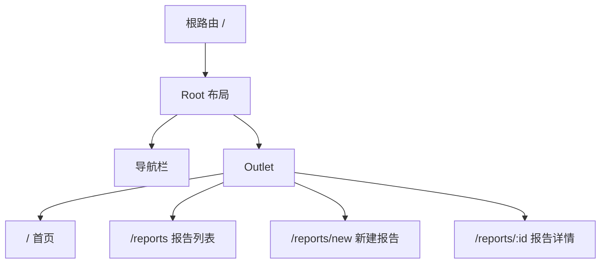

# 第17章 React Router v7 与导航系统

第16章我们把表单处理与数据校验讲透了：从受控/非受控组件、React Hook Form、Zod，到文件上传和表单 UX。一个真实应用不可能只有一个页面——用户需要在"报告列表"、"报告详情"、"新建报告"、"设置"之间跳转。**路由**就是前端应用的"交通网络"，它决定用户在某个 URL 下看到什么、能访问什么。

本章我们把当前单页前端扩展成多页面应用。学习目标很明确：

- 掌握 React Router v7 的声明式路由与数据 API 路由；
- 用嵌套路由和布局路由复用导航栏、侧边栏；
- 用路由参数、查询参数和状态传递实现报告详情、筛选条件、登录回跳；
- 用导航守卫做认证检查与权限拦截；
- 用懒加载和滚动管理提升路由体验。

## 17.1 路由配置：声明式与数据 API 路由

### 17.1.1 安装 React Router v7

React Router v7 分为**框架模式**和**库模式**。框架模式需要服务端构建、路由模块约定、数据流约定，适合全栈应用；**库模式**就是我们熟悉的 SPA 路由 API，直接在 Vite 里使用。

本书前端采用 Vite + SPA，所以使用库模式：

```bash
pnpm add react-router-dom
```

安装后，我们可以从 `react-router-dom` 导入路由器、路由组件和 Hooks。

### 17.1.2 声明式路由：BrowserRouter + Routes + Route

最直观的路由写法是声明式：用 `<BrowserRouter>` 包裹应用，用 `<Routes>` 匹配唯一路由，用 `<Route>` 定义路径与组件的映射。

```tsx
// 文件: src/frontend/src/App.tsx（教学示例：声明式路由）

import { BrowserRouter, Routes, Route, Link } from 'react-router-dom'
import { ReportList } from '@/features/reports'

function Home() {
  return (
    <div>
      <h1>深度研究与报告平台</h1>
      <p>欢迎使用 Go + React + AI 全栈应用。</p>
    </div>
  )
}

export default function App() {
  return (
    <BrowserRouter>
      <nav style={{ display: 'flex', gap: '1rem', padding: '1rem 0' }}>
        <Link to="/">首页</Link>
        <Link to="/reports">报告列表</Link>
        <Link to="/reports/new">新建报告</Link>
      </nav>

      <Routes>
        <Route path="/" element={<Home />} />
        <Route path="/reports" element={<ReportList />} />
      </Routes>
    </BrowserRouter>
  )
}
```

`Link` 是 React Router 提供的声明式导航组件，它最终渲染成 `<a>`，但点击时通过前端路由切换页面，不会触发整页刷新。

> **注意**：不要在 React Router 应用里用原生的 `<a href="/reports">`。原生链接会让浏览器重新请求 HTML，破坏 SPA 体验。

### 17.1.3 数据 API 路由：createBrowserRouter + RouterProvider

声明式路由简单易懂，但 React Router v7 更推荐使用 **数据 API**：把路由定义为一个对象树，用 `createBrowserRouter` 创建路由器，再用 `RouterProvider` 提供给应用。

```tsx
// 文件: src/frontend/src/routes.tsx（教学示例：数据 API 路由）

import { createBrowserRouter } from 'react-router-dom'
import { Root } from './routes/root'
import { HomePage } from './routes/HomePage'
import { ReportsPage } from '@/features/reports/pages/ReportsPage'
import { CreateReportPage } from '@/features/reports/pages/CreateReportPage'
import { ReportDetailPage } from '@/features/reports/pages/ReportDetailPage'

export const router = createBrowserRouter([
  {
    path: '/',
    element: <Root />,
    children: [
      { index: true, element: <HomePage /> },
      { path: 'reports', element: <ReportsPage /> },
      { path: 'reports/new', element: <CreateReportPage /> },
      { path: 'reports/:id', element: <ReportDetailPage /> },
    ],
  },
])
```

```tsx
// 文件: src/frontend/src/main.tsx（教学示例）

import { StrictMode } from 'react'
import { createRoot } from 'react-dom/client'
import { RouterProvider } from 'react-router-dom'
import { router } from './routes'

createRoot(document.getElementById('root')!).render(
  <StrictMode>
    <RouterProvider router={router} />
  </StrictMode>
)
```

数据 API 的优势：

- 路由定义是**纯数据**，便于测试、类型化、动态生成；
- 支持 `loader`（路由加载数据）、`action`（处理表单提交）、`errorElement`（错误边界）等声明式能力；
- 与 React Router v7 的框架模式语法更接近，未来迁移成本更低。

### 17.1.4 两种路由风格对比

| 维度      | BrowserRouter + Routes             | createBrowserRouter + RouterProvider     |
| --------- | ---------------------------------- | ---------------------------------------- |
| 学习曲线  | 低，接近 JSX 直觉                  | 中，需要理解 loader/action/errorElement  |
| 数据获取  | 在组件内用 useEffect / React Query | 可在 loader 中预取，组件用 useLoaderData |
| 错误处理  | 需自己写 Error Boundary            | errorElement 直接挂在路由上              |
| 类型化    | 一般                               | 路由对象天然适合类型推导                 |
| v7 推荐度 | 兼容可用                           | 更推荐                                   |

本书的教学示例以数据 API 为主，但会在关键位置说明声明式写法如何对应。

### 17.1.5 项目实战：基础路由配置

把前面的声明式写法升级到数据 API，并加入真实页面。我们首先需要一个根布局 `Root`，让所有页面共享导航栏。

```tsx
// 文件: src/frontend/src/routes/root.tsx（教学示例）

import { Outlet, Link } from 'react-router-dom'

export function Root() {
  return (
    <div style={{ minHeight: '100vh' }}>
      <header
        style={{
          borderBottom: '1px solid #e5e7eb',
          padding: '1rem',
        }}
      >
        <nav style={{ display: 'flex', gap: '1.5rem' }}>
          <Link to="/">首页</Link>
          <Link to="/reports">报告列表</Link>
          <Link to="/reports/new">新建报告</Link>
          <Link to="/settings">设置</Link>
        </nav>
      </header>

      <main style={{ padding: '1.5rem' }}>
        <Outlet />
      </main>
    </div>
  )
}
```

`<Outlet />` 是 React Router 的占位符：父路由渲染的组件会在这里插入子路由匹配的组件。下一节会详细讲嵌套路由。

### 17.1.6 数据预取：loader 与 useLoaderData

17.1.4 的对比表提到，数据 API 路由可以在 `loader` 中预取数据。下面看个具体例子：进入 `/reports` 之前，先把报告列表请求好，组件直接用 `useLoaderData` 渲染。

```tsx
// routes.tsx 片段

import type { Report } from '@/features/reports/types'

export const router = createBrowserRouter([
  {
    path: '/',
    element: <Root />,
    children: [
      {
        path: 'reports',
        element: <ReportsPageWithLoader />,
        loader: async () => {
          const res = await fetch('/api/reports')
          if (!res.ok) throw new Error('加载报告列表失败')
          const payload = await res.json()
          return payload.data as Report[]
        },
      },
    ],
  },
])
```

```tsx
// 文件: src/frontend/src/features/reports/pages/ReportsPageWithLoader.tsx（教学示例）

import { useLoaderData } from 'react-router-dom'
import type { Report } from '../types'

export function ReportsPageWithLoader() {
  const reports = useLoaderData() as Report[]

  return (
    <div>
      <h1>报告列表（loader 预取）</h1>
      <ul>
        {reports.map((report) => (
          <li key={report.id}>{report.title}</li>
        ))}
      </ul>
    </div>
  )
}
```

`loader` 的优势：

- **数据在渲染前就位**：组件挂载时已经有数据，首屏不会出现"加载中..."；
- **错误自动走 errorElement**：`loader` 里抛出的错误会被最近的路由 `errorElement` 捕获；
- **与 React Query 不冲突**：`loader` 适合做首屏预取，React Query 适合做后台刷新、乐观更新、缓存管理。

本书后续项目实战仍主要用 React Query / `useEffect` 获取数据，因为这样能和第15、16章的写法自然衔接。你在真实项目里可以根据场景选择：首屏关键数据用 `loader`，复杂客户端状态用 React Query。

## 17.2 嵌套路由、布局路由与错误边界

### 17.2.1 Outlet 与嵌套路由

嵌套路由让我们可以把 UI 拆成"稳定的外壳"和"变化的内容"。典型结构是：



在 `routes.tsx` 中，`Root` 作为父路由，`children` 中的每个子路由都会渲染在 `<Outlet />` 的位置。

### 17.2.2 布局路由：无 path 的父路由

有时候我们只想复用布局，不想给父路径额外占一个 URL。这时可以用**无 path 布局路由**：

```tsx
{
  element: <SidebarLayout />,
  children: [
    { path: 'reports', element: <ReportsPage /> },
    { path: 'settings', element: <SettingsPage /> },
  ],
}
```

`SidebarLayout` 不需要 `path`，它只为子路由提供共享布局。访问 `/reports` 时，URL 不变，但会同时渲染 `SidebarLayout` 和 `ReportsPage`。

### 17.2.3 错误边界：errorElement

React Router v7 允许给路由挂 `errorElement`，当该路由或其子路由抛错时显示兜底 UI。

```tsx
// 文件: src/frontend/src/routes/RouteError.tsx（教学示例）

import { useRouteError, isRouteErrorResponse } from 'react-router-dom'

export function RouteError() {
  const error = useRouteError()

  if (isRouteErrorResponse(error)) {
    return (
      <div style={{ padding: '2rem', color: '#dc2626' }}>
        <h1>{error.status}</h1>
        <p>{error.statusText}</p>
      </div>
    )
  }

  return (
    <div style={{ padding: '2rem', color: '#dc2626' }}>
      <h1>出错了</h1>
      <p>{error instanceof Error ? error.message : '未知错误'}</p>
    </div>
  )
}
```

```tsx
import { RouteError } from './routes/RouteError'

export const router = createBrowserRouter([
  {
    path: '/',
    element: <Root />,
    errorElement: <RouteError />,
    children: [
      { index: true, element: <HomePage /> },
      { path: 'reports', element: <ReportsPage /> },
    ],
  },
])
```

> **注意**：`errorElement` 只捕获路由树内的渲染错误和 loader/action 错误。组件内部的事件处理错误（如 onClick 里的异步错误）不会被捕获，仍需用 React 的 Error Boundary 或 try/catch 处理。

### 17.2.4 项目实战：带侧边栏的报告中心布局

研究报告平台通常有一个"报告中心"，左侧是导航，右侧是内容。我们用嵌套路由实现：

```tsx
// 文件: src/frontend/src/features/reports/pages/ReportCenterLayout.tsx（教学示例）

import { Outlet, Link } from 'react-router-dom'

export function ReportCenterLayout() {
  return (
    <div style={{ display: 'grid', gridTemplateColumns: '200px 1fr', gap: '1.5rem' }}>
      <aside style={{ borderRight: '1px solid #e5e7eb', paddingRight: '1rem' }}>
        <nav style={{ display: 'flex', flexDirection: 'column', gap: '0.75rem' }}>
          <Link to="/reports">全部报告</Link>
          <Link to="/reports/new">新建报告</Link>
        </nav>
      </aside>

      <section>
        <Outlet />
      </section>
    </div>
  )
}
```

```tsx
// routes.tsx 片段
{
  path: '/',
  element: <Root />,
  children: [
    { index: true, element: <HomePage /> },
    {
      path: 'reports',
      element: <ReportCenterLayout />,
      children: [
        { index: true, element: <ReportsPage /> },
        { path: 'new', element: <CreateReportPage /> },
        { path: ':id', element: <ReportDetailPage /> },
      ],
    },
  ],
}
```

## 17.3 路由参数、查询参数、状态传递

### 17.3.1 路由参数：useParams

当 URL 是 `/reports/123` 时，`123` 是动态参数。React Router 用 `:id` 声明参数，用 `useParams` 读取。

```tsx
// 文件: src/frontend/src/features/reports/pages/ReportDetailPage.tsx（教学示例）

import { useParams, Link } from 'react-router-dom'
import { ReportDetail } from '../components/ReportDetail'

export function ReportDetailPage() {
  const { id } = useParams<{ id: string }>()

  if (!id) {
    return <div>缺少报告 ID</div>
  }

  return (
    <div>
      <Link to="/reports">← 返回列表</Link>
      <h1 style={{ marginTop: '1rem' }}>报告详情</h1>
      <ReportDetail reportId={id} />
    </div>
  )
}
```

```tsx
// 文件: src/frontend/src/features/reports/components/ReportDetail.tsx（教学示例）

import { useEffect, useState } from 'react'
import type { Report } from '../types'

interface Props {
  reportId: string
}

export function ReportDetail({ reportId }: Props) {
  const [report, setReport] = useState<Report | null>(null)
  const [loading, setLoading] = useState(true)
  const [error, setError] = useState<string | null>(null)

  useEffect(() => {
    fetch(`/api/reports/${reportId}`)
      .then((res) => {
        if (!res.ok) throw new Error(`HTTP ${res.status}`)
        return res.json()
      })
      .then((data) => setReport(data.data))
      .catch((err) => setError(err instanceof Error ? err.message : '未知错误'))
      .finally(() => setLoading(false))
  }, [reportId])

  if (loading) return <div>加载中...</div>
  if (error) return <div style={{ color: 'red' }}>错误: {error}</div>
  if (!report) return <div>报告不存在</div>

  return (
    <div>
      <h2>{report.title}</h2>
      <p>主题: {report.topic}</p>
      <p>状态: {report.status}</p>
    </div>
  )
}
```

> **注意**：`useParams` 返回的总是字符串。如果后端需要数字 ID，记得在请求前转换：`Number(id)`。

### 17.3.2 查询参数：useSearchParams

查询参数常用于筛选、分页、搜索关键词。React Router 提供 `useSearchParams`，用法类似 `useState`，但同步的是 URL 的 `?keyword=ai&page=2`。

```tsx
// 文件: src/frontend/src/features/reports/components/ReportSearch.tsx（教学示例）

import { useSearchParams } from 'react-router-dom'

export function ReportSearch() {
  const [searchParams, setSearchParams] = useSearchParams()
  const keyword = searchParams.get('keyword') || ''

  const handleChange = (value: string) => {
    setSearchParams((prev) => {
      if (value) {
        prev.set('keyword', value)
      } else {
        prev.delete('keyword')
      }
      return prev
    })
  }

  return (
    <input
      value={keyword}
      onChange={(e) => handleChange(e.target.value)}
      placeholder="搜索报告"
      className="w-full rounded border p-2"
    />
  )
}
```

把筛选条件放在 URL 里的好处：

- 刷新页面后筛选不丢失；
- 可以直接复制链接分享；
- 浏览器前进/后退可以记录筛选历史。

### 17.3.3 状态传递：useLocation 与 navigate state

有时候我们不想把某些信息暴露在 URL 上，比如"从哪个页面跳转过来"、"登录后回跳到哪"。这时可以用路由的 `state`。

```tsx
import { useNavigate } from 'react-router-dom'

function ReportCard({ report }: { report: Report }) {
  const navigate = useNavigate()

  return (
    <div
      onClick={() =>
        navigate(`/reports/${report.id}`, {
          state: { from: '/reports' },
        })
      }
      style={{ cursor: 'pointer' }}
    >
      {report.title}
    </div>
  )
}
```

```tsx
import { useLocation } from 'react-router-dom'

function ReportDetailPage() {
  const location = useLocation()
  const from = (location.state as { from?: string } | null)?.from

  return (
    <div>
      {from && <p>来自: {from}</p>}
      {/* ... */}
    </div>
  )
}
```

> **注意**：`location.state` 只在通过 React Router 导航时存在。如果用户直接输入 URL 访问，`state` 为 `null`，必须做兜底处理。

### 17.3.4 项目实战：带筛选的报告列表

把 `ReportSearch` 和 `ReportList` 组合起来。列表组件读取 `keyword` 查询参数，实现前端过滤（真实场景应发给后端）。

```tsx
// 文件: src/frontend/src/features/reports/pages/ReportsPage.tsx（教学示例）

import { useSearchParams } from 'react-router-dom'
import { ReportSearch } from '../components/ReportSearch'
import { ReportList } from '../components/ReportList'

export function ReportsPage() {
  const [searchParams] = useSearchParams()
  const keyword = searchParams.get('keyword') || ''

  return (
    <div>
      <h1 style={{ marginBottom: '1rem' }}>报告列表</h1>
      <div style={{ marginBottom: '1rem' }}>
        <ReportSearch />
      </div>
      <ReportList keyword={keyword} />
    </div>
  )
}
```

为了让这个页面跑起来，我们把 `ReportList` 改造成了接收 `keyword` prop 并做前端过滤（真实场景应把关键词发给后端）。源码已同步到 `src/frontend/src/features/reports/components/ReportList.tsx`，你也可以在课后练习里换成服务端过滤。

## 17.4 导航守卫：认证检查、权限拦截、重定向

### 17.4.1 为什么需要导航守卫

不是所有页面都对所有人开放。研究报告平台里：

- `/reports/new` 只有登录用户能访问；
- `/settings` 可能只有管理员能访问；
- 未登录用户访问受保护页面应该被重定向到登录页，登录成功后再跳回来。

这些就是**导航守卫**的职责。

### 17.4.2 RequireAuth 组件：认证检查

最简洁的实现是一个高阶组件（或布局组件），在渲染子内容前先检查登录状态。本节示例依赖的 `useAuth` Hook 会在 17.4.5 小节给出最小实现，它负责提供 `isAuthenticated`、`user`、`login`、`logout` 等状态和方法。

```tsx
// 文件: src/frontend/src/features/auth/components/RequireAuth.tsx（教学示例）

import { Navigate, useLocation } from 'react-router-dom'
import { useAuth } from '../hooks/useAuth'

interface Props {
  children: React.ReactNode
}

export function RequireAuth({ children }: Props) {
  const { isAuthenticated } = useAuth()
  const location = useLocation()

  if (!isAuthenticated) {
    return <Navigate to="/login" state={{ from: location.pathname }} replace />
  }

  return <>{children}</>
}
```

```tsx
// routes.tsx 片段
{
  path: 'reports/new',
  element: (
    <RequireAuth>
      <CreateReportPage />
    </RequireAuth>
  ),
}
```

`<Navigate>` 是 React Router 的声明式重定向组件。`replace` 表示用新地址替换当前历史记录，避免用户点后退时再次触发守卫循环。

### 17.4.3 登录后回跳

守卫把原始路径通过 `state.from` 传给登录页。登录成功后读取它并跳转回去：

```tsx
// 文件: src/frontend/src/features/auth/pages/LoginPage.tsx（教学示例）

import { useNavigate, useLocation } from 'react-router-dom'
import { useAuth } from '../hooks/useAuth'

export function LoginPage() {
  const navigate = useNavigate()
  const location = useLocation()
  const { login } = useAuth()

  const from = (location.state as { from?: string })?.from || '/'

  const handleLogin = async () => {
    await login()
    navigate(from, { replace: true })
  }

  return (
    <div>
      <h1>登录</h1>
      <button onClick={handleLogin}>模拟登录</button>
      <p>登录后将跳转至: {from}</p>
    </div>
  )
}
```

### 17.4.4 权限拦截：RequireRole

如果系统有角色概念（比如 lead / analyst / writer），可以进一步做角色拦截：

```tsx
// 文件: src/frontend/src/features/auth/components/RequireRole.tsx（教学示例）

import { Navigate, useLocation } from 'react-router-dom'
import { useAuth } from '../hooks/useAuth'

interface Props {
  allowedRoles: string[]
  children: React.ReactNode
}

export function RequireRole({ allowedRoles, children }: Props) {
  const { user } = useAuth()
  const location = useLocation()

  if (!user) {
    return <Navigate to="/login" state={{ from: location.pathname }} replace />
  }

  if (!allowedRoles.includes(user.role)) {
    return <div>权限不足</div>
  }

  return <>{children}</>
}
```

> **注意**：前端权限拦截只能提升用户体验，**真正的权限校验必须在后端完成**。第9章已经实现了 RBAC，第38章会升级到 Casbin/OPA 动态策略引擎。

### 17.4.5 useAuth Hook：登录状态的统一封装

```tsx
// 文件: src/frontend/src/features/auth/hooks/useAuth.ts（教学示例）

import { useState, useCallback } from 'react'

interface User {
  id: string
  name: string
  role: 'admin' | 'lead' | 'analyst'
}

export function useAuth() {
  const [user, setUser] = useState<User | null>(null)

  const login = useCallback(async () => {
    // 实际项目这里调用 /api/auth/login
    setUser({ id: '1', name: 'Alice', role: 'lead' })
  }, [])

  const logout = useCallback(() => {
    setUser(null)
  }, [])

  return {
    user,
    isAuthenticated: !!user,
    login,
    logout,
  }
}
```

> **提示**：真实项目里，`user` 通常来自第15章的 Zustand store 或 React Query，而不是本地 useState。这里用 useState 是为了教学示例最小化。

## 17.5 代码分割与懒加载：路由级按需加载

### 17.5.1 为什么需要懒加载

随着应用变大，把所有页面打包成一个 JS 文件会导致首屏加载变慢。理想情况下，用户访问首页时只加载首页代码，访问报告详情页时再加载详情页代码。

React 提供 `React.lazy` + `Suspense` 实现组件级懒加载。React Router 则天然适合按路由拆分。

### 17.5.2 React.lazy + Suspense 基础

```tsx
import { lazy, Suspense } from 'react'

const HeavyChart = lazy(() => import('./HeavyChart'))

function Dashboard() {
  return (
    <Suspense fallback={<div>加载图表中...</div>}>
      <HeavyChart />
    </Suspense>
  )
}
```

`lazy` 接收一个返回动态 import 的函数，组件只有在渲染时才会加载。`Suspense` 的 `fallback` 会在加载期间显示。

### 17.5.3 路由级懒加载

把懒加载和路由对象结合：

```tsx
// 文件: src/frontend/src/routes.tsx（教学示例：懒加载版）

import { lazy, Suspense } from 'react'
import { createBrowserRouter, Outlet } from 'react-router-dom'

const HomePage = lazy(() => import('./routes/HomePage'))
const ReportsPage = lazy(() => import('@/features/reports/pages/ReportsPage'))
const CreateReportPage = lazy(() => import('@/features/reports/pages/CreateReportPage'))
const ReportDetailPage = lazy(() => import('@/features/reports/pages/ReportDetailPage'))

function LazyWrapper({ children }: { children: React.ReactNode }) {
  return <Suspense fallback={<div>页面加载中...</div>}>{children}</Suspense>
}

export const router = createBrowserRouter([
  {
    path: '/',
    element: <Root />,
    children: [
      {
        index: true,
        element: (
          <LazyWrapper>
            <HomePage />
          </LazyWrapper>
        ),
      },
      {
        path: 'reports',
        element: (
          <LazyWrapper>
            <ReportsPage />
          </LazyWrapper>
        ),
      },
      // ... 其他路由
    ],
  },
])
```

> **注意**：被 `lazy` 导入的组件必须默认导出（`export default`）。命名导出需要额外包装，所以路由页面通常写成默认导出。

### 17.5.4 项目实战：按需加载报告中心

实际项目中，我们会给整个"报告中心"模块一个懒加载边界：

```tsx
const ReportCenterRoutes = lazy(() => import('./features/reports/routes/ReportCenterRoutes'))

export const router = createBrowserRouter([
  {
    path: '/',
    element: <Root />,
    children: [
      { index: true, element: <HomePage /> },
      {
        path: 'reports/*',
        element: (
          <Suspense fallback={<div>加载报告中心...</div>}>
            <ReportCenterRoutes />
          </Suspense>
        ),
      },
    ],
  },
])
```

```tsx
// 文件: src/frontend/src/features/reports/routes/ReportCenterRoutes.tsx（教学示例）

import { Routes, Route } from 'react-router-dom'
import { ReportCenterLayout } from '../pages/ReportCenterLayout'
import { ReportsPage } from '../pages/ReportsPage'
import { CreateReportPage } from '../pages/CreateReportPage'
import { ReportDetailPage } from '../pages/ReportDetailPage'

export default function ReportCenterRoutes() {
  return (
    <Routes>
      <Route element={<ReportCenterLayout />}>
        <Route index element={<ReportsPage />} />
        <Route path="new" element={<CreateReportPage />} />
        <Route path=":id" element={<ReportDetailPage />} />
      </Route>
    </Routes>
  )
}
```

这里混用了 `<Routes>`（声明式）和 `createBrowserRouter`（数据 API）：外层用数据 API 做顶层拆分，内层用声明式做模块内部路由。这种"混合模式"在大型应用中很常见。

## 17.6 滚动管理与页面过渡动画

### 17.6.1 滚动恢复

SPA 切换路由时，浏览器不会自动滚动到页面顶部。React Router 提供 `<ScrollRestoration>` 组件，可以自动把滚动位置恢复到之前的状态。

```tsx
// main.tsx 片段
import { RouterProvider, ScrollRestoration } from 'react-router-dom'

// 在 Root 布局里使用
function Root() {
  return (
    <div>
      <ScrollRestoration />
      <nav>...</nav>
      <Outlet />
    </div>
  )
}
```

如果你想在每次路由切换时强制回到顶部，可以写一个简单的 Hook：

```tsx
// 文件: src/frontend/src/shared/hooks/useScrollToTop.ts（教学示例）

import { useEffect } from 'react'
import { useLocation } from 'react-router-dom'

export function useScrollToTop() {
  const { pathname } = useLocation()

  useEffect(() => {
    window.scrollTo({ top: 0, behavior: 'smooth' })
  }, [pathname])
}
```

在布局组件里调用即可。

### 17.6.2 页面过渡动画

页面切换动画可以提升体验，但实现时要谨慎：React 的协调机制会让旧组件直接卸载，要做过渡通常需要同时保留新旧两个页面。一个简单的淡入效果可以用 CSS：

```css
/* src/frontend/src/index.css 片段 */

.page-enter {
  opacity: 0;
}

.page-enter-active {
  opacity: 1;
  transition: opacity 300ms ease-in;
}
```

```tsx
function AnimatedOutlet() {
  const location = useLocation()

  return (
    <div key={location.pathname} className="page-enter page-enter-active">
      <Outlet />
    </div>
  )
}
```

> **注意**：复杂过渡（如滑动、同时保留新旧页面）建议用 `react-transition-group` 或 `Framer Motion`。本章只做概念演示，第19章讲 Shadcn UI 与动画时会再深入。

### 17.6.3 项目实战：平滑滚动 + 简单淡入

把滚动恢复和淡入结合到 `Root` 布局：

```tsx
// 文件: src/frontend/src/routes/root.tsx（更新版教学示例）

import { Outlet, Link, ScrollRestoration, useLocation } from 'react-router-dom'
import { useEffect } from 'react'

export function Root() {
  const { pathname } = useLocation()

  useEffect(() => {
    window.scrollTo({ top: 0, behavior: 'smooth' })
  }, [pathname])

  return (
    <div style={{ minHeight: '100vh' }}>
      <ScrollRestoration />
      <header style={{ borderBottom: '1px solid #e5e7eb', padding: '1rem' }}>
        <nav style={{ display: 'flex', gap: '1.5rem' }}>
          <Link to="/">首页</Link>
          <Link to="/reports">报告列表</Link>
          <Link to="/reports/new">新建报告</Link>
          <Link to="/settings">设置</Link>
        </nav>
      </header>

      <main
        key={pathname}
        style={{
          padding: '1.5rem',
          animation: 'fadeIn 300ms ease-in',
        }}
      >
        <Outlet />
      </main>

      <style>{`
        @keyframes fadeIn {
          from { opacity: 0; transform: translateY(8px); }
          to { opacity: 1; transform: translateY(0); }
        }
      `}</style>
    </div>
  )
}
```

> **注意**：用 `key={pathname}` 触发 React 重新创建 `main` 元素，动画才会在每次路由切换时播放。如果性能敏感，应使用更专业的动画库。

## 17.7 路由设计决策清单

| 检查项                        | 建议                                                        |
| ----------------------------- | ----------------------------------------------------------- |
| 顶层路由用数据 API 还是声明式 | 推荐 `createBrowserRouter`，便于 loader/errorElement/懒加载 |
| 共享布局用 Outlet 还是 HOC    | 用 `<Outlet />` 嵌套路由，语义更清晰                        |
| 认证守卫放在哪一层            | 放在需要保护的具体路由上，而不是全局                        |
| 查询参数 vs state             | 可分享、可持久化的用查询参数；临时上下文用 state            |
| 懒加载边界怎么切              | 按功能模块切（报告中心、设置、AI 面板），不要太细           |
| 滚动行为                      | 长列表用 `ScrollRestoration`，简单场景用 `useScrollToTop`   |

## 小结

- React Router v7 库模式适合 Vite + SPA 项目。声明式路由（`<BrowserRouter>` + `<Routes>`）直观，数据 API 路由（`createBrowserRouter` + `RouterProvider`）更强大、更可扩展。
- 嵌套路由通过 `<Outlet />` 复用导航栏、侧边栏等布局；无 path 的父路由只做布局包装。
- `errorElement` 可以给路由树挂错误边界，统一处理渲染和 loader/action 错误。
- `useParams` 读取路由参数，`useSearchParams` 读写查询参数，`location.state` / `navigate(..., { state })` 传递不暴露URL的临时状态。
- 导航守卫用 `<RequireAuth>` / `<RequireRole>` 等高阶组件实现，登录后通过 `state.from` 回跳。前端守卫只是体验优化，后端必须做最终鉴权。
- `React.lazy` + `Suspense` 实现路由级代码分割，按功能模块切分懒加载边界最合理。
- 滚动恢复用 `<ScrollRestoration>` 或自定义 `useScrollToTop`；简单过渡动画可用 CSS keyframes，复杂场景交给专业动画库。

下一章（第18章）我们将进入 Tailwind CSS 与设计系统构建：Utility-First 哲学、设计令牌、响应式布局与暗色模式。

## 练习

1. 把 `src/frontend/src/App.tsx` 改造成数据 API 路由，包含 `/`、 `/reports`、 `/reports/new`、 `/reports/:id` 四个路由，并用 `Root` 布局共享导航栏。
2. 给 `ReportList` 添加 `keyword` prop，让它根据查询参数 `?keyword=xxx` 做前端过滤（提示：用 `useSearchParams`）。
3. 实现 `RequireRole` 组件，保护 `/settings` 路由只允许 `admin` 角色访问，未登录则重定向到 `/login`。
4. 把报告中心模块做成懒加载：访问 `/reports` 时才加载 `features/reports/routes/ReportCenterRoutes`，并配置 `Suspense` fallback。
5. 对比 React Router v7 数据 API 的 `loader` 和第15章 React Query 的 `useQuery`：各自适合什么场景？在你的项目里会如何分工？
