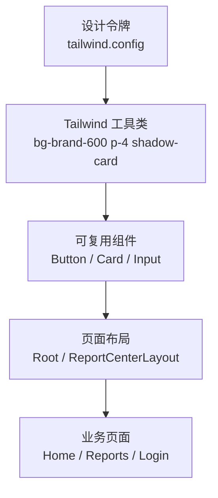
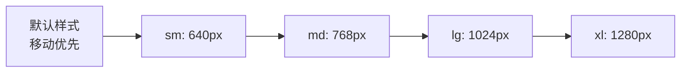

# 第18章 Tailwind CSS 与设计系统构建

第17章我们把前端从单页扩展成了多页应用：路由配置、嵌套布局、路由参数、导航守卫、懒加载都已就位。但回头看代码会发现一个尴尬的事实：`Root`、`ReportCenterLayout`、`LoginPage` 还在用内联 `style={{ ... }}` 写样式；`Button` 组件虽然用了 Tailwind 类名，但项目里压根没安装 Tailwind，那些类名只是"字符串装饰"。

本章要正式把 **Tailwind CSS** 接入项目，并借这个机会聊透"设计系统"这件事：如何用 Utility-First 方式快速拼出界面、如何把颜色/间距/阴影收敛成可复用的设计令牌、如何实现可持久化的暗色模式，以及生产构建时 Tailwind 是怎么做到只生成用过的 CSS 的。学完这一章，第16、17章示例里的 `className="..."` 才真正有了生命。

本章学习目标：

- 理解 Utility-First 设计哲学，能权衡它与手写 CSS / CSS-in-JS 的优劣；
- 掌握 Tailwind v3 的核心配置：`tailwind.config` / `postcss.config` / `@tailwind` 指令；
- 用 Flexbox、Grid、响应式断点完成常见页面布局；
- 用 `theme.extend` 建立品牌设计令牌，并在组件中一致使用；
- 用 `darkMode: 'class'` 实现暗色模式切换与持久化；
- 理解 JIT 模式与 `content` 扫描机制，验证生产 CSS 体积。

## 18.1 Utility-First 设计哲学：效率与一致性的平衡

### 18.1.1 从"写样式"到"拼类名"

传统 CSS 的工作流是：先给元素起类名，再去 CSS 文件里写规则。

```css
.card {
  padding: 1rem;
  border-radius: 0.5rem;
  background-color: #ffffff;
  box-shadow: 0 4px 6px -1px rgb(0 0 0 / 0.1);
}
```

```html
<div class="card">...</div>
```

这个流程的问题在于：每增加一个组件，就要发明一个新类名、写一组规则，团队里很快会出现 `card`、`card-v2`、`card-new`、`report-card` 等命名灾难。而一旦要统一调整圆角或阴影，你可能要改十几个 CSS 文件。

Tailwind 把粒度拆到最小：每个 CSS 属性对应一个类名。你不再"写样式"，而是"拼类名"。

```html
<div class="rounded-lg bg-white p-4 shadow-md">...</div>
```

这听起来像是"反语义化"，但关键在于：**语义被提升到了配置层**。`rounded-lg`、`p-4`、`shadow-md` 不是随意值，它们都来自 `tailwind.config.js` 里定义的设计令牌。团队里所有人用的都是同一套刻度，一致性自然得到保证。

### 18.1.2 设计令牌是唯一真相源

一个设计系统的核心不是"有多少组件"，而是**设计令牌（Design Tokens）**：颜色、字体、间距、圆角、阴影、动画时长等基础决策。Tailwind 的配置文件就是这个真相源。



在这个层级里：

- 设计令牌变化时，所有使用该令牌的组件和页面同步更新；
- 组件层只做"哪些令牌组合在一起"的决策；
- 页面层专注于业务逻辑，而不是纠结像素值。

### 18.1.3 Tailwind 与其他方案对比

| 方案         | 优点                                   | 缺点                         | 适用场景                          |
| ------------ | -------------------------------------- | ---------------------------- | --------------------------------- |
| 内联 `style` | 零依赖、直观                           | 难以复用、无设计约束         | 教学示例、临时调试                |
| CSS Modules  | 局部作用域、无命名冲突                 | 样板文件多、命名开销大       | 大型遗留项目、需要严格隔离        |
| CSS-in-JS    | 动态主题强、组件即样式                 | 运行时开销、包体积增加       | 高度动态主题、复杂条件样式        |
| Tailwind CSS | 配置即规范、JIT 按需生成、无运行时开销 | 需要记忆类名、类名字符串较长 | 现代 React/Vue 项目、设计系统驱动 |

> **注意**：Utility-First 不是"不要语义化"。语义在 `tailwind.config` 和组件命名里；HTML 上的类名负责表达"长什么样"，而不是"是什么业务概念"。

## 18.2 Tailwind 核心：配置、插件、自定义工具类

### 18.2.1 安装 Tailwind CSS v3

本书前端使用 Vite + React 19 + TypeScript。Tailwind v3 与这套栈配合最成熟，且与目录中"JIT 模式 / purge 策略"的概念一致。执行以下命令：

```bash
cd src/frontend
pnpm add -D tailwindcss@^3.4.17 postcss autoprefixer
```

> **注意**：仓库 `package.json` 设置了 `"type": "module"`，因此配置文件统一用 `.cjs` 扩展名，避免 `module.exports` 在 ESM 环境下报错。

### 18.2.2 三件套：tailwind.config.cjs / postcss.config.cjs / index.css

Tailwind 需要三个文件才能工作：配置文件、PostCSS 配置、CSS 入口。

```cjs
// 文件: src/frontend/tailwind.config.cjs（教学示例）

/** @type {import('tailwindcss').Config} */
module.exports = {
  darkMode: 'class',

  content: ['./index.html', './src/**/*.{js,ts,jsx,tsx}'],

  theme: {
    extend: {
      colors: {
        brand: {
          50: '#eff6ff',
          100: '#dbeafe',
          200: '#bfdbfe',
          300: '#93c5fd',
          400: '#60a5fa',
          500: '#3b82f6',
          600: '#2563eb',
          700: '#1d4ed8',
          800: '#1e40af',
          900: '#1e3a8a',
        },
      },
      fontFamily: {
        sans: [
          'Inter',
          'system-ui',
          '-apple-system',
          'BlinkMacSystemFont',
          'Segoe UI',
          'sans-serif',
        ],
      },
      spacing: {
        18: '4.5rem',
      },
      borderRadius: {
        '2xl': '1rem',
      },
      boxShadow: {
        card: '0 4px 6px -1px rgb(0 0 0 / 0.1), 0 2px 4px -2px rgb(0 0 0 / 0.1)',
      },
      keyframes: {
        fadeIn: {
          '0%': { opacity: '0', transform: 'translateY(8px)' },
          '100%': { opacity: '1', transform: 'translateY(0)' },
        },
      },
      animation: {
        fadeIn: 'fadeIn 300ms ease-in',
      },
    },
  },

  plugins: [
    require('tailwindcss/plugin')(({ addUtilities }) => {
      addUtilities({
        '.text-balance': { textWrap: 'balance' },
      })
    }),
  ],
}
```

```cjs
// 文件: src/frontend/postcss.config.cjs（教学示例）

module.exports = {
  plugins: {
    tailwindcss: {},
    autoprefixer: {},
  },
}
```

```css
/* 文件: src/frontend/src/index.css（教学示例） */

@tailwind base;
@tailwind components;
@tailwind utilities;
```

最后，在应用入口引入 `index.css`：

```tsx
// 文件: src/frontend/src/main.tsx（教学示例片段）

import { StrictMode } from 'react'
import { createRoot } from 'react-dom/client'
import { RouterProvider } from 'react-router-dom'
import { router } from './routes'
import './index.css'

createRoot(document.getElementById('root')!).render(
  <StrictMode>
    <RouterProvider router={router} />
  </StrictMode>
)
```

### 18.2.3 `content` 字段：Tailwind 的 purge 机制

Tailwind v3 默认启用 JIT（Just-In-Time）模式。它不会把所有可能的类都生成出来，而是扫描 `content` 里指定的文件，只生成其中**实际出现过的类**。

```cjs
content: ['./index.html', './src/**/*.{js,ts,jsx,tsx}'],
```

这就是 v3 中的 "purge"：

- 开发时，只要你在 JSX/TSX 里写一个类名，Tailwind 立刻生成对应的 CSS；
- 生产构建时，未使用的类不会进入最终包，CSS 体积极小；
- 如果 `content` 路径写漏了（比如忘记包含 `.tsx`），对应的类就会失效。

> **注意**：不要把整个 `node_modules` 写进 `content`。范围太大会拖慢扫描速度，而且大部分库都自带样式，不需要 Tailwind 处理。

### 18.2.4 自定义插件与 `@apply`

如果某些样式反复出现，可以用 Tailwind 插件把它们注册成新的工具类。上面的配置里就添加了一个 `.text-balance` 工具类：

```cjs
plugins: [
  require('tailwindcss/plugin')(({ addUtilities }) => {
    addUtilities({
      '.text-balance': { textWrap: 'balance' },
    })
  }),
],
```

`@apply` 则用于在全局 CSS 里复用工具类，比如打印样式或全局动画：

```css
@layer components {
  .prose p {
    @apply mb-4 leading-relaxed;
  }
}
```

> **提示**：不要把每个组件都包成一个 `@apply` 自定义类。那样会重新发明"语义化类名"，失去 Utility-First 的优势。`@apply` 适合极少数需要跨组件复用且不适合做成组件的场景。

## 18.3 布局系统：Flexbox、Grid、响应式断点

### 18.3.1 常用布局工具类

Tailwind 把 Flexbox 和 Grid 的常用属性都映射成了类名，写布局时不再需要写大量 CSS。

| 能力      | 类名示例                                              |
| --------- | ----------------------------------------------------- |
| 开启 Flex | `flex`                                                |
| 方向      | `flex-row`、`flex-col`、`flex-row-reverse`            |
| 对齐      | `items-center`、`justify-between`、`justify-end`      |
| 自动边距  | `mx-auto`、`ml-auto`                                  |
| 开启 Grid | `grid`                                                |
| 列数      | `grid-cols-2`、`grid-cols-3`、`grid-cols-[200px_1fr]` |
| 间距      | `gap-4`、`gap-x-2`、`space-y-2`                       |
| 自适应    | `grid-cols-1 md:grid-cols-3`                          |

### 18.3.2 响应式断点

Tailwind 采用**移动优先（Mobile-First）**策略：默认样式对应最小屏幕，再用 `sm:`、`md:`、`lg:` 等前缀覆盖更大屏幕。

| 断点  | 最小宽度 | 典型设备 |
| ----- | -------- | -------- |
| `sm`  | 640px    | 大手机   |
| `md`  | 768px    | 平板     |
| `lg`  | 1024px   | 小桌面   |
| `xl`  | 1280px   | 桌面     |
| `2xl` | 1536px   | 大屏     |



例如 `grid-cols-1 md:grid-cols-[200px_1fr]` 表示：小屏幕单列，平板及以上变为"200px 侧边栏 + 自适应内容区"。

### 18.3.3 项目实战：重写报告中心布局

第17章的 `ReportCenterLayout` 用内联 Grid 写死了侧边栏。现在用 Tailwind 重写，并加入响应式能力：

```tsx
// 文件: src/frontend/src/features/reports/pages/ReportCenterLayout.tsx（教学示例）

import { Outlet, Link } from 'react-router-dom'

export function ReportCenterLayout() {
  return (
    <div className="grid grid-cols-1 gap-6 md:grid-cols-[200px_1fr]">
      <aside className="border-b border-gray-200 pb-4 md:border-b-0 md:border-r md:pr-4 dark:border-slate-700">
        <nav className="flex flex-row gap-3 md:flex-col">
          <Link to="/reports" className="hover:text-brand-600 dark:hover:text-brand-400">
            全部报告
          </Link>
          <Link to="/reports/new" className="hover:text-brand-600 dark:hover:text-brand-400">
            新建报告
          </Link>
        </nav>
      </aside>

      <section>
        <Outlet />
      </section>
    </div>
  )
}
```

改造点：

- `grid-cols-1 md:grid-cols-[200px_1fr]` 实现响应式两栏；
- 小屏幕下侧边栏在内容上方、横向排列；中等屏幕以上恢复左侧竖向导航；
- 用 `dark:border-slate-700` 预留暗色模式样式。

### 18.3.4 布局系统教学示例

下面的 `LayoutDemo` 同时演示了 Flex 与响应式 Grid：

```tsx
// 文件: src/frontend/src/shared/components/design-system/LayoutDemo.tsx（教学示例）

export function LayoutDemo() {
  return (
    <div className="space-y-6">
      <section>
        <h3 className="mb-2 font-medium">Flex 布局</h3>
        <div className="flex flex-col gap-4 rounded-2xl border border-gray-200 p-4 md:flex-row md:items-center md:justify-between dark:border-slate-700">
          <div className="rounded bg-brand-100 px-4 py-2 text-brand-700 dark:bg-brand-900 dark:text-brand-200">
            左侧
          </div>
          <div className="rounded bg-brand-100 px-4 py-2 text-brand-700 dark:bg-brand-900 dark:text-brand-200">
            中间
          </div>
          <div className="rounded bg-brand-100 px-4 py-2 text-brand-700 dark:bg-brand-900 dark:text-brand-200">
            右侧
          </div>
        </div>
      </section>

      <section>
        <h3 className="mb-2 font-medium">响应式 Grid 布局</h3>
        <div className="grid grid-cols-1 gap-4 sm:grid-cols-2 lg:grid-cols-3">
          {Array.from({ length: 6 }).map((_, i) => (
            <div
              key={i}
              className="rounded-2xl border border-gray-200 bg-white p-4 shadow-card dark:border-slate-700 dark:bg-slate-800"
            >
              卡片 {i + 1}
            </div>
          ))}
        </div>
      </section>
    </div>
  )
}
```

## 18.4 设计令牌：颜色、字体、间距、圆角、阴影

### 18.4.1 为什么需要设计令牌

没有令牌时，一个"品牌蓝"可能在项目里出现 `#2563eb`、`#3b82f6`、`blue-600` 等多种写法。设计令牌把这些决策收敛到一个地方：

```cjs
// tailwind.config.cjs 片段

colors: {
  brand: {
    50: '#eff6ff',
    100: '#dbeafe',
    // ...
    600: '#2563eb',
    // ...
  },
}
```

之后团队里只使用 `bg-brand-600`、`text-brand-700`、`ring-brand-300`。品牌色调整时，改一处即可全局生效。

### 18.4.2 扩展默认主题而非覆盖

推荐用 `theme.extend` 而不是直接覆盖 `theme`。这样可以保留 Tailwind 的 `gray`、`red`、`blue` 等完整色板，降低迁移成本。

我们已经配置的令牌包括：

- `colors.brand.*`：品牌主色；
- `fontFamily.sans`：全局无衬线字体栈；
- `spacing.18`：自定义 `4.5rem` 间距；
- `borderRadius.2xl`：`1rem` 大圆角；
- `boxShadow.card`：卡片阴影；
- `animation.fadeIn`：页面淡入动画。

### 18.4.3 项目实战：用品牌色改造 Button

```tsx
// 文件: src/frontend/src/shared/components/Button.tsx（教学示例）

import type { ButtonHTMLAttributes, ReactNode } from 'react'

interface Props extends ButtonHTMLAttributes<HTMLButtonElement> {
  children: ReactNode
  variant?: 'primary' | 'secondary' | 'outline' | 'danger'
}

export function Button({ children, variant = 'primary', ...rest }: Props) {
  const base =
    'px-4 py-2 rounded font-medium transition-colors focus:outline-none focus:ring-2 focus:ring-offset-2 disabled:opacity-50 disabled:cursor-not-allowed'
  const styles = {
    primary:
      'bg-brand-600 text-white hover:bg-brand-700 focus:ring-brand-300 focus:ring-offset-white dark:focus:ring-offset-slate-900',
    secondary:
      'bg-gray-200 text-gray-800 hover:bg-gray-300 focus:ring-gray-300 focus:ring-offset-white dark:bg-slate-700 dark:text-slate-100 dark:hover:bg-slate-600 dark:focus:ring-offset-slate-900',
    outline:
      'border-2 border-gray-300 text-gray-700 hover:bg-gray-100 focus:ring-gray-300 focus:ring-offset-white dark:border-slate-600 dark:text-slate-200 dark:hover:bg-slate-800 dark:focus:ring-offset-slate-900',
    danger:
      'bg-red-600 text-white hover:bg-red-700 focus:ring-red-300 focus:ring-offset-white dark:focus:ring-offset-slate-900',
  }

  return (
    <button className={`${base} ${styles[variant]}`} {...rest}>
      {children}
    </button>
  )
}
```

这个版本：

- 用 `brand-600` 替代了写死的 `blue-600`；
- 加入了 `disabled` 状态；
- 用 `focus:ring-offset-white dark:focus:ring-offset-slate-900` 保证暗色模式下焦点环可见。

### 18.4.4 设计令牌卡片示例

```tsx
// 文件: src/frontend/src/shared/components/design-system/TokenCard.tsx（教学示例）

export function TokenCard() {
  return (
    <div className="rounded-2xl border border-gray-200 bg-white p-6 shadow-card dark:border-slate-700 dark:bg-slate-800">
      <h3 className="text-lg font-semibold text-gray-900 dark:text-slate-100">设计令牌示例</h3>
      <p className="mt-2 text-gray-600 dark:text-gray-300">
        这张卡片使用了品牌色、自定义圆角、阴影与间距令牌。
      </p>
      <div className="mt-4 flex flex-wrap gap-3">
        <span className="rounded bg-brand-100 px-3 py-1 text-sm text-brand-700 dark:bg-brand-900 dark:text-brand-200">
          brand-100 / brand-700
        </span>
        <span className="rounded bg-brand-600 px-3 py-1 text-sm text-white">brand-600</span>
        <span className="rounded border border-gray-300 px-3 py-1 text-sm text-gray-700 dark:border-slate-600 dark:text-slate-200">
          outline
        </span>
      </div>
    </div>
  )
}
```

### 18.4.5 进阶：用 CSS 变量实现运行时换肤

如果需要在运行时动态切换主题（比如用户自定义品牌色），可以把令牌映射到 CSS 变量：

```css
/* index.css 片段 */

@layer base {
  :root {
    --color-surface: 255 255 255;
    --color-foreground: 15 23 42;
  }
  .dark {
    --color-surface: 15 23 42;
    --color-foreground: 248 250 252;
  }
}
```

```cjs
// tailwind.config.cjs 片段
colors: {
  surface: 'rgb(var(--color-surface) / <alpha-value>)',
  foreground: 'rgb(var(--color-foreground) / <alpha-value>)',
}
```

> **提示**：本章项目实战采用基础的 `theme.extend` 策略即可。CSS 变量方案作为进阶参考，适合需要用户自定义主题的场景。

## 18.5 暗色模式：class 策略、系统偏好、切换持久化

### 18.5.1 三种暗色策略对比

| 策略    | 配置                   | 特点                               |
| ------- | ---------------------- | ---------------------------------- |
| `media` | `darkMode: 'media'`    | 完全跟随系统偏好，无法手动切换     |
| `class` | `darkMode: 'class'`    | 手动可控，便于持久化和预览         |
| 组合    | `class` + `matchMedia` | 首次按系统，之后按用户选择（推荐） |

我们选择**组合策略**：配置用 `class`，首次加载时读取 `prefers-color-scheme`，用户切换后写入 `localStorage`。

### 18.5.2 useDarkMode Hook

```tsx
// 文件: src/frontend/src/shared/hooks/useDarkMode.ts（教学示例）

import { useEffect, useState } from 'react'

export type Theme = 'light' | 'dark'

export function useDarkMode() {
  const [theme, setTheme] = useState<Theme>('light')

  useEffect(() => {
    const stored = localStorage.getItem('theme') as Theme | null
    if (stored) {
      setTheme(stored)
      return
    }
    if (window.matchMedia('(prefers-color-scheme: dark)').matches) {
      setTheme('dark')
    }
  }, [])

  useEffect(() => {
    const root = document.documentElement
    if (theme === 'dark') {
      root.classList.add('dark')
    } else {
      root.classList.remove('dark')
    }
    localStorage.setItem('theme', theme)
  }, [theme])

  const toggle = () => setTheme((t) => (t === 'light' ? 'dark' : 'light'))

  return { theme, isDark: theme === 'dark', setTheme, toggle }
}
```

关键点：

- 首次挂载时先读 `localStorage`，没有记录再读系统偏好；
- 每次 `theme` 变化时，同步到 `html` 的 `class` 和 `localStorage`；
- `document.documentElement` 就是 `<html>`，这样 `dark:` 变体才能生效。

### 18.5.3 ThemeToggle 组件

```tsx
// 文件: src/frontend/src/shared/components/ThemeToggle.tsx（教学示例）

import { useDarkMode } from '@/shared/hooks/useDarkMode'
import { Button } from './Button'

export function ThemeToggle() {
  const { isDark, toggle } = useDarkMode()

  return (
    <Button variant="outline" onClick={toggle} aria-label="切换主题">
      {isDark ? '深色' : '浅色'}
    </Button>
  )
}
```

### 18.5.4 在 Root 布局中接入暗色模式

```tsx
// 文件: src/frontend/src/routes/root.tsx（教学示例）

import { Outlet, Link, ScrollRestoration, useLocation } from 'react-router-dom'
import { useEffect } from 'react'
import { ThemeToggle } from '@/shared/components/ThemeToggle'

export function Root() {
  const { pathname } = useLocation()

  useEffect(() => {
    window.scrollTo({ top: 0, behavior: 'smooth' })
  }, [pathname])

  return (
    <div className="min-h-screen bg-white text-gray-900 dark:bg-slate-900 dark:text-slate-100">
      <ScrollRestoration />
      <header className="border-b border-gray-200 p-4 dark:border-slate-700">
        <nav className="flex items-center justify-between gap-6">
          <div className="flex gap-6">
            <Link to="/" className="hover:text-brand-600 dark:hover:text-brand-400">
              首页
            </Link>
            <Link to="/reports" className="hover:text-brand-600 dark:hover:text-brand-400">
              报告列表
            </Link>
            <Link to="/design-system" className="hover:text-brand-600 dark:hover:text-brand-400">
              设计系统
            </Link>
            <Link to="/reports/new" className="hover:text-brand-600 dark:hover:text-brand-400">
              新建报告
            </Link>
            <Link to="/settings" className="hover:text-brand-600 dark:hover:text-brand-400">
              设置
            </Link>
          </div>
          <ThemeToggle />
        </nav>
      </header>

      <main key={pathname} className="animate-fadeIn p-6">
        <Outlet />
      </main>
    </div>
  )
}
```

> **注意**：暗色模式切换后，如果页面出现"闪烁"（先亮后暗），说明初始主题判断是在客户端 JS 执行后才生效。生产环境可以考虑把主题判断逻辑内联到 `index.html` 的 `<script>` 中，或在服务端渲染时决定。

## 18.6 性能优化：JIT 模式、CSS 压缩、purge 策略

### 18.6.1 JIT 模式：只生成你写的类

Tailwind v3 默认启用 JIT。开发时，如果你在 JSX 里写：

```html
<div className="w-[123px] bg-brand-600"></div>
```

Tailwind 会即时生成 `w-[123px]` 和 `bg-brand-600` 对应的 CSS，而不是预先生成所有可能值。这带来两个好处：

- 开发构建速度极快；
- 支持任意值语法（如 `w-[123px]`、`bg-[#1da1f2]`），不再受限于预设刻度。

### 18.6.2 `content` 即 purge 策略

在 Tailwind v2 时代，purge 是一个独立配置项；v3 把它合并进了 `content`。只要 `content` 路径写全，生产构建时未使用的类自然不会被包含。

```cjs
content: ['./index.html', './src/**/*.{js,ts,jsx,tsx}'],
```

常见漏写路径导致类名失效的场景：

- 模板文件不在 `src` 下（如 `index.html`）；
- 使用动态字符串拼接类名（Tailwind 无法静态分析）；
- 第三方组件库的 JSX 没有被扫描到。

> **提示**：避免用字符串拼接类名。如果需要动态类，优先用 `clsx` / `tailwind-merge` 组合完整类名字符串，或把固定组合抽到组件里。

### 18.6.3 Vite 生产构建自动压缩 CSS

Vite 生产构建会调用 `cssnano` 压缩 CSS。配合 Tailwind 的 JIT，最终 CSS 文件通常只有几 KB 到十几 KB。

```bash
cd src/frontend
pnpm build
ls -lh dist/assets/*.css
```

你可以看到生成的 CSS 只包含实际使用的工具类，没有冗余。

### 18.6.4 性能建议与注意事项

| 建议                    | 原因                                    |
| ----------------------- | --------------------------------------- |
| `content` 范围精确      | 避免扫描无关文件，加快构建              |
| 优先使用预设刻度        | 保持设计一致性，减少任意值滥用          |
| 慎用大面积 `@apply`     | 否则又回到"自定义类名 + 大段 CSS"的老路 |
| 不要把所有颜色都自定义  | 保留 Tailwind 默认灰阶、红绿等语义色    |
| 暗色模式用 `class` 策略 | 便于持久化和精确控制                    |

## 小结

- Tailwind 的 Utility-First 不是反语义化，而是把语义收敛到 `tailwind.config` 这一层，让设计令牌成为团队规范的唯一真相源。
- `tailwind.config.cjs` + `postcss.config.cjs` + `index.css` 是 Vite 项目接入 Tailwind v3 的最小闭环；`main.tsx` 里需要引入 `index.css`。
- `content` 字段决定了 Tailwind 扫描哪些文件生成类名，漏写路径是类名失效的最常见原因。
- Flexbox、Grid、响应式断点用工具类表达，可大幅减少布局样板代码；移动优先的断点策略符合现代设备分布。
- 设计令牌通过 `theme.extend` 扩展，团队共享同一套颜色、字体、间距、圆角、阴影规范；`Button` 和 `TokenCard` 展示了品牌令牌的实际用法。
- 暗色模式使用 `darkMode: 'class'` 配合 `useDarkMode` Hook，可兼顾系统偏好、用户手动切换和 `localStorage` 持久化。
- 生产构建依赖 JIT 与 `content` 扫描实现按需生成，配合 Vite 的 cssnano 完成压缩；合理使用任意值和 `@apply` 能保持设计系统健康。

下一章（第19章）我们将在 Tailwind 主题的基础上引入 **Shadcn UI**，学习如何拥有组件代码而不是依赖黑盒组件库。

## 练习

1. 完成 Tailwind v3 接入，运行 `pnpm dev`，确认 `Button`、`Root`、`ReportCenterLayout` 的样式都已生效。
2. 把 `HomePage` 和 `LoginPage` 的所有内联 `style` 替换为 Tailwind 工具类，并统一使用共享 `Button` 组件。
3. 在 `tailwind.config.cjs` 中新增一个 `accent` 品牌辅助色，并用它改造 `ThemeToggle` 的 `outline` 变体。
4. 给 `ReportCenterLayout` 添加更细粒度的响应式能力：小屏下侧边栏隐藏或变成横向标签，中等屏幕以上恢复左侧固定宽度侧边栏。
5. 执行生产构建，查看 `dist/assets/*.css` 的体积，并解释为什么 Tailwind 生成的 CSS 文件这么小。
6. （进阶）尝试用 CSS 变量方案实现一套 `surface` / `foreground` 语义化令牌，并在 `Root` 和 `TokenCard` 中替换硬编码的背景色与文字色。
