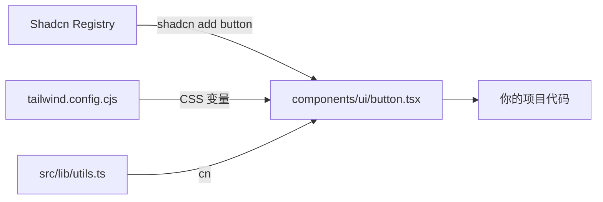
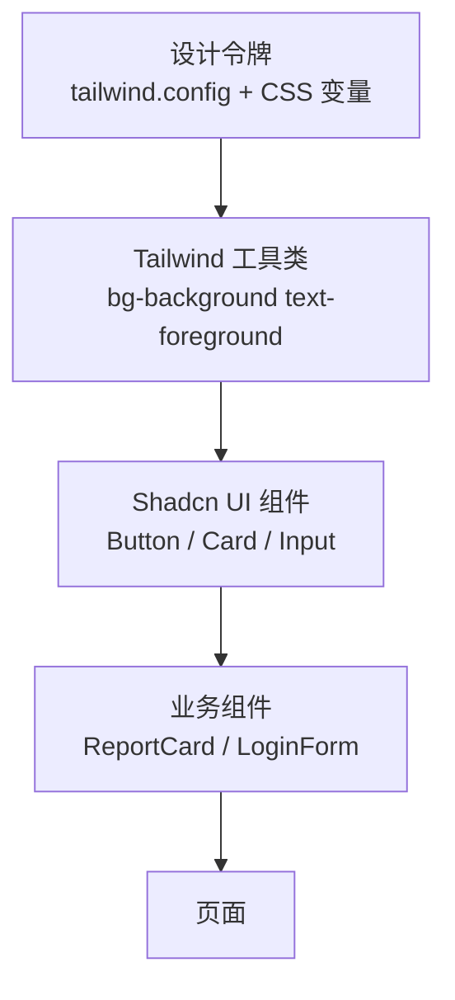
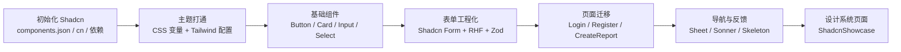

# 第19章 Shadcn UI 与组件工程化

第18章我们把 Tailwind CSS 接入项目，建立了品牌设计令牌、暗色模式和响应式布局。但回到代码会发现：`Button` 还在用字符串拼接 `className`；`LoginPage`、`RegisterPage` 的表单输入框都是原生 HTML 控件；报告列表的加载态只是一行"加载中..."文本。

这些组件不是不能用，而是缺少一套**工程化的组件体系**：统一的变体管理、一致的焦点/禁用/错误状态、可访问的表单绑定、可复用的加载与反馈模式。自己从头封装所有组件会耗费大量精力，直接引入黑盒 npm 组件库又难以定制。

本章引入 **Shadcn UI**：它不是传统意义上的 npm 组件库，而是一个把组件源码复制到你项目里的"可复制组件注册表（copy-paste registry）"。你拥有每一行代码，可以按需修改，同时享受社区沉淀的组件设计、可访问性处理和 Tailwind 主题集成。

本章学习目标：

- 理解 Shadcn UI 与传统 npm 组件库的本质区别；
- 掌握 Shadcn 项目结构：`components.json`、`src/lib/utils.ts`、`cn()`、`class-variance-authority`；
- 将 Shadcn 的 CSS 变量主题与既有 Tailwind 设计令牌融合；
- 用 Shadcn Button / Card / Input / Select / Form 等组件替换/封装现有界面；
- 用 Shadcn Form + React Hook Form + Zod 构建类型安全的表单；
- 理解 Shadcn 组件内置动画与可访问性（a11y）能力；
- 建立组件升级策略，避免 copy-paste 代码成为维护负担。

## 19.1 Shadcn UI 理念：拥有组件代码，而非依赖组件库

### 19.1.1 组件库的两种形态

传统 UI 组件库（如 Ant Design、Material-UI、Chakra UI）通常以 npm 包形式发布：

```bash
pnpm add @arco-design/web-react
```

然后直接引用：

```tsx
import { Button } from '@arco-design/web-react'
```

优点很明显：开箱即用、文档齐全、社区生态大。缺点也很明显：

- **定制困难**：想改一颗按钮的圆角，可能需要覆盖全局主题或写大量 CSS；
- **包体积不可控**：即使只用了一个 Button，也可能引入整个库的样式和运行时；
- **升级风险高**：大版本升级可能破坏大量组件行为，而你无法单独控制某个组件；
- **黑盒调试难**：出现样式或行为异常时，你面对的是压缩后的组件代码。

Shadcn UI 走的是另一条路：它不提供 npm 包，而是提供一个 CLI 和一组托管在 registry 上的组件源码。你运行 `shadcn add button`，CLI 会把 `button.tsx` 的源码**复制到你的项目里**。从此这行代码就是你的项目代码，你可以：

- 直接修改它的样式和逻辑；
- 只保留需要的组件，不用的不会进入构建产物；
- 升级时逐组件 diff，保留项目自定义部分。

### 19.1.2 Shadcn UI 的工作方式

Shadcn 项目有三个核心约定：

1. **`components.json`**：项目级元数据，记录风格（style）、基础色（baseColor）、CSS 变量开关、路径别名等；
2. **`src/lib/utils.ts`**：提供 `cn()` 工具函数，它是 `clsx` + `tailwind-merge` 的薄包装；
3. **`src/components/ui/`**：所有复制进来的组件都放在这里。



这种架构的关键在于：**组件层不自带主题，主题由 Tailwind 配置和 CSS 变量提供**。因此 Shadcn 组件可以无缝融入你已有的设计系统。

### 19.1.3 与 Tailwind 设计系统的关系

回顾第18章的设计令牌层级：



在第18章，我们把"颜色/间距/阴影"收敛到 `tailwind.config.cjs`。本章则在此基础上增加一层**语义化 CSS 变量**：`--background`、`--foreground`、`--primary`、`--muted` 等。这些变量定义在 `:root` 和 `.dark` 下，Tailwind 配置再把它们映射成 `bg-background`、`text-primary` 等工具类。

Shadcn 组件只使用这些语义化工具类，因此：

- 切换 `.dark` 类，所有组件自动换肤；
- 修改 `--primary`，所有主色按钮同步变化；
- 保留项目自定义的 `brand-*` 色阶，用于品牌特定场景。

### 19.1.4 本章改造路线图

本章我们要完成以下改造：



> **注意**：本章使用的是 Tailwind CSS v3（与第18章一致）。当前 Shadcn CLI 最新版默认生成 Tailwind v4 语法，直接用于本项目会编译失败。因此本章采用**手动初始化 + 复制 v3 兼容组件源码**的方式，这也正好体现了"拥有代码"的核心理念。

## 19.2 手动初始化 Shadcn UI：配置、依赖与 `cn`

### 19.2.1 创建 `components.json`

`components.json` 是 Shadcn 项目的"身份证"。它告诉 CLI 组件应该放到哪里、使用什么别名、Tailwind 配置在哪里。

```json
// 文件: src/frontend/components.json（教学示例）

{
  "$schema": "https://ui.shadcn.com/schema.json",
  "style": "new-york",
  "rsc": false,
  "tsx": true,
  "tailwind": {
    "config": "tailwind.config.cjs",
    "css": "src/index.css",
    "baseColor": "slate",
    "cssVariables": true,
    "prefix": ""
  },
  "iconLibrary": "lucide",
  "aliases": {
    "components": "@/components",
    "utils": "@/lib/utils",
    "ui": "@/components/ui",
    "lib": "@/lib",
    "hooks": "@/hooks"
  }
}
```

关键字段：

- `style`：`new-york` 或 `default`，决定组件默认外观风格；
- `rsc`：是否为 React Server Components，Vite 项目设为 `false`；
- `tailwind.config` / `tailwind.css`：Tailwind 配置文件和 CSS 入口；
- `cssVariables`：是否使用 CSS 变量主题，现代项目推荐 `true`；
- `aliases`：组件和工具函数的路径别名，必须与你项目的 `@/` 别名一致。

### 19.2.2 安装核心依赖

Shadcn 组件依赖以下库：

```bash
cd src/frontend
pnpm add class-variance-authority clsx tailwind-merge lucide-react \
  @radix-ui/react-label @radix-ui/react-slot @radix-ui/react-select \
  @radix-ui/react-dialog @radix-ui/react-dropdown-menu \
  @radix-ui/react-separator @radix-ui/react-avatar

pnpm add -D tailwindcss-animate
```

依赖说明：

| 依赖 | 作用 |
| ---- | ---- |
| `class-variance-authority` | 类型安全的变体管理（cva） |
| `clsx` | 条件类名拼接 |
| `tailwind-merge` | 合并 Tailwind 类名并解决冲突 |
| `lucide-react` | 图标库 |
| `@radix-ui/react-*` | 无样式、可访问的底层 primitive |
| `tailwindcss-animate` | Tailwind 动画工具类（如 `animate-in`） |

### 19.2.3 `src/lib/utils.ts`：`cn` 工具函数

`cn` 是组件工程化的最小公共工具。它先把条件类名用 `clsx` 拼起来，再用 `tailwind-merge` 去重和合并冲突。

```ts
// 文件: src/frontend/src/lib/utils.ts（教学示例）

import { type ClassValue, clsx } from "clsx"
import { twMerge } from "tailwind-merge"

export function cn(...inputs: ClassValue[]) {
  return twMerge(clsx(inputs))
}
```

使用示例：

```tsx
// 合并类名并去重
className={cn("px-4 py-2", isActive && "bg-blue-500", "px-6")}
// 结果："py-2 bg-blue-500 px-6"（后面的 px-6 覆盖了 px-4）
```

> **提示**：不要小看这个函数。它是 Shadcn 组件能优雅地支持 `className` 覆盖和变体组合的关键。

### 19.2.4 组件目录约定

所有 Shadcn 组件统一放在 `src/components/ui/` 下：

```
src/components/ui/
├── alert.tsx
├── avatar.tsx
├── badge.tsx
├── button.tsx
├── card.tsx
├── dropdown-menu.tsx
├── form.tsx
├── input.tsx
├── label.tsx
├── select.tsx
├── separator.tsx
├── sheet.tsx
├── skeleton.tsx
├── sonner.tsx
└── textarea.tsx
```

业务组件则在 `src/shared/components/` 或 `src/features/*/components/` 中二次封装。这种分层让"基础 UI 组件"与"业务组件"职责清晰。

## 19.3 核心组件实战：Button、Card、Form、Select

### 19.3.1 Shadcn 组件源码结构

以 `button.tsx` 为例，Shadcn 组件通常由三部分组成：

1. **变体定义（cva）**：用 `class-variance-authority` 声明不同 variant/size 的类名组合；
2. **forwardRef 组件**：接收 props，拼接类名，渲染底层元素；
3. **类型导出**：导出组件和变体类型，方便二次封装。

```tsx
// 文件: src/frontend/src/components/ui/button.tsx（教学示例片段）

import * as React from "react"
import { Slot } from "@radix-ui/react-slot"
import { cva, type VariantProps } from "class-variance-authority"
import { cn } from "@/lib/utils"

const buttonVariants = cva(
  "inline-flex items-center justify-center whitespace-nowrap rounded-md text-sm font-medium ring-offset-background transition-colors focus-visible:outline-none focus-visible:ring-2 focus-visible:ring-ring focus-visible:ring-offset-2 disabled:pointer-events-none disabled:opacity-50",
  {
    variants: {
      variant: {
        default: "bg-primary text-primary-foreground hover:bg-primary/90",
        destructive: "bg-destructive text-destructive-foreground hover:bg-destructive/90",
        outline: "border border-input bg-background hover:bg-accent hover:text-accent-foreground",
        secondary: "bg-secondary text-secondary-foreground hover:bg-secondary/80",
        ghost: "hover:bg-accent hover:text-accent-foreground",
        link: "text-primary underline-offset-4 hover:underline",
      },
      size: {
        default: "h-10 px-4 py-2",
        sm: "h-9 rounded-md px-3",
        lg: "h-11 rounded-md px-8",
        icon: "h-10 w-10",
      },
    },
    defaultVariants: {
      variant: "default",
      size: "default",
    },
  }
)

export interface ButtonProps
  extends React.ButtonHTMLAttributes<HTMLButtonElement>,
    VariantProps<typeof buttonVariants> {
  asChild?: boolean
}

const Button = React.forwardRef<HTMLButtonElement, ButtonProps>(
  ({ className, variant, size, asChild = false, ...props }, ref) => {
    const Comp = asChild ? Slot : "button"
    return (
      <Comp
        className={cn(buttonVariants({ variant, size, className }))}
        ref={ref}
        {...props}
      />
    )
  }
)
Button.displayName = "Button"

export { Button, buttonVariants }
```

解读：

- `cva` 把基础类名和变体类名组织成可维护结构；
- `Slot` 让按钮可以渲染为子元素（例如把按钮包在 `Link` 上）；
- `cn(buttonVariants({ variant, size, className }))` 同时处理变体、尺寸和外部覆盖。

### 19.3.2 用 Shadcn Button 替换手搓 Button

第18章的 `Button.tsx` 用字符串拼接，变体一多就难以维护。现在用 Shadcn Button 做薄包装，保留项目历史 API：

```tsx
// 文件: src/frontend/src/shared/components/Button.tsx（教学示例）

import type { ButtonHTMLAttributes, ReactNode } from 'react'
import { Button as ShadcnButton, buttonVariants } from '@/components/ui/button'
import type { VariantProps } from 'class-variance-authority'

interface Props extends ButtonHTMLAttributes<HTMLButtonElement> {
  children: ReactNode
  variant?: 'primary' | 'secondary' | 'outline' | 'danger' | VariantProps<typeof buttonVariants>['variant']
  size?: VariantProps<typeof buttonVariants>['size']
}

const variantMap: Record<string, VariantProps<typeof buttonVariants>['variant']> = {
  primary: 'default',
  secondary: 'secondary',
  outline: 'outline',
  danger: 'destructive',
}

export function Button({ children, variant = 'primary', size, ...rest }: Props) {
  const shadcnVariant = variantMap[variant] ?? variant

  return (
    <ShadcnButton variant={shadcnVariant} size={size} {...rest}>
      {children}
    </ShadcnButton>
  )
}
```

改造点：

- 历史 API 的 `primary`、`danger` 映射到 Shadcn 的 `default`、`destructive`；
- 新增 `size` 和原生 Shadcn 变体支持；
- 焦点、禁用、暗色模式全部交给 Shadcn Button 处理。

### 19.3.3 表单三件套：Input / Label / Textarea / Select

原生输入框最大的问题是每个项目都要重新写一遍焦点环、错误态、标签对齐。Shadcn 把这些收敛到组件里：

```tsx
// 文件: src/frontend/src/components/ui/input.tsx（教学示例）

import * as React from "react"
import { cn } from "@/lib/utils"

export interface InputProps
  extends React.InputHTMLAttributes<HTMLInputElement> {}

const Input = React.forwardRef<HTMLInputElement, InputProps>(
  ({ className, type, ...props }, ref) => {
    return (
      <input
        type={type}
        className={cn(
          "flex h-10 w-full rounded-md border border-input bg-background px-3 py-2 text-sm ring-offset-background file:border-0 file:bg-transparent file:text-sm file:font-medium placeholder:text-muted-foreground focus-visible:outline-none focus-visible:ring-2 focus-visible:ring-ring focus-visible:ring-offset-2 disabled:cursor-not-allowed disabled:opacity-50",
          className
        )}
        ref={ref}
        {...props}
      />
    )
  }
)
Input.displayName = "Input"

export { Input }
```

`Label` 组件基于 Radix Label primitive，自动处理 `htmlFor`：

```tsx
<div className="space-y-2">
  <Label htmlFor="email">邮箱</Label>
  <Input id="email" type="email" />
</div>
```

`Select` 组件基于 Radix Select，提供下拉选择、键盘导航和无障碍支持：

```tsx
<Select>
  <SelectTrigger>
    <SelectValue placeholder="选择模型" />
  </SelectTrigger>
  <SelectContent>
    <SelectItem value="gpt-4o">GPT-4o</SelectItem>
    <SelectItem value="claude-3-5">Claude 3.5</SelectItem>
    <SelectItem value="kimi-latest">Kimi Latest</SelectItem>
  </SelectContent>
</Select>
```

### 19.3.4 Shadcn Form 组件解析

Shadcn Form 是对 React Hook Form 的薄包装，核心成员：

| 组件 | 作用 |
| ---- | ---- |
| `Form` | `FormProvider`，提供 form 上下文 |
| `FormField` | 封装 RHF 的 `Controller` |
| `FormItem` | 每个字段的外壳，生成唯一 ID |
| `FormLabel` | 自动关联 `htmlFor` 和错误态颜色 |
| `FormControl` | 用 Radix Slot 把 a11y 属性注入子控件 |
| `FormDescription` | 字段说明 |
| `FormMessage` | 错误提示 |

```tsx
// 文件: src/frontend/src/components/ui/form.tsx（教学示例片段）

const FormItem = React.forwardRef<HTMLDivElement, React.HTMLAttributes<HTMLDivElement>>(
  ({ className, ...props }, ref) => {
    const id = React.useId()
    return (
      <FormItemContext.Provider value={{ id }}>
        <div ref={ref} className={cn("space-y-2", className)} {...props} />
      </FormItemContext.Provider>
    )
  }
)
```

`FormControl` 会自动给子控件添加 `id`、`aria-describedby` 和 `aria-invalid`：

```tsx
<FormControl>
  <Input placeholder="输入标题" />
</FormControl>
```

渲染后：

```html
<input id=":r0:-form-item" aria-describedby=":r0:-form-item-message" aria-invalid="false" />
```

这样屏幕阅读器就能正确读出标签和错误信息。

### 19.3.5 反馈组件 Alert 与 Badge

`Alert` 用于展示重要提示，`Badge` 用于状态标签。

```tsx
<Alert variant="destructive">
  <AlertTitle>登录失败</AlertTitle>
  <AlertDescription>邮箱或密码错误，请重试。</AlertDescription>
</Alert>
```

```tsx
<Badge variant={report.status === 'completed' ? 'default' : 'outline'}>
  {statusMap[report.status]}
</Badge>
```

### 19.3.6 Dialog 与 Sheet 的区别

- `Dialog`：模态弹窗，阻断用户当前流程，适合确认操作；
- `Sheet`：从侧面滑出的抽屉，适合导航、详情面板等辅助内容。

本章用 `Sheet` 做移动端导航抽屉。

## 19.4 复合组件开发：表单、列表、卡片的二次封装

### 19.4.1 用 Card + Input + Label + Button + Alert 重写登录页

改造前（第18章风格）：

```tsx
<div className="mx-auto my-8 max-w-md rounded-2xl border border-gray-200 bg-white p-6 shadow-card dark:border-slate-700 dark:bg-slate-800">
  ...</div>
```

改造后（Shadcn 风格）：

```tsx
// 文件: src/frontend/src/features/auth/pages/LoginPage.tsx（教学示例片段）

import { Card, CardContent, CardDescription, CardHeader, CardTitle } from '@/components/ui/card'
import { Input } from '@/components/ui/input'
import { Label } from '@/components/ui/label'
import { Button } from '@/components/ui/button'
import { Alert, AlertDescription } from '@/components/ui/alert'

<Card className="mx-auto my-8 max-w-md">
  <CardHeader>
    <CardTitle>登录</CardTitle>
  </CardHeader>
  <CardContent>
    <form onSubmit={handleSubmit} className="space-y-4">
      <div className="space-y-2">
        <Label htmlFor="email">邮箱</Label>
        <Input id="email" type="email" value={email} onChange={...} required />
      </div>
      ...
      {error && (
        <Alert variant="destructive">
          <AlertDescription>{error}</AlertDescription>
        </Alert>
      )}
      <Button type="submit" className="w-full">登录</Button>
    </form>
  </CardContent>
</Card>
```

改造后，登录页的卡片、输入框、按钮、错误提示全部使用语义化变量，暗色模式自动生效，无需写任何 `dark:` 类。

### 19.4.2 注册页改造

注册页与登录页结构类似，增加昵称字段和密码强度说明：

```tsx
<div className="space-y-2">
  <Label htmlFor="password">密码</Label>
  <Input id="password" type="password" ... />
  <p className="text-xs text-muted-foreground">至少 8 位，包含大小写字母和数字</p>
</div>
```

### 19.4.3 用 Shadcn Form + RHF + Zod 重写创建报告表单

第一步，定义 schema：

```ts
// 文件: src/frontend/src/features/reports/schemas/reportSchema.ts（教学示例）

import { z } from 'zod'

export const reportSchema = z.object({
  title: z.string().min(2, '标题至少需要 2 个字符').max(100, '标题最多 100 个字符'),
  topic: z.string().min(2, '主题至少需要 2 个字符').max(200, '主题最多 200 个字符'),
  depth: z.enum(['shallow', 'medium', 'deep']),
  model: z.enum(['gpt-4o', 'claude-3-5', 'kimi-latest']),
  description: z.string().max(1000, '描述最多 1000 个字符').optional(),
})

export type ReportFormData = z.infer<typeof reportSchema>
```

第二步，用 `FormField` 包裹每个字段：

```tsx
// 文件: src/frontend/src/features/reports/components/CreateReportFormRHF.tsx（教学示例）

import { useForm } from 'react-hook-form'
import { zodResolver } from '@hookform/resolvers/zod'
import { Button } from '@/components/ui/button'
import { Input } from '@/components/ui/input'
import { Textarea } from '@/components/ui/textarea'
import { Select, SelectContent, SelectItem, SelectTrigger, SelectValue } from '@/components/ui/select'
import { Form, FormControl, FormField, FormItem, FormLabel, FormMessage } from '@/components/ui/form'
import { reportSchema, type ReportFormData } from '../schemas/reportSchema'

export function CreateReportForm({ onSubmit, isLoading }: CreateReportFormProps) {
  const form = useForm<ReportFormData>({
    resolver: zodResolver(reportSchema),
    defaultValues: { title: '', topic: '', depth: 'medium', model: 'kimi-latest', description: '' },
  })

  return (
    <Form {...form}>
      <form onSubmit={form.handleSubmit(onSubmit)} className="space-y-4">
        <FormField
          control={form.control}
          name="title"
          render={({ field }) => (
            <FormItem>
              <FormLabel>报告标题</FormLabel>
              <FormControl>
                <Input placeholder="例如：多智能体协作调研" {...field} />
              </FormControl>
              <FormMessage />
            </FormItem>
          )}
        />

        <FormField
          control={form.control}
          name="depth"
          render={({ field }) => (
            <FormItem>
              <FormLabel>研究深度</FormLabel>
              <Select onValueChange={field.onChange} defaultValue={field.value}>
                <FormControl>
                  <SelectTrigger>
                    <SelectValue placeholder="选择研究深度" />
                  </SelectTrigger>
                </FormControl>
                <SelectContent>
                  <SelectItem value="shallow">浅度概览</SelectItem>
                  <SelectItem value="medium">中度分析</SelectItem>
                  <SelectItem value="deep">深度研究</SelectItem>
                </SelectContent>
              </Select>
              <FormMessage />
            </FormItem>
          )}
        />

        ...

        <Button type="submit" disabled={isLoading}>创建报告</Button>
      </form>
    </Form>
  )
}
```

改造收益：

- 校验规则集中在 schema，而不是散落在 JSX；
- 错误提示自动关联到对应字段，样式统一；
- 下拉选择获得键盘导航和屏幕阅读器支持。

### 19.4.4 用 Card + Badge 改造 ReportCard

```tsx
// 文件: src/frontend/src/features/reports/components/ReportCard.tsx（教学示例）

import { Card, CardContent, CardDescription, CardHeader, CardTitle } from '@/components/ui/card'
import { Badge } from '@/components/ui/badge'

const statusVariant = {
  completed: 'default',
  failed: 'destructive',
  running: 'secondary',
  pending: 'outline',
} as const

export function ReportCard({ report }: Props) {
  return (
    <Card>
      <CardHeader className="pb-2">
        <CardTitle>{report.title}</CardTitle>
        <CardDescription>{report.topic}</CardDescription>
      </CardHeader>
      <CardContent>
        <Badge variant={statusVariant[report.status] || 'outline'}>
          {statusMap[report.status] || report.status}
        </Badge>
      </CardContent>
    </Card>
  )
}
```

### 19.4.5 用 Skeleton 改造加载态

```tsx
// 文件: src/frontend/src/features/reports/components/ReportList.tsx（教学示例片段）

import { Skeleton } from '@/components/ui/skeleton'

if (loading) {
  return (
    <div className="grid gap-4">
      {Array.from({ length: 3 }).map((_, i) => (
        <div key={i} className="rounded-lg border p-4">
          <Skeleton className="h-5 w-1/3" />
          <Skeleton className="mt-2 h-4 w-1/2" />
          <Skeleton className="mt-3 h-6 w-16 rounded-full" />
        </div>
      ))}
    </div>
  )
}
```

`Skeleton` 比"加载中..."文本更能保持布局稳定，减少页面跳动（CLS）。

### 19.4.6 新增 ShadcnShowcase 组件展示墙

`DesignSystemPage` 在 Tailwind 展示基础上增加 Shadcn 组件区块：

```tsx
// 文件: src/frontend/src/shared/components/design-system/ShadcnShowcase.tsx（教学示例片段）

import { Button } from '@/components/ui/button'
import { Input } from '@/components/ui/input'
import { Label } from '@/components/ui/label'
import { Card, CardContent, CardDescription, CardHeader, CardTitle } from '@/components/ui/card'
import { Badge } from '@/components/ui/badge'
import { Alert, AlertDescription, AlertTitle } from '@/components/ui/alert'
import { Skeleton } from '@/components/ui/skeleton'
import { Avatar, AvatarFallback, AvatarImage } from '@/components/ui/avatar'
```

这个组件集中展示 Button 变体、表单控件、Card、Badge、Alert、Skeleton、Avatar，方便后续章节复用和主题调试。

## 19.5 动画与交互：从组件内置动画到页面过渡

### 19.5.1 Shadcn 组件内置动画

Shadcn 的许多组件依赖 `tailwindcss-animate` 提供的工具类：

- `animate-in` / `animate-out`：进入/退出动画开关；
- `fade-in-0` / `fade-out-0`：透明度变化；
- `zoom-in-95` / `zoom-out-95`：缩放变化；
- `slide-in-from-top-2` / `slide-in-from-bottom-2`：位移变化。

例如 `SelectContent` 的类名：

```tsx
className="... data-[state=open]:animate-in data-[state=closed]:animate-out data-[state=closed]:fade-out-0 data-[state=open]:fade-in-0 data-[state=closed]:zoom-out-95 data-[state=open]:zoom-in-95 data-[side=bottom]:slide-in-from-top-2"
```

这些动画由 Radix primitive 的 `data-[state]` 属性触发，无需手动管理状态。

### 19.5.2 Sheet / Dialog 的进入退出动画

Sheet 使用 Radix Dialog，通过 CSS 变量控制滑入方向：

```tsx
<SheetContent side="left" className="w-[240px]">
  ...
</SheetContent>
```

进入时内容从左侧滑入并伴随淡入；关闭时反向滑出。这些动画已经封装在 `sheet.tsx` 的类名里。

### 19.5.3 与 Tailwind `animate-fadeIn` 的取舍

第18章我们自定义了 `animate-fadeIn`：

```cjs
keyframes: {
  fadeIn: {
    '0%': { opacity: '0', transform: 'translateY(8px)' },
    '100%': { opacity: '1', transform: 'translateY(0)' },
  },
},
animation: {
  fadeIn: 'fadeIn 300ms ease-in',
},
```

它用在 `Root` 的 `main` 上，给页面切换加淡入效果。Shadcn 的 `animate-in` 更细腻（支持多种方向和状态），但 `animate-fadeIn` 更简单、项目可控。两者可以共存：

- 组件级弹出/折叠用 Shadcn 的 `tailwindcss-animate`；
- 页面级过渡保留项目自定义的 `animate-fadeIn`。

### 19.5.4 可选：用 Framer Motion 增强

如果项目需要更复杂的编排动画（如列表项依次进入、页面共享元素过渡），可以安装 `framer-motion`：

```bash
pnpm add framer-motion
```

本章不涉及复杂动画，但 Shadcn 组件已经通过 Radix + Tailwind animate 覆盖了大部分交互反馈需求。

## 19.6 可访问性（a11y）：ARIA、键盘导航、焦点管理

### 19.6.1 Radix primitive 带来的 a11y 优势

Shadcn 组件基于 Radix UI primitive，这意味着很多可访问性细节已经内建：

- `Select` 支持方向键选择、Home/End、字符搜索；
- `Dialog` / `Sheet` 自动管理焦点陷阱（focus trap）和 ESC 关闭；
- `DropdownMenu` 支持方向键导航和 Enter 激活；
- `Avatar` 自动处理图片加载失败时的 fallback。

这些能力如果手写，需要大量测试和 ARIA 知识。使用 Shadcn/Radix 可以让我们站在巨人肩膀上。

### 19.6.2 Dialog / Sheet 的焦点陷阱

当 Sheet 打开时，焦点会被限制在 Sheet 内容区内：

- 按 Tab 只在 Sheet 内部循环；
- 按 ESC 关闭 Sheet；
- 关闭后焦点回到触发按钮。

这由 Radix Dialog 自动实现，无需额外代码。

### 19.6.3 表单 Label 与 Input 的关联

Shadcn Form 通过 `useId()` 生成唯一 ID，并自动设置：

- `Label` 的 `htmlFor`；
- `Input` 的 `id`；
- 错误提示的 `aria-describedby`；
- 错误状态的 `aria-invalid`。

这是屏幕阅读器正确朗读表单的基础。

### 19.6.4 按钮的 `aria-label` 与 Toast 的 `role`

图标按钮必须提供 `aria-label`：

```tsx
<Button variant="outline" size="icon" aria-label="切换主题">
  {isDark ? <Moon className="h-4 w-4" /> : <Sun className="h-4 w-4" />}
</Button>
```

Sonner Toast 默认带有 `role="status"`，屏幕阅读器会在 Toast 出现时朗读内容。

## 19.7 主题系统：CSS 变量、动态主题与品牌定制

### 19.7.1 为什么 Shadcn 使用 HSL 格式的 CSS 变量

Shadcn 的主题变量采用 HSL 格式：

```css
--primary: 221.2 83.2% 53.3%;
```

Tailwind 中这样使用：

```css
.primary {
  background-color: hsl(var(--primary));
}
```

HSL 的优势：

- **语义清晰**：色调、饱和度、明度分离，调整暗色模式时只需改明度；
- **便于透明度**：`hsl(var(--primary) / 0.5)` 直接得到半透明主色；
- **动态换肤**：运行时修改变量即可换色，无需重新构建。

### 19.7.2 合并 `tailwind.config.cjs`

我们在第18章的基础上扩展 Shadcn 语义颜色：

```cjs
// 文件: src/frontend/tailwind.config.cjs（教学示例片段）

module.exports = {
  darkMode: 'class',
  content: ['./index.html', './src/**/*.{js,ts,jsx,tsx}'],
  theme: {
    extend: {
      colors: {
        border: 'hsl(var(--border))',
        input: 'hsl(var(--input))',
        ring: 'hsl(var(--ring))',
        background: 'hsl(var(--background))',
        foreground: 'hsl(var(--foreground))',
        primary: {
          DEFAULT: 'hsl(var(--primary))',
          foreground: 'hsl(var(--primary-foreground))',
        },
        secondary: { ... },
        destructive: { ... },
        muted: { ... },
        accent: { ... },
        popover: { ... },
        card: { ... },
        brand: { /* 保留第18章色阶 */ },
      },
      borderRadius: {
        lg: 'var(--radius)',
        md: 'calc(var(--radius) - 2px)',
        sm: 'calc(var(--radius) - 4px)',
      },
      keyframes: {
        'accordion-down': { from: { height: '0' }, to: { height: 'var(--radix-accordion-content-height)' } },
        'accordion-up': { from: { height: 'var(--radix-accordion-content-height)' }, to: { height: '0' } },
      },
      animation: {
        'accordion-down': 'accordion-down 0.2s ease-out',
        'accordion-up': 'accordion-up 0.2s ease-out',
      },
    },
  },
  plugins: [require('tailwindcss-animate'), ...],
}
```

关键原则：**保留 `brand-*` 自定义色阶，同时增加 Shadcn 语义变量**。品牌特定场景（如 Logo、品牌徽章）继续用 `brand-600`；通用 UI 元素（按钮、卡片、输入框）用 `primary`、`background` 等语义变量。

### 19.7.3 在 `src/index.css` 中定义变量

```css
/* 文件: src/frontend/src/index.css（教学示例） */

@tailwind base;
@tailwind components;
@tailwind utilities;

@layer base {
  :root {
    --background: 0 0% 100%;
    --foreground: 222.2 84% 4.9%;
    --card: 0 0% 100%;
    --card-foreground: 222.2 84% 4.9%;
    --popover: 0 0% 100%;
    --popover-foreground: 222.2 84% 4.9%;
    --primary: 221.2 83.2% 53.3%;
    --primary-foreground: 210 40% 98%;
    --secondary: 210 40% 96.1%;
    --secondary-foreground: 222.2 47.4% 11.2%;
    --muted: 210 40% 96.1%;
    --muted-foreground: 215.4 16.3% 46.9%;
    --accent: 210 40% 96.1%;
    --accent-foreground: 222.2 47.4% 11.2%;
    --destructive: 0 84.2% 60.2%;
    --destructive-foreground: 210 40% 98%;
    --border: 214.3 31.8% 91.4%;
    --input: 214.3 31.8% 91.4%;
    --ring: 221.2 83.2% 53.3%;
    --radius: 0.5rem;
  }

  .dark {
    --background: 222.2 84% 4.9%;
    --foreground: 210 40% 98%;
    /* ... */
  }
}

@layer base {
  * {
    @apply border-border;
  }
  body {
    @apply bg-background text-foreground;
  }
}
```

### 19.7.4 暗色模式协同

第18章的 `useDarkMode` 在 `html` 元素上切换 `.dark` 类：

```tsx
document.documentElement.classList.add('dark')
```

Shadcn 的 CSS 变量在 `.dark` 选择器下重新定义，因此所有使用 `bg-background`、`text-foreground` 的组件会自动换肤。

### 19.7.5 把品牌主色映射到 `--primary`

我们的品牌主色是蓝色 `brand-600`（#2563eb），对应 HSL 约为 `221.2 83.2% 53.3%`。因此：

```css
:root {
  --primary: 221.2 83.2% 53.3%;
}
```

暗色模式下，主色可以稍微调亮：

```css
.dark {
  --primary: 217.2 91.2% 59.8%; /* 接近 brand-500 */
}
```

这样 Shadcn 的 `Button default` 就是我们的品牌蓝，同时暗色模式下保持可读性。

### 19.7.6 验证与构建

改造完成后，执行：

```bash
cd src/frontend
pnpm build
```

预期结果：

- TypeScript 编译通过；
- Vite 生产构建成功；
- CSS 文件体积在合理范围（本章约为 28 kB，gzip 后约 6 kB）；
- JS 体积有所增加，因为引入了 Radix primitive，但这是为可访问性和交互质量付出的代价。

> **注意**：构建时如果出现 JS chunk 超过 500 kB 的警告，是因为所有 Radix primitive 被 Rollup 打包到一个 chunk。这在教学阶段可接受；生产优化可以通过 `manualChunks` 或动态导入拆分。

## 小结

- Shadcn UI 不是 npm 组件库，而是把组件源码复制到项目里的 registry，核心优势是"拥有代码、完全可控"。
- 项目初始化需要 `components.json`、`src/lib/utils.ts` 和 `cn()` 工具函数；组件统一放在 `src/components/ui/`。
- Shadcn 组件基于 Radix primitive 和 Tailwind CSS 变量，天然具备良好的可访问性和暗色模式支持。
- 主题融合的关键是在保留项目自定义令牌（如 `brand-*`）的同时，引入 Shadcn 语义变量（`--primary`、`--background` 等）并在 Tailwind 配置中映射。
- 用 Shadcn Form + React Hook Form + Zod 可以大幅提升表单工程化水平：校验集中、错误提示统一、类型安全。
- Button、Card、Input、Select、Alert、Badge、Skeleton、Sheet、Sonner 等组件可以逐步替换项目中的原生控件和自建组件。
- 组件升级时需要 diff 源码，保留项目自定义部分，避免盲目覆盖。

下一章（第20章）我们将进入复杂交互与可视化，学习图表库、虚拟滚动、拖拽、Markdown 渲染和实时通信。

## 练习

1. 解释 Shadcn UI 与 Ant Design / Material-UI 在定制自由度、升级方式、包体积上的差异，各适合什么场景？
2. 为什么 Shadcn 使用 HSL 格式的 CSS 变量？请结合暗色模式说明。
3. 给 `Button` 薄包装新增 `size="lg"` 和 `asChild` 透传，并在 `DesignSystemPage` 展示所有 `variant × size` 组合。
4. 将 `ResearcherFieldArray.tsx` 中的原生 `input/select` 替换为 Shadcn `Input/Select`，并用 Shadcn `Form` 统一校验与错误提示。
5. 将 `ReportList.tsx` 的加载态从 3 个占位卡片改为与真实报告卡片完全一致的 `Skeleton` 布局。
6. 在 `Root.tsx` 中新增一个 `DropdownMenu` 用户菜单，包含"个人设置"（占位链接）和"退出登录"两项。
7. 把品牌主色从蓝色改为紫色，列出最少需要修改的几个文件/变量位置，并验证明暗模式下的显示效果。
